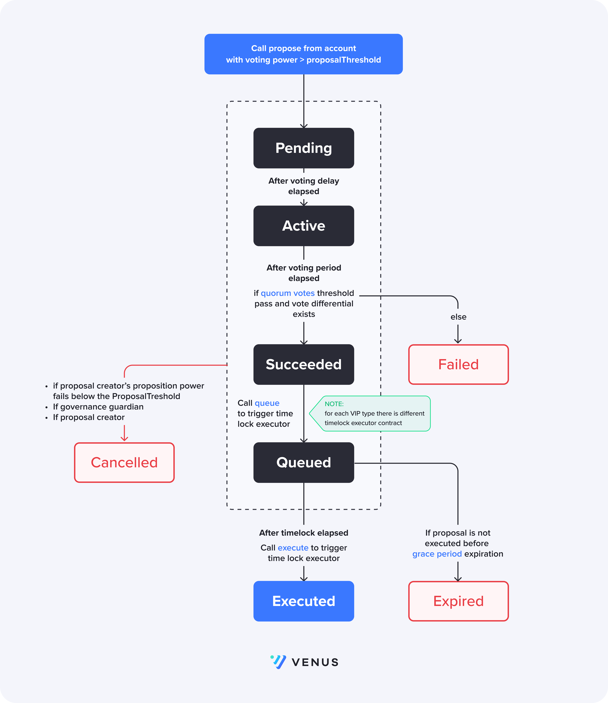

# Governance

## Introduction

Venus Governance V4 is updated version of on-chain governance, allowing unique features such as delegated voting, rapid protocol upgrades, governance upgrades. On top of that Governance V4 brings a granularity in our pause mechanism, allowing governance to pause any actions on any markets, especially in the context of isolated markets.  **The above changes are meant to increase Governance efficiency, while reducing opportunities for malicious or erroneous proposals to slip through.**

## Details

Governance has **3 main contracts**: **GovernanceBravoDelegate, XVSVault, XVS** token.
XVS token is the protocol token used for protocol users to cast their vote on proposals submitted from other users.
XVSVault is the main stacking contract for XVS. Users should stake their XVS in order to be able to cast their votes. Users can also delegate their voting power to other users via the XVSVault. This contract is also responsible for staking rewards for each pool.

# Governor Bravo
GovernanceBravoDelegate is Venus main Governance contract. Users interact with it to:
- Submit new proposal
- Vote on a proposal
- Cancel proposal
- Queue proposal for execution to a timelock executor contract
GovernanceBravoDelegate is using XVSVault to get information about voting power of users to enforce some of important governance rules:
- Users with voting power below proposalThreshold cannot submit a proposal
- If a user's voring power drops below certain amount, anyone can cancel the the proposal. On the other hand governance guardian and proposal creator can cancel a proposal at anytime, but before it is queued for execution.

## Venus Improvement Proposal
Venus V4 Governance brings up categorisation for VIPs in order to optimise some actions such as the fast expedition of interest rate, risk parameters and other crucial protocol variables.
In order to implement different VIP roles, a solution of having 3 different types of VIPs has been implemented:

- NORMAL
- FASTTRACK
- CRITICAL

Each type has the following parameters, based on which the governance flow might change:

- `votingDelay` - **The delay before voting on a proposal may take place, once proposed, in blocks**
- `votingPeriod` - **The duration of voting on a proposal, in blocks**
- `proposalThreshold` - **The number of votes required in order for a voter to become a proposer**

The configurations for the three types is done upon initialisation of the **GovernorBravo** contract.
For each type of VIP there is also separate timelock executor contract, which will be used to dispatch the VIP to be executed, giving even more control over the flow of each type of VIP.



## Voting
After a VIP is proposed, one could vote on it only after the `votingDelay` has been passed. If `votingDelay = 0` the voting will begin in the next block after the proposal has been submitted. After the delay, the proposal state is `ACTIVE` and users can cast their vote `for` or `against`  the proposal, weighted by the users total voting power (tokens + delegated voting power). The total voting power for the user is obtained by calling XVSVault's `getPriorVotes`.
GovernorBravoDelegate also  accepts EIP-712 signatures for voting on proposals via the external function `castVoteBySig`

## Delegating
A users voting power is not measured only by the amount of staked XVS he has, but also delegated voting power is taken into account. Delegating is the process of 1 user delegating his voting power to other, so that the latter has the combined voting power of both users. This is quite a crucial feature, because of the fact that a voter can submit a proposal if he has **passed** a certain **voting power threshold** which in our code is called `proposalThreshold`. 
The delegation of votes should happen through the XVSVault contract by calling `delegate` or `delegateBySig` functions. In order to revert delegation of votes to a user, one should call the same functions with a value of `0`.

# Solidity API

## GovernorBravoDelegate

### name

```solidity
string name
```

### MIN_PROPOSAL_THRESHOLD

```solidity
uint256 MIN_PROPOSAL_THRESHOLD
```

### MAX_PROPOSAL_THRESHOLD

```solidity
uint256 MAX_PROPOSAL_THRESHOLD
```

### MIN_VOTING_PERIOD

```solidity
uint256 MIN_VOTING_PERIOD
```

### MAX_VOTING_PERIOD

```solidity
uint256 MAX_VOTING_PERIOD
```

### MIN_VOTING_DELAY

```solidity
uint256 MIN_VOTING_DELAY
```

### MAX_VOTING_DELAY

```solidity
uint256 MAX_VOTING_DELAY
```

### quorumVotes

```solidity
uint256 quorumVotes
```

### DOMAIN_TYPEHASH

```solidity
bytes32 DOMAIN_TYPEHASH
```

### BALLOT_TYPEHASH

```solidity
bytes32 BALLOT_TYPEHASH
```

### initialize

```solidity
function initialize(address xvsVault_, struct GovernorBravoDelegateStorageV2.ProposalConfig[] proposalConfigs_, contract TimelockInterface[] timelocks, address guardian_) public
```

Used to initialize the contract during delegator contructor

#### Parameters

| Name | Type | Description |
| ---- | ---- | ----------- |
| xvsVault_ | address | The address of the XvsVault |
| proposalConfigs_ | struct GovernorBravoDelegateStorageV2.ProposalConfig[] | Governance confifgs for each GovernanceType |
| timelocks | contract TimelockInterface[] | Timelock addresses for each GovernanceType |
| guardian_ | address |  |

### propose

```solidity
function propose(address[] targets, uint256[] values, string[] signatures, bytes[] calldatas, string description, enum GovernorBravoDelegateStorageV2.ProposalType proposalType) public returns (uint256)
```

Function used to propose a new proposal. Sender must have delegates above the proposal threshold

#### Parameters

| Name | Type | Description |
| ---- | ---- | ----------- |
| targets | address[] | Target addresses for proposal calls |
| values | uint256[] | Eth values for proposal calls |
| signatures | string[] | Function signatures for proposal calls |
| calldatas | bytes[] | Calldatas for proposal calls |
| description | string | String description of the proposal |
| proposalType | enum GovernorBravoDelegateStorageV2.ProposalType |  |

#### Return Values

| Name | Type | Description |
| ---- | ---- | ----------- |
| [0] | uint256 | Proposal id of new proposal |

### queue

```solidity
function queue(uint256 proposalId) external
```

Queues a proposal of state succeeded

#### Parameters

| Name | Type | Description |
| ---- | ---- | ----------- |
| proposalId | uint256 | The id of the proposal to queue |

### queueOrRevertInternal

```solidity
function queueOrRevertInternal(address target, uint256 value, string signature, bytes data, uint256 eta, uint8 proposalType) internal
```

### execute

```solidity
function execute(uint256 proposalId) external
```

Executes a queued proposal if eta has passed

#### Parameters

| Name | Type | Description |
| ---- | ---- | ----------- |
| proposalId | uint256 | The id of the proposal to execute |

### cancel

```solidity
function cancel(uint256 proposalId) external
```

Cancels a proposal only if sender is the proposer, or proposer delegates dropped below proposal threshold

#### Parameters

| Name | Type | Description |
| ---- | ---- | ----------- |
| proposalId | uint256 | The id of the proposal to cancel |

### getActions

```solidity
function getActions(uint256 proposalId) external view returns (address[] targets, uint256[] values, string[] signatures, bytes[] calldatas)
```

Gets actions of a proposal

#### Parameters

| Name | Type | Description |
| ---- | ---- | ----------- |
| proposalId | uint256 | the id of the proposal |

#### Return Values

| Name | Type | Description |
| ---- | ---- | ----------- |
| targets | address[] |  |
| values | uint256[] |  |
| signatures | string[] |  |
| calldatas | bytes[] |  |

### getReceipt

```solidity
function getReceipt(uint256 proposalId, address voter) external view returns (struct GovernorBravoDelegateStorageV1.Receipt)
```

Gets the receipt for a voter on a given proposal

#### Parameters

| Name | Type | Description |
| ---- | ---- | ----------- |
| proposalId | uint256 | the id of proposal |
| voter | address | The address of the voter |

#### Return Values

| Name | Type | Description |
| ---- | ---- | ----------- |
| [0] | struct GovernorBravoDelegateStorageV1.Receipt | The voting receipt |

### state

```solidity
function state(uint256 proposalId) public view returns (enum GovernorBravoDelegateStorageV1.ProposalState)
```

Gets the state of a proposal

#### Parameters

| Name | Type | Description |
| ---- | ---- | ----------- |
| proposalId | uint256 | The id of the proposal |

#### Return Values

| Name | Type | Description |
| ---- | ---- | ----------- |
| [0] | enum GovernorBravoDelegateStorageV1.ProposalState | Proposal state |

### castVote

```solidity
function castVote(uint256 proposalId, uint8 support) external
```

Cast a vote for a proposal

#### Parameters

| Name | Type | Description |
| ---- | ---- | ----------- |
| proposalId | uint256 | The id of the proposal to vote on |
| support | uint8 | The support value for the vote. 0=against, 1=for, 2=abstain |

### castVoteWithReason

```solidity
function castVoteWithReason(uint256 proposalId, uint8 support, string reason) external
```

Cast a vote for a proposal with a reason

#### Parameters

| Name | Type | Description |
| ---- | ---- | ----------- |
| proposalId | uint256 | The id of the proposal to vote on |
| support | uint8 | The support value for the vote. 0=against, 1=for, 2=abstain |
| reason | string | The reason given for the vote by the voter |

### castVoteBySig

```solidity
function castVoteBySig(uint256 proposalId, uint8 support, uint8 v, bytes32 r, bytes32 s) external
```

Cast a vote for a proposal by signature

_External function that accepts EIP-712 signatures for voting on proposals._

### castVoteInternal

```solidity
function castVoteInternal(address voter, uint256 proposalId, uint8 support) internal returns (uint96)
```

Internal function that caries out voting logic

#### Parameters

| Name | Type | Description |
| ---- | ---- | ----------- |
| voter | address | The voter that is casting their vote |
| proposalId | uint256 | The id of the proposal to vote on |
| support | uint8 | The support value for the vote. 0=against, 1=for, 2=abstain |

#### Return Values

| Name | Type | Description |
| ---- | ---- | ----------- |
| [0] | uint96 | The number of votes cast |

### _setGuardian

```solidity
function _setGuardian(address newGuardian) external
```

Sets the new governance guardian

#### Parameters

| Name | Type | Description |
| ---- | ---- | ----------- |
| newGuardian | address | the address of the new guardian |

### _initiate

```solidity
function _initiate(address governorAlpha) external
```

Initiate the GovernorBravo contract

_Admin only. Sets initial proposal id which initiates the contract, ensuring a continuous proposal id count_

#### Parameters

| Name | Type | Description |
| ---- | ---- | ----------- |
| governorAlpha | address | The address for the Governor to continue the proposal id count from |

### _setProposalMaxOperations

```solidity
function _setProposalMaxOperations(uint256 proposalMaxOperations_) external
```

Set max proposal operations

_Admin only._

#### Parameters

| Name | Type | Description |
| ---- | ---- | ----------- |
| proposalMaxOperations_ | uint256 | Max proposal operations |

### _setPendingAdmin

```solidity
function _setPendingAdmin(address newPendingAdmin) external
```

Begins transfer of admin rights. The newPendingAdmin must call `_acceptAdmin` to finalize the transfer.

_Admin function to begin change of admin. The newPendingAdmin must call `_acceptAdmin` to finalize the transfer._

#### Parameters

| Name | Type | Description |
| ---- | ---- | ----------- |
| newPendingAdmin | address | New pending admin. |

### _acceptAdmin

```solidity
function _acceptAdmin() external
```

Accepts transfer of admin rights. msg.sender must be pendingAdmin

_Admin function for pending admin to accept role and update admin_

### add256

```solidity
function add256(uint256 a, uint256 b) internal pure returns (uint256)
```

### sub256

```solidity
function sub256(uint256 a, uint256 b) internal pure returns (uint256)
```

### getChainIdInternal

```solidity
function getChainIdInternal() internal pure returns (uint256)
```

