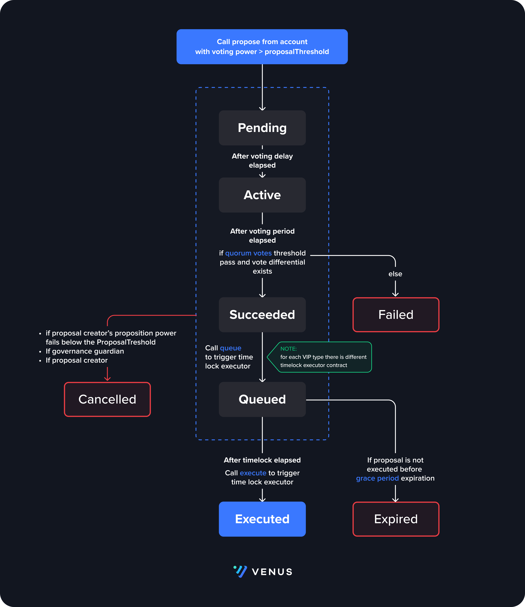

# Bravo

## Governance

### Introduction

Venus Governance latest on-chain governance includes several new features including variable proposal routes and fine grained pause control. Variable routes for proposals allows for governance paramaters such as voting threshold and timelocks to be customized based on the risk level and impact of the proposal. Added granularity to the pause control mechanism allows governance to pause individual actions on specific markets, which reduces impact on the protocol as a whole. This is particularly useful when applied to isolated lending.


The goal of **Governance** is to increase governance efficiency, while mitigating and eliminating malicious or erroneous proposals.


### Details

Governance has **3 main contracts**: **GovernanceBravoDelegate, XVSVault, XVS** token. XVS token is the protocol token used for protocol users to cast their vote on submitted proposals. XVSVault is the main staking contract for XVS. Users first stake their XVS in the vault and receive voting power proportional to their staked tokens that they can use to vote on proposals. Users also can choose to delegate their voting power to other users. You can read more on the [XVSVault](../../vaults/xvs-vault.md) page.

## Governor Bravo

GovernanceBravoDelegate is main Venus Governance contract. Users interact with it to:

* Submit new proposal
* Vote on a proposal
* Cancel a proposal
* Queue a proposal for execution with a timelock executor contract GovernanceBravoDelegate uses the XVSVault to get restrict certain actions based on a user's voting power. The governance rules it inforces are:
* A user's voting power must be greater than the `proposalThreshold` to submit a proposal
* If a user's voting power drops below certain amount, anyone can cancel the the proposal. The governance guardian and proposal creator can also cancel a proposal at anytime before it is queued for execution.

### Venus Improvement Proposal

Venus Governance allows for Venus Improvement Proposals (VIPs) to be categorized based on their impact and risk levels. This allows for optimizing proposals execution to allow for things such as expediting interest rate changes and quickly updating risk parameters, while moving slower on other types of proposals that can prevent a larger risk to the protocol and are not urgent. There are three different types of VIPs with different proposal paramters:

* `NORMAL`
* `FASTTRACK`
* `CRITICAL`

When initializing the GovernorBravo contract, the parameters for the three routes are set. The parameeters are:

* `votingDelay` - The delay in blocks between submitting a proposal and when voting begins
* `votingPeriod` - The number of blocks where voting will be open
* `proposalThreshold` - The number of votes required in order submit a proposal

There is also a separate timelock executor contract for each route, which is used to dispatch the VIP for execution, giving even more control over the flow of each type of VIP.



### Voting

After a VIP is proposed, voting is opened after the `votingDelay` has passed. For example, if `votingDelay = 0`, then voting will begin in the next block after the proposal has been submitted. After the delay, the proposal state is `ACTIVE` and users can cast their vote `for`, `against`, or `abstain`, weighted by their total voting power (tokens + delegated voting power). Abstaining from a voting allows for a vote to be cast and optionally include a comment, without the incrementing for or against vote count. The total voting power for the user is obtained by calling XVSVault's `getPriorVotes`. GovernorBravoDelegate also accepts EIP-712 signatures for voting on proposals via the external function `castVoteBySig`

### Delegating

A users voting power includes the amount of staked XVS the have staked as well as the votes delegate to them. Delegating is the process of a user loaning their voting power to another, so that the latter has the combined voting power of both users. This is an important feature because it allows for a user to let another user who they trust propose or vote in their place. The delegation of votes happens through the XVSVault contract by calling the `delegate` or `delegateBySig` functions. These same functions can revert vote delegation by calling the same function with a value of `0`.

## Solidity API

### GovernorBravoDelegate

#### name

```solidity
string name
```

#### MIN\_PROPOSAL\_THRESHOLD

```solidity
uint256 MIN_PROPOSAL_THRESHOLD
```

#### MAX\_PROPOSAL\_THRESHOLD

```solidity
uint256 MAX_PROPOSAL_THRESHOLD
```

#### MIN\_VOTING\_PERIOD

```solidity
uint256 MIN_VOTING_PERIOD
```

#### MAX\_VOTING\_PERIOD

```solidity
uint256 MAX_VOTING_PERIOD
```

#### MIN\_VOTING\_DELAY

```solidity
uint256 MIN_VOTING_DELAY
```

#### MAX\_VOTING\_DELAY

```solidity
uint256 MAX_VOTING_DELAY
```

#### quorumVotes

```solidity
uint256 quorumVotes
```

#### DOMAIN\_TYPEHASH

```solidity
bytes32 DOMAIN_TYPEHASH
```

#### BALLOT\_TYPEHASH

```solidity
bytes32 BALLOT_TYPEHASH
```

#### initialize

```solidity
function initialize(address xvsVault_, struct GovernorBravoDelegateStorageV2.ProposalConfig[] proposalConfigs_, contract TimelockInterface[] timelocks, address guardian_) public
```

Used to initialize the contract during delegator contructor

**Parameters**

| Name              | Type                                                    | Description                                 |
| ----------------- | ------------------------------------------------------- | ------------------------------------------- |
| xvsVault\_        | address                                                 | The address of the XvsVault                 |
| proposalConfigs\_ | struct GovernorBravoDelegateStorageV2.ProposalConfig\[] | Governance confifgs for each GovernanceType |
| timelocks         | contract TimelockInterface\[]                           | Timelock addresses for each GovernanceType  |
| guardian\_        | address                                                 |                                             |

#### propose

```solidity
function propose(address[] targets, uint256[] values, string[] signatures, bytes[] calldatas, string description, enum GovernorBravoDelegateStorageV2.ProposalType proposalType) public returns (uint256)
```

Function used to propose a new proposal. Sender must have delegates above the proposal threshold


**Call restrictions:**

* Proposer must meet the proposal threshold
* Proposal action data must pass arity check
* Proposal action count cannot exceed `proposalMaxOperations`
* Each account can have one proposal in the funnel at a time


**Events**

`ProposalCreated`

**Parameters**

| Name         | Type       | Description                                              |
| ------------ | ---------- | -------------------------------------------------------- |
| id           | uint       | The id of the proposal                                   |
| proposer     | address    | Address of the proposer                                  |
| targets      | address\[] | Addresses for the contracts with the function signatures |
| values       | uint\[]    | Values to use send with the action calls                 |
| signatures   | string\[]  | Function signatures of the actions                       |
| calldatas    | bytes\[]   | Function arguments for the action signatures             |
| startBlock   | uint       | Block where the voting period begins                     |
| endBlock     | uint       | Block where the voting period ends                       |
| description  | string     | Proposal description                                     |
| proposalType | uint8      | Route of the proposal                                    |

**Parameters**

| Name         | Type                                             | Description                            |
| ------------ | ------------------------------------------------ | -------------------------------------- |
| targets      | address\[]                                       | Target addresses for proposal calls    |
| values       | uint256\[]                                       | Eth values for proposal calls          |
| signatures   | string\[]                                        | Function signatures for proposal calls |
| calldatas    | bytes\[]                                         | Calldatas for proposal calls           |
| description  | string                                           | String description of the proposal     |
| proposalType | enum GovernorBravoDelegateStorageV2.ProposalType |                                        |

**Return Values**

| Name | Type    | Description                 |
| ---- | ------- | --------------------------- |
| \[0] | uint256 | Proposal id of new proposal |

#### queue

```solidity
function queue(uint256 proposalId) external
```

Queues a proposal for execution


**Proposal must succeed** in order to be queued.


**Events**

`ProposalQueued`

**Parameters**

| Name       | Type | Description                               |
| ---------- | ---- | ----------------------------------------- |
| proposalId | uint | Id of the queued proposal                 |
| eta        | uint | Time when proposal leaves queued timelock |

**Parameters**

| Name       | Type    | Description                     |
| ---------- | ------- | ------------------------------- |
| proposalId | uint256 | The id of the proposal to queue |

#### queueOrRevertInternal

```solidity
function queueOrRevertInternal(address target, uint256 value, string signature, bytes data, uint256 eta, uint8 proposalType) internal
```

#### execute

```solidity
function execute(uint256 proposalId) external
```

Executes a queued proposal if eta has passed


**Proposal must be queued** in order to be executed.


**Events**

`ProposalExecuted`

**Parameters**

| Name       | Type | Description               |
| ---------- | ---- | ------------------------- |
| proposalId | uint | Id of the queued proposal |

**Parameters**

| Name       | Type    | Description                       |
| ---------- | ------- | --------------------------------- |
| proposalId | uint256 | The id of the proposal to execute |

#### cancel

```solidity
function cancel(uint256 proposalId) external
```

Cancels a proposal only if sender is the proposer, or proposer delegates dropped below proposal threshold

**Events**

`ProposalCancelled`

**Parameters**

| Name       | Type | Description               |
| ---------- | ---- | ------------------------- |
| proposalId | uint | Id of the queued proposal |

**Parameters**

| Name       | Type    | Description                      |
| ---------- | ------- | -------------------------------- |
| proposalId | uint256 | The id of the proposal to cancel |

#### getActions

```solidity
function getActions(uint256 proposalId) external view returns (address[] targets, uint256[] values, string[] signatures, bytes[] calldatas)
```

Gets actions of a proposal

**Parameters**

| Name       | Type    | Description            |
| ---------- | ------- | ---------------------- |
| proposalId | uint256 | the id of the proposal |

**Return Values**

| Name       | Type       | Description |
| ---------- | ---------- | ----------- |
| targets    | address\[] |             |
| values     | uint256\[] |             |
| signatures | string\[]  |             |
| calldatas  | bytes\[]   |             |

#### getReceipt

```solidity
function getReceipt(uint256 proposalId, address voter) external view returns (struct GovernorBravoDelegateStorageV1.Receipt)
```

Gets the receipt for a voter on a given proposal

**Parameters**

| Name       | Type    | Description              |
| ---------- | ------- | ------------------------ |
| proposalId | uint256 | the id of proposal       |
| voter      | address | The address of the voter |

**Return Values**

| Name | Type                                          | Description        |
| ---- | --------------------------------------------- | ------------------ |
| \[0] | struct GovernorBravoDelegateStorageV1.Receipt | The voting receipt |

#### state

```solidity
function state(uint256 proposalId) public view returns (enum GovernorBravoDelegateStorageV1.ProposalState)
```

Gets the state of a proposal

**Parameters**

| Name       | Type    | Description            |
| ---------- | ------- | ---------------------- |
| proposalId | uint256 | The id of the proposal |

**Return Values**

| Name | Type                                              | Description    |
| ---- | ------------------------------------------------- | -------------- |
| \[0] | enum GovernorBravoDelegateStorageV1.ProposalState | Proposal state |

#### castVote

```solidity
function castVote(uint256 proposalId, uint8 support) external
```

Cast a vote for a proposal. Vote values are 0 for against, 1 for in favor and 2 for abstain.

**Events**

`VoteCast`

**Parameters**

| Name       | Type            | Description                                         |
| ---------- | --------------- | --------------------------------------------------- |
| voter      | address indexed | Account that cast the vote                          |
| proposalId | uint            | Proposal being voted on                             |
| support    | uint8           | The value for the vote. 0=against, 1=for, 2=abstain |
| votes      | uint            | Voting power of the account                         |
| reason     | string          | Optional reason provided with vote                  |

**Parameters**

| Name       | Type    | Description                                                 |
| ---------- | ------- | ----------------------------------------------------------- |
| proposalId | uint256 | The id of the proposal to vote on                           |
| support    | uint8   | The support value for the vote. 0=against, 1=for, 2=abstain |

#### castVoteWithReason

```solidity
function castVoteWithReason(uint256 proposalId, uint8 support, string reason) external
```

Cast a vote for a proposal with a reason. Vote values are 0 for against, 1 for in favor and 2 for abstain.

**Events**

`VoteCast`

**Parameters**

| Name       | Type            | Description                                         |
| ---------- | --------------- | --------------------------------------------------- |
| voter      | address indexed | Account that cast the vote                          |
| proposalId | uint            | Proposal being voted on                             |
| support    | uint8           | The value for the vote. 0=against, 1=for, 2=abstain |
| votes      | uint            | Voting power of the account                         |
| reason     | string          | Optional reason provided with vote                  |

**Parameters**

| Name       | Type    | Description                                                 |
| ---------- | ------- | ----------------------------------------------------------- |
| proposalId | uint256 | The id of the proposal to vote on                           |
| support    | uint8   | The support value for the vote. 0=against, 1=for, 2=abstain |
| reason     | string  | The reason given for the vote by the voter                  |

#### castVoteBySig

```solidity
function castVoteBySig(uint256 proposalId, uint8 support, uint8 v, bytes32 r, bytes32 s) external
```

Cast a vote for a proposal by signature. Vote values are 0 for against, 1 for in favor and 2 for abstain.

_External function that accepts EIP-712 signatures for voting on proposals._

**Events**

`VoteCast`

**Parameters**

| Name       | Type            | Description                                         |
| ---------- | --------------- | --------------------------------------------------- |
| voter      | address indexed | Account that cast the vote                          |
| proposalId | uint            | Proposal being voted on                             |
| support    | uint8           | The value for the vote. 0=against, 1=for, 2=abstain |
| votes      | uint            | Voting power of the account                         |
| reason     | string          | Optional reason provided with vote                  |

#### castVoteInternal

```solidity
function castVoteInternal(address voter, uint256 proposalId, uint8 support) internal returns (uint96)
```

Internal function that caries out voting logic. Enforces that requirments to cast vote are met:

* Proposal must be active
* Support must be 0, 1, or 2
* User cannot vote more than once

**Parameters**

| Name       | Type    | Description                                                 |
| ---------- | ------- | ----------------------------------------------------------- |
| voter      | address | The voter that is casting their vote                        |
| proposalId | uint256 | The id of the proposal to vote on                           |
| support    | uint8   | The support value for the vote. 0=against, 1=for, 2=abstain |

**Return Values**

| Name | Type   | Description              |
| ---- | ------ | ------------------------ |
| \[0] | uint96 | The number of votes cast |

#### \_setGuardian

```solidity
function _setGuardian(address newGuardian) external
```

Sets the new governance guardian


**Only admin and current guardian** can set a new guardian. The address must also not be null.


**Events**

`NewGuardian`

**Parameters**

| Name        | Type    | Description               |
| ----------- | ------- | ------------------------- |
| oldGuardian | address | Previous guardian         |
| newGuardian | address | New guardian that was set |

**Parameters**

| Name        | Type    | Description                     |
| ----------- | ------- | ------------------------------- |
| newGuardian | address | the address of the new guardian |

#### \_initiate

```solidity
function _initiate(address governorAlpha) external
```

Initiate the GovernorBravo contract

_Admin only. Sets initial proposal id which initiates the contract, ensuring a continuous proposal id count_

**Parameters**

| Name          | Type    | Description                                                         |
| ------------- | ------- | ------------------------------------------------------------------- |
| governorAlpha | address | The address for the Governor to continue the proposal id count from |

#### \_setProposalMaxOperations

```solidity
function _setProposalMaxOperations(uint256 proposalMaxOperations_) external
```

Set max proposal operations allowed on a propossal


**Only admin** can set the max number of operations on a proposal.


**Events**

`ProposalMaxOperationsUpdated`

**Parameters**

| Name                     | Type    | Description                       |
| ------------------------ | ------- | --------------------------------- |
| oldProposalMaxOperations | address | Previous max number of operations |
| proposalMaxOperations\_  | address | New max number of operations      |

**Parameters**

| Name                    | Type    | Description             |
| ----------------------- | ------- | ----------------------- |
| proposalMaxOperations\_ | uint256 | Max proposal operations |

#### \_setPendingAdmin

```solidity
function _setPendingAdmin(address newPendingAdmin) external
```

Begins transfer of admin rights. The newPendingAdmin must call `_acceptAdmin` to finalize the transfer.

_Admin function to begin change of admin. The newPendingAdmin must call `_acceptAdmin` to finalize the transfer._

**Events**

`NewPendingAdmin`

**Parameters**

| Name            | Type    | Description            |
| --------------- | ------- | ---------------------- |
| oldPendingAdmin | address | Previous pending admin |
| newPendingAdmin | address | New pending admin      |

**Parameters**

| Name            | Type    | Description        |
| --------------- | ------- | ------------------ |
| newPendingAdmin | address | New pending admin. |

#### \_acceptAdmin

```solidity
function _acceptAdmin() external
```

Accepts transfer of admin rights. msg.sender must be pendingAdmin

_Admin function for pending admin to accept role and update admin_


**Only pending admin** can accept the admin.


**Events**

`NewAdmin`

**Parameters**

| Name     | Type    | Description    |
| -------- | ------- | -------------- |
| oldAdmin | address | Previous admin |
| newAdmin | address | New admin      |

Also emits the Pending Admin event setting the pending admin to 0

#### add256

```solidity
function add256(uint256 a, uint256 b) internal pure returns (uint256)
```

#### sub256

```solidity
function sub256(uint256 a, uint256 b) internal pure returns (uint256)
```

#### getChainIdInternal

```solidity
function getChainIdInternal() internal pure returns (uint256)
```
