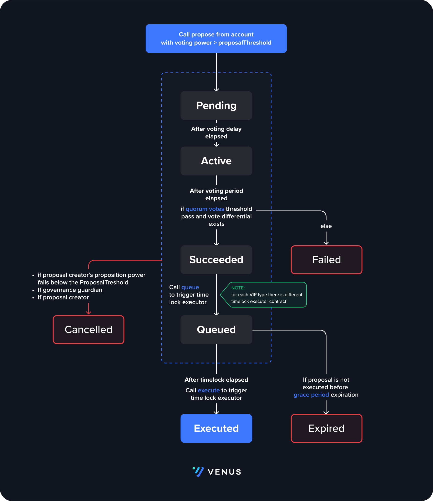

# VIPs

### Overview

Venus Protocol's governance relies on participants locking XVS tokens into a vault to acquire voting power for Venus Improvement Proposals (VIPs). A 48-hour timelock period after voting ensures transparency and protection against malicious proposals. However, the initial model's rigidity prompted the introduction of a new governance structure in Venus V4. This upgraded model incorporates fast-track VIPs, role-based access control, and a fine-grained pause mechanism for enhanced flexibility and timely adjustments.

### Governance Upgrade

Venus V4 introduces an improved governance structure with the following components:

* Fast-track and Critical VIPs
* Role-based access control
* Fine-grained pause

**Fast-track and Critical Improvement Proposals**

Venus Governance has now categorized VIPs into three types: Normal, Fast-track, and Critical.

* **Normal VIPs** encompass significant updates like contract upgrades or changes in access controls.
* **Fast-track VIPs** deal with risk parameter adjustments such as interest rates or collateral factors.
* **Critical VIPs** are utilized during emergencies demanding an immediate reaction.

Each VIP type has its unique proposal threshold, timelock, and voting periods, reflecting the potential risk and impact of the proposed changes.

The initial voting and delay periods for these types are as follows:

* Normal VIP: 24 hours voting + 48 hours delay
* Fast-track VIP: 24 hours voting + 6 hours delay
* Critical VIP: 6 hours voting + 1 hour delay

**Role-based Access Control**

Venus V4 employs a separate Access Control Manager contract that validates access permissions rather than merely verifying the caller as an "admin". This allows certain actions to bypass voting, enabling them to take the fast-track or critical route, or even to be executed directly through a multisig by guardians. It can be particularly useful for implementing borrowing and supply caps, pausing specific market actions, or responding to rapid market fluctuations.

**Fine-grained Pause**

A fine-grained pause mechanism allows the pause guardian to individually halt any action on any market. Unlike previous versions, where the entire protocol was paused for damage control or protection against attacks, the updated model enables guardians to pause individual market actions like supply, borrow, and enabling collateral, offering greater control and flexibility.

<figure><figcaption></figcaption></figure>
