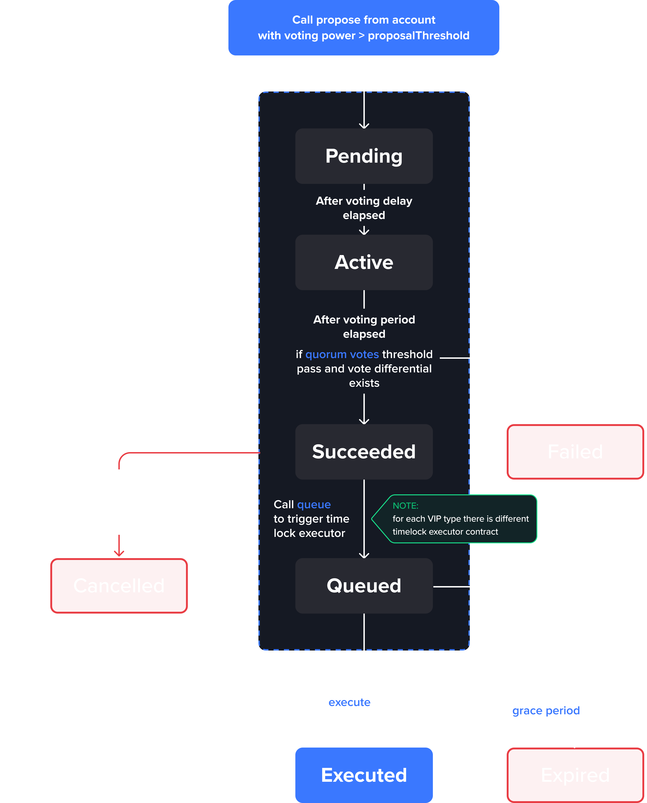

# Venus Improvement Proposals

Venus Protocol is governed through Venus Improvement Proposals (VIPs). On BNB Chain, the Governor reads voting power from the XVS Vault and executes successful proposals through route-specific timelocks. Cross-chain VIPs use the [omnichain governance system](../technical-reference/reference-technical-articles/omnichain-governance.md) to deliver approved actions to other networks.

## Proposal lifecycle

1. A proposer with enough delegated voting power submits a VIP.
2. Voting power is snapshotted at the proposal's start block.
3. Delegates vote **For**, **Against**, or **Abstain**.
4. A successful proposal is queued in its assigned timelock.
5. After the timelock delay, anyone can execute the queued proposal.

A proposal succeeds only when **For** votes are greater than **Against** votes and at least the quorum. Abstain votes are recorded but do not satisfy the quorum requirement.

## Proposal routes and current configuration

Governance supports Normal, Fast-track, and Critical proposal routes. The Governor stores the voting delay, voting period, and proposal threshold separately for each route.

The following values were read from the BNB Chain Governor at block `118,362,254`:

| Route | Voting delay | Voting period | Proposal threshold | Timelock delay |
| --- | ---: | ---: | ---: | ---: |
| Normal | 1 block | 192,384 blocks | 1,000,000 XVS | 48 hours |
| Fast-track | 1 block | 192,384 blocks | 1,000,000 XVS | 6 hours |
| Critical | 1 block | 48,096 blocks | 1,000,000 XVS | 1 hour |

The global quorum is currently 1,500,000 **For** votes, and a proposal can contain at most 100 actions.


These are configurable on-chain values, not permanent protocol constants. Voting periods are measured in blocks, so they should not be presented as a guaranteed wall-clock duration. Before creating a VIP, verify `proposalConfigs`, `quorumVotes`, `proposalTimelocks`, and the selected timelock's `delay` directly on-chain. See [Deployed Governance Contracts](../deployed-contracts/governance.md).


### Critical route status

[VIP-645](https://venus.io/governance/proposal/645?chainId=56) removed every permission held by the Critical Timelock across Venus deployments. The route and its configuration still exist, but it cannot currently execute privileged protocol actions. Emergency responses instead use explicitly granted guardian permissions, the fine-grained pause mechanism, or a governance route that has the required permission.

## Access control and guardians

Venus contracts use an Access Control Manager (ACM) for action-scoped permissions. A permission grants a specific caller the ability to invoke a specific function; it does not make that caller a global administrator.

This model lets governance grant narrowly scoped capabilities to timelocks or guardians. For example, an authorized guardian may be able to pause a particular market action without being able to change unrelated parameters. Because these permissions can change through VIPs, integrations and operators should check the live ACM state instead of relying on a static list of roles.

The fine-grained pause mechanism can independently pause actions such as supplying, borrowing, or using an asset as collateral. The exact supported actions and authorized callers depend on the deployed contract and network.

## Related documentation

* [Delegate voting power and vote](../guides/governance-guide/delegating.md)
* [Submit a VIP](../guides/governance-guide/vip.md)
* [Governor Bravo Delegate reference](../technical-reference/reference-governance/governor-bravo-delegate.md)
* [Deployed Governance Contracts](../deployed-contracts/governance.md)

<figure><figcaption>
<em>Governance process</em>
</figcaption></figure>
