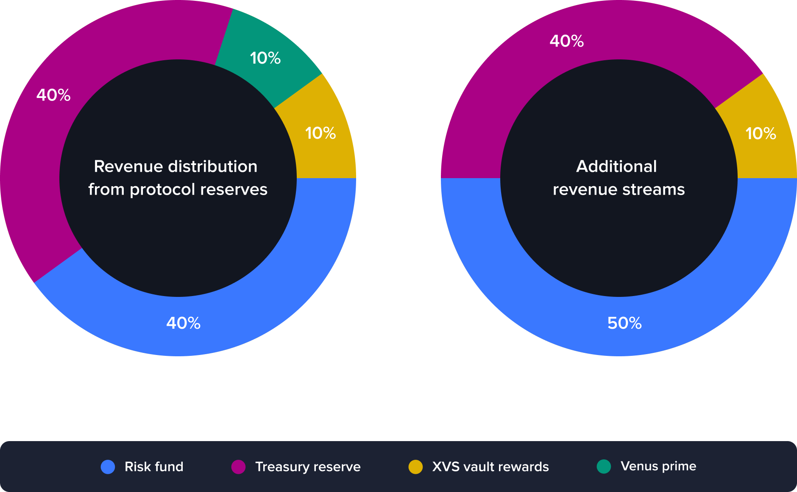

# Tokenomics

### Overview

The Venus Protocol tokenomics have been reevaluated to optimize income distribution and cater to the protocol's present and future needs. [Version 3.1](https://snapshot.org/#/venus-xvs.eth/proposal/0xc9d270ccecb7b91c75b95b8d9af24fc7c20cd38c0c0c44888ed4e7724f4e7ce9) of the Venus Protocol revenue distribution model addresses this need and optimizes the allocation between rewards and treasury reserves.

### XVS Vault Base Rewards

The XVS Staking Vault is an integral component of the Venus ecosystem. It enables governance voting participation and is a prerequisite for Venus Prime eligibility. To incentivize XVS staking, additional rewards will be offered in the form of Base Rewards (previously refered as Legacy Rewards).

These rewards will be transferred every six months from the [XVS Distributor](https://bscscan.com/address/0xfd36e2c2a6789db23113685031d7f16329158384) to the [XVS Vault Store](https://www.bscscan.com/address/0x1e25cf968f12850003db17e0dba32108509c4359), where they will be emitted at a rate of 1050 XVS per day.

### Revenue Distribution from Protocol Reserves

Protocol reserves are mainly composed of accumulated borrow fees. The model for revenue allocation from these reserves divides income into four main segments:

* **Risk Fund (40%)**: This fund is established to address potential shortfalls in the protocol, particularly in situations of ineffective or delayed liquidations. The allocation to the risk fund remains unchanged to maintain a strong financial buffer.
* **Treasury Reserve (40%)**: The treasury reserve bolsters the protocol's resilience and provides a robust safety net for its ongoing operations.
* **XVS Vault Rewards (10%)**: Venus protocol continues to incentivize users through XVS Vault Rewards.
* **Venus Prime Token Program (10%)**: This program utilizes a portion of the reserve revenue to incentivize user participation and boost the APYs for qualified users in the main market.

### Allocation for Additional Revenue Streams

Other revenue streams include liquidation penalties and potential income generated from future product releases. The revenue distribution for these streams is as follows:

* **Risk Fund (50%)**
* **Treasury Reserves (40%)**
* **XVS Vault Rewards (10%)**

The methodology behind these adjustments includes an assessment of the existing tokenomics, past changes, their impact on the ecosystem, and analysis of market dynamics and trends.

This dual allocation model accounts for the diverse revenue sources within the Venus Protocol ecosystem, ensuring robust and responsive financial management. As the protocol evolves and introduces new products, these models may further be adjusted to optimally serve the Venus community.

<figure><figcaption></figcaption></figure>
