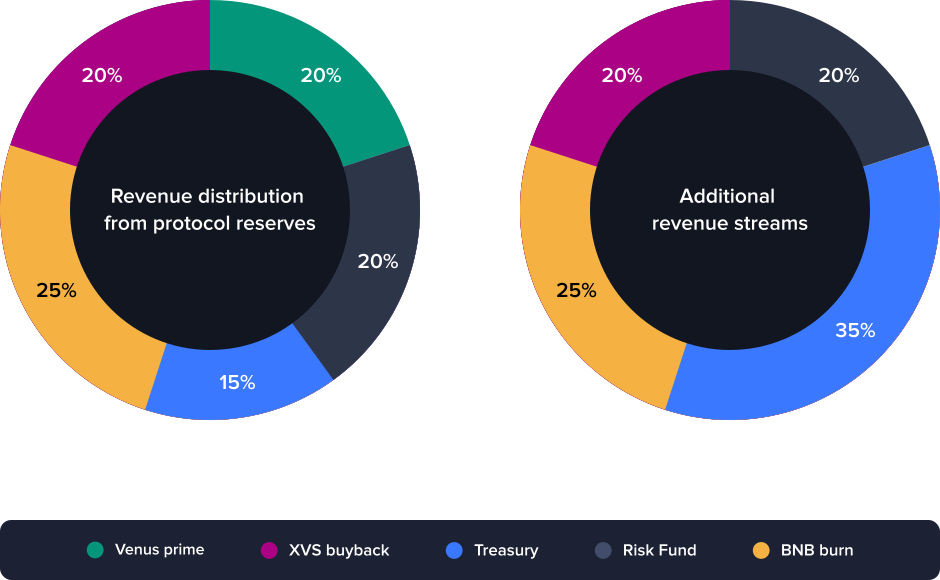

# Tokenomics

### Overview

The Venus Protocol tokenomics have been reevaluated to optimize income distribution and cater to the protocol's present and future needs. [Version 4.1](https://snapshot.box/#/s:venus-xvs.eth/proposal/0xb8f03ad2dd2988a6d2e89a1adbebc52c7a62b284ea493008752c71b7f00b3386) of the Venus Protocol revenue distribution model addresses the need and optimizes the allocation between rewards, treasury reserves, a risk fund and BNB burns.

### XVS Vault Base Rewards

The XVS Staking Vault is an integral component of the Venus ecosystem. It enables governance voting participation and is a prerequisite for Venus Prime eligibility. To incentivize XVS staking, additional rewards will be offered in the form of Base Rewards (previously referred to as Legacy Rewards).

These rewards will be transferred every six months from the [XVS Distributor](https://bscscan.com/address/0xfd36e2c2a6789db23113685031d7f16329158384) to the [XVS Vault Store](https://www.bscscan.com/address/0x1e25cf968f12850003db17e0dba32108509c4359), where they will be emitted at a rate of 308.7 XVS per day.

### Revenue Distribution from Protocol Reserves

Protocol reserves are mainly composed of accumulated borrow fees. The model for revenue allocation from these reserves divides income into three main segments:

* **Treasury Reserve (15%)**: The treasury reserve is used to fund community-driven initiatives and essential protocol expenses for its ongoing operations.
* **XVS Vault Rewards (20%)**: This allocation is designated for the buyback of XVS, which is then distributed via vault rewards.
* **Venus Prime Token Program (20%)**: Used to boost select market APYs with organic rewards for users that qualify.
* **Risk Fund (20%)**: This fund is established to address potential shortfalls in the protocol, particularly in situations of ineffective or delayed liquidations.
* **BNB Burn (25%)**: See community proposal [BNB Chain <> Venus BNB Burn Proposal](https://community.venus.io/t/bnb-chain-venus-bnb-burn-proposal/5142).

### Allocation for Additional Revenue Streams

Other revenue streams include liquidation penalties and potential income generated from future product releases. The revenue distribution for these streams is as follows:

* **Treasury Reserves (35%)**
* **XVS Vault Rewards (20%)**
* **Risk Fund (20%)**
* **BNB Burn (25%)**

The methodology behind these adjustments includes an assessment of the existing tokenomics, past changes, their impact on the ecosystem, and analysis of market dynamics and trends.

This dual allocation model accounts for the diverse revenue sources within the Venus Protocol ecosystem, ensuring robust and responsive financial management. As the protocol evolves and introduces new products, these models may further be adjusted to optimally serve the Venus community.

<figure><figcaption></figcaption></figure>
