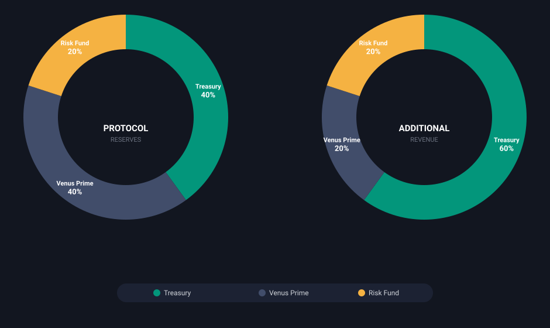

# Tokenomics

Venus Protocol revenue distribution is configured by governance. [Tokenomics version 4.1](https://snapshot.box/#/s:venus-xvs.eth/proposal/0xb8f03ad2dd2988a6d2e89a1adbebc52c7a62b284ea493008752c71b7f00b3386) established the current model, and [VIP-585](https://venus.io/governance/proposal/585?chainId=56) ended the BNB Burn allocation and introduced chain-revenue eligibility rules.


The percentages and reward speeds below are a governance-policy snapshot, not immutable token properties. Check recent VIPs and the live Protocol Share Reserve and XVS Vault configuration before using them in financial models.


## Protocol reserve revenue

Protocol reserves are primarily generated from interest paid by borrowers. For an eligible deployment, the configured allocation is:

| Destination | Share |
| --- | ---: |
| Treasury | 40% |
| XVS Vault rewards | 20% |
| Venus Prime | 20% |
| Risk Fund | 20% |

XVS Vault revenue is used to buy XVS and distribute it through vault rewards. The Prime allocation supplies eligible markets with protocol-funded rewards. The Risk Fund helps cover protocol shortfalls.

## Other revenue

Revenue streams such as liquidation income use this allocation:

| Destination | Share |
| --- | ---: |
| Treasury | 60% |
| XVS Vault rewards | 20% |
| Risk Fund | 20% |

New products or revenue sources may use a different governance-approved configuration.

## Chain eligibility

A deployment is eligible to allocate revenue to XVS Vault rewards and Venus Prime when it generates at least $50,000 in average monthly revenue over the preceding six months. An ineligible deployment routes 100% of its revenue to the Treasury. Governance periodically evaluates eligibility, so it can change as the rolling revenue window changes.

## XVS Vault rewards

Vault reward speed is governance-configured and can combine a base allocation with XVS purchased using protocol revenue. It is not a guaranteed yield or a permanent emission rate.

[VIP-641](https://venus.io/governance/proposal/641?chainId=56) retained a base allocation equivalent to 308.7 XVS per day and, together with buybacks, configured a total BNB Chain vault speed equivalent to 535 XVS per day for Q3 2026. At BNB Chain block `118,362,254`, the XVS Vault reported `0.002786458333333333` XVS per block, equivalent to the same nominal daily rate at 192,000 blocks per day.

Future VIPs can fund the vault and change the speed at any time. Read `rewardTokenAmountsPerBlockOrSecond(XVS)` on the live XVS Vault and review its funding balance before quoting a current reward rate.

<figure><figcaption>
<em>Governance-configured revenue distribution</em>
</figcaption></figure>
