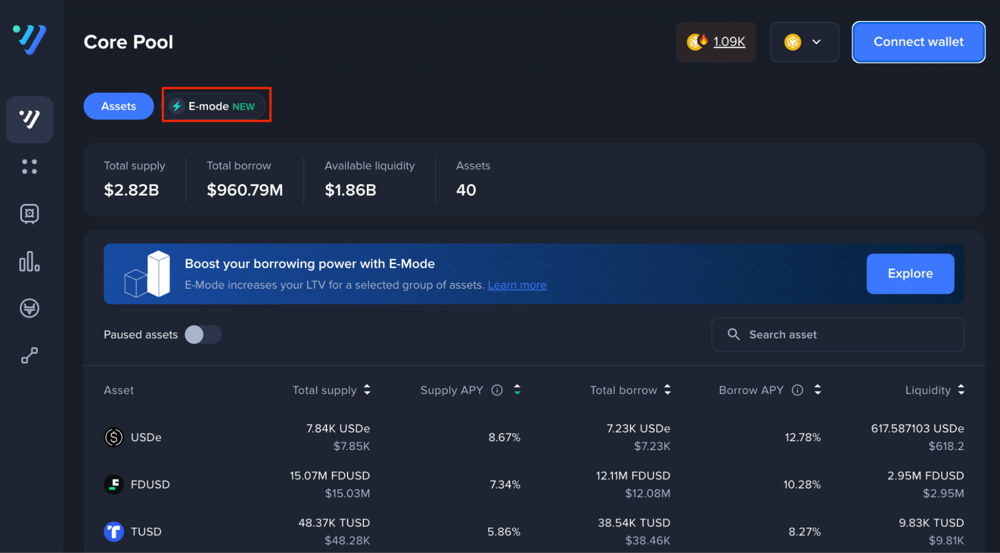

# Try E-Mode on Venus

### Want to try out e-mode?

Head to the Venus dApp ([app.venus.io](https://app.venus.io)) and ensure you are connected to the BNB Chain.

Click on the “E-mode” icon to view current e-mode groups.

<figure><figcaption></figcaption></figure>

Make sure your wallet is connected.

<figure><figcaption></figcaption></figure>

Click “Enable” in the e-mode group you would like to enable. Just like that, enjoy increased LTV on the assets listed in that e-mode group!

<figure><figcaption></figcaption></figure>

When e-mode is enabled, you can only borrow assets listed in that group. These assets will be marked in the “borrowable” column for your reference.

Currently, only the Stablecoins e-mode group is enabled. We plan to release BTC and BNB e-mode groups within the next few weeks. Keep following us on X or join our Telegram and Discord groups to be the first to know!
