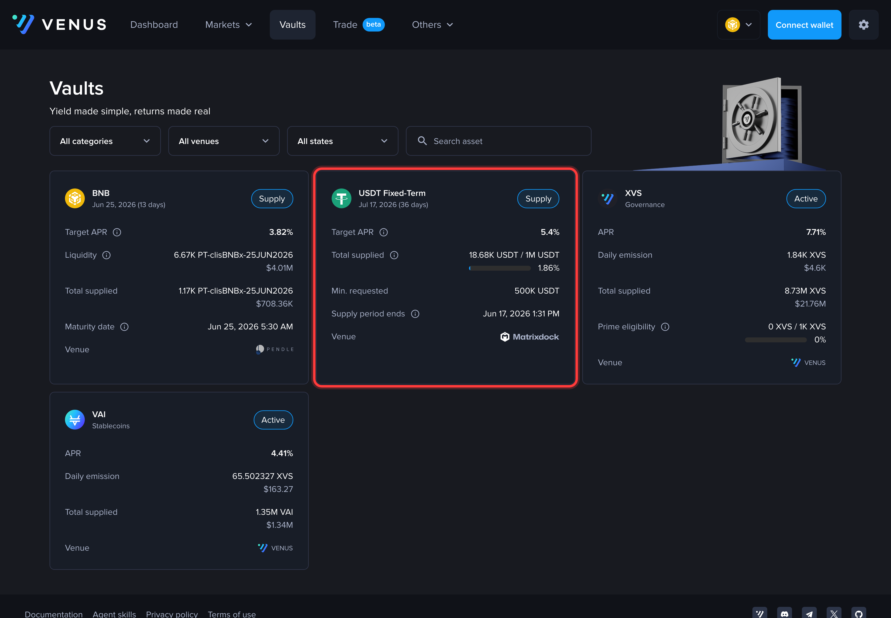
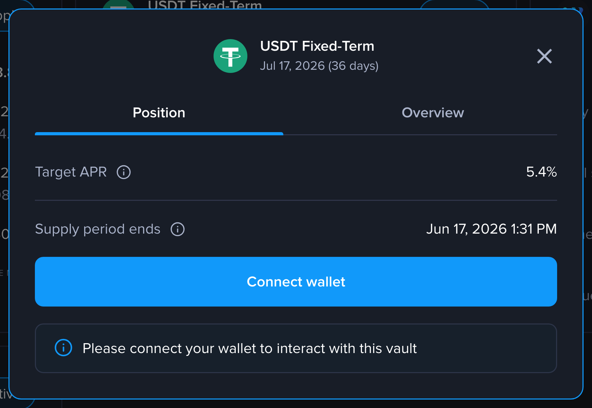
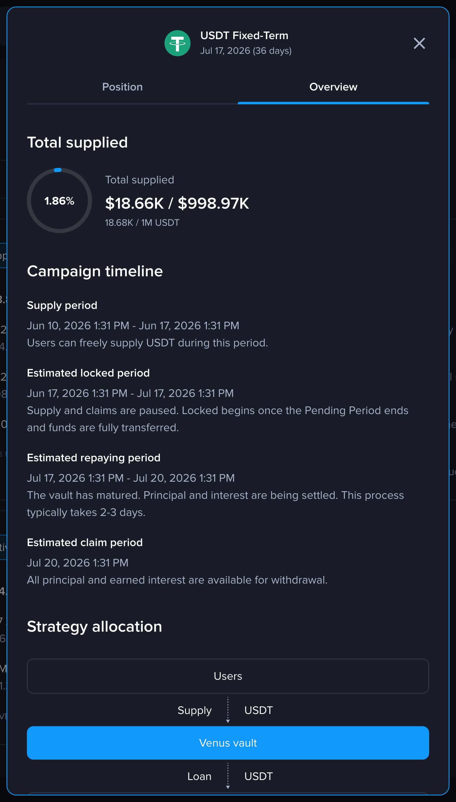
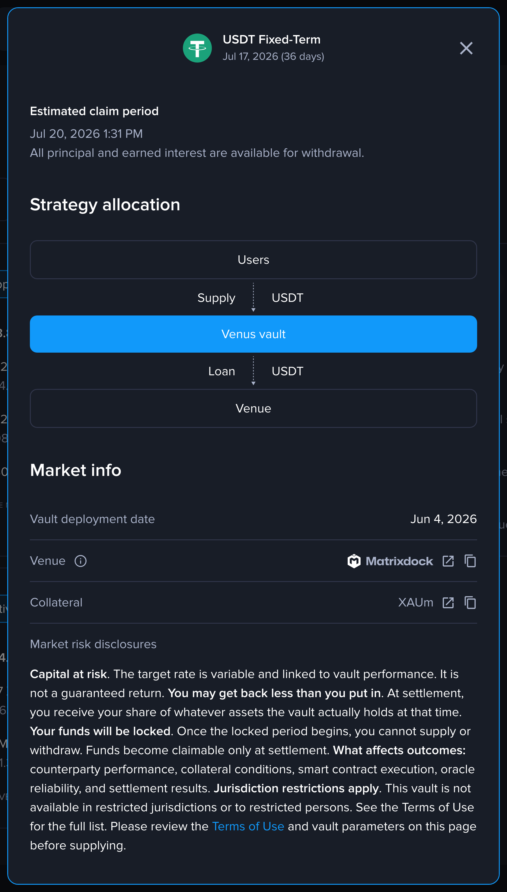
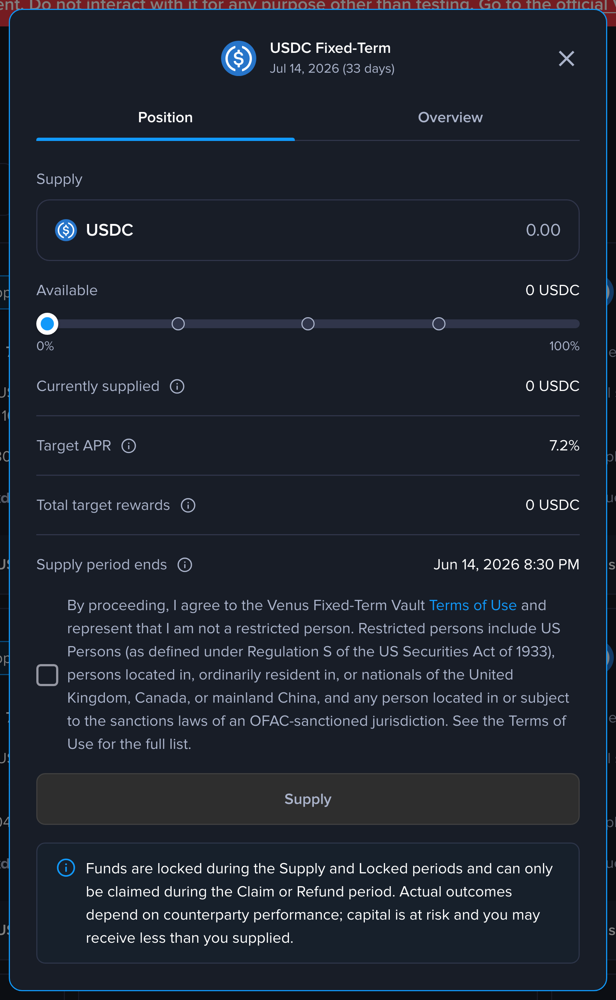
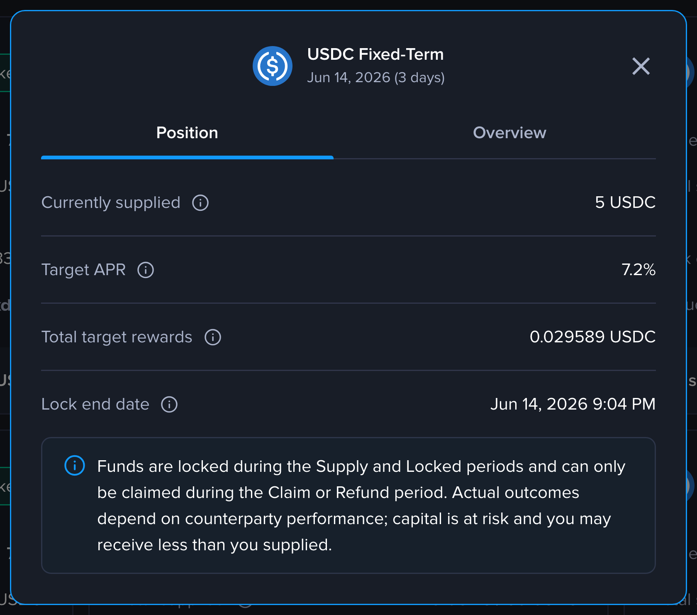
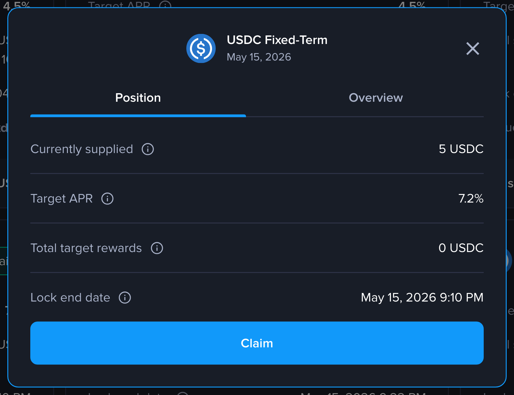

# Supplier Guide

This guide walks through how to participate in a Fixed Term Vault as a supplier. You supply the loan asset during the fundraising window, hold through the lock period, and redeem principal plus the target yield at maturity.


**Capital is at risk.** The target APR is set at vault deployment and is not a guaranteed return. Actual proceeds at settlement depend on counterparty performance and may be less than the amount supplied. This product is not available to retail investors or persons in restricted jurisdictions (US, UK, Canada, mainland China, or OFAC-sanctioned countries).


## Finding a Vault

Fixed Term Vaults live on the Venus **Vaults** page: [venus.io/#/vaults?chainId=56](https://venus.io/#/vaults?chainId=56). Open the app, make sure your network is set to BNB Chain, and select **Vaults** in the top navigation.

Each vault is shown as a card. A Fixed Term Vault is labelled **Fixed-Term** next to the supply asset (for example, *USDT Fixed-Term*) and shows its headline terms — the target APR, total supplied against the cap, the minimum requested raise, when the supply period ends, and the venue.

<figure><figcaption>
The Vaults page. The middle card is a Fixed-Term vault — note the <code>Fixed-Term</code> label, the target APR, and the supply period.
</figcaption></figure>

## Reading the Vault Terms

Click the vault card to open its detail panel, and review the terms before committing — they are fixed at deployment and cannot change once the vault is live.

The **Position** tab shows the **Target APR** (net of the protocol reserve factor) and the **Supply period ends** deadline.

<figure><figcaption>
Position tab: target APR and the supply-period deadline.
</figcaption></figure>

The **Overview** tab shows total supplied and the **campaign timeline** — Supply → Locked → Repaying → Claim. The gap between the supply close and the lock end is your lock duration.

<figure><figcaption>
Overview tab: total supplied and the campaign timeline (Supply → Locked → Repaying → Claim).
</figcaption></figure>

**Market info** shows the venue (the institution that borrows the funds), the collateral backing the loan, and the risk disclosures.

<figure><figcaption>
Market info: the venue (recipient), the collateral asset, and the risk disclosures.
</figcaption></figure>

## Step 1: Supply During Fundraising

While the supply period is open, connect your wallet using **Connect wallet** in the top-right, then open the vault and go to the **Position** tab.

1. Enter the amount of the supply asset you want to deposit, or use the percentage slider. The **Available** balance is shown above the input.
2. Tick the box confirming you agree to the Fixed-Term Vault Terms of Use and that you are not a restricted person.
3. If this is your first supply of this asset, approve the token spend, then click **Supply** and confirm the transaction in your wallet.

You receive vault share tokens representing your claim. The shares are freely transferable, so you can hold them in any wallet. A **minimum supply floor** applies unless you're filling the final residual capacity, in which case the floor is waived so the cap can actually be reached.

<figure><figcaption>
The supply form: enter an amount, accept the terms, then Supply. Funds are locked once the lock period begins.
</figcaption></figure>

## Step 2: Hold Through the Lock Period

When the supply window closes with the raise above the minimum, the vault enters the lock period. At this point:

* **Supplying and withdrawing are blocked.** There is no early exit.
* **The yield amount is fixed.** Interest is calculated upfront on the full raise for the entire lock duration.
* **Shares remain transferable.** You can move or sell them at any time, even while funds are locked.

In the app, the vault's badge changes to **Locked** and the **Position** tab shows your **Currently supplied** balance, the **Target APR**, your **Total target rewards**, and the **Lock end date**. The action buttons are gone — funds can only be claimed once the vault reaches the Claim or Refund period.

<figure><figcaption>
A locked position. Funds are committed until maturity — there is no early exit.
</figcaption></figure>

## Step 3: Wait for Settlement

When the lock duration elapses, the loan is due and the institution has until the settlement deadline to repay in full. Suppliers cannot withdraw during this window.

Either the institution repays in full and the vault matures, or the settlement deadline passes with debt outstanding and the vault becomes eligible for overdue liquidation at the late-penalty rate. Either way, no action is required from the supplier.

## Step 4: Redeem at Maturity

Once the institution has repaid the full debt, the vault matures and its badge changes to **Claim**. Open the vault, go to the **Position** tab, and click **Claim** to burn your shares and receive principal plus your share of the interest. Confirm the transaction in your wallet.

<figure><figcaption>
A matured vault. Click <strong>Claim</strong> to burn your shares and withdraw principal plus interest.
</figcaption></figure>

### Example: Estimating Your Payout

A vault raises 100,000 USDC at an 8% target APR for a 90-day lock. You supply 10,000 USDC and receive shares representing 10% of the vault.

* Total interest at maturity: $$100{,}000 \times 0.08 \times 90/365 \approx 1{,}972.60 \text{ USDC}$$
* Assume a 10% protocol fee on interest: $$1{,}972.60 \times 0.10 \approx 197.26 \text{ USDC}$$
* Net target interest paid to suppliers: $$1{,}972.60 - 197.26 \approx 1{,}775.34 \text{ USDC}$$
* Settlement pool: $$100{,}000 + 1{,}775.34 = 101{,}775.34 \text{ USDC}$$
* Your share (10%): **~10,177.53 USDC**. That should be a return of ~1.78% over the 90-day term on your 10,000 USDC principal.

## Key Risks You Must Understand

A Fixed Term Vault is a fixed-term commitment. Be aware of the following before participating:

* **No early exit during the lock period.** Funds are locked until maturity.
* **Fundraising shortfall.** If the raise falls short of the minimum, the vault fails and you get your principal back with no interest.
* **Collateral underdelivery.** If the institution doesn't top up collateral in time, you get your principal back plus a pro-rata share of the confiscated margin in the collateral asset.
* **Overdue liquidation.** If the institution misses the settlement deadline, the vault is liquidated at the late-penalty rate, which can reduce the amount available for suppliers.
* **Liquidation may reduce recovery.** If collateral didn't fully cover the debt, your payout may be less than the target rewards.

## Best Practices

* **Read the vault terms carefully.** Target APR, lock duration, and the minimum-raise threshold determine your worst-case outcome.
* **Track the settlement deadline.** Once it approaches, watch for repayment activity. If the institution misses it, you'll need to wait for either a catch-up repayment or a liquidation to settle the vault.
* **Redeem as soon as possible.** If funds remain unclaimed for too long, Venus may sweep the remaining assets and close the vault.

## Recovering Your Funds

A vault has three end states — **Matured**, **Failed**, and **Liquidated**. In any of them your shares become redeemable: open the vault, go to the **Position** tab, and click **Claim**. This burns your shares and pays you a share of the vault's assets proportional to how much of the vault you hold. What that payout consists of depends on how the vault ended.

| End state | What you receive |
| --- | --- |
| **Matured** — institution repaid in full | Your principal plus your pro-rata share of the interest, paid in the supply asset. |
| **Failed** — raise stayed below the minimum | Your full principal back in the supply asset. No interest, because no loan was made. |
| **Failed** — institution didn't post enough collateral | Your full principal back in the supply asset, **plus** your pro-rata share of the institution's confiscated margin, paid in the collateral asset. |
| **Liquidated** — bad debt was repaid to settle the vault | Your pro-rata share of whatever supply asset the vault holds. This can be less than your principal if the collateral didn't cover the full debt. |

---

For the on-chain details, including the full state machine, function signatures, math, and liquidation paths, see the [Fixed Term Vaults Technical Reference](../../technical-reference/reference-technical-articles/fixed-rate-vaults.md).
