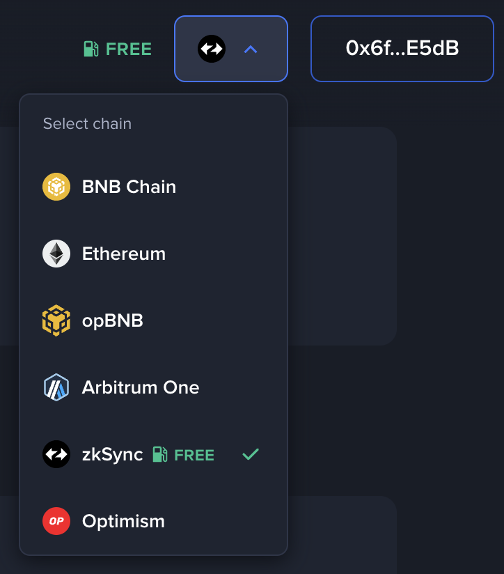
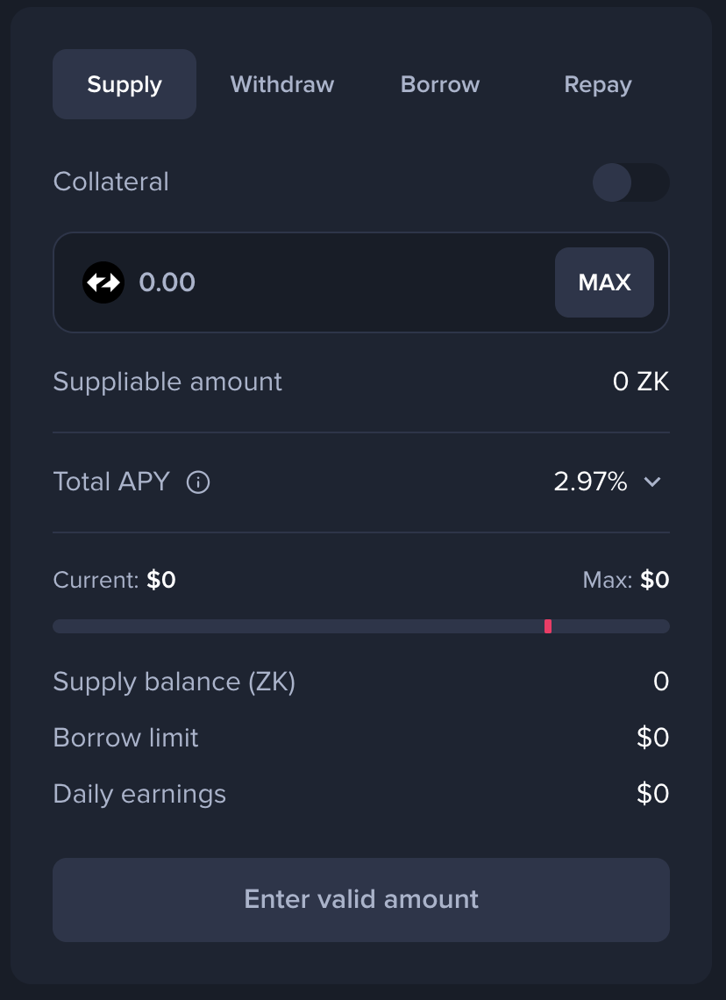
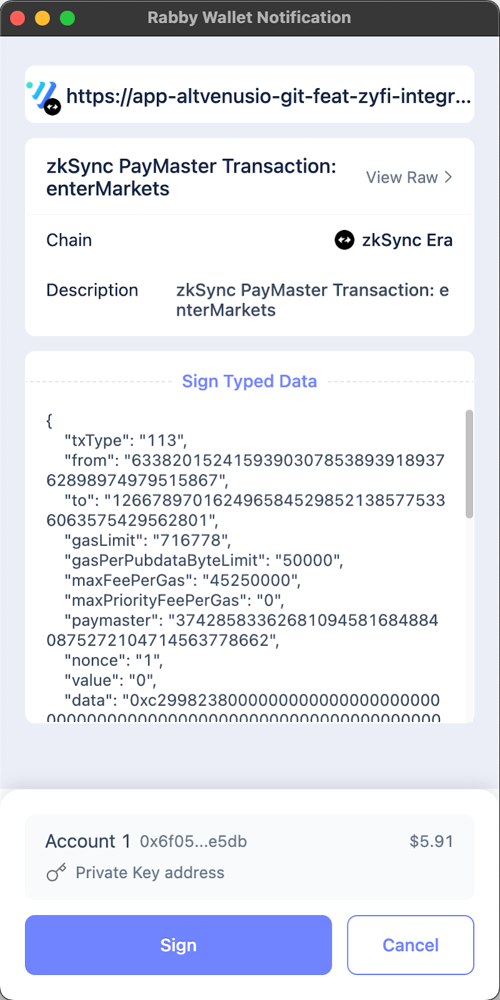
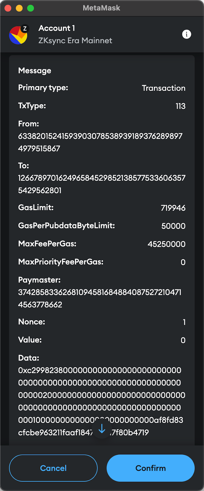

# Gasless transactions on ZKsync

The Venus app can offer transactions that use a [Zyfi Paymaster](https://docs.zyfi.org/integration-guide/paymasters-integration/sponsored-paymaster) on ZKsync. Paymaster availability, supported actions, sponsorship percentage, fee token, quota, and quote expiry are dynamic; a displayed option is not a promise that every transaction will be fully sponsored.


Do not depend on sponsorship for urgent position management. Keep enough ETH for a standard ZKsync transaction, or use a fee token only when the current Venus quote explicitly identifies it and its maximum cost. Never sign an opaque or unexpected payload: verify the ZKsync network, contract, action, token, amount, fee, and expiry shown by the app and wallet.


## Step-by-Step Guide

### Step 1: Connect to ZKsync on Venus

1. Open the [Venus app](https://app.venus.io) and connect your wallet.
2. Make sure you are connected to the ZKsync network. If you are not, switch your wallet’s network to ZKsync.

<figure><figcaption>Selection of ZKsync network</figcaption></figure>

### Step 2: Prepare the Venus action

In this example, the action enables the ZK market as collateral. Enabling collateral changes liquidation risk; review the market and resulting account health before continuing.

1. Navigate to the ZK market on Venus.
2. Click on "Collateral" to enable the use of this market as collateral.

<figure><figcaption>Interaction with any feature on ZKsync</figcaption></figure>

### Step 3: Review the quote and authorize the transaction

1. If sponsorship is currently available for the action, the app displays a paymaster quote. Check whether sponsorship is full or partial, which token pays any remainder, the maximum fee, and the quote expiry.
2. Review the wallet request. Wallets and integration versions can present a transaction or typed authorization differently; confirm the decoded target and action match the Venus action you prepared. Reject an unexpected chain, contract, spender, amount, fee token, value, nonce, or deadline.
3. Authorize only after those values match. If the quote has expired or sponsorship is unavailable, cancel and use the normal wallet transaction flow with ETH rather than repeatedly signing stale payloads.

<figure><figcaption>Example Zyfi authorization prompt in Rabby; verify the current decoded request.</figcaption></figure>

<figure><figcaption>Example Zyfi authorization prompt in MetaMask; verify the current decoded request.</figcaption></figure>

### Viewing the Transaction

Verify the submitted transaction on the [ZKsync Explorer](https://explorer.zksync.io/). If a paymaster was used, the transaction details identify it; also confirm the called Venus contract, status, token movements, and final fee. The screenshots above are illustrative and may not match the current wallet or app flow.
