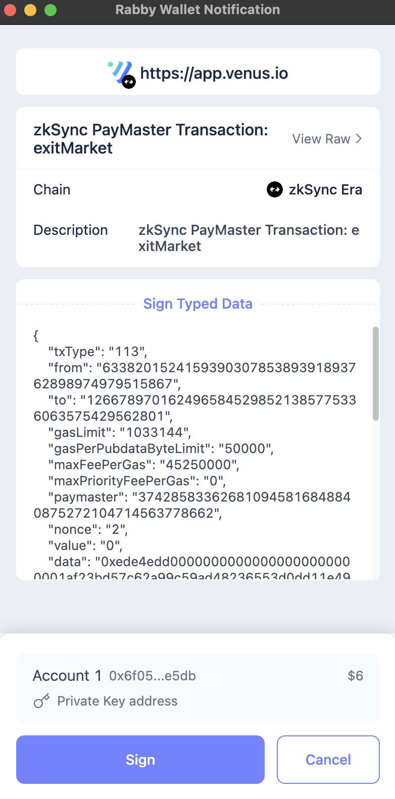
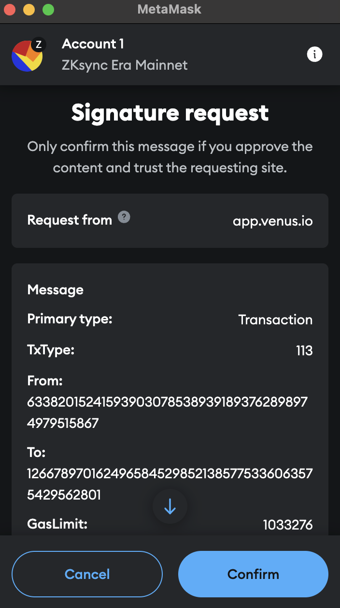

This guide will walk you through the steps to interact with Venus Protocol on zkSync without needing ETH to cover gas fees, thanks to the integration of [ZyFi Paymaster](https://www.zyfi.org/). All transactions will be sponsored, so you can focus on using the protocol without worrying about gas expenses.

## Step-by-Step Guide

### Step 1: Connect to zkSync on Venus

1. Open the [Venus app](https://app.venus.io) and connect your wallet.
2. Make sure you are connected to the zkSync network. If you are not, switch your wallet’s network to zkSync.

<figure><figcaption>Selection of zkSync network</figcaption></figure>

### Step 2: Interact with the Venus Protocol

In this example, we will approve the use of the ZK market as collateral.

1. Navigate to the ZK market on Venus.
2. Click on "Collateral" to enable the use of this market as collateral.

<figure><figcaption>Interaction with any feature on zkSync</figcaption></figure>

### Step 3: Sign the Transaction

1. Instead of sending a typical transaction, you will be prompted to **sign a message**. This step authorizes ZyFi to pay for the gas fee of the transaction on your behalf.
2. Sign the message in your wallet. The gas for the transaction will be covered by ZyFi Paymaster, so you **don’t need ETH** in your wallet.
3. Once signed, ZyFi processes the transaction, and it is sent to the zkSync blockchain with gas paid through their vault.

<figure><figcaption>Sign a message with Rabby, instead of sending a transaction</figcaption></figure>

<figure><figcaption>Sign a message with Metamask, instead of sending a transaction</figcaption></figure>

### Viewing the Transaction

You can verify the transaction on the [zkSync Explorer](https://explorer.zksync.io/). The transaction will display ZyFi as the Paymaster, covering the gas fees.