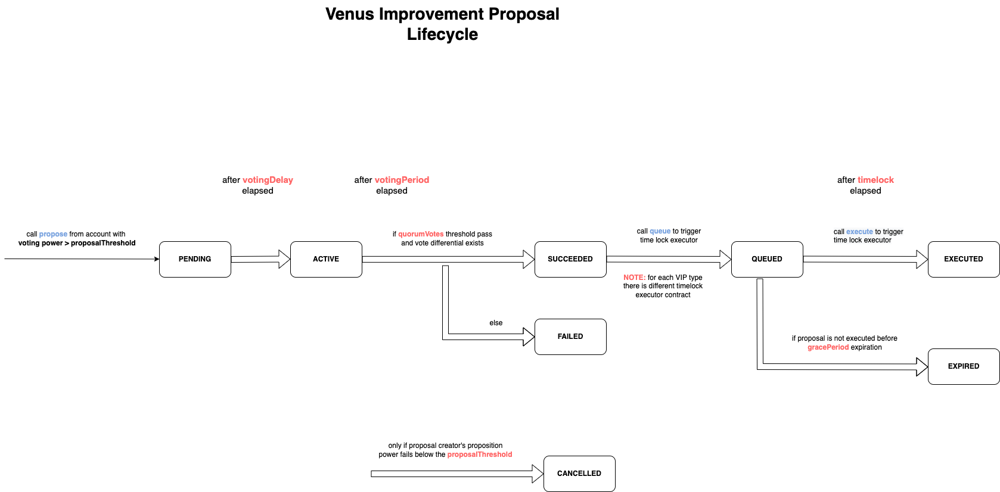

# Governance

## Introduction

Venus Governance V4 is updated version of on-chain governance, allowing unique features such as delegated voting, rapid protocol upgrades, governance upgrades. On top of that Governance V4 brings a granularity in our pause mechanism, allowing governance to pause any actions on any markets, especially in the context of isolated markets.  **The above changes are meant to increase Governance efficiency, while reducing opportunities for malicious or erroneous proposals to slip through.**

## Details

Governance has 3 main contracts: GovernanceBravoDelegate, XVSVault, XVS token.
XVS token is the protocol token used for protocol users to cast their vote on proposals submitted from other users.
XVSVault is the main stacking contract for XVS. Users should stake their XVS in order to be able to cast their votes. Users can also delegate their voting power to other users via the XVSVault. This contract is also responsible for staking rewards for each pool.
GovernanceBravoDelegate is Venus Governance contract. Users interact with it to:
- Submit new proposal
- Vote on a proposal
- Cancel proposal
- Queue proposal for execution to a timelock executor contract

GovernanceBravoDelegate is using XVSVault to get information about voting power of users to enforce some of important governance rules:
- Users with voting power below proposalThreshold cannot submit a proposal
- If a user's voring power drops below certain amount, anyone can cancel the the proposal. On the other hand governance guardian and proposal creator can cancel a proposal at anytime, but before it is queued for execution.

