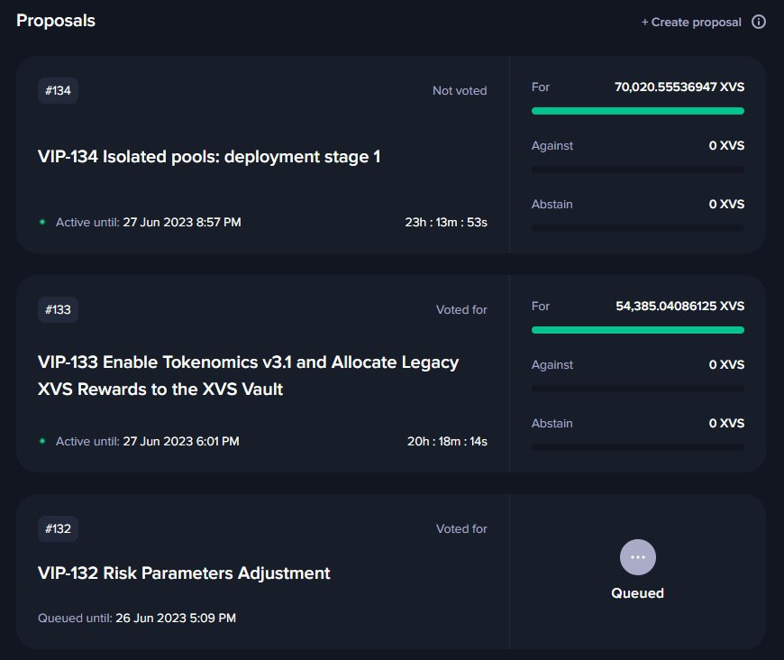
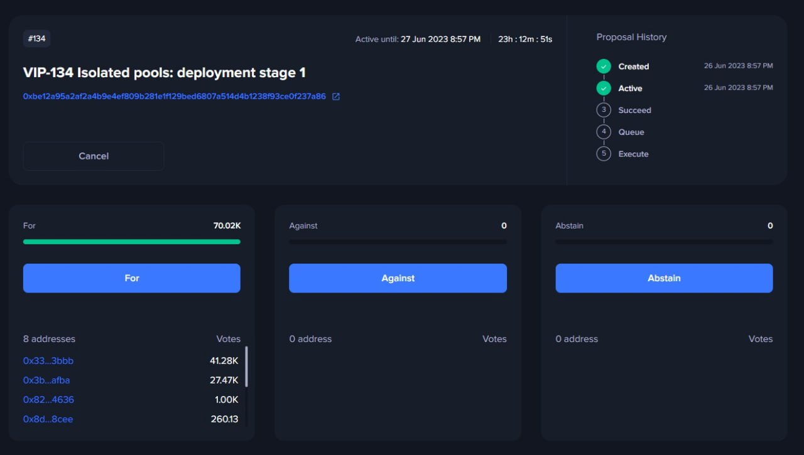
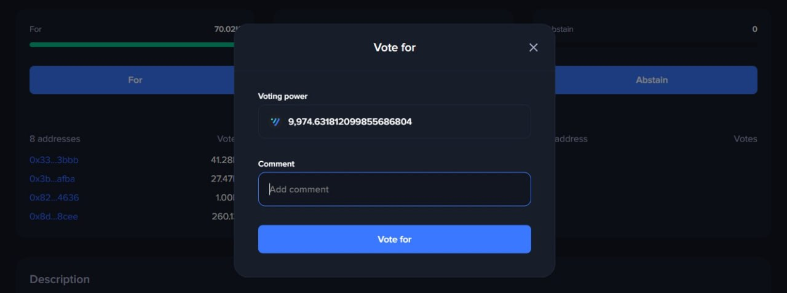
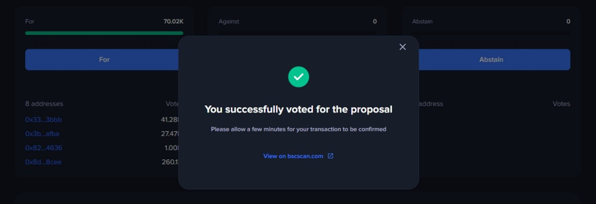

# Delegating & Voting

### Overview

Participation in the Venus Protocol governance process requires that users delegate their voting power. This process ensures that XVS tokens held in the vault are eligible to vote on Venus Improvement Proposals (VIPs). Notably, with the new governance model, this process needs to be done only once.

### Delegate Voting Power

**Step 1: Visit the Venus Governance Portal**

Access the Venus governance portal via your browser. The URL is [https://app.venus.io/governance](https://app.venus.io/governance).

**Step 2: Connect Your Wallet**

On the top right corner of the screen, click on the "Connect Wallet" button. Choose your wallet from the dropdown menu and follow the prompts to connect.

**Step 3: Delegate Your Voting Power**

Once your wallet is connected, click on the "Delegate" button in the Governance section. This will open up a new dialogue box.

<figure><figcaption></figcaption></figure>

**Step 4: Enter Your Address**

In the new dialogue box, click on the "Paste your address" field. Your connected wallet address should automatically populate.

<figure><figcaption></figcaption></figure>

**Step 5: Redelegate Your Votes**

Click on the "Redelegate" button. This will submit the address for vote delegation.

<figure><figcaption></figcaption></figure>

**Step 6: Confirm the Transaction**

A confirmation prompt will appear in your connected wallet (for example, MetaMask). Confirm the transaction to complete the voting power delegation process.

Congratulations, you've now enabled your XVS in the vault to participate in Venus Protocol's governance. Your tokens are now ready to vote on upcoming VIP proposals. Remember, your engagement in the protocol’s decision-making process is vital for its future development and success.

### Vote for a VIP

#### Step 7: Select the VIP Proposal&#x20;

To vote on a Venus Improvement Proposal (VIP), navigate to the list of active proposals on the Venus Governance Portal. Click on the title of the VIP you wish to vote on. _**Remember, your voting eligibility requires your address to be delegated.**_

<figure><figcaption></figcaption></figure>

#### Step 8: Cast Your Vote&#x20;

After selecting the VIP, you'll see voting options for the proposal. You can choose 'For' to vote in favor of the proposal, 'Against' to vote against it, or 'Abstain' to remain neutral.

<figure><figcaption></figcaption></figure>

#### Step 9: Add a Comment&#x20;

Before you submit your vote, you have an option to provide a comment explaining the reasoning behind your decision. This step is not mandatory, but it contributes to a more transparent and inclusive voting process.

<figure><figcaption></figcaption></figure>

#### Step 10: Submit Your Vote&#x20;

Once you've made your decision and optionally left a comment, click the 'Submit Vote' button to cast your vote.

<figure><figcaption></figcaption></figure>

Congratulations, you've successfully voted on a VIP proposal! Your participation is integral to the development and success of the Venus Protocol. Thank you for your contribution to our community's decision-making process. Remember, every vote counts in shaping the future of Venus Protocol.

