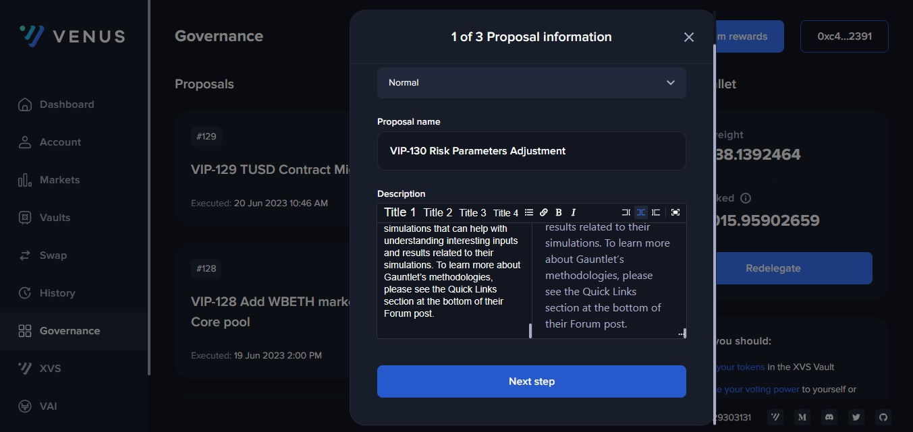
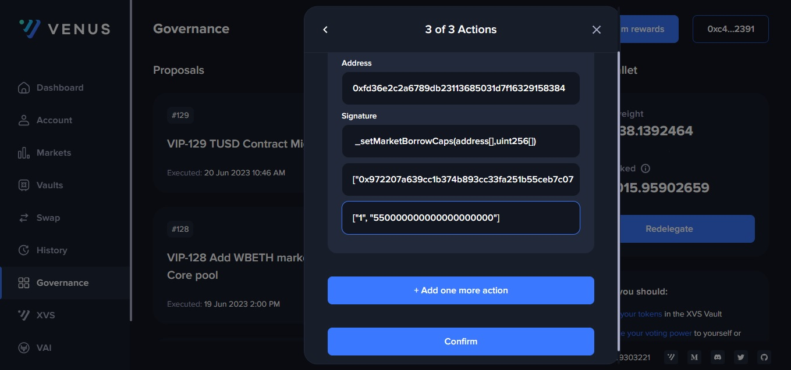
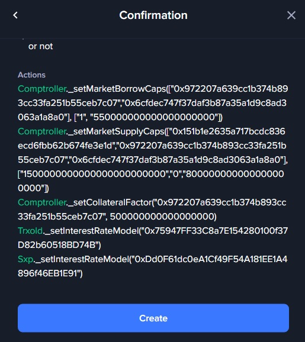

# Submitting a VIP

### Overview

Venus Protocol's governance model allows token holders to propose and vote on Venus Improvement Proposals (VIPs). Here's a step-by-step guide to help you create and submit a proposal. Remember, you need a voting weight of at least 300,000 to submit a proposal.

### Step 1: Visit the Venus Governance Portal

Navigate to the Venus Governance Portal using your preferred web browser. You can access the portal at <https://app.venus.io/governance>.

### Step 2: Connect Your Wallet

To submit a proposal, you need to connect your digital wallet. Locate the "Connect Wallet" button at the top right corner of the screen and click on it. A dropdown menu will appear, listing various wallets that the Venus Governance Portal supports. Select your wallet from the dropdown menu and follow the instructions to connect your wallet to the portal.

### Step 3: Create a Proposal

Now that your wallet is connected, you can create a proposal. Look for the "Create Proposal" button at the top right corner of the screen and click on it.

<figure><figcaption></figcaption></figure>

### Step 4: Choose the Proposal Type

After clicking the "Create Proposal" button, a new interface will pop up prompting you to select the proposal type. Select the relevant proposal type depending on the kind of change you want to propose.

<figure><figcaption></figcaption></figure>

### Step 5: Enter Proposal Information

The next step involves providing detailed information about your proposal. This includes the proposal's title, a brief description, and a link to an off-chain discussion related to your proposal. Ensure the information you provide is clear and concise to facilitate understanding by other community members.

<figure><figcaption></figcaption></figure>

### Step 6: Set the Voting Options

Now, specify the voting options. These are the possible responses that voters can choose when voting on your proposal. Typical voting options include "For" and "Against", but you can add more options as needed.

<figure><figcaption></figcaption></figure>

### Step 7: Specify the Actions

This step involves detailing the specific actions that will take place if the proposal is approved. Be as specific as possible, outlining the method calls, contracts, and arguments that will be affected.

<figure><figcaption></figcaption></figure>

### Step 8: Confirm the Proposal Submission

Finally, review your proposal to ensure all details are accurate. After confirming everything is correct, click the "Submit" button to submit your proposal. You'll see a confirmation prompt on your connected wallet. Confirm the transaction to complete the proposal submission process.

<figure><figcaption></figcaption></figure>

Congratulations! You've successfully submitted a Venus Improvement Proposal. The Venus community will now review your proposal and vote on it. Remember, your active involvement in Venus Protocol's governance process is crucial for its continued development and success.
