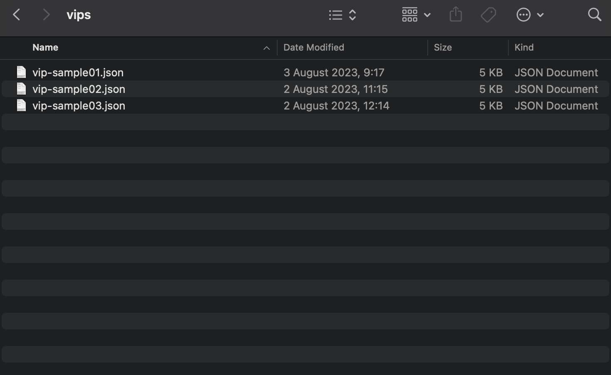

# Submitting a VIP

### Overview

Venus Protocol's governance model allows token holders to propose and vote on Venus Improvement Proposals (VIPs). Here's a step-by-step guide to help you create and submit a proposal. Remember, you need a voting weight of at least 300,000 to submit a proposal.

### Step 1: Visit the Venus Governance Portal

Navigate to the Venus Governance Portal using your preferred web browser. You can access the portal at <https://app.venus.io/governance>.

### Step 2: Connect Your Wallet

To submit a proposal, you need to connect your digital wallet. Locate the "Connect Wallet" button at the top right corner of the screen and click on it. A dropdown menu will appear, listing various wallets that the Venus Governance Portal supports. Select your wallet from the dropdown menu and follow the instructions to connect your wallet to the portal.

### Step 3: Create a Proposal

Now that your wallet is connected, you can create a proposal. Look for the "Create Proposal" button at the top right corner of the screen and click on it.

<figure><figcaption></figcaption></figure>

This action will open a modal presenting two options - "Upload file" and "Create Manually":

<figure><figcaption></figcaption></figure>

Let's now take a look at each option and how they can used to create a VIP.

### Step 4: Upload a proposal file

The fastest way to create a proposal is by importing a VIP file. They are JSON formatted files containing all the information needed to create a VIP, such as the proposal's title, type, actions and parameters.

Venus makes available a tool to generate VIP files, which you can find [here](https://github.com/VenusProtocol/vips). You can also check an [example of a valid proposal file here](https://github.com/VenusProtocol/venus-protocol-interface/blob/main/src/assets/proposals/vip-123.json). Note that all the fields will be validated according to their requirements and types.

#### Step 4.1: Choose a VIP file

Clicking "Upload file" will lead you to choose the proposal file you want to upload:

<figure><figcaption></figcaption></figure>

After uploading the desired file, it will be parsed and validated. Any possible errors found will be reported by the interface.

#### Step 4.2: Confirm the Proposal

Once the validation is done, the interface will present all the VIP data for your review:

<figure><figcaption></figcaption></figure>

If everything looks good, click "Create" at the bottom of the modal to confirm the creation of your VIP.

### Step 5: Create a Proposal Manually

Instead of uploading a file, you can opt to manually create a proposal. By clicking on "Create manually", we are presented a sequence of screens:

#### Step 5.1: Choose the Proposal Type

After clicking the "Create manually" button, a new interface will pop up prompting you to select the proposal type. Select the relevant proposal type depending on the kind of change you want to propose.

<figure><figcaption></figcaption></figure>

#### Step 5.2: Enter Proposal Information

The next step involves providing detailed information about your proposal. This includes the proposal's title, a brief description, and a link to an off-chain discussion related to your proposal. Ensure the information you provide is clear and concise to facilitate understanding by other community members.

<figure><figcaption></figcaption></figure>

#### Step 5.3: Set the Voting Options

Now, specify the voting options. These are the possible responses that voters can choose when voting on your proposal. Typical voting options include "For" and "Against", but you can add more options as needed.

<figure><figcaption></figcaption></figure>

#### Step 5.4: Specify the Actions

This step involves detailing the specific actions that will take place if the proposal is approved. Be as specific as possible, outlining the method calls, contracts, and arguments that will be affected.

<figure><figcaption></figcaption></figure>

#### Step 5.5: Confirm the Proposal Submission

Finally, just like after the VIP import, you will be able to review your proposal to ensure all details are accurate. After confirming everything is correct, click the "Submit" button to submit your proposal. You'll see a confirmation prompt on your connected wallet. Confirm the transaction to complete the proposal submission process.

<figure><figcaption></figcaption></figure>

Congratulations! You've successfully submitted a Venus Improvement Proposal. The Venus community will now review your proposal and vote on it. Remember, your active involvement in Venus Protocol's governance process is crucial for its continued development and success.
