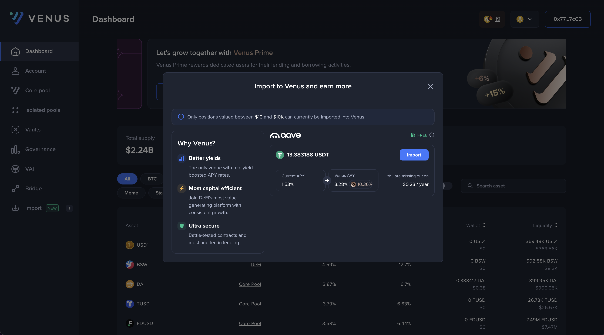
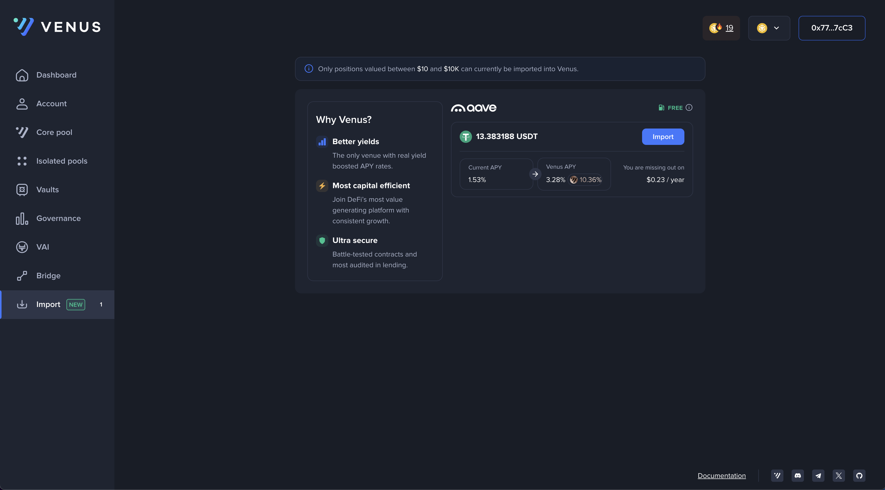

# Import Positions

### Introduction

This guide provides step-by-step instructions on how to import your supply positions from other DeFi platforms into the Venus Protocol.

### Steps for importing supply positions from other DeFi platforms)

#### Step 1: Connect Your Wallet

* Click on the "Connect wallet" button in the top right corner of the Venus Bridge interface to connect your wallet.

<figure><figcaption></figcaption></figure>

If you have supply positions in other DeFi protocols (we currently only support Aave, with more to come soon) for which we can propose a better APY, a modal will automatically appear showing you options to import your positions to the Venus Protocol.

<figure><figcaption></figcaption></figure>

If you close this modal, it won't be shown to you ever again. You can still access this UI by selecting the "Import" item in the side menu.

<figure><figcaption></figcaption></figure>

#### Step 2: Initiate an Import

* Click on the "Import" button next to any position listed.
* A confirmation pop-up will appear in your wallet for you to approve the transaction. Note that this transaction is sponsored by the Venus Protocol, therefore it is free of charge.

#### Step 3: Confirm and Wait

* Confirm the transaction in your wallet. The interface will show the transaction as pending, indicating that it is being processed. This may take from a few seconds to a few minutes depending on the current network activity.
* You can import all your positions one-by-one by repeating the process.

#### Step 4: Transaction Completion

* Once the transaction is complete, the new positions will appear in the "Account" page.
