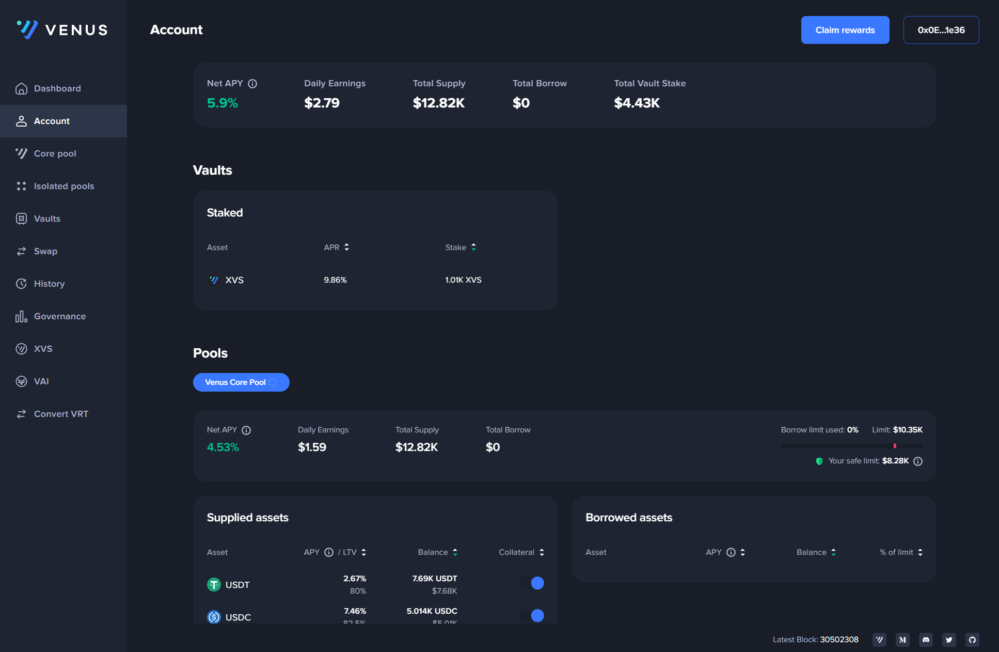

# Venus interface

Let's take a quick look at the Venus interface and the features available in each menu of the navigation bar.

### Dashboard

In the center of the Dashboard interface, you will find the Supply and Borrow markets. The Supply market allows you to lend your cryptocurrency assets and earn interest on them. You can choose which assets to supply and specify the amount you want to lend. On the other hand, the Borrow market allows you to borrow cryptocurrency assets by using your supplied assets as collateral. You can select the assets you want to borrow and specify the amount you need.

<figure><figcaption></figcaption></figure>

### Account

The Account interface provides an overview of your supplied and borrowed assets. Here, you can keep track of your balances and monitor the status of your transactions.

<figure><figcaption></figcaption></figure>

### Core Pool

The Core Pool is accessed from the Markets interface, which lists lending markets for the selected chain and displays metrics such as Supply APY, Borrow APY, and liquidity. On chains where [Isolation Mode](../../whats-new/isolated-e-mode.md) groups are available, they appear as an **Isolation mode** tab within the Core Pool interface.

Isolation Mode is separate from the deprecated standalone Isolated Pools product described below.

### Pools

The standalone Isolated Pools navigation and market screens described in earlier versions of this guide have been removed. New supply and borrow activity in these pools is not available through the Venus interface. If you still have a position or unclaimed rewards in a legacy isolated pool, follow the [exit and rewards guide](../isolated-pools-deprecation.md).

### Vaults

The Vaults interface allows you to access and manage the vaults associated with Venus Protocol. Vaults are designed to provide users with automated strategies for optimizing their yields and managing their assets more efficiently.

<figure><figcaption></figcaption></figure>

### Swap

The Swap interface enables you to swap one cryptocurrency for another within the Venus Protocol. You can exchange your assets conveniently and quickly.

<figure><figcaption></figcaption></figure>

### History

In the History interface, you can review transaction history and track your previous activities on the Protocol.

<figure><figcaption></figcaption></figure>

### Governance

The Governance interface provides access to Venus Protocol's governance features. Here, users can participate in voting and contribute to decision-making processes that shape the future of the protocol.

<figure><figcaption></figcaption></figure>

### XVS

The XVS interface displays the current daily reward distribution rate for each of the protocol markets.

<figure><figcaption></figcaption></figure>

### VAI

The VAI interface is where you can mint and manage the VAI stablecoin. VAI is created on Venus Protocol and is pegged to the value of one USD.

<figure><figcaption></figcaption></figure>
