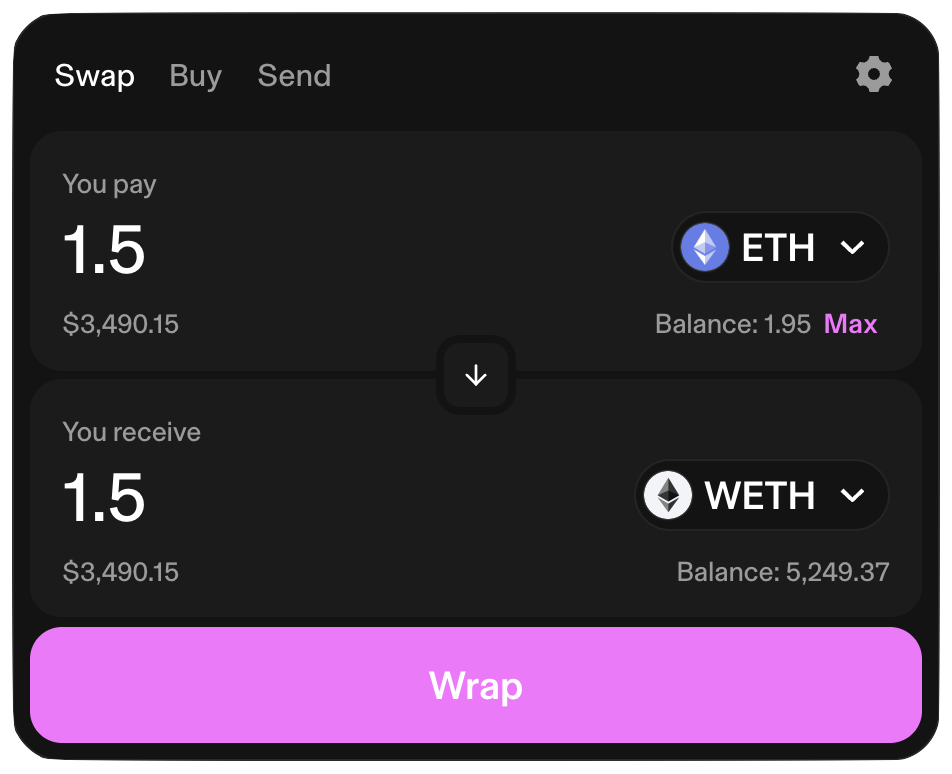
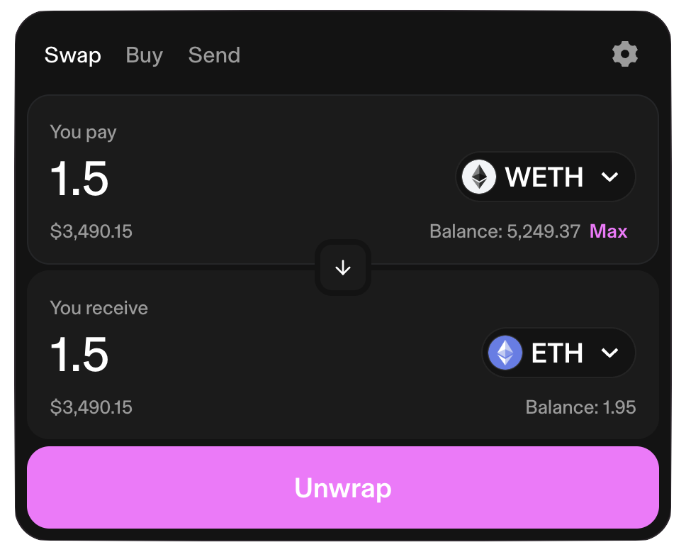

# Supplying and borrowing

In this guide, we will focus on using Venus Protocol to earn interest and borrow assets. If you’re looking for a more technical understanding of what’s happening under the hood, check out [Venus Protocol’s whitepaper](https://github.com/VenusProtocol/venus-protocol-documentation/blob/main/whitepapers/Venus-whitepaper-v4.pdf).

Once you’ve created your Web3 wallet on [MetaMask](https://metamask.io) or any other supported wallet App, open the Venus app ([https://app.venus.io](https://app.venus.io)). The interface will ask you to connect your Web3 wallet. Connecting your wallet to Venus Protocol enables you to authorize transactions, view balances, and perform other essential actions.

After successfully connecting your wallet, you will gain access to all the features of the Venus Protocol interface. In the Dashboard menu you will find all the markets. Clicking one of the markets a new modal will pop out, enabling you to interact with the selected market. Just make sure you are under the "Supply" or "Borrow" tab, depending on the desired action.

## Supply Assets to Earn Interest

1. Connect your Web3 wallet on MetaMask or other supported wallet app to the Venus app ([https://app.venus.io](https://app.venus.io)).
2. Navigate to the "Dashboard" menu and choose the asset you want to supply. For example, if you want to supply TRX, click on the TRX market.
3. Enable the asset. This will prompt a transaction confirmation in your wallet. Remember that a small gas fee applies, so ensure some native tokens (BNB for BNB chain, or ETH for Ethereum, for example) are available in your wallet.
4. Specify the amount you want to supply. The selected assets are transferred directly from your wallet to Venus Protocol, earning interest immediately. This interest will be automatically added to your Supply Balance.

## Manage your Borrowing Limit

Your borrowing limit on Venus Protocol is a function of the assets you have supplied. The following steps guide you to manage it:

1. Navigate to the "Account" section.
2. Here, you'll find your Borrow Limit on each pool, represented as a percentage of the total value of your supplied assets.
3. To adjust this limit, you can either supply more assets or repay some of your outstanding loans.

## Borrow Assets on Venus Protocol

After supplying assets, you can borrow other assets within your borrowing limit:

1. From the "Dashboard" menu, select the asset you want to borrow.
2. Input the amount you wish to borrow and confirm the transaction.

## Farm $XVS tokens

In addition to earning interest on supplied assets, you can also farm $XVS tokens:

1. In the "Vaults" section, you can stake your XVS or VAI tokens to earn XVS tokens.
2. Click on 'Stake'. You will be prompted to confirm the transaction in your wallet.

## Lending and Borrowing Example

Let's assume you supply 1000 TRX to Venus, and the vTRX/TRX rate is 0.0204. You'd receive approximately 49,019 vTRX in return (1000 / 0.0204). If the vTRX/TRX rate increases to 0.0215 after a year, your 49,019 vTRX would be worth 1021.5 TRX (49019 \* 0.0215), an increase of 21.5 TRX.

Remember that these vTokens represent your collateral in Venus Protocol. It's crucial not to trade or transfer them if you have an active loan, as they're required to maintain your borrowing limit.

## WETH

ETH is the native token for the Ethereum blockchain, used to pay gas fees, for example. WETH is an [ERC-20](https://ethereum.org/developers/docs/standards/tokens/erc-20) token representing ETH. Most Web3 apps (including Venus) are compatible with ERC-20 tokens, so it's necessary to convert ETH to WETH.

The conversion of ETH -> WETH and WETH -> ETH is always available in the WETH token itself, and the exchange rate is always `1:1`:

* If you wrap 1 ETH, you'll receive 1 WETH.
* If you unwrap 1 WETH, you'll receive 1 ETH.

Only the gas fee to execute the wrap/unwrap transactions will need to be paid. Each Ethereum network (including L2s) has its own WETH token (see the full list on [CoinMarketCap](https://coinmarketcap.com/currencies/weth/))).

An easy way to get WETH from ETH is by using Uniswap. For example, on the Ethereum mainnet, the process would be:

1. Go to the [Uniswap page to wrap ETH on Ethereum](https://app.uniswap.org/swap?chain=mainnet&inputCurrency=ETH&outputCurrency=0xc02aaa39b223fe8d0a0e5c4f27ead9083c756cc2).
2. Connect your wallet.
3. Type the amount of ETH you want to wrap.
4. Click on `Wrap`.
5. Review and accept the transaction in your Web3 wallet.
6. Remember to add the WETH token to your Web3 wallet to see your WETH balance.

<figure><figcaption>Wrap ETH at Uniswap</figcaption></figure>

To unwrap WETH tokens (getting ETH), you can also use [Uniswap](https://app.uniswap.org/swap?chain=mainnet&inputCurrency=0xc02aaa39b223fe8d0a0e5c4f27ead9083c756cc2&outputCurrency=ETH), switching the input and output currencies.

<figure><figcaption>Unwrap ETH at Uniswap</figcaption></figure>