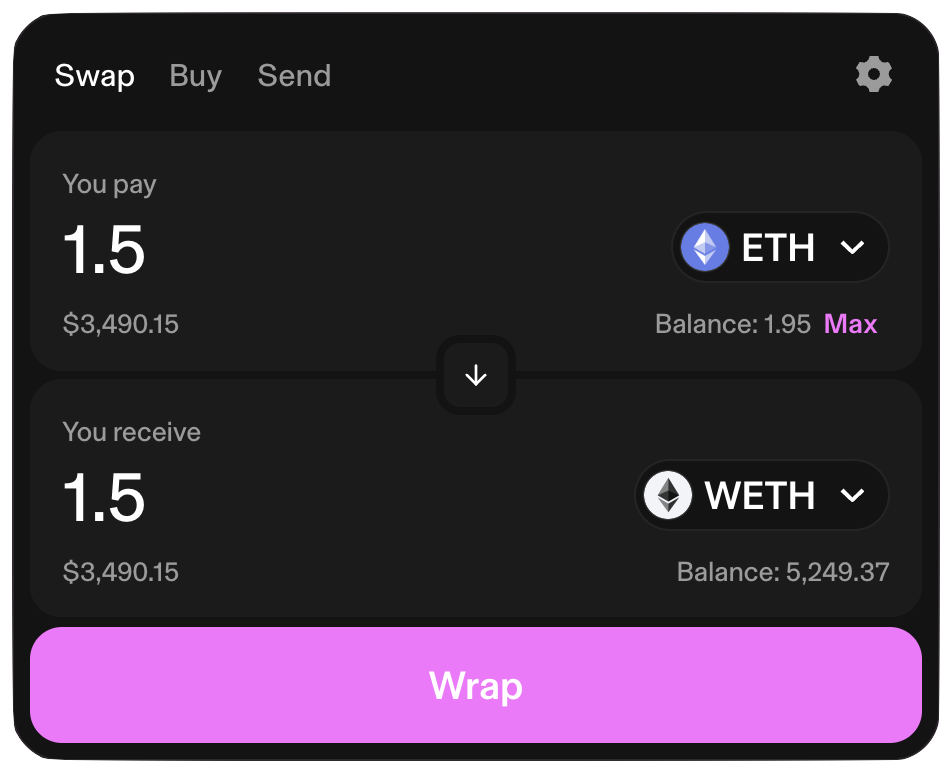
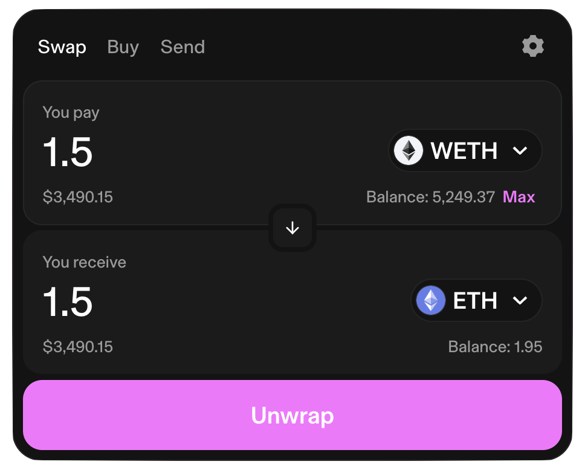

# Wrapping and Unwrapping ETH (WETH)

Venus Protocol markets on Ethereum-based networks require ERC-20 tokens. ETH, the native Ethereum gas token, is not an ERC-20 token — you need to wrap it into WETH before supplying to a Venus market.

## ETH ↔ WETH

ETH is the native token for the Ethereum blockchain, used to pay gas fees, for example. WETH is an [ERC-20](https://ethereum.org/developers/docs/standards/tokens/erc-20) token representing ETH. Most Web3 apps (including Venus) are compatible with ERC-20 tokens, so it's necessary to convert ETH to WETH.

The conversion of ETH -> WETH and WETH -> ETH is always available in the WETH token itself, and the exchange rate is always `1:1`:

* If you wrap 1 ETH, you'll receive 1 WETH.
* If you unwrap 1 WETH, you'll receive 1 ETH.

Only the gas fee to execute the wrap/unwrap transactions will need to be paid. Each Ethereum network (including L2s) has its own WETH token (see the full list on [CoinMarketCap](https://coinmarketcap.com/currencies/weth/)).

## Wrapping ETH using Uniswap

An easy way to get WETH from ETH is by using Uniswap. For example, on the Ethereum mainnet, the process would be:

1. Go to the [Uniswap page to wrap ETH on Ethereum](https://app.uniswap.org/swap?chain=mainnet&inputCurrency=ETH&outputCurrency=0xc02aaa39b223fe8d0a0e5c4f27ead9083c756cc2).
2. Connect your wallet.
3. Type the amount of ETH you want to wrap.
4. Click on `Wrap`.
5. Review and accept the transaction in your Web3 wallet.
6. Remember to add the WETH token to your Web3 wallet to see your WETH balance.

<figure><figcaption>Wrap ETH at Uniswap</figcaption></figure>

To unwrap WETH tokens (getting ETH), you can also use [Uniswap](https://app.uniswap.org/swap?chain=mainnet&inputCurrency=0xc02aaa39b223fe8d0a0e5c4f27ead9083c756cc2&outputCurrency=ETH), switching the input and output currencies.

<figure><figcaption>Unwrap ETH at Uniswap</figcaption></figure>
