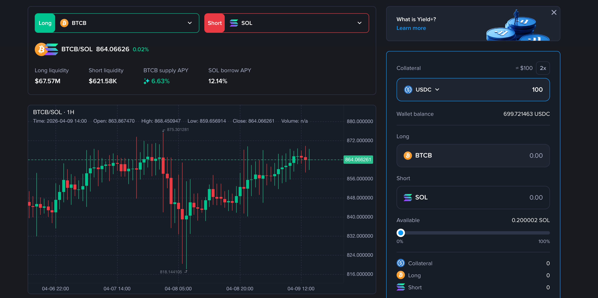
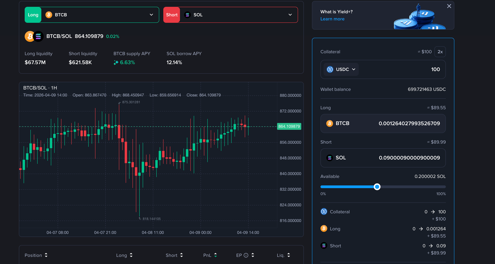
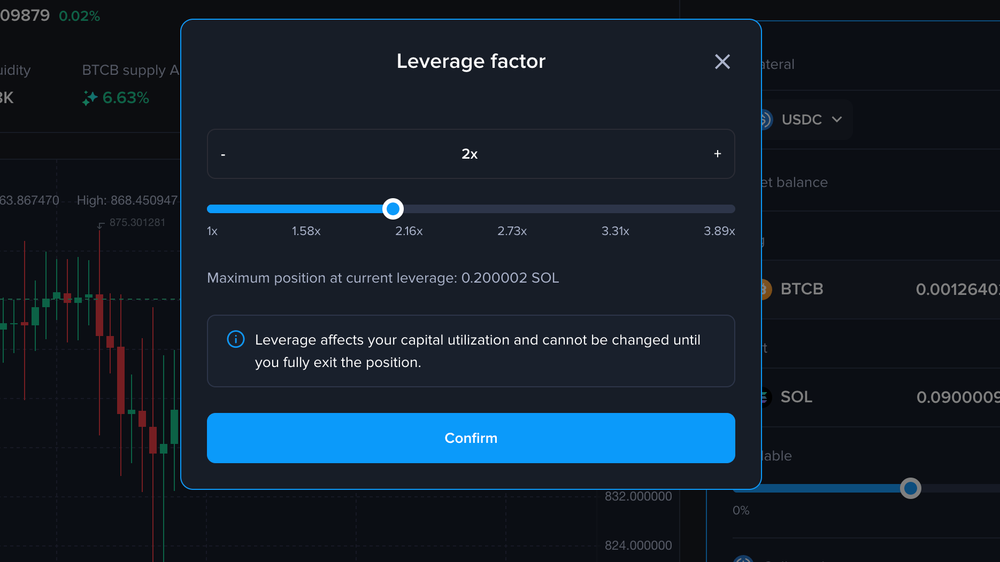
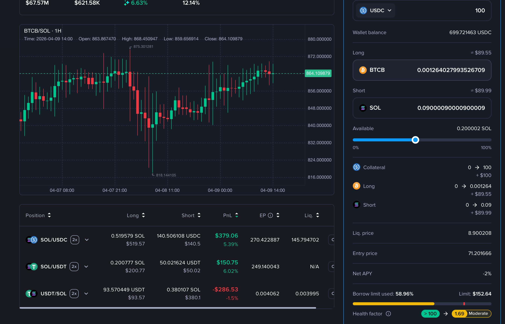
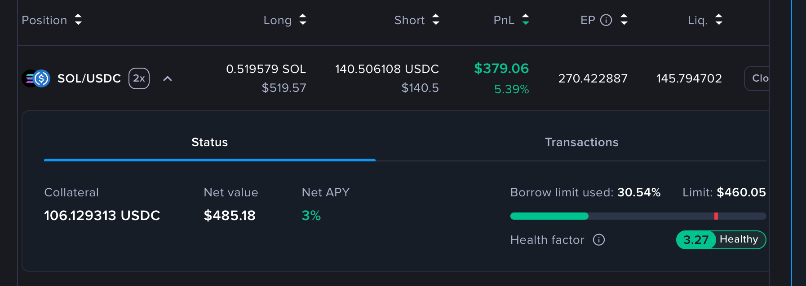

# Venus Yield+ Guide

Venus Yield+ lets you express a view that one asset will outperform another, without needing to predict absolute price direction. This guide walks through the full lifecycle of a Yield+ position — from opening to closing — and explains all available management actions along the way.

---

## What Is a Yield+ Position?

A Yield+ position is made up of two legs that are managed as a single unit:

- **Long Leg** — an asset you believe will outperform, supplied into Venus to earn lending yield
- **Short Leg** — an asset you believe will underperform, borrowed from Venus

When you open a position, the protocol borrows the short asset, swaps it into the long asset, and supplies it — all in a single transaction. When you close, the process reverses automatically.

All profits and losses are settled in your chosen stablecoin (**DSA** — Default Settlement Asset), which is either USDT or USDC.

---

## Step 1: Choose a Trading Pair

<figure><figcaption></figcaption></figure>

Browse the available trading pairs. Each pair shows:

- The current relative price between the long and short asset
- Available liquidity on both the long (supply) and short (borrow) side
- Supply APY, borrow APY, and net APY

Pick the pair that matches your market view. For example, if you believe WBNB will outperform ETH, select the WBNB/ETH pair (WBNB = long, ETH = short).


The long asset must have a Collateral Factor (CF) > 0 in the Venus Core Pool.
The short asset must be available for borrowing in the Venus Core Pool.


---

## Step 2: Initialize Your Position

<figure><figcaption></figcaption></figure>

This step activates a new position account for the selected pair and opens your first trade in one atomic transaction.

**What to configure:**

| Field | Description |
| --- | --- |
| **DSA** | Choose USDT or USDC as your collateral and settlement currency. This cannot be changed later without fully exiting. |
| **Collateral Amount** | The amount of DSA to deposit. This is your initial principal. |
| **Leverage** | Your exposure multiplier. Higher leverage amplifies both gains and losses. The maximum depends on the collateral factors of the chosen assets. |
| **Short Amount** | The amount of the short asset to borrow. Cannot exceed the maximum allowed by your available capital and leverage. |
| **Slippage Tolerance** | Minimum long asset amount you expect from the swap. The transaction reverts if the swap output is below this. |

Select your desired leverage multiplier and set the short amount to borrow. The UI displays the maximum leverage available based on the collateral factors of the selected assets.

<figure><figcaption></figcaption></figure>

**Before submitting:**

- Review the estimated Health Factor, entry price (short/long ratio), liquidation price, and Net APY
- Approve the DSA token spend on the RelativePositionManager

<figure><figcaption></figcaption></figure>

**What happens on-chain:**

1. A dedicated PositionAccount is deployed for this trading pair (first time only)
2. Your DSA collateral is supplied into Venus on behalf of the PositionAccount
3. The short asset is borrowed via a flash loan
4. The short asset is swapped into the long asset
5. The long asset is supplied to Venus as leveraged collateral
6. Any dust from the swap is returned to your wallet


Leverage and DSA cannot be changed while a position is open. To adjust either, you must fully close all positions, withdraw all collateral, and deactivate (Exit Market), then re-initialize.


---

## Step 3: Monitor Your Position

<figure><figcaption></figcaption></figure>

Once open, track your position from the dashboard:

| Metric | Description |
| --- | --- |
| **PnL %** | Relative price performance since entry, amplified by leverage |
| **PnL (USD)** | Absolute profit or loss converted to USD |
| **Long Supply** | Current supplied balance of the long asset |
| **Short Borrow** | Current outstanding borrow of the short asset |
| **Health Factor** | How close to liquidation your position is. HF > 1 is safe; HF < 1 triggers liquidation |
| **Entry Price** | The short/long ratio at the time of opening |
| **Liquidation Price** | The short/long ratio at which liquidation would occur |
| **Net APY** | DSA APY + Supply APY − Borrow APY |
| **Available Capital** | Deposited collateral minus capital currently locked by open positions |


Each position has its own independent Health Factor. If you hold multiple positions, monitor each one individually.


---

## Step 4: Manage Your Position

While a position is active, four management actions are available.

### Increase Position (Scale)

Adds to your existing position using available collateral or additional DSA principal. The same leverage ratio applies.

Use this when you want to increase your relative exposure without changing your DSA, leverage, or position account.

**How it works:**
- Optionally deposit additional DSA principal first
- The system borrows more of the short asset and swaps it into more long collateral
- Your effective position size increases; your leverage ratio stays the same

### Supply Collateral

Deposits additional DSA into your PositionAccount without opening a new trade. This increases your Available Capital and improves your Health Factor without changing your position size.

Use this when your Health Factor is declining and you want to reduce liquidation risk without unwinding any exposure. The deposited DSA earns supply APY immediately and increases the buffer between your current borrow value and the liquidation threshold.

### Reduce Position

Closes a percentage of your position (from 1% to 100%) and settles PnL.

You can also use a small partial reduce (e.g. 5–20%) as a Health Factor management tool: closing part of the position repays a proportional slice of the short debt, which directly raises your Health Factor without requiring a full exit.

- **With profit:** The excess long collateral (above what's needed to repay the debt fraction) is swapped back to DSA and added to your principal balance
- **With loss:** The long collateral is swapped to repay as much of the debt fraction as possible, and remaining debt is covered by redeeming DSA collateral

After reducing, your collateral remains in the PositionAccount. You can open new trades or withdraw at any time.


A position remains visible even after a full reduce. This lets you re-enter the same market without deploying a new PositionAccount. To fully exit, use **Close Market**.


### Withdraw Collateral

Removes Available Capital from your PositionAccount back to your wallet.

Only the portion of collateral not locked by an open position can be withdrawn. The withdrawable amount decreases as your position size increases and increases as you reduce or add collateral.

---

## Step 5: Close and Deactivate

**Close Market** fully exits the trading pair in one transaction:

1. Closes all remaining open positions and settles PnL (same as a 100% reduce)
2. Exits the DSA market and withdraws all collateral to your wallet
3. Deactivates the PositionAccount

After deactivation, you can re-initialize at any time — with a different DSA, different leverage, or different collateral amount.

---

## Understanding PnL

Yield+ PnL is based on the **relative price movement** between your two assets, amplified by leverage.

### Formula

$$
\text{PnL\%} = \left(\frac{R_t}{R_0} - 1\right) \times \text{leverage}
$$

$$
\text{PnL (USD)} = \left(R_t \times \text{Long Amount} - \text{Short Amount}\right) \times \text{Price(Short)}
$$

Where:
- $R_0$ = Entry price ratio (short asset / long asset at open)
- $R_t$ = Current price ratio

### Example

You open a WBNB/ETH position:
- Entry ratio ($R_0$): 0.50 ETH per BNB
- Leverage: 2x
- Short Amount: 5 ETH, Long Amount: 10 BNB

**If BNB outperforms (ratio moves to 0.55):**
PnL% = (0.55 / 0.50 − 1) × 2 = **+20%**

**If ETH outperforms (ratio drops to 0.45):**
PnL% = (0.45 / 0.50 − 1) × 2 = **−20%**

---

## Understanding Risks

### Liquidation Risk

Yield+ uses the same liquidation mechanism as Venus Core. If your Health Factor falls below 1, a third-party liquidator can repay part of your borrow and seize a portion of your collateral.

To manage liquidation risk:
- Monitor your Health Factor regularly and track the current ratio vs. your liquidation price
- **Supply more DSA principal** (via Supply Collateral) to improve your Health Factor without changing position size
- **Partially reduce your position** (e.g. 5–20%) to repay a slice of short debt, which raises the Health Factor directly
- Understand that leverage amplifies both gains and losses — a 2x leveraged position has twice the liquidation sensitivity

### Slippage

Opening and closing positions involve on-chain swaps, which are subject to slippage. Set a realistic slippage tolerance before confirming. In extreme market conditions, a transaction may revert if the swap cannot meet the minimum output; you only lose gas in that case.

### Market Risk

Relative performance positions can still lose money. If the asset you are shorting outperforms the asset you are longing, your PnL will be negative. Leverage amplifies both gains and losses symmetrically.

### Interest Rate Risk

You pay borrow interest on the short leg continuously. If the borrow rate rises significantly, your Net APY can turn negative, increasing the effective cost of holding the position.

### Smart Contract Risk

Yield+ is built on top of Venus's audited lending and borrowing infrastructure. No changes were made to core contracts, risk parameters, or liquidation engines. The new RelativePositionManager and PositionAccount contracts have been independently audited. Audit reports are available in the [Security & Audits](../security-and-audits.md) section.

---

## Frequently Asked Questions

**Can I change my DSA after opening a position?**
No. Your DSA is locked while the position is active. To change it, fully close all positions, withdraw all collateral, and deactivate (Exit Market), then re-initialize with a different DSA.

**Can I change my leverage after opening?**
No. Leverage is fixed for the lifecycle of each activation cycle. Close, deactivate, and re-activate with the new leverage setting.

**What happens if my position gets liquidated?**
Liquidation works the same as Venus Core. A liquidator repays part of your borrow and seizes a portion of your collateral at a discount. After liquidation, your position remains open but with a reduced size. You can continue managing it normally.

**Is my collateral shared across different positions?**
No. Each trading pair has its own isolated PositionAccount. A liquidation on one pair does not affect your positions on other pairs.

**What does "Available Capital" mean?**
Available Capital = your total deposited collateral minus the amount currently locked by your open position. This is how much you can either use to open additional exposure or withdraw from the account.

**Can I have multiple positions on the same pair?**
Each pair has one PositionAccount per wallet. Within that account, you can increase or decrease your position size, but it is managed as a single position.

**What fees do I pay?**
You pay standard Venus Protocol borrowing interest on the short leg. On-chain swaps during open and close incur normal DEX trading fees and slippage. There are no additional platform fees specific to Yield+.

**What is the difference between "Reduce Position" and "Close Market"?**
- **Reduce Position** closes your long/short trade and settles PnL, but leaves your collateral in the PositionAccount. You can re-enter the same market immediately.
- **Close Market** does everything at once — closes all positions, settles PnL, withdraws all collateral to your wallet, and deactivates the account.

---

## Glossary

| Term | Definition |
| --- | --- |
| **DSA** | Default Settlement Asset — the stablecoin (USDT or USDC) used as collateral and for PnL settlement |
| **Long Leg** | The asset you believe will outperform, supplied into Venus |
| **Short Leg** | The asset you believe will underperform, borrowed from Venus |
| **Leverage** | Multiplier applied to your position size relative to your collateral; fixed at activation |
| **Health Factor (HF)** | Position safety metric; liquidation occurs when HF < 1 |
| **Entry Price** | The short/long ratio at the time of opening |
| **Liquidation Price** | The short/long ratio at which liquidation is triggered |
| **Capital Utilization** | How much of your deposited collateral is locked by open positions |
| **Available Capital** | Deposited collateral minus capital utilization; available to trade or withdraw |
| **Net APY** | Supply APY on the long asset plus DSA APY minus borrow APY on the short asset |
| **PositionAccount** | A dedicated on-chain smart contract per wallet per trading pair; auto-deployed on first trade |
| **Increase Position** | Add to your existing position using available capital at the same leverage |
| **Reduce Position** | Partially or fully reduce the long/short size; PnL is settled into DSA collateral |
| **Close Market** | Fully close all positions, settle PnL, withdraw all collateral, and deactivate the PositionAccount |
