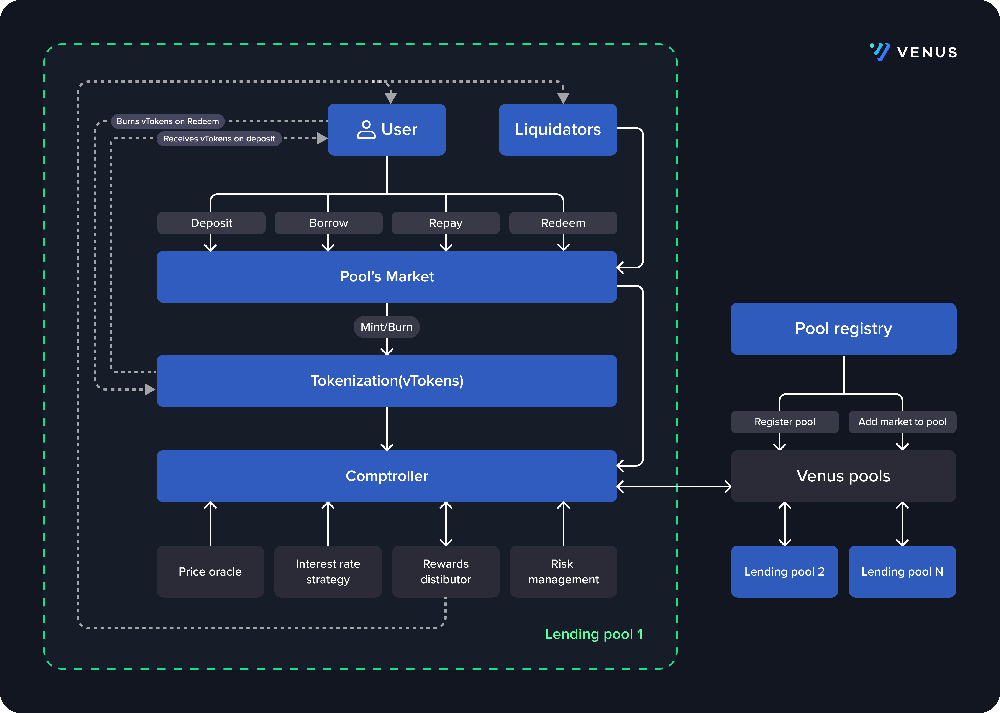

# Pool Registry

## Introduction

The pool registry maintains the isolated lending pools directory and performs actions like creating and registering new lending pools, adding new markets to existing pools, setting and updating the pool metadata, and providing getter methods to retrieve pool information.



## Details

Isolated lending has three main components: PoolRegistry, pools, and markets. The PoolRegistry is responsible for managing pools. It can create new pools, update pool metadata and manage markets within pools. PoolRegistry contains getter methods to get the details of any existing pool like `getVTokenForAsset` and `getPoolsSupportedByAsset`. It also contains methods for updating pool metadata (`updatePoolMetadata`) and setting pool name (`setPoolName`). Users can bookmark pools using the `bookmarkPool` method and get a list of the all bookmarked pools through the `getBookmarks` method.

Pool metadata includes risk rating, category, logo url, and description. It is set by calling `updatePoolMetadata` and retrieved through `getVenusPoolMetadata`. Risk rating is determined off chain through risk analysis by Venus with the intention of helping users navigate pools based on their risk tolerance.

The directory of pools is managed through two mappings: `_poolByComptroller` which is a hashmap with the comptroller address as the key and `VenusPool` as the value and `_poolsByID` which is an array of comptroller addresses. Individual pools can be accessed by calling `getPoolByComptroller` with the pool's comptroller address. `_poolsByID` is used to iterate through all of the pools.

PoolRegistry also contains a map of asset addresses called `_supportedPools` that maps to an array of assets suppored by each pool. This array of pools by asset is retrieved by calling `getPoolsSupportedByAsset`.

### Pools

PoolRegistry registers new isolated pools in the directory with the `createRegistryPool` method. It creates a proxy for the comptroller, sets the `msg.sender` as the `admin` of the comptroller and configuration values for the `closeFactor`, `liquidationIncentive`, `minLiquidatableCollateral`, and `priceOracle`, before adding the pool to the directory. More details on Pools can be found under the [Pool](../isolated-lending/pool.md) page.

### Markets

Isolated pools are composed of independent markets with specific assets and custom risk management configurations according to their markets.

To add a new market to a lending pool, the PoolRegistry first deploys the JumpRate or WhitePaperInterestRate factory as an interest rate model to calculate the interest for the borrowers and lenders according to the available liquidity of the protocol. You can read more about interest rate models under [Protocol Math](../guides/protocol-math.md). The upgradable vToken is then deployed to handle all the transactions within the market and finally the market is listed in the pool through `_supportMarket` method.

Markets are covered in more detail under [VTokens](core-pool/vtokens.md)

# Solidity API

## Pool Registry

### initialize

```solidity
function initialize(
        VBep20ImmutableProxyFactory _vTokenFactory,
        JumpRateModelFactory _jumpRateFactory,
        WhitePaperInterestRateModelFactory _whitePaperFactory,
        Shortfall _shortfall,
        address payable riskFund_,
        address payable protocolShareReserve_
    ) public initializer
```

Initializes the deployer to owner. Set all the required contracts to pool registry.

#### Parameters

| Name                   | Type                               | Description                                            |
| ---------------------- | ---------------------------------- | ------------------------------------------------------ |
| \_vTokenFactory        | VBep20ImmutableProxyFactory        | VBep20 proxy factory to deploy vTokens.                |
| \_jumpRateFactory      | JumpRateModelFactory               | Jump rate model factory as Interest rate model.        |
| \_whitePaperFactory    | WhitePaperInterestRateModelFactory | white paper rate model factory as Interest rate model. |
| \_shortfall            | Shortfall                          | shortfall contract.                                    |
| riskFund\_             | address                            | riskFund contract address.                             |
| protocolShareReserve\_ | address                            | protocolShareReserve contract address.                 |

#### Return Values

| Name | Type | Description                                                            |
| ---- | ---- | ---------------------------------------------------------------------- |
| [0]  | bool | false if the user account cannot call the particular contract function |

### createRegistryPool

```solidity
function createRegistryPool(
        string memory name,
        address implementation,
        uint256 closeFactor,
        uint256 liquidationIncentive,
        address priceOracle
    ) external virtual onlyOwner returns (uint256, address)
```

Deploys a new venus pool and adds to the directory, by taking all the required inputs


Can only be called by the _owner_.


#### Parameters

| Name                 | Type    | Description                                        |
| -------------------- | ------- | -------------------------------------------------- |
| name                 | string  | The name of the pool.                              |
| implementation       | address | The Comptroller implementation address.            |
| closeFactor          | uint256 | The pool's close factor (scaled by 1e18).          |
| liquidationIncentive | uint256 | The pool's liquidation incentive (scaled by 1e18). |
| priceOracle          | address | The pool's PriceOracle address.                    |

#### Return Values

| Name | Type    | Description                             |
| ---- | ------- | --------------------------------------- |
| [0]  | uint256 | The index of the registered Venus pool. |
| [1]  | address | The comptroller's proxy address.        |

### setPoolName

```solidity
function setPoolName(uint256 poolId, string calldata name)
        external
```

Modify existing Venus pool name.


Can be called by the _owner_ or _comptroller admin_.


#### Parameters

| Name   | Type    | Description                             |
| ------ | ------- | --------------------------------------- |
| poolId | uint256 | The Id of the registered pool.          |
| name   | string  | The new name of the pool to be updated. |

### bookmarkPool

```solidity
  function bookmarkPool(address comptroller)
        external
```

Bookmarks a Venus pool Comptroller(proxy) contract addresses.

#### Parameters

| Name        | Type    | Description                                 |
| ----------- | ------- | ------------------------------------------- |
| comptroller | address | Address of the comptroller to be bookmarked |

### getAllPools

```solidity
function getAllPools() external view returns (VenusPool[] memory)
```

To get the details of all the registered pools in the directory.

#### Return Values

| Name | Type               | Description                      |
| ---- | ------------------ | -------------------------------- |
| [0]  | array of VenusPool | Arrays of all Venus pools' data. |

### getVenusPoolMetadata

```solidity
function getVenusPoolMetadata(uint256 poolId)
        external
        view
        returns (VenusPoolMetaData memory)
```

Get the registered pool Meta data by pool ID.

#### Parameters

| Name        | Type    | Description                      |
| ----------- | ------- | -------------------------------- |
| comptroller | address | comptroller address of the pool. |

#### Return Values

| Name | Type              | Description                 |
| ---- | ----------------- | --------------------------- |
| [0]  | VenusPoolMetaData | Meta data of the Venus pool |

### getBookmarks

```solidity
function getBookmarks(address account)
        external
        view
        returns (address[] memory)
```

Get the book marked pools by the account.

#### Parameters

| Name    | Type    | Description      |
| ------- | ------- | ---------------- |
| account | address | Account address. |

#### Return Values

| Name | Type  | Description                    |
| ---- | ----- | ------------------------------ |
| [0]  | array | Array of the pools' addresses. |

### addMarket

```solidity
function addMarket(
        AddMarketInput memory input
    ) external
```

Add a market to an existing venus pool.


Can only be called by the _owner_.


#### Parameters

| Name  | Type           | Description                        |
| ----- | -------------- | ---------------------------------- |
| input | AddMarketInput | Details of the market to be added. |

#### Return Values

| Name | Type              | Description                 |
| ---- | ----------------- | --------------------------- |
| [0]  | VenusPoolMetaData | Meta data of the Venus pool |

### getVTokenForAsset

```solidity
function getVTokenForAsset(uint256 poolId, address asset)
        external
        view
        returns (address)
```

Add a market to an existing venus pool.

#### Parameters

| Name   | Type    | Description                      |
| ------ | ------- | -------------------------------- |
| poolId | uint256 | Pool ID of the existing pool.    |
| asset  | address | Address of the underlying asset. |

#### Return Values

| Name | Type    | Description            |
| ---- | ------- | ---------------------- |
| [0]  | address | Address of the vToken. |

### getPoolsSupportedByAsset

```solidity
function getPoolsSupportedByAsset(address asset)
        external
        view
        returns (uint256[] memory)
```

Get pools which supports the given asset as input.

#### Parameters

| Name  | Type    | Description                      |
| ----- | ------- | -------------------------------- |
| asset | address | Address of the underlying asset. |

#### Return Values

| Name | Type      | Description                    |
| ---- | --------- | ------------------------------ |
| [0]  | uint256[] | Array of the pools' addresses. |

### updatePoolMetadata

```solidity
function updatePoolMetadata(uint256 poolId, VenusPoolMetaData memory _metadata)
        external
        onlyOwner
```

Update metadata of an existing pool


Can only be called by the _owner_.


#### Parameters

| Name       | Type              | Description                   |
| ---------- | ----------------- | ----------------------------- |
| poolId     | uint256           | Pool ID of the existing pool. |
| \_metadata | VenusPoolMetaData | Meta data to be updated.      |
