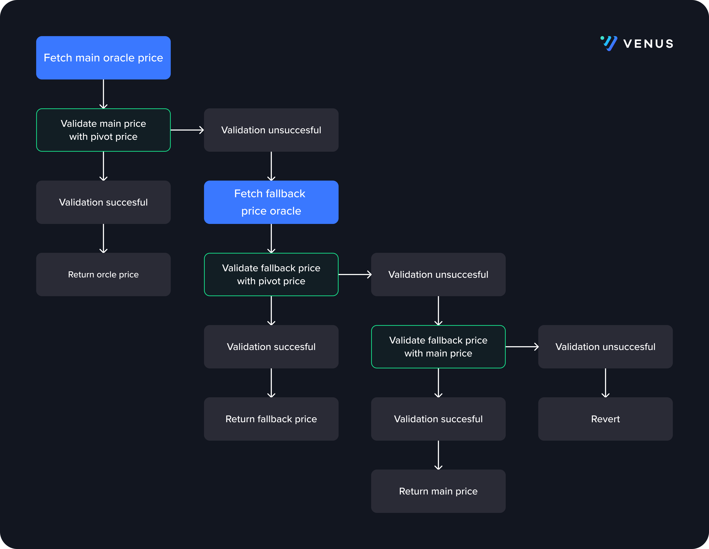

# Resillient Oracle

## Introduction

Resillient oracle is the price oracle that the protocol interacts with for fetching price of assets. 

## Details

DeFi Protocols are usually vulnerable to price oracles reporting incorrect prices. There are various ways in which oracle prices can be manipulated depending on the type of price oracle used which can create a single point of failure and opens several ways for attacking the protocol.

Keeping this in mind, we have designed a resilient oracle which uses multiple oracle sources to validate prices and fallback mechanisms to provide accurate prices and protect from oracle attacks. Currently it includes integrations with Chainlink, Pyth, Binance Oracle and TWAP (Time-Weighted Average Price) oracles. TWAP uses PancakeSwap as the on-chain price source.

The way the resilient oracle works is for every market (vToken) we configure the main, pivot and fallback oracles. The main oracle oracle is the most trustworthy price source, the pivot oracle is is used as a loose sanity checker and the fallback oracle is used as a backup price source.



To validate the price between two oracles we set an upper and lower bound ratio for every market. The upper bound ratio represents the deviation between reported prices (price from oracle that’s being validated) and anchor price (price from oracle we are validating against) beyond which the reported price will be invalidated. And the lower bound ratio presents the deviation between reported price and anchor price below which the reported price will be invalidated. So for oracle price to be considered valid the below statement should be true:

```
anchorRatio = anchorPrice/reporterPrice
isValid = anchorRatio <= upperBoundAnchorRatio && anchorRatio >= lowerBoundAnchorRatio
```

We usually use Chainlink as the main oracle, TWAP or Pyth oracle as pivot oracle depending on which supports the given market and binance oracle is used as the fallback oracle. For some markets we may use Pyth or TWAP as the main oracle if the token price is not supported by Chainlink or Binance oracles. 

When fetching an oracle price, for the price to be valid it must be positive and not stagnant. If the price is invalid then we consider the oracle to be stagnant and treat it like it's disabled.

## Solidity API

### initialize

```solidity
function initialize(contract BoundValidatorInterface _boundValidator) public
```

Initializes the contract admin and sets the required contracts

#### Parameters

| Name | Type | Description |
| ---- | ---- | ----------- |
| _boundValidator | contract BoundValidatorInterface | Address of the bound validator contract |

### pause

```solidity
function pause() external
```

Pause oracle

### unpause

```solidity
function unpause() external
```

Unpause oracle

### getTokenConfig

```solidity
function getTokenConfig(address vToken) external view returns (struct ResilientOracle.TokenConfig)
```

_Get token config by vToken address_

#### Parameters

| Name | Type | Description |
| ---- | ---- | ----------- |
| vToken | address | vtoken address |

### getOracle

```solidity
function getOracle(address vToken, enum ResilientOracle.OracleRole role) public view returns (address oracle, bool enabled)
```

Get oracle & enabling status by vToken address

#### Parameters

| Name | Type | Description |
| ---- | ---- | ----------- |
| vToken | address | vtoken address |
| role | enum ResilientOracle.OracleRole | oracle role |

### setTokenConfigs

```solidity
function setTokenConfigs(struct ResilientOracle.TokenConfig[] tokenConfigs_) external
```

Batch set token configs

#### Parameters

| Name | Type | Description |
| ---- | ---- | ----------- |
| tokenConfigs_ | struct ResilientOracle.TokenConfig[] | token config array |

### setTokenConfig

```solidity
function setTokenConfig(struct ResilientOracle.TokenConfig tokenConfig) public
```

Set single token configs, vToken MUST HAVE NOT be added before, and main oracle MUST NOT be zero address

#### Parameters

| Name | Type | Description |
| ---- | ---- | ----------- |
| tokenConfig | struct ResilientOracle.TokenConfig | token config struct |

### setOracle

```solidity
function setOracle(address vToken, address oracle, enum ResilientOracle.OracleRole role) external
```

Set oracle of any type for the input vToken, input vToken MUST exist

#### Parameters

| Name | Type | Description |
| ---- | ---- | ----------- |
| vToken | address | vToken address |
| oracle | address | oracle address |
| role | enum ResilientOracle.OracleRole | oracle role |

### enableOracle

```solidity
function enableOracle(address vToken, enum ResilientOracle.OracleRole role, bool enable) external
```

Enable/disable oracle for the input vToken, input vToken MUST exist

#### Parameters

| Name | Type | Description |
| ---- | ---- | ----------- |
| vToken | address | vToken address |
| role | enum ResilientOracle.OracleRole | oracle role |
| enable | bool | expected status |

### updatePrice

```solidity
function updatePrice(address vToken) external
```

Currently it calls the updateTwap. This function should be called everytime before calling getUnderlyingPrice

#### Parameters

| Name | Type | Description |
| ---- | ---- | ----------- |
| vToken | address | vToken address |

### getUnderlyingPrice

```solidity
function getUnderlyingPrice(address vToken) external view returns (uint256)
```

Get price of underlying asset of the input vToken, check flow:
- check the global pausing status
- check price from main oracle against pivot oracle
- check price from fallback oracle against pivot oracle or main oracle if fails

#### Parameters

| Name | Type | Description |
| ---- | ---- | ----------- |
| vToken | address | vToken address |

#### Return Values

| Name | Type | Description |
| ---- | ---- | ----------- |
| [0] | uint256 | USD price in scaled decimals e.g., vToken decimals is 8 then price is returned as `10**18 * 10**(18-8) = 10**28` decimals  |
