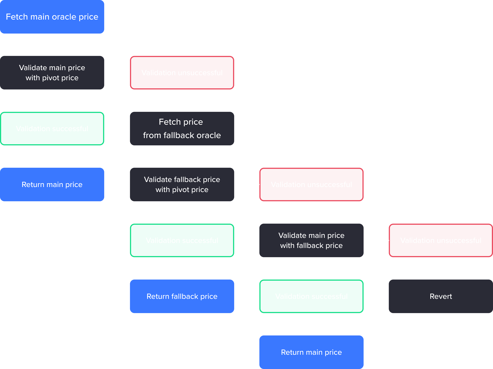

# Resilient Price Oracle

### Overview

In its previous version, Venus was fully reliant on the Chainlink price oracle for fetching prices. This dependence, while generally reliable, created a single point of failure. An erroneous or stale price could, without a secondary mechanism for validation, pose threats such as unwarranted liquidations or inflated borrowing.

In light of these risks, Venus V4 introduces the Resilient Price Oracle, a more robust system capable of pulling data from multiple sources for cross-validation. The Resilient Oracle is equipped with an algorithm to verify prices between two or more sources, providing a safeguard in cases where the primary source proves unreliable or fails.

Furthermore, the improved oracle infrastructure supports the integration of new price oracles in real-time and permits the enabling and disabling of price oracles per token.

### Key Features

#### Resilient Price Feeds

The Resilient Price Feeds replace the single source price provider used in the Comptroller contract with a more robust and reliable solution. This new component not only fetches asset prices from various on-chain sources but also includes a fallback mechanism to protect the protocol from oracle failures. Presently, this feature incorporates Chainlink, Pyth Network, Binance Oracle, and TWAP oracles, with the possibility of adding more in the future.

#### Governance Configurations

The Resilient Price Feeds system can be configured by the Venus governance via Venus Improvement Proposals (VIPs). These configurations include pause and resume functionalities for the oracle, price feed configurations, and fixed price settings, among others.

### Safety Measures

In implementing the Resilient Price Oracle, several safety measures have been adopted to ensure the security and continuity of the Venus Protocol:

* **Price Continuity:** Asset prices pre and post upgrade were validated in a simulated environment to ensure consistency.
* **Testnet Deployment:** The oracles have been deployed and tested in the Venus Protocol testnet environment.
* **Auditing:** The code has been audited by OpenZeppelin, Peckshield, Certik, and Hacken.

<figure><figcaption></figcaption></figure>

### Further Reading

For more detailed information, refer to the following resources:

**Audit reports**

* [Peckshield audit report](https://github.com/VenusProtocol/oracle/blob/develop/audits/013\_oracles\_peckshield\_20230424.pdf)
* [Certik audit report](https://github.com/VenusProtocol/oracle/blob/develop/audits/024\_oracles\_certik\_20230522.pdf)
* [Hacken audit report](https://github.com/VenusProtocol/oracle/blob/develop/audits/016\_oracles\_hacken\_20230426.pdf)

**Deployed contracts on main net:**

* [ResilientOracle](https://bscscan.com/address/0x6592b5DE802159F3E74B2486b091D11a8256ab8A)
* [ChainlinkOracle](https://bscscan.com/address/0x1B2103441A0A108daD8848D8F5d790e4D402921F)
* [BinanceOracle](https://bscscan.com/address/0x594810b741d136f1960141C0d8Fb4a91bE78A820)
* [PythOracle](https://bscscan.com/address/0xb893E38162f55fb80B18Aa44da76FaDf8E9B2262)
* [TWAPOracle](https://bscscan.com/address/0xea2f042e1A4f057EF8A5220e57733AD747ea8867)

**References**

* [Repository](https://github.com/VenusProtocol/oracle)
* [Simulation pre/post upgrade](https://github.com/VenusProtocol/vips/pull/4/)
* [Deployment on testnet](https://github.com/VenusProtocol/oracle/tree/develop/deployments/bsctestnet)
* [Community post about Venus V4, introducing Resilient Price Feeds](https://community.venus.io/t/proposing-venus-v4/3188#price-feed-redundancy-6)
* [Venus Stars blog post about Binance Oracle](https://venusstars.io/community/index.php/2023/05/09/venus-enhances-resilience-binance-oracle-feeds/)
* [Community discussion about Pyth Oracle](https://community.venus.io/t/vip-xx-integrate-with-pyth-as-an-oracle/2723/6)
