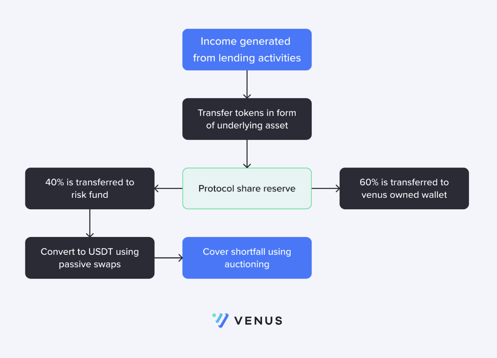

# Risk Fund and Shortfall Handling

### Overview

Venus Protocol manages risks of high volatility tokens with isolated pools. Each pool has an associated risk fund receiving 40% of the pool's income (interest and liquidation bonus) in USDT to prevent insolvency. The risk fund also covers bad debt in case of bankruptcy without a liquidator.

<figure><figcaption>
<em>Risk Management</em>
</figcaption></figure>

### Protocol Share Reserve

The Protocol Share Reserve is a common treasury for all isolated pools, collecting income from accrued interest and the liquidation of accounts.

### Bad Debt and Shortfall Handling

When a borrower's shortfall is detected, Venus halts the interest accrual, writes off the borrower's balance, and tracks the bad debt.&#x20;

<figure><figcaption>
<em>Shortfall Handling</em> 
</figcaption></figure>

The bad debt, `V`, is calculated as `100 * (1.5/1.2) = 125 BUSD`, for an example with an initial borrow index of 1.2, a bad debt of 100 BUSD, and a borrow index of 1.5 at detection.

Once the bad debt reaches a threshold, the risk fund reserve is auctioned. Auction participants can receive up to a 10% incentive for covering the bad debt.

### Auction Scenarios

Auctions aim to cover as much bad debt as possible. There are two types:

<figure><figcaption>
<em>Auction Scenarios</em>
</figcaption></figure>

* **Scenario 1 (X% Auction):** Bidders specify the percentage (`X%`) of the bad debt they'll cover.
* **Scenario 2 (Y% Auction):** Bidders specify the percentage (`Y%`) of the risk fund they want.

Bids are only accepted if the bidder has sufficient funds and offers the best deal. Subsequent bids must be placed within 10 blocks of the previous one. If no bids are placed for 100 blocks, the auction restarts with the updated bad debt and risk fund balances.
