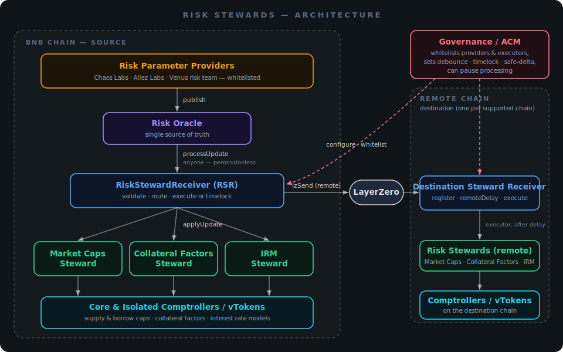
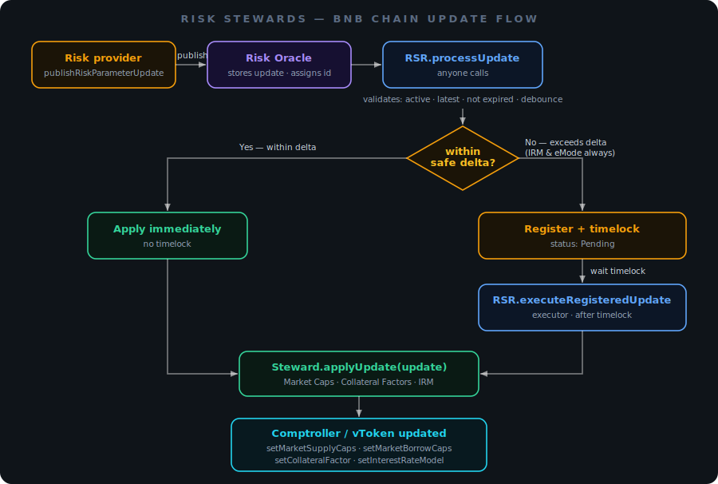
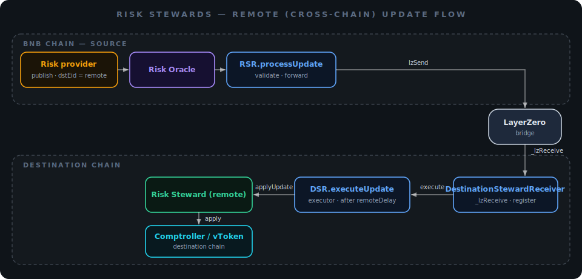

# Risk Oracle & Risk Stewards

## Overview

Venus Protocol uses a **Risk Oracle** and a set of **Risk Stewards** to keep risk parameters aligned with real-time market conditions while preserving decentralized governance. Previously, every risk-parameter change went through the same full VIP process, no matter how routine. The framework now lets governance-approved risk managers apply pre-authorized adjustments through a secure, automated on-chain pipeline, but no risk provider is ever given open-ended authority: each change is first proposed openly in the Venus community, and can only move a parameter within limits the DAO has set. Routine moves within a governance-set **safe delta** apply automatically within minutes; anything larger is held for a cooldown period and released only by a whitelisted Venus executor (who can also reject it), while the most sensitive changes still require a full VIP. Governance sets every limit, approves who may publish and who may execute, and can pause the system at any time.

The framework currently automates four parameter types: **supply caps**, **borrow caps**, **collateral factors** (with their liquidation thresholds), and **interest rate models**, across all supported Venus chains. BNB Chain acts as the source chain, and updates targeting other chains are propagated via LayerZero. Every recommendation and execution is recorded on the Risk Oracle, so anyone can inspect a proposed change on-chain, before and after it takes effect.

## How the System Fits Together

<figure><figcaption>
Whitelisted providers publish to the Risk Oracle on BNB Chain; the Risk Steward Receiver applies updates locally or bridges them to other chains. Governance configures and gates the whole pipeline.
</figcaption></figure>

The pipeline has four parts:

* **Risk Oracle** (BNB Chain): where whitelisted providers publish recommendations.
* **Risk Steward Receiver** (BNB Chain, the source chain): validates each recommendation, decides how it should be applied, executes local changes, and forwards cross-chain ones via LayerZero.
* **Destination Steward Receiver** (every other supported chain): receives bridged updates, holds them for a short delay, and lets a Venus executor apply them.
* **Risk Stewards** (Market Caps, Collateral Factors, IRM): deployed on each chain to perform the actual change in the relevant Comptroller or vToken.

The contract-level detail lives in the [Risk Stewards technical article](../technical-reference/reference-technical-articles/risk-stewards.md).

## Risk Oracle

The **Risk Oracle** is Venus Protocol's own on-chain contract and the single source of truth for risk-parameter recommendations. It is owned and controlled by Venus governance, not by any third party.

Whitelisted **risk parameter providers** publish recommendations to it. A provider can be an external risk manager such as Chaos Labs or Allez Labs, or Venus's own risk team. Providers are added or removed only through governance (via the `AccessControlManager`), so the set of authorized senders is fully under DAO control. Each recommendation records the target market, the parameter type, the new value, the destination chain, and a reference ID (typically a link to a Venus community post explaining the change).

## Risk Stewards

A **Risk Steward** is an on-chain contract that applies one family of risk-parameter changes on behalf of the protocol, strictly within bounds set by governance:

| Risk Steward | Parameters it can change |
| --- | --- |
| **Market Caps Risk Steward** | Supply caps, borrow caps |
| **Collateral Factors Risk Steward** | Collateral factors and liquidation thresholds |
| **IRM Risk Steward** | Interest rate model contract for a market |

Each steward applies only validated updates routed to it, enforces a **safe delta** (changes within a governance-set percentage of the current value can execute immediately; larger ones require a timelock and executor approval), and cannot touch any parameter outside its mandate.

## How Updates Are Applied

Anyone can trigger processing of a published recommendation; the entry point is permissionless. Before anything happens, the recommendation is validated against governance's configuration: the update type must be active, it must be the latest for that market and type, it must not have expired, and a debounce window since the last change must have passed. From there it follows one of two paths.

### On BNB Chain (local updates)

<figure><figcaption>
A BNB Chain update applies immediately when it is within the safe delta; otherwise it waits through a timelock and is applied (or rejected) by a whitelisted executor.
</figcaption></figure>

If the change is within the steward's safe delta, it is applied immediately. If it exceeds the safe delta it is registered behind a timelock; after the delay a whitelisted Venus executor applies it, or rejects it. Interest rate model updates and eMode collateral-factor updates always take the timelocked path, regardless of size.

### On Other Chains (remote updates)

<figure><figcaption>
An update targeting another chain is forwarded over LayerZero, held for a remote delay on the destination chain, then applied by a whitelisted executor there.
</figcaption></figure>

When a recommendation targets a market on another chain, the Risk Steward Receiver forwards it over LayerZero to that chain's Destination Steward Receiver, where it is held for a remote delay and then applied by a whitelisted executor on the destination chain. Cross-chain updates therefore always pass through a delay and an executor.

## Roles and Permissions

| Role | Can do | Set by |
| --- | --- | --- |
| **Risk parameter providers** | Publish recommendations to the Risk Oracle; trigger processing of their own updates | Governance (ACM whitelist) |
| **Anyone** | Trigger processing of a published recommendation | Permissionless |
| **Whitelisted executors (Venus team)** | Apply timelocked and cross-chain updates after their delay; reject updates | Governance (ACM whitelist) |
| **Governance / ACM** | Configure debounce, timelock, safe-delta bounds, and supported update types; add/remove providers and executors; pause processing | DAO (VIP) |

## Safeguards and Governance Control

This system does **not** bypass governance; it operates entirely within constraints the DAO approves:

* **Bounded changes**: stewards can only move the four supported parameters, and only within the safe-delta / timelock rules set by governance.
* **Frequency limits**: a debounce period prevents rapid repeated changes to the same market and parameter.
* **Timelock + veto**: larger changes, IRM changes, and eMode collateral-factor changes wait through a timelock during which a Venus executor can reject them.
* **Expiration & replay protection**: updates expire if not executed in time and can never be processed twice.
* **Pause**: governance can pause update processing at any time.
* **Reserved for governance**: high-impact parameters outside the four supported types still require a full VIP.

The framework was enabled on BNB Chain in [VIP-592](https://app.venus.io/#/governance/proposal/592?chainId=56), which also onboarded Allez Labs as the first external risk provider. At launch, governance set a 3-day debounce, a 6-hour timelock, a 50% safe delta for market caps, and a 10% safe delta for collateral factors. These values are set by governance and can be adjusted through it.

## What's Next

The framework starts with supply caps, borrow caps, collateral factors, and interest rate models across supported chains. Additional parameters and refinements may be added over time, always subject to DAO approval and governance-defined constraints.

## Learn More

* [Risk Stewards technical article](../technical-reference/reference-technical-articles/risk-stewards.md)
* [Proposed Risk Stewards Framework for More Efficient Risk Management](https://community.venus.io/t/proposed-risk-stewards-framework-for-more-efficient-risk-management/5606)
* [VIP-592: Risk Stewards Framework Implementation](https://app.venus.io/#/governance/proposal/592?chainId=56)
