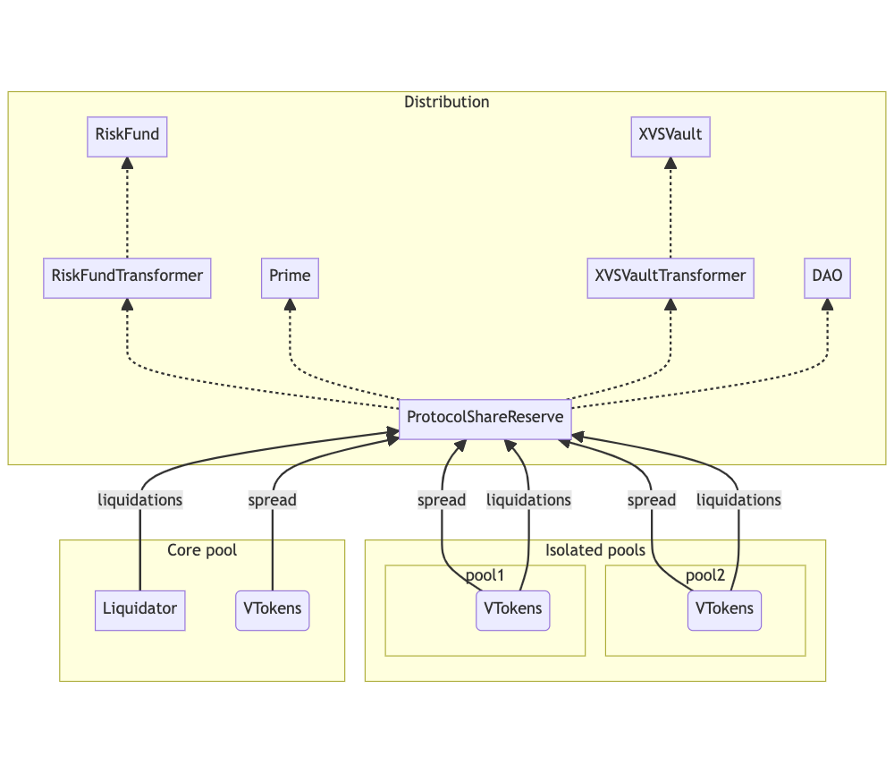

# Venus Protocol Income Distribution

## Introduction

The purpose of this document is to define the technical solution for distributing the incomes generated by the Venus protocol. The distribution takes into account the incomes generated by the spread (borrow minus supply rates) and liquidations (part of the liquidation incentives). The document covers the distribution process for both Core pools and Isolated pools, and explains how the incomes are allocated to different destinations based on specific rules and percentages. Additionally, it outlines the approach for near-streaming income distribution.

## Income Distribution Schema
We want to distribute the protocol incomes this way *[Tokenomics](https://snapshot.org/#/venus-xvs.eth/proposal/0xc9d270ccecb7b91c75b95b8d9af24fc7c20cd38c0c0c44888ed4e7724f4e7ce9)*

The Venus Protocol generates income from two main sources:

- (A) Spread between the borrowing rate and the supply rate
- (B) Part of the liquidation incentives

The distribution of protocol incomes is as follows:

**Schema 1:**

- When: Income generated by (A) from markets supported by the Prime program.
- Distribution:
    - 40%: Risk fund
    - 40%: Treasury
    - 10%: XVS Vault rewards
    - 10%: Venus Prime

**Schema 2:**

- When: Conditions for Schema 1 are not satisfied.
- Distribution:
    - 50%: Risk fund
    - 40%: Treasury
    - 10%: XVS Vault rewards

The initial distribution excludes VAI funds, which are kept in the VTreasury.

## Streaming Income Distribution

<figure></figure>

The Venus protocol aims to distribute accumulated reserves in the markets automatically and in near-real-time, leveraging transactions executed by users. This approach eliminates the need for external tools to manage the distribution process. . The `ProtocolShareReserve` contract serves as the designated destination for liquidation incomes, allowing for tracking and distribution within the Venus Protocol.

### Core Pool - Spread Income

In Core pools, accumulated reserves in the markets will be distributed after reaching a specified threshold. The threshold is based on the number of blocks since the last transfer of reserves. This strategy helps socialize part of the cost associated with distribution.

### Core Pook - Liquidation Income
In Core pools, incentivized tokens is transferred to the Liquidator contract in the form of vTokens. During a liquidation transaction, the Liquidator contract will try to redeem the underlying tokens from the liquidated vTokens. If the redemption process is successful, the resulting underlying tokens will be sent to the `ProtocolShareReserve` contract. However, if the redemption fails, the underlying tokens will be added to a list of pending redemptions. Subsequently, the Liquidator contract will make further attempts to redeem the pending redemptions in subsequent liquidation transactions.

### Isolated Pool - Spread Income

Similar to the work done to Core Pool Spread Income.

### Isolated Pool - Liquidation Income

In Isolated pools, liquidations are managed by the VToken contracts. During a liquidation transaction, the seized amount for the protocol is transferred to the `ProtocolShareReserve` contract.
This ensures that 100% of the liquidation income is directly sent to the `ProtocolShareReserve` contract, without the need for additional updates.

## Distribution of Collected Incomes

The distribution of collected incomes is facilitated by the `ProtocolShareReserve` contract. It supports WBNB transfers but not BNB transfers. Therefore, BNB needs to be wrapped into WBNB before transferring to the `ProtocolShareReserve` contract.

### `updateAssetsState` Function

The `updateAssetsState` function enables the transfer of funds to the `ProtocolShareReserve` contract. After transferring funds from the origins to the `ProtocolShareReserve` contract, the `updateAssetsState` function invoked with the following parameters:

- `address comptroller`: The Comptroller where the market generated the income.
- `address asset`: The asset transferred to the `ProtocolShareReserve`.
- `IncomeOrigin origin`: The origin type, either "spread" or "liquidation."

Within the `updateAssetsState` function, the following steps are performed:

- Calculate the transferred balance, taking into account the previous balance of the asset.
- Assign the received amount to the appropriate entry (comptroller - asset - schema).
- Track the total balance of the received asset for future distribution.

### `releaseFunds` Function

The `releaseFunds` function is responsible for distributing the accumulated funds to the different destinations. This function can be invoked by anyone and follows a two-step process:

1. Transfer the tokens to the destination addresses.
2. Invoke the `updateAssetsState` function in the receiver contract.