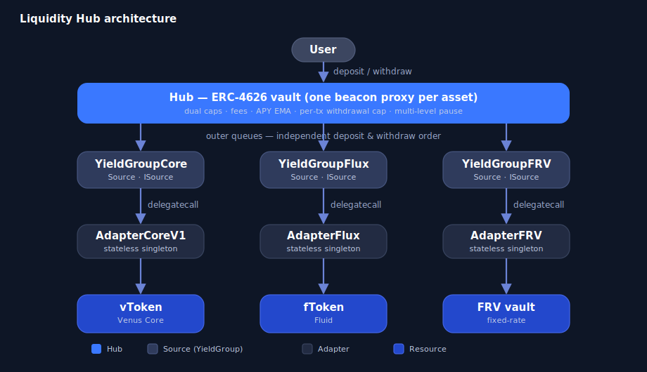

# Liquidity Hub

The **Venus Liquidity Hub** is a per-asset ERC-4626 allocator vault. A lender deposits a single asset, the Hub routes it across Venus yield families (**Core**, **Flux**, **FRV**) under a governance-set policy, and returns a yield-bearing share token. Yield accrues through a **rising exchange rate** (one share = X underlying), never by rebasing. There is one Hub per asset, with no cross-asset coupling.

For the user-facing introduction, see [Liquidity Hub](../../whats-new/liquidity-hub.md) under *What's New*.

## Architecture

Routing is three-tiered. The Hub depends only on the `ISource` interface and never reaches past a Source into the underlying market.

<figure><figcaption></figcaption></figure>

* **Hub** — the ERC-4626 entry point (one beacon proxy per asset). Holds the Source registry, the two outer routing queues, dual caps, the per-transaction withdrawal cap, fees, APY tracking, and the multi-level pause flags.
* **YieldGroup (Source)** — aggregates one or more *resources* of a single protocol family behind the uniform `ISource` boundary, and owns its own inner deposit / withdraw queues and per-resource registry.
* **Adapter** — a stateless singleton translating between a YieldGroup and one protocol ABI. Mutating calls run via **delegatecall** so receipt tokens land on the YieldGroup; one deployment per ABI family serves every YieldGroup.
* **Resource** — the underlying market or vault that holds the capital (a Venus Core vToken, a Fluid fToken, or a Fixed-Rate Vault share).

> **Terminology.** The PRD calls the grouping layer a *Source*; the code names the contract a *YieldGroup* and reserves *Source* for the `ISource` interface. PRD *Product / Vault* = code *Resource*.

## The three yield families

|                          | **Core**                            | **Flux**                              | **FRV**                                |
| ------------------------ | ----------------------------------- | ------------------------------------- | -------------------------------------- |
| Underlying protocol      | Venus Core lending                  | Fluid Lending                         | Venus Fixed-Rate Vaults                |
| Resource / receipt token | vToken (Compound-style)             | fToken (ERC-4626 share)               | FRV vault share (ERC-4626)             |
| Deposit / withdraw call  | `mint` / `redeemUnderlying`         | `deposit` / `withdraw`                | `deposit` / `withdraw`                 |
| Spot APY source          | `supplyRatePerBlock` × `blocksPerYear` | Fluid `LendingResolver`            | vault `fixedAPY` (Fundraising / Lock)  |
| Lifecycle constraint     | none                                | none                                  | 11-state machine                       |

## Contracts

* [**Hub**](hub.md) — the ERC-4626 entry point: routing flows, dual caps, per-tx withdrawal cap, fees, APY tracking, multi-level pause, Operator reallocation, and the full Solidity API.
* [**Yield Groups**](yield-groups.md) — `YieldGroupCore`, `YieldGroupFlux`, `YieldGroupFRV`: the `ISource` implementations, per-resource registry / queues / caps, and the FRV lifecycle.
* [**Adapters**](adapters.md) — `AdapterCoreV1`, `AdapterFlux`, `AdapterFRV`: the stateless, delegatecall-dispatched protocol translators.
* [**Interfaces**](interfaces.md) — `ISource` and `IResourceAdapter`, the boundary contracts.

## Key features

* **Atomic-or-revert** deposits, withdrawals, and reallocations — no partial fills.
* **Dual caps per Source** (absolute amount and percentage of Hub TVL; the stricter binds) plus an optional per-resource cap and a per-transaction withdrawal cap.
* **Multi-level pause** — Hub, Source, or single resource, each independent.
* **Reentrancy-guarded** — every state-mutating entry point on the Hub and the YieldGroups is `nonReentrant`.
* **Asymmetric permissions** — loosening requires governance; tightening (pause, lower a cap) is Operator-accessible. All gated by `AccessControlManagerV8`.
* **Stateless shared adapters** — zero storage, delegatecall dispatch; a new protocol family needs only a new adapter, not a Hub change.
* **Fees off at launch** — management and performance fee machinery exists but ships at `0/0`.

## Deployment

The Hub uses a **beacon-proxy model**: one `UpgradeableBeacon` per family per chain (Hub, Core, FRV, Flux), each owned by governance — upgrading a beacon upgrades every vault of that family atomically; per-asset instances are beacon proxies. Deploy scripts only deploy and initialize the proxies; **ACM wiring, `addSource` / `addResource`, and queue configuration are separate governance (ACM-gated) actions**.

v1 targets **BNB Chain**, with **USDT** as the first asset. The Liquidity Hub contracts are **not yet deployed**; addresses will be published here once they are live.

## Audits

The Liquidity Hub contracts undergo independent security audits before mainnet deployment. Audit reports will be published in the [venus-liquidity-hub repository](https://github.com/VenusProtocol/venus-liquidity-hub/tree/main/audits) and indexed on the [Security & Audits](../../security-and-audits.md) page.
