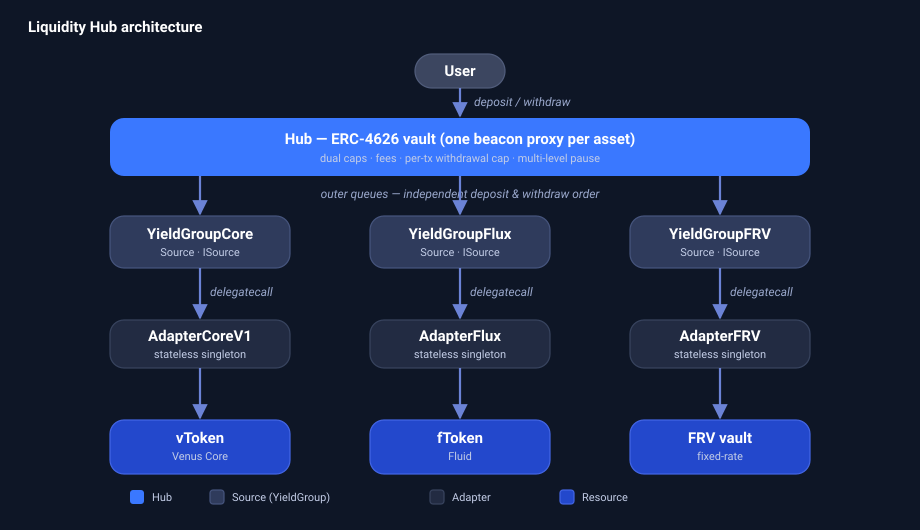

# Liquidity Hub

The **Venus Liquidity Hub** is a per-asset ERC-4626 allocator vault. A lender deposits a single asset, the Hub routes it across Venus yield families (**Core**, **Flux**, **FRV**) under a governance-set policy, and returns a yield-bearing share token. Yield accrues through a **rising exchange rate** (one share = X underlying), never by rebasing. There is one Hub per asset, with no cross-asset coupling.

For the user-facing introduction, see [Liquidity Hub](../../whats-new/liquidity-hub.md) under *What's New*.

## Architecture

Routing is three-tiered. The Hub depends only on the `IYieldGroupBase` interface and never reaches past a Source into the underlying market.

<figure><figcaption></figcaption></figure>

* **Hub** — the ERC-4626 entry point (one beacon proxy per asset). Holds the Source registry, the two outer routing queues, dual caps, the per-transaction withdrawal cap, the fee parameters, and the multi-level pause flags. It exposes **no APY view** — spot APY is read per-Source from `YieldGroup.spotAPYBps()` and must be aggregated off-chain.
* **YieldGroup (Source)** — aggregates one or more *resources* of a single protocol family behind the uniform `IYieldGroupBase` boundary, and owns its own inner deposit / withdraw queues and per-resource registry.
* **Adapter** — a stateless singleton translating between a YieldGroup and one protocol ABI. Mutating calls run via **delegatecall** so receipt tokens land on the YieldGroup; one deployment per ABI family serves every YieldGroup.
* **Resource** — the underlying market or vault that holds the capital (a Venus Core vToken, a Fluid fToken, or a Fixed-Rate Vault share).

> **Terminology.** The PRD calls the grouping layer a *Source*; the code names the contract a *YieldGroup* and the Hub-facing interface `IYieldGroupBase`. There is no `ISource` type in the Solidity — "Source" survives only in deployment-artifact aliases (`CoreSource_USDT`, `FluxSource_USDC`, `FRVSource_U`). PRD *Product / Vault* = code *Resource*.

## The three yield families

|                          | **Core**                            | **Flux**                              | **FRV**                                |
| ------------------------ | ----------------------------------- | ------------------------------------- | -------------------------------------- |
| Underlying protocol      | Venus Core lending                  | Fluid Lending                         | Venus Fixed-Rate Vaults                |
| Resource / receipt token | vToken (Compound-style)             | fToken (ERC-4626 share)               | FRV vault share (ERC-4626)             |
| Deposit / withdraw call  | `mint` / `redeemUnderlying`         | `deposit` / `withdraw`                | `deposit` / `withdraw`                 |
| Spot APY source          | `supplyRatePerBlock` × `blocksPerYear` | Fluid `LendingResolver`            | vault `fixedAPY` (Fundraising / Lock)  |
| Lifecycle constraint     | none                                | none                                  | 11-state machine                       |
| Wired at launch          | ✅ vToken registered                 | ✅ fToken registered                   | ❌ Source registered, no resource       |

**FRV carries no resource at launch.** An FRV Source is deployed and registered on every Hub with its caps set, but no Fixed-Rate Vault instance exists for USDT / USDC / U on BNB Chain yet, so the onboarding proposal calls `addResource` on the Core and Flux Sources only. FRV is therefore kept out of the outer deposit queue entirely and placed **last** in the outer withdraw queue — not because it can serve withdrawals, but because `setOuterWithdrawQueue` rejects a queue that omits a registered Source with non-zero `totalAssets()`, and that total counts idle balance: omitting FRV would let a 1-wei donation permanently block the Operator from reordering the queue. No capital routes to FRV until a follow-up proposal wires a vault.

## Contracts

* [**Hub**](hub.md) — the ERC-4626 entry point: routing flows, dual caps, per-tx withdrawal cap, fees, multi-level pause, Operator reallocation, and the full Solidity API.
* [**Yield Groups**](yield-groups.md) — `YieldGroup` (the generic router, deployed twice: once as the Core family, once as Flux) and `YieldGroupFRV`: the `IYieldGroupBase` implementations, per-resource registry / queues / caps, and the FRV lifecycle.
* [**Adapters**](adapters.md) — `AdapterCoreV1`, `AdapterFlux`, `AdapterFRV`: the stateless, delegatecall-dispatched protocol translators.
* [**Interfaces**](interfaces.md) — `IYieldGroupBase` (with its family extensions `IYieldGroup` and `IYieldGroupFRV`) and `IResourceAdapter`, the boundary contracts.
* **`Migrator`** — a stateless, permissionless, non-upgradeable helper for one-click migration of a Venus Core position into a Hub (`migrateFromCore` / `migrateFromCoreBNB`).

**`HubRegistry`** — one per chain, the canonical directory of deployed Hubs. Governance calls `addHub(address)` / `removeHub(address)` (both ACM-gated); everyone else reads `hubForAsset(address)`, `assetForHub(address)`, `isHub(address)`, `getHubs()` and `getHubsCount()`. It emits `HubAdded` / `HubRemoved`, and an indexer should seed from state on `HubAdded` rather than relying on log ordering. Each asset may have at most one Hub (`AssetAlreadyHasHub`).

## Key features

* **Atomic-or-revert** deposits, withdrawals, and reallocations — no partial fills.
* **Dual caps per Source** (absolute amount and percentage of Hub TVL; the stricter binds) plus an optional per-resource cap and a per-transaction withdrawal cap.
* **Multi-level pause** — Hub, Source, or single resource, each independent.
* **Reentrancy-guarded value paths** — every entry point that moves assets is `nonReentrant`: `deposit` / `mint` / `withdraw` / `redeem` / `reallocate` / `emergencyReallocate` / `accrueFees` / `sweep` on the Hub, and `deposit` / `withdraw` / `depositResource` / `withdrawResource` / `sweep` on each YieldGroup. The ACM-gated admin setters are not individually guarded; they rely on ACM gating instead.
* **Asymmetric permissions** — governance holds every gated function except `reallocate`; tightening (pause, lower a cap) is additionally Operator-accessible, and pausing is delegated further to a no-delay Guardian multisig, while loosening (unpause, register a route, raise the withdrawal cap, set fees) stays governance-only. The exceptions are `raiseYieldGroupCap` and `raiseResourceCap`, which the Operator also holds so it can open headroom ahead of a rebalance. All gated by `AccessControlManagerV8`.
* **Stateless shared adapters** — zero storage, delegatecall dispatch; a new protocol family needs only a new adapter, not a Hub change.
* **Fees off at launch** — management and performance fee machinery exists but ships at `0/0`.

## Deployment

The Hub uses a **beacon-proxy model**: one `UpgradeableBeacon` per family per chain (Hub, Core, FRV, Flux), each owned by governance — upgrading a beacon upgrades every vault of that family atomically; per-asset instances are beacon proxies. Deploy scripts only deploy and initialize the proxies; **ACM wiring, `addYieldGroup` / `addResource`, and queue configuration are separate governance (ACM-gated) actions**.

`HubRegistry` is the exception: it is a chain-level singleton behind a **`TransparentUpgradeableProxy`**, not a beacon proxy, so it is upgraded independently of every Hub. On BNB Chain mainnet that proxy is administered by Venus's shared `DefaultProxyAdmin`, the same one that administers the core pool and isolated pools; the BSC testnet deployment predates that decision and still carries a registry-specific `ProxyAdmin`.

v1 targets **BNB Chain**, launching with three assets: **USDT**, **USDC** and **U**.

The contracts are **deployed on BNB Chain mainnet**. Deployment only creates and initializes the proxies — the governance proposal that onboards them grants the ACM roles, registers each Hub with the [HubRegistry](#contracts), wires the resources and queues, and seeds each Hub with a bootstrap deposit. Until that proposal executes, the Hubs are deployed but unwired.

#### BNB Chain mainnet (chain ID 56)

| Asset | Hub |
| ----- | --- |
| USDT  | `0x18AfDACF30F8671021dec4b78297E39d2FE87226` |
| USDC  | `0x9D2D9592cF8DFbf59107fAab703d08494BE14617` |
| U     | `0x0e5AA174d4F31b757a237eb1999DE151596788B0` |

`HubRegistry` is deployed at `0x6D93Fd479f2d37445CFBe132412e316a0364acc2`. Prefer resolving Hub addresses through it rather than hard-coding them.

Supporting contracts:

| Contract | Address | Notes |
| -------- | ------- | ----- |
| `Migrator` | `0xfe6b8BEf1215C19Cd247FbF495ef560932F1Eb9B` | Stateless, permissionless, non-upgradeable. One-click migration of a Venus Core position into a Hub via `migrateFromCore` / `migrateFromCoreBNB` (plus `*WithConsent` variants) |
| `HubBeacon` | `0x0f20e1004962e2DF16c16FC15460Dc6480626321` | Upgrades every Hub atomically |
| `CoreBeacon` | `0x195a0F1BCF73C3Beb609a1271E8E08b8E4c098C6` | Core-family YieldGroups |
| `FluxBeacon` | `0x9bb6a3Ac5955fA8dc236560CA9D51483d1d79f15` | Flux-family YieldGroups |
| `FRVBeacon` | `0x8A5EceDD726246682402430b9B24c19bF61B7f1d` | FRV-family YieldGroups |
| `AdapterCoreV1` | `0x4E514a0C7aB9d140eE204dfA0017574270D92944` | Shared singleton |
| `AdapterFlux` | `0xA81bDf813A428053E764C34Bc679b3E4d0807be3` | Shared singleton |
| `AdapterFRV` | `0x1FA0365bDd603452CE96BE3c0e12Db5515a35902` | Shared singleton |
| `DefaultProxyAdmin` | `0x6beb6D2695B67FEb73ad4f172E8E2975497187e4` | Venus's shared `ProxyAdmin`, administering the registry's `TransparentUpgradeableProxy`; governance-owned |

Each asset also has three YieldGroup proxies (`CoreSource_*`, `FluxSource_*`, `FRVSource_*`); resolve them from the Hub's `registeredYieldGroups()` rather than hard-coding.

**Launch parameters.** Identical across all three assets, which are all 18-decimal:

| Parameter | USDT | USDC | U |
| --------- | ---- | ---- | - |
| Share token name / symbol | `Venus Hub USDT` / `vhUSDT` | `Venus Hub USDC` / `vhUSDC` | `Venus Hub U` / `vhU` |
| `decimalsOffset` | 6 | 6 | 6 |
| `maxWithdrawalSize` (per tx) | 10,000,000 | 10,000,000 | 10,000,000 |
| Core cap (absolute / %) | 2,000,000,000 / disabled | same | same |
| Flux cap (absolute / %) | 7,000,000 / 20% | same | same |
| FRV cap (absolute / %) | 5,000,000 / 30% | same | same |
| Management / performance / redeem fee | 0 / 0 / 0 | 0 / 0 / 0 | 0 / 0 / 0 |

`feeRecipient` is `0xF322942f644A996A617BD29c16bd7d231d9F35E9` on all three. Core's percentage dimension uses the `10_000` BPS sentinel, so only its absolute cap binds; Flux is held to 20% of TVL, which at launch sits well under its absolute cap, so it fills through Operator `reallocate` rather than from the deposit queue. Each Hub is seeded with a 10-token bootstrap deposit from the Treasury whose shares are minted to the burn address, so `totalSupply` is never zero and the refill-from-empty branch cannot be re-opened.

**Role holders.** Granted by the onboarding proposal, not baked into the bytecode — see [Permissions](hub.md#permissions):

| Role | Address |
| ---- | ------- |
| Governance | `0x939bD8d64c0A9583A7Dcea9933f7b21697ab6396` — the [Normal Timelock](../../deployed-contracts/governance.md) |
| Operator | `0x83f426233B358A36953F6951161E76FB7c866a7A` — the routine keeper multisig |
| Guardian | `0x1C2CAc6ec528c20800B2fe734820D87b581eAA6B` — no-delay containment multisig |

#### BSC testnet (chain ID 97)

A parallel deployment exists for integration testing. It ships **USDT only** — not the three assets mainnet carries — so a harness written against the mainnet asset list will not map cleanly.

| Contract | Address |
| -------- | ------- |
| `Hub_USDT` | `0x7cE6ADF754D0eC81A6CF8ACd9C7454F45077dc61` |
| `HubRegistry` | `0x5346f648029d1D1d1034e09e8AD7a115f5D7A159` |
| `Migrator` | `0x343D518d8C89f9B5D770000F1ed80f45bF1419f5` |
| `CoreSource_USDT` | `0x11e39DC7b8b16BBDA8D9C2903dF741Ae9341Ec88` |
| `FluxSource_USDT` | `0x044E572144bc08ed2D90E081EeEd7b5b6Cb01016` |
| `FRVSource_USDT` | `0xA0Fb0fFeBdcB7F45A3Ec841cCE7F78B7CeBD0f82` |
| `AdapterCoreV1` | `0xDf669957448eCB23309eEFda4de230c62d22AE33` |
| `AdapterFlux` | `0x15Dca35ae0b16BeceabAEC9Dea49630e8C601730` |
| `AdapterFRV` | `0xeF0E85ab9A23F50EB4595CF7e2F5461feF7E7fc5` |
| `HubRegistryProxyAdmin` | `0x9f8413eEE33D434F6D4f40C83181f32A831c9ef7` |

**Testnet is not a faithful mirror of mainnet.** Four differences will break assumptions carried over from a testnet harness:

* The share token is named `Vault Share` / **`vSHARE`**, a placeholder — not the `Venus Hub <asset>` / `vh<asset>` pair mainnet uses.
* **FRV is fully wired on testnet**: a Fixed-Rate Vault instance exists and is registered as a resource, and all three Sources sit in both outer queues. On mainnet the FRV Source has no resource at all.
* Caps are effectively unbounded (`type(uint128).max` absolute, percentage dimension disabled) rather than the tiered mainnet values, and the per-transaction withdrawal cap is lower.
* The registry proxy is administered by a registry-specific `HubRegistryProxyAdmin`, not the shared `DefaultProxyAdmin` mainnet uses.

## Audits

The Liquidity Hub contracts undergo independent security audits before mainnet deployment. Audit reports will be published in the [venus-liquidity-hub repository](https://github.com/VenusProtocol/venus-liquidity-hub/tree/main/audits) and indexed on the [Security & Audits](../../security-and-audits.md) page.
