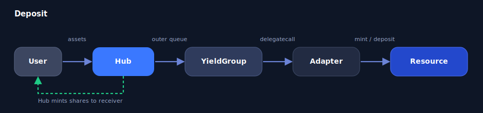
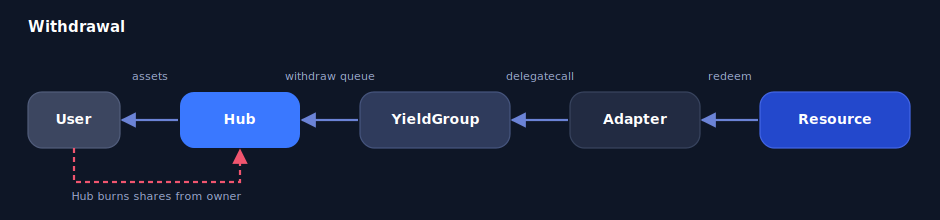
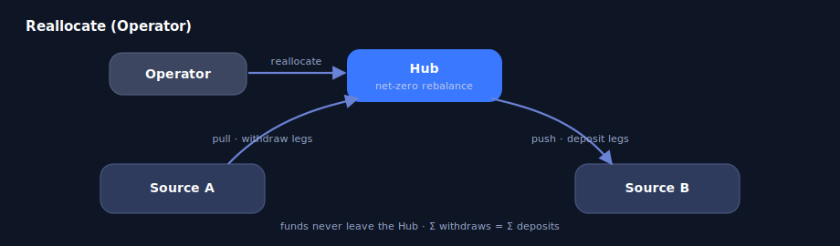
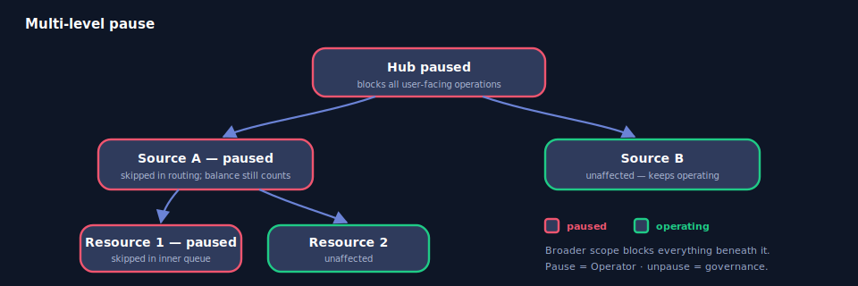

# Hub

The `Hub` is the per-asset ERC-4626 entry point of the Liquidity Hub. It accepts a single underlying asset, mints share tokens, and routes capital through a registry of Sources under a governance-set policy. One `Hub` is deployed per asset as a beacon proxy.

A Hub extends ERC-4626 with a Source registry, dual caps, an asymmetric multi-level pause, Operator reallocation, management + performance fees, and an EMA-tracked realized APY. Registry and queue admin logic is delegatecall-linked into the **`HubAdminLib`** library to keep the Hub under the 24 KB bytecode limit; the library executes in the Hub's storage context.

## Inheritance

The Hub is built on the Venus upgradeable stack:

* **`ERC4626Upgradeable`** — OpenZeppelin's ERC-4626 base (deposit / mint / withdraw / redeem, share accounting).
* **`AccessControlledV8`** — every privileged setter is gated through `AccessControlManagerV8` via `_checkAccessAllowed(msg.sig)`.
* **`HubStorage`** — isolates all Hub state in a base contract with a reserved `__gap` for upgrade safety.
* **`IHub`** — external interface (see [Interfaces](interfaces.md) for the boundary types it shares with Sources).

Storage lives entirely in `HubStorage`; never reorder or prepend its fields. New fields are appended and the `__gap` is shrunk by the same number of slots.

## Operation flows

All user-facing mutating operations are **atomic-or-revert** — they complete in full or revert with a named error. There is no partial fill and no remainder returned.

### Deposit

<figure><figcaption></figcaption></figure>

1. User calls `deposit(assets, receiver)` (or `mint`).
2. The Hub accrues fees and refreshes APY, then pulls `assets` from the user — so the caller trades against the post-accrual share price.
3. The Hub snapshots `totalAssets()` (which already includes the just-transferred idle) and walks the **outer deposit queue**.
4. For each Source: skip if unregistered or paused; compute `capRoom = max(0, effectiveCap − source.totalAssets())`; send `min(remaining, capRoom, source.maxDeposit())`. If the Source places less than requested, the Hub reverts `SourceUnderfilled`.
5. Each Source walks its **inner deposit queue**, delegatecalling its adapter per resource (respecting any per-resource cap), and mints receipt tokens into the YieldGroup.
6. The Hub mints share tokens to the receiver.
7. If capacity across the whole queue is short, the **entire transaction reverts** (`HubCapacityExceeded`).

### Withdrawal

<figure><figcaption></figcaption></figure>

1. User calls `withdraw(assets, receiver, owner)` (or `redeem`).
2. The Hub accrues fees, refreshes APY, enforces the **per-transaction withdrawal cap** (`HubWithdrawCapExceeded`), then burns shares from `owner`.
3. The Hub consumes its own **idle balance first**, then walks the **outer withdraw queue** (independent of the deposit queue).
4. For each Source, the Hub calls `Source.withdraw(amount, hub)`; the Source uses its own idle balance first, then walks its **inner withdraw queue**, delegatecalling the adapter's `redeemUnderlying` / `withdraw`.
5. The Hub measures the delivered balance delta (rather than trusting a return value) and reverts `SourceUnderfilled` on any shortfall.
6. Underlying flows Resource → YieldGroup → Hub → receiver.
7. If liquidity is short, the **entire transaction reverts** (`HubInsufficientLiquidity`).

### Reallocate

<figure><figcaption></figcaption></figure>

Reallocate moves assets between Sources — and, optionally, between specific resources within a Source — without funds entering or leaving the Hub. Both legs share the [`ReallocateLeg`](#structs) struct. The Hub treats `resource` as an **opaque pass-through**: it holds no resource registry and never reads resource state — it relays the address to the owning Source, which validates it against its own registry.

1. The Operator calls `reallocate(withdraws, deposits)`.
2. The Hub accrues fees and refreshes APY (skipped while paused).
3. **Pull phase** — every withdraw leg runs first: `Source.withdraw` (queue) or `Source.withdrawResource` (targeted). Underlying returns to the Hub as idle. Pulling from a *paused* resource is allowed (wind-down).
4. The Hub takes a single `totalAssets()` snapshot after all pulls — the cap reference for every push (valid because a balanced reallocate conserves TVL).
5. **Push phase** — each deposit leg checks the Source is registered, unpaused, and within its effective cap, then `Source.deposit` (queue) or `Source.depositResource` (targeted). Depositing into a paused resource reverts.
6. The Hub enforces `Σ withdraws == Σ deposits` (`ReallocateImbalanced` otherwise). **Net-zero invariant.**

A targeted leg (non-zero `resource`) moves the full `amount` into / out of that one resource or reverts. Setting both legs to the same `source` performs an **intra-Source move** (e.g. `vUSDT_v1` → `vUSDT_v2`). `emergencyReallocate` performs the same net-zero rebalance but **remains callable while the Hub is paused**, giving governance a wind-down lever without granting the Operator a pause bypass.

## totalAssets computation

`totalAssets()` drives share pricing for every deposit / withdraw (`convertToShares` / `convertToAssets`).

```
Hub.totalAssets()
  = Σ Source.totalAssets()  +  Hub idle balance
        │
        └─ Source.totalAssets()
             = Σ adapter.totalAssets(resource, yieldGroup)  +  Source idle balance
```

* A Source whose `totalAssets()` view reverts contributes **0** (fault isolation) rather than bricking the Hub; it reappears once fixed.
* Hub idle is normally zero (deposits route out atomically, withdrawals pull exact amounts, reallocate is balanced). A direct token donation persists and is intentionally counted into NAV — it accrues to LPs and is consumed first on withdraw; the underlying cannot be swept.
* View paths use the **stored** exchange rate (`exchangeRateStored`, stale up to one accrual cycle, no state mutation). Mutating paths trigger interest accrual on the resource during mint / redeem, so the rate is current by the time the operation completes.

## Cap enforcement

**Source level — dual cap.** Each Source carries an absolute amount AND a percentage of Hub TVL; the stricter binds:

```
effectiveCap = (percentageCapBps == 10_000)
             ? absoluteCap
             : min(absoluteCap, percentageCapBps × hubTVL / 10_000)
```

`percentageCapBps == 10_000` (100%) is a sentinel that **disables** the percentage component — required so a fresh Hub at TVL = 0 can take its first deposit (otherwise `pct × 0` collapses the cap to zero). `absoluteCap == type(uint256).max` is rejected; use the sentinel to disable the percentage dimension instead.

**Per-transaction withdrawal cap.** `maxWithdrawalSize` (asset units) bounds every single withdraw / redeem so one transaction cannot drain a downstream product's liquidity; exceeding it reverts `HubWithdrawCapExceeded`.

The optional **per-resource deposit cap** (Core & Flux) binds one level down, inside the YieldGroup — see [Yield Groups](yield-groups.md#resource-caps-core--flux-only).

## Fees

Two fee types, both minted as **dilution shares** to a single `feeRecipient` (`address(0)` disables minting). Accrual is idempotent within a block and runs before every deposit / withdraw / reallocate. Both rates are capped at `MAX_FEE_BPS` (50%).

* **Management fee** — linear time proration: `totalAssets × bps × Δt / (10_000 × 365 days)`. A single accrual is capped at `MAX_MGMT_FEE_PER_ACCRUAL_BPS` (40%) of TVL; when the cap binds, the uncharged remainder **defers** to the next accrual instead of being forfeited.
* **Performance fee** — charged only on gains in price-per-share above a monotonic **high-water mark** (`totalAssets × 1e18 / totalSupply`). The HWM advances whenever PPS climbs — independent of whether a fee is minted — so a later rate increase cannot retroactively claim past gains.

v1 launches at `0/0`; the machinery exists for governance to enable fees later.

## APY tracking

The Hub exposes an EMA-smoothed `realizedAPYBps()`:

```
spot   = TVL-weighted average of each Source's spotAPYBps()   (over Source-only TVL; Hub idle excluded)
newEMA = (alpha × spot + (10_000 − alpha) × oldEMA) / 10_000
```

* `emaAlphaBps` is the smoothing factor in BPS: `10_000` = no smoothing (instant), small values = heavy smoothing.
* Each Source's per-tick contribution is clamped at `MAX_SOURCE_APY_BPS` (50_000 = 500%).
* A Source whose `totalAssets()` or `spotAPYBps()` reverts is skipped for that tick.

## Multi-level pause

Three independent scopes — a broader scope blocks everything beneath it; siblings keep operating. Pause is **asymmetric**: tightening (pause) is Operator-accessible, loosening (unpause) is governance-only.

<figure><figcaption></figcaption></figure>

* **Hub paused** — all deposits / withdrawals / mints / redeems, `reallocate`, fee / APY accrual, and the fee / EMA setters are blocked; `emergencyReallocate` and `sweep` stay callable; views stay readable. Underlying products keep operating. Accrual is skipped across the pause window so LPs are never charged for frozen time.
* **Source paused** — the Hub-level flag makes routing skip the Source. Its balance still counts in `totalAssets()`; it is reachable only via `reallocate` / `emergencyReallocate`. New deposit / push legs revert `SourcePaused`.
* **Resource paused** — set on the YieldGroup, not the Hub; see [Yield Groups](yield-groups.md#pause-asymmetric).

## Permissions

Every privileged call is gated by `AccessControlManagerV8` — the role is `keccak256(targetContract, roleString)`, where `roleString` is the literal function signature. The contracts do not hard-code an Operator-vs-governance branch; the asymmetry is entirely a matter of which addresses governance grants each role to. In v1 the Operator is the Venus Core multisig.

| Action class                                                                                              | Governance (VIP) | Operator |
| --------------------------------------------------------------------------------------------------------- | :--------------: | :------: |
| Add / remove Source, **raise** caps, **unpause**, set fees, set EMA alpha, `sweep`, `emergencyReallocate`  | ✅               | ❌       |
| **Lower** caps, lower per-tx cap, **pause**, reorder queues                                                | ✅               | ✅       |
| `reallocate` between Sources / resources                                                                   | —                | ✅       |
| `deposit` / `mint` / `withdraw` / `redeem`, `accrueFees`, `refreshAPY`, views                              | permissionless   | permissionless |

## Invariants and safety

* **Atomic-or-revert.** Deposits, withdrawals, and reallocate fully complete or revert with a named error — no partial fills, no remainder returned.
* **Net-zero reallocate.** `Σ withdraws == Σ deposits`; the Operator can only move funds among registered routes, never in or out.
* **Reentrancy-guarded.** Every state-mutating entry point — `deposit` / `mint` / `withdraw` / `redeem`, `reallocate`, `emergencyReallocate`, `accrueFees`, `refreshAPY`, `sweep` on the Hub, and `deposit` / `withdraw` / `depositResource` / `withdrawResource` on each YieldGroup — is `nonReentrant` (`ReentrancyGuardUpgradeable`), since each makes external calls into Sources, delegatecalls into adapters, and reaches into the underlying Core / Flux / FRV protocols.
* **Fault isolation.** A Source with a reverting `totalAssets()` view contributes 0 instead of bricking the Hub; it can still be removed as an emergency eviction.
* **Removal safety.** `removeSource` gates on the Source's balance so a funded Source can't be silently dropped; YieldGroups apply the same gate on a raw receipt-token balance.
* **Inflation defense.** The ERC-4626 decimals offset (≤ `MAX_DECIMALS_OFFSET` = 12) is set per asset at init; the deploy path is responsible for a non-zero value.
* **Standard ERC-20 only.** Fee-on-transfer, deflationary, and rebasing underlyings are unsupported (deposits fail closed if a token delivers less than requested).
* **Upgrade-safe storage.** State is isolated in `HubStorage` with a reserved `__gap`; fields are never reordered or prepended.

## Constants

| Constant                       | Value     | Description                                                        |
| ------------------------------ | --------- | ----------------------------------------------------------------- |
| `BPS_DENOMINATOR`              | `10_000`  | Basis-point denominator (100%)                                    |
| `EXP_SCALE`                    | `1e18`    | Fixed-point mantissa                                              |
| `MAX_DECIMALS_OFFSET`          | `12`      | Maximum ERC-4626 inflation-defense decimals offset               |
| `MAX_FEE_BPS`                  | `5_000`   | Maximum management or performance fee rate (50%)                 |
| `MAX_MGMT_FEE_PER_ACCRUAL_BPS` | `4_000`   | Cap on one management-fee accrual (40% of TVL); remainder defers  |
| `MAX_SOURCE_APY_BPS`           | `50_000`  | Per-Source APY clamp per EMA tick (500%)                          |
| `SECONDS_PER_YEAR`             | `365 days`| Seconds per year, used for management-fee time proration          |

## State variables

Defined in `HubStorage`:

| Variable                    | Type                                          | Description                                              |
| --------------------------- | --------------------------------------------- | ------------------------------------------------------- |
| `_hubPaused`                | `bool`                                        | True while the Hub is paused                            |
| `_decimalsOffsetStored`     | `uint8`                                        | ERC-4626 inflation-defense offset, set once at init     |
| `_maxWithdrawalSize`        | `uint256`                                      | Per-transaction withdraw / redeem cap, in asset units   |
| `_registeredSources`        | `address[]`                                    | Canonical set of registered Sources                     |
| `_sourceIndex`              | `mapping(address => uint256)`                  | 1-indexed position in the registry (0 = not registered) |
| `_sources`                  | `mapping(address => SourceConfig)`             | Per-Source caps, pause, and registered flag             |
| `_outerDepositQueue`        | `address[]`                                    | Deposit cascading order                                 |
| `_outerWithdrawQueue`       | `address[]`                                    | Withdraw pulling order (independent of deposit queue)   |
| `_managementFeeBps`         | `uint16`                                       | Management fee rate in BPS                               |
| `_performanceFeeBps`        | `uint16`                                       | Performance fee rate in BPS                              |
| `_feeRecipient`             | `address`                                      | Recipient of newly-minted fee shares                    |
| `_highWaterMarkPerShare`    | `uint256`                                      | Performance HWM (`totalAssets × 1e18 / totalSupply`)    |
| `_lastFeeAccrualTimestamp`  | `uint64`                                       | Timestamp of last fee accrual                           |
| `_lastEmaUpdate`            | `uint64`                                       | Timestamp of last EMA update                            |
| `_emaApyBps`                | `uint64`                                       | Current EMA of weighted realized APY, in BPS            |
| `_emaAlphaBps`              | `uint16`                                       | EMA smoothing factor in BPS (`10_000` = no smoothing)   |

## Structs

### SourceConfig

```solidity
struct SourceConfig {
    uint256 absoluteCap;       // hard cap on the Source's holdings, in asset units
    uint16 percentageCapBps;   // cap as a fraction of totalAssets(); 10_000 disables this component
    bool paused;               // when true, routing skips this Source; balance still counts
    bool registered;           // true iff present in registeredSources()
}
```

### ReallocateLeg

```solidity
struct ReallocateLeg {
    address source;    // Source to act on (must be registered)
    address resource;  // specific resource, or address(0) to route through the inner queue
    uint256 amount;    // asset units to move on this leg
}
```

The same shape is reused for both the withdraw (pull) and deposit (push) arrays of `reallocate`. `resource == address(0)` cascades through the Source's inner queue (idle-first on a pull, capacity-order on a push); a non-zero `resource` moves the full `amount` against that one market / vault and bypasses the queue.

## Solidity API

### ERC-4626 user functions

Permissionless and atomic-or-revert. Each accrues fees and refreshes APY before pricing.

* **`deposit(uint256 assets, address receiver)`** — deposit `assets`, route through the outer deposit queue, mint shares to `receiver`. Reverts `HubCapacityExceeded` / `HubPaused`.
* **`mint(uint256 shares, address receiver)`** — mint exactly `shares`, depositing the required assets.
* **`withdraw(uint256 assets, address receiver, address owner)`** — burn shares from `owner`, pull `assets` (Hub idle first, then the outer withdraw queue), deliver to `receiver`. Reverts `HubWithdrawCapExceeded` / `HubInsufficientLiquidity`.
* **`redeem(uint256 shares, address receiver, address owner)`** — burn exactly `shares` and deliver the corresponding assets.
* **`totalAssets()`** — `Σ Source.totalAssets() + Hub idle balance`.

The standard ERC-4626 `convertTo*` / `preview*` / `max*` views are inherited and reflect live caps, liquidity, and the per-transaction withdrawal cap.

### Source registry (governance)

* **`addSource(address source, uint256 absoluteCap, uint16 percentageCapBps)`** — register a Source. Validates `source.asset() == asset()` (`SourceAssetMismatch`) and the cap pair (`InvalidCap`); `SourceAlreadyRegistered` if present. Emits `SourceAdded`.
* **`removeSource(address source)`** — remove a Source. `SourceHasBalance` if it still custodies a balance. Emits `SourceRemoved`.
* **`raiseSourceCap(address source, uint256 absoluteCap, uint16 percentageCapBps)`** — loosen caps; must be strictly higher (`NotIncreasing`). Emits `SourceCapRaised`.
* **`lowerSourceCap(address source, uint256 absoluteCap, uint16 percentageCapBps)`** — tighten caps; must be strictly lower (`NotDecreasing`). Operator-accessible. Emits `SourceCapLowered`.

### Outer queues (Operator)

* **`setOuterDepositQueue(address[] queue)`** — replace the deposit routing order; every entry must be a registered Source (`SourceNotRegistered` otherwise) with no duplicates (`InvalidQueue`). Emits `OuterDepositQueueSet`.
* **`setOuterWithdrawQueue(address[] queue)`** — replace the withdraw routing order under the same registration / duplicate validation; additionally, dropping a Source that still holds a balance reverts `WithdrawQueueOmitsFundedSource`. Emits `OuterWithdrawQueueSet`.

### Reallocate (Operator)

* **`reallocate(ReallocateLeg[] withdraws, ReallocateLeg[] deposits)`** — atomic net-zero rebalance; `ReallocateImbalanced` if sums differ. Emits `WithdrawRouted` / `DepositRouted`.
* **`emergencyReallocate(ReallocateLeg[] withdraws, ReallocateLeg[] deposits)`** — same semantics, callable while paused, governance-only role.

### Pause (asymmetric)

* **`pauseHub()`** / **`unpauseHub()`** — pause is Operator-accessible (also Guardian); unpause is governance-only. Emits `HubPauseToggled`.
* **`pauseSource(address source)`** / **`unpauseSource(address source)`** — pause is Operator-accessible; unpause is governance-only. Emits `SourcePauseToggled`.

### Per-transaction withdrawal cap

* **`raiseMaxWithdrawalSize(uint256 newSize)`** — governance-only; `NotIncreasing` if not strictly higher. Emits `MaxWithdrawalSizeRaised`.
* **`lowerMaxWithdrawalSize(uint256 newSize)`** — Operator-accessible; `NotDecreasing` if not strictly lower. Emits `MaxWithdrawalSizeLowered`.

### Fees and APY

* **`setManagementFeeBps(uint16 bps)`** / **`setPerformanceFeeBps(uint16 bps)`** — set fee rates; pending fees accrue at the OLD rate first. `InvalidFeeBps` above `MAX_FEE_BPS`. Emits `ManagementFeeBpsSet` / `PerformanceFeeBpsSet`.
* **`setFeeRecipient(address recipient)`** — set the recipient; pending fees mint to the OLD recipient first; `address(0)` disables minting. Emits `FeeRecipientSet`.
* **`accrueFees()`** — permissionless poke; idempotent within a block. Emits `FeesAccrued` / `HighWaterMarkUpdated`.
* **`refreshAPY()`** — permissionless poke recomputing the EMA APY. Emits `APYRefreshed`.
* **`setEmaAlphaBps(uint16 newAlphaBps)`** — retune the smoothing factor; must be in `(0, 10_000]` (`InvalidEmaAlpha`). Emits `EmaAlphaBpsSet`.

### Sweep

* **`sweep(address token, address to)`** — forward the Hub's full balance of an arbitrary ERC-20 to `to`. `SweepProtectedAsset` if `token == asset()` — the underlying can never be swept. Governance-only. Emits `Swept`.

### Views

* **`realizedAPYBps()` → `uint64`** — EMA-smoothed weighted-average realized APY in BPS.
* **`sourceConfig(address source)` → `SourceConfig`** — full stored config for a Source.
* **`sourceEffectiveCap(address source)` → `uint256`** — live effective cap (the stricter of the dual cap).
* **`registeredSources()` → `address[]`** — the Source registry.
* **`outerDepositQueue()` / `outerWithdrawQueue()` → `address[]`** — the current routing orders.
* **`maxWithdrawalSize()` → `uint256`** — per-transaction withdraw cap.
* **`hubPaused()` → `bool`** — Hub-level pause state.
* **`feeRecipient()` → `address`** — current fee recipient.
* **`feeBps()` → `(uint16 managementBps, uint16 performanceBps)`** — current fee rates.
* **`highWaterMarkPerShare()` → `uint256`** — performance HWM in share-price units.
* **`emaAlphaBps()` → `uint16`** — EMA smoothing factor.

## Events

| Event                     | Parameters                                                  | Description                                       |
| ------------------------- | ----------------------------------------------------------- | ------------------------------------------------- |
| `SourceAdded`             | `source`, `absoluteCap`, `percentageCapBps`                 | Source registered                                 |
| `SourceRemoved`           | `source`                                                    | Source removed                                    |
| `SourceCapRaised`         | `source`, `absoluteCap`, `percentageCapBps`                 | Source caps loosened                              |
| `SourceCapLowered`        | `source`, `absoluteCap`, `percentageCapBps`                 | Source caps tightened                             |
| `SourcePauseToggled`      | `source`, `paused`                                          | Source pause flag flipped                         |
| `OuterDepositQueueSet`    | `queue`                                                     | Deposit routing order replaced                    |
| `OuterWithdrawQueueSet`   | `queue`                                                     | Withdraw routing order replaced                   |
| `HubPauseToggled`         | `paused`                                                    | Hub pause flag flipped                            |
| `MaxWithdrawalSizeRaised` | `oldSize`, `newSize`                                        | Per-tx withdraw cap raised                        |
| `MaxWithdrawalSizeLowered`| `oldSize`, `newSize`                                        | Per-tx withdraw cap lowered                       |
| `DepositRouted`           | `source`, `amount`                                          | Assets deposited into a Source                    |
| `WithdrawRouted`          | `source`, `amount`                                          | Assets withdrawn from a Source                    |
| `ManagementFeeBpsSet`     | `oldBps`, `newBps`                                          | Management fee rate changed                       |
| `PerformanceFeeBpsSet`    | `oldBps`, `newBps`                                          | Performance fee rate changed                      |
| `FeeRecipientSet`         | `oldRecipient`, `newRecipient`                              | Fee recipient changed                             |
| `FeesAccrued`             | `managementShares`, `performanceShares`, `totalShares`      | Fee shares minted in an accrual                   |
| `HighWaterMarkUpdated`    | `oldHwm`, `newHwm`                                          | Performance HWM moved up                          |
| `APYRefreshed`            | `oldApyBps`, `newApyBps`                                    | EMA-tracked APY moved                             |
| `EmaAlphaBpsSet`          | `oldAlphaBps`, `newAlphaBps`                                | EMA smoothing factor retuned                      |
| `Swept`                   | `token`, `to`, `amount`                                     | Stray-token balance rescued                       |

## Errors

| Error                          | When                                                                       |
| ------------------------------ | -------------------------------------------------------------------------- |
| `HubCapacityExceeded`          | Deposit / mint exceeds aggregate spare cap across unpaused Sources         |
| `HubInsufficientLiquidity`     | Withdraw / redeem exceeds liquid funds (withdraw queue + Hub idle)         |
| `SourceUnderfilled`            | A Source delivers fewer assets than requested on a leg                     |
| `HubWithdrawCapExceeded`       | Withdraw / redeem exceeds `maxWithdrawalSize()`                            |
| `HubPaused`                    | A user-facing mutating call is attempted while the Hub is paused           |
| `SourcePaused`                 | A deposit / reallocate-push leg targets a paused Source                    |
| `SourceNotRegistered`          | Operation targets a Source not in the registry                            |
| `SourceAlreadyRegistered`      | `addSource` on an already-registered Source                               |
| `SourceHasBalance`             | `removeSource` while the Source still holds a balance                     |
| `SourceAssetMismatch`          | A Source's `asset()` does not match the Hub's underlying                  |
| `InvalidCap`                   | Cap pair is invalid (e.g. percentage > 100%, or `absoluteCap == uint256.max`) |
| `InvalidQueue`                 | A queue contains a duplicate entry (an *unregistered* entry reverts `SourceNotRegistered` instead) |
| `ReallocateImbalanced`         | `reallocate` withdraw and deposit sums do not match                       |
| `WithdrawQueueOmitsFundedSource`| A withdraw-queue replacement drops a funded Source                        |
| `SweepProtectedAsset`          | `sweep` called with `token == asset()`                                   |
| `ZeroAddress` / `ZeroAmount`   | A required non-zero address / amount parameter was zero                   |
| `InvalidDecimalsOffset`        | `decimalsOffset_` at init exceeded `MAX_DECIMALS_OFFSET`                  |
| `InvalidFeeBps`                | A fee rate exceeded `MAX_FEE_BPS`                                         |
| `InvalidEmaAlpha`              | `emaAlphaBps` was zero or greater than `10_000`                          |
| `NotIncreasing` / `NotDecreasing` | A `raise*` / `lower*` call was not strictly increasing / decreasing    |

## ACM role strings

The role gating each privileged function is `keccak256(hubAddress, roleString)` where `roleString` is the literal signature:

`addSource(address,uint256,uint16)`, `removeSource(address)`, `raiseSourceCap(address,uint256,uint16)`, `lowerSourceCap(address,uint256,uint16)`, `setOuterDepositQueue(address[])`, `setOuterWithdrawQueue(address[])`, `pauseHub()`, `unpauseHub()`, `pauseSource(address)`, `unpauseSource(address)`, `raiseMaxWithdrawalSize(uint256)`, `lowerMaxWithdrawalSize(uint256)`, `setManagementFeeBps(uint16)`, `setPerformanceFeeBps(uint16)`, `setFeeRecipient(address)`, `setEmaAlphaBps(uint16)`, `sweep(address,address)`, `reallocate((address,address,uint256)[],(address,address,uint256)[])`, `emergencyReallocate((address,address,uint256)[],(address,address,uint256)[])`.
