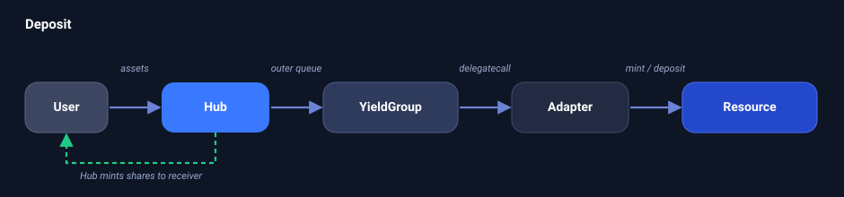
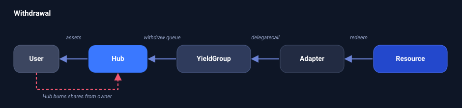
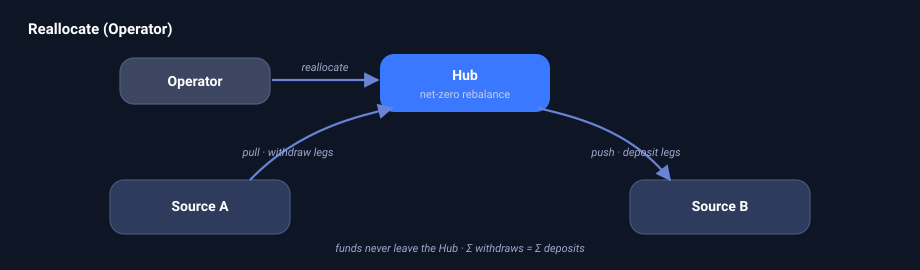
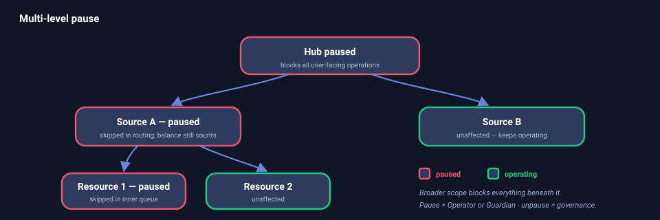

# Hub

The `Hub` is the per-asset ERC-4626 entry point of the Liquidity Hub. It accepts a single underlying asset, mints share tokens, and routes capital through a registry of Sources under a governance-set policy. One `Hub` is deployed per asset as a beacon proxy.

A Hub extends ERC-4626 with a Source registry, dual caps, an asymmetric multi-level pause, Operator reallocation, and management, performance and redeem fees. Registry and queue admin logic is delegatecall-linked into the **`HubAdminLib`** library to keep the Hub under the 24 KB bytecode limit; the library executes in the Hub's storage context.

## Inheritance

The Hub is built on the Venus upgradeable stack:

* **`ERC4626Upgradeable`** — OpenZeppelin's ERC-4626 base (deposit / mint / withdraw / redeem, share accounting).
* **`AccessControlledV8`** — every privileged setter is gated through `AccessControlManagerV8` via `_checkAccessAllowed("<function signature>")`. The role string is the literal signature text (e.g. `"addYieldGroup(address,uint256,uint16)"`), never the 4-byte selector. This base also brings in `Ownable2StepUpgradeable`, which supplies the ownership surface documented below.
* **`ReentrancyGuardUpgradeable`** — supplies the `nonReentrant` guard on the asset-moving entry points (see [Invariants and safety](#invariants-and-safety)).
* **`HubStorage`** — isolates all Hub state in a base contract with a reserved `__gap` for upgrade safety.
* **`IHub`** — external interface (see [Interfaces](interfaces.md) for the boundary types it shares with YieldGroups).

The declaration order is `ERC4626Upgradeable, AccessControlledV8, ReentrancyGuardUpgradeable, HubStorage, IHub` and is load-bearing for upgrade safety — never reorder it.

Storage lives entirely in `HubStorage`; never reorder or prepend its fields. New fields are appended and the `__gap` is shrunk by the same number of slots.

## Operation flows

All user-facing mutating operations are **atomic-or-revert** — they complete in full or revert with a named error. There is no partial fill and no remainder returned.

### Deposit

<figure><figcaption></figcaption></figure>

1. User calls `deposit(assets, receiver)` (or `mint`).
2. The Hub accrues fees, then pulls `assets` from the user — so the caller trades against the post-accrual share price.
3. The Hub snapshots `totalAssets()` (which already includes the just-transferred idle) and walks the **outer deposit queue**.
4. For each Source: skip if unregistered or paused; compute `capRoom = max(0, effectiveCap − source.totalAssets())`; send `min(remaining, capRoom, source.maxDeposit())`. A **partial fill is accepted here** — the Source places what its inner queue can absorb, refunds the unplaced remainder to the Hub, and returns the placed amount; the cascade routes that remainder to the next Source. A Source whose `deposit` call reverts outright is caught, skipped (`YieldGroupSkipped`), and routing continues. `YieldGroupUnderfilled` is a `reallocate`-only error, not a deposit-cascade one.
5. Each Source walks its **inner deposit queue**, delegatecalling its adapter per resource (respecting any per-resource cap), and mints receipt tokens into the YieldGroup.
6. The Hub mints share tokens to the receiver.
7. If capacity across the whole queue is short, the **entire transaction reverts** (`HubCapacityExceeded`).

### Withdrawal

<figure><figcaption></figcaption></figure>

1. User calls `withdraw(assets, receiver, owner)` (or `redeem`).
2. The Hub accrues fees, enforces the **per-transaction withdrawal cap** (`HubWithdrawCapExceeded`), then burns shares from `owner`.
3. The Hub consumes its own **idle balance first**, then walks the **outer withdraw queue** (independent of the deposit queue).
4. For each Source, the Hub calls `Source.withdraw(amount, hub)`; the Source uses its own idle balance first, then walks its **inner withdraw queue**, delegatecalling the adapter's `redeemUnderlying` / `withdraw`.
5. The Hub measures the delivered balance delta (rather than trusting a return value) and reverts `YieldGroupUnderfilled` on any shortfall.
6. Underlying flows Resource → YieldGroup → Hub → receiver.
7. If liquidity is short, the **entire transaction reverts** (`HubInsufficientLiquidity`).

### Reallocate

<figure><figcaption></figcaption></figure>

Reallocate moves assets between Sources — and, optionally, between specific resources within a Source — without funds entering or leaving the Hub. Both legs share the [`ReallocateLeg`](#structs) struct. The Hub treats `resource` as an **opaque pass-through**: it holds no resource registry and never reads resource state — it relays the address to the owning Source, which validates it against its own registry.

1. The Operator calls `reallocate(withdraws, deposits)`.
2. The Hub accrues fees (skipped while paused).
3. **Pull phase** — every withdraw leg runs first: `Source.withdraw` (queue) or `Source.withdrawResource` (targeted). Underlying returns to the Hub as idle. Pulling from a *paused* resource is allowed (wind-down).
4. The Hub takes a single TVL snapshot after all pulls — the cap reference for every push (valid because a balanced reallocate conserves TVL). While unpaused this is the strict, fail-closed `totalAssets()`. While paused (the `emergencyReallocate` path) it is a **fail-open** sum that skips any Source whose `totalAssets()` reverts, so a single bricked Source cannot block a rebalance among the healthy ones.
5. **Push phase** — each deposit leg checks the Source is registered, unpaused, and within its effective cap, then `Source.deposit` (queue) or `Source.depositResource` (targeted). Depositing into a paused resource reverts.
6. The Hub enforces `Σ withdraws == Σ deposits` (`ReallocateImbalanced` otherwise). **Net-zero invariant.**

A targeted leg (non-zero `resource`) moves the full `amount` into / out of that one resource or reverts. Setting both legs to the same `source` performs an **intra-Source move** (e.g. `vUSDT_v1` → `vUSDT_v2`). `emergencyReallocate` performs the same net-zero rebalance but **remains callable while the Hub is paused**, giving governance a wind-down lever without granting the Operator a pause bypass.

## totalAssets computation

`totalAssets()` drives share pricing for every deposit / withdraw (`convertToShares` / `convertToAssets`).

```
Hub.totalAssets()
  = Σ Source.totalAssets()  +  Hub idle balance
        │
        └─ Source.totalAssets()
             = Σ adapter.totalAssets(resource, yieldGroup)  +  Source idle balance
```

* `totalAssets()` **fails closed**. It sums every registered Source with no error isolation, so a Source whose `totalAssets()` view reverts makes the whole NAV read revert — and with it every `convertTo*` / `preview*` view and every deposit / mint / withdraw / redeem / `accrueFees` / `reallocate` — until the Source is fixed or evicted. This is deliberate: NAV is the share-price denominator, so silently counting a live Source as 0 would under-pay redeemers and over-credit depositors. Fault isolation applies only one level out, to the quantity-gate views (`maxDeposit` / `maxWithdraw`) and the deposit / withdraw routing, which do skip a faulting Source. Recovery is the emergency path of `removeYieldGroup`, which permits removal precisely when the view reverts.
* Hub idle is normally zero (deposits route out atomically, withdrawals pull exact amounts, reallocate is balanced). A direct token donation persists and is intentionally counted into NAV — it accrues to LPs and is consumed first on withdraw; the underlying cannot be swept.
* View paths use the **stored** exchange rate (`exchangeRateStored`, stale up to one accrual cycle, no state mutation). Mutating paths trigger interest accrual on the resource during mint / redeem, so the rate is current by the time the operation completes.

## Cap enforcement

**Source level — dual cap.** Each Source carries an absolute amount AND a percentage of Hub TVL; the stricter binds:

```
effectiveCap = (percentageCapBps == 10_000)
             ? absoluteCap
             : min(absoluteCap, percentageCapBps × hubTVL / 10_000)
```

`percentageCapBps == 10_000` (100%) is a sentinel that **disables** the percentage component — required so a fresh Hub at TVL = 0 can take its first deposit (otherwise `pct × 0` collapses the cap to zero). `absoluteCap == type(uint256).max` is rejected; use the sentinel to disable the percentage dimension instead.

**Per-transaction withdrawal cap.** `maxWithdrawalSize` (asset units) bounds every single withdraw / redeem so one transaction cannot drain a downstream product's liquidity; exceeding it reverts `HubWithdrawCapExceeded`.

The optional **per-resource deposit cap** (Core & Flux) binds one level down, inside the YieldGroup — see [Yield Groups](yield-groups.md#resource-caps-core--flux-only).

## Fees

Three fee types. Management and performance fees are minted as **dilution shares** to a single `feeRecipient` (`address(0)` disables minting); the redeem fee is taken from the withdrawing lender. Accrual is idempotent within a block and runs before every deposit / withdraw / reallocate. The management and performance rates are capped at `MAX_FEE_BPS` (50%); the redeem fee is capped at `MAX_REDEEM_FEE_BPS` (5%).

* **Management fee** — linear time proration: `totalAssets × bps × Δt / (10_000 × 365 days)`. A single accrual is capped at `MAX_MGMT_FEE_PER_ACCRUAL_BPS` (100%) of TVL. When the cap binds, the accrual cursor advances only over the window that produced the cap, so the **remaining elapsed time defers** to the next accrual — but the clamped fee itself is not minted: a separate `totalFee < totalAssets()` guard skips any accrual whose combined management + performance fee would reach 100% of TVL. At the launch rate of `0` neither path is reachable.
* **Performance fee** — charged only on gains in price-per-share above a **high-water mark** (`totalAssets × 1e18 / totalSupply`). The mark moves on three paths: it ratchets up to PPS on a new high during accrual (independent of whether a fee is minted, so a later rate increase cannot retroactively claim past gains); it is incremented by the retained exit-fee PPS uplift on `withdraw` / `redeem`, so the redeem fee is not taxed as performance; and it is **re-anchored to the entry PPS — possibly downward — on a refill from an empty vault**, so a new cohort is neither shielded by nor charged for a prior cohort's high. It is therefore non-decreasing for any continuously-held cohort, but not monotonic across a full emptying.

* **Redeem fee** — an exit fee in BPS applied to `withdraw` / `redeem`, charged directly to the withdrawing lender rather than diluting the pool. Capped at `MAX_REDEEM_FEE_BPS` (`500` = 5%).

v1 launches with all three set to `0`; the machinery exists for governance to enable them later.

## Multi-level pause

Three independent scopes — a broader scope blocks everything beneath it; siblings keep operating. Pause is **asymmetric**: tightening (pause) is Operator-accessible, loosening (unpause) is governance-only.

<figure><figcaption></figcaption></figure>

* **Hub paused** — all deposits / withdrawals / mints / redeems, `reallocate`, and fee accrual and the fee setters are blocked; `emergencyReallocate` and `sweep` stay callable; views stay readable, though all four `max*` views return `0`. Underlying products keep operating. Only the **time-based management fee** is excluded from the pause window — `unpauseHub` advances the accrual cursor by the pause duration, so LPs are not charged rent for frozen time. The performance fee is *not* excluded: the high-water mark is deliberately left unchanged, so per-share gains the underlying products earn during the freeze are charged on the first post-resume accrual.
* **Source paused** — the Hub-level flag makes routing skip the Source **silently in both directions**: a user `deposit` / `mint` cascades to the next Source and a user `withdraw` / `redeem` pulls from elsewhere, with no `YieldGroupPaused` revert (only `HubCapacityExceeded` / `HubInsufficientLiquidity` fire if the rest of the queue cannot cover the amount). Its balance still counts in `totalAssets()` but is excluded from `maxDeposit()` / `maxWithdraw()`. Funds remain reachable via `reallocate` / `emergencyReallocate` — a **pull** leg from a paused Source is allowed, while a **push** leg into one reverts `YieldGroupPaused`.
* **Resource paused** — set on the YieldGroup, not the Hub; see [Yield Groups](yield-groups.md#pause-asymmetric).

## Permissions

Every ACM-gated call is authorised through `AccessControlManagerV8` — the role is `keccak256(abi.encodePacked(targetContract, roleString))`, where `roleString` is the literal function signature. The ownership functions (`transferOwnership` / `acceptOwnership` / `setAccessControlManager`) sit outside the ACM and are owner-only; see [Ownership and access control](#ownership-and-access-control). The contracts do not hard-code an Operator-vs-governance branch; the asymmetry is entirely a matter of which addresses governance grants each role to. In v1 the Operator is the Venus Core multisig.

Three holders in v1: governance (a VIP, behind the Normal Timelock), the Operator (the Venus Core
multisig), and the **Guardian** (a multisig that acts with no timelock delay, so it can contain an
incident immediately). The Guardian is granted containment only — it can tighten but never loosen.

| Action class                                                                        | Governance (VIP) | Operator | Guardian |
| ------------------------------------------------------------------------------------ | :--------------: | :------: | :------: |
| Add / remove YieldGroup, add / remove / re-adapter a resource                          | ✅               | ❌       | ❌       |
| Set fees and fee recipient, `sweep`, `setBlocksPerYear`                                | ✅               | ❌       | ❌       |
| **Raise** the per-transaction withdrawal cap                                           | ✅               | ❌       | ❌       |
| **Unpause** at any level (Hub, YieldGroup, resource)                                   | ✅               | ❌       | ❌       |
| **Raise or lower** YieldGroup caps and per-resource caps                               | ✅               | ✅       | ❌       |
| **Lower** the per-transaction withdrawal cap, reorder outer / inner queues             | ✅               | ✅       | ❌       |
| **Pause** — Hub, YieldGroup, or resource                                               | ✅               | ✅       | ✅       |
| `emergencyReallocate` (works while paused)                                             | ✅               | ❌       | ✅       |
| `forceRemoveResource` (FRV)                                                            | ✅               | ❌       | ✅       |
| `reallocate` between YieldGroups / resources                                           | ❌               | ✅       | ❌       |
| `addHub` / `removeHub` on the `HubRegistry`                                            | ✅               | ❌       | ❌       |
| `deposit` / `mint` / `withdraw` / `redeem`, `accrueFees`, views                        | permissionless   | permissionless | permissionless |

Two rows are worth reading carefully, because both depart from a naive loosening-vs-tightening split:

* **`raiseYieldGroupCap` is Operator-accessible.** It is the one loosening lever the Operator holds, granted so it can open headroom immediately before a `reallocate` without waiting for a governance round. Raising the *per-transaction withdrawal cap* is still governance-only.
* **Governance does not hold `reallocate`.** It is Operator-only. Governance's equivalent lever is `emergencyReallocate`, which has the same net-zero semantics and additionally works while the Hub is paused.

The Guardian's grant is a strict subset of governance's: pause at all three levels, `emergencyReallocate`, and `forceRemoveResource`. It holds no unpause, so it can contain an incident but never undo a governance-ordered pause.

Nothing in the contracts hard-codes these three. The split is entirely a matter of which addresses
governance grants each role to — the asymmetry is a deployment decision, not a code branch.

## Invariants and safety

* **Atomic-or-revert.** Deposits, withdrawals, and reallocate fully complete or revert with a named error — no partial fills, no remainder returned.
* **Net-zero reallocate.** `Σ withdraws == Σ deposits`; the Operator can only move funds among registered routes, never in or out.
* **Reentrancy-guarded value paths.** Every entry point that moves assets is `nonReentrant` (`ReentrancyGuardUpgradeable`) — `deposit` / `mint` / `withdraw` / `redeem`, `reallocate`, `emergencyReallocate`, `accrueFees`, `sweep` on the Hub, and `deposit` / `withdraw` / `depositResource` / `withdrawResource` / `sweep` on each YieldGroup — since each makes external calls into Sources, delegatecalls into adapters, and reaches into the underlying Core / Flux / FRV protocols. The ACM-gated admin setters and the `onlyHub` `accrue()` poke are **not** individually guarded; they rely on ACM gating and `onlyHub` instead.
* **Fault isolation on the quantity gates, fail-closed on price.** A Source with a reverting `totalAssets()` view contributes 0 to `maxDeposit()` / `maxWithdraw()` and is skipped by the deposit / withdraw routing — but `Hub.totalAssets()` itself is deliberately **fail-closed** and reverts with it, halting share pricing rather than understating NAV. Such a Source can still be removed as an emergency eviction: `removeYieldGroup` catches the reverting view and permits removal.
* **Removal safety.** `removeYieldGroup` gates on the Source's balance so a funded Source can't be silently dropped; YieldGroups apply the same gate on a raw receipt-token balance.
* **Inflation defense.** The ERC-4626 decimals offset is set per asset at `initialize` and enforced **on-chain in both directions**: `0` and anything above `MAX_DECIMALS_OFFSET` (12) revert `InvalidDecimalsOffset`, so a Hub can never be deployed with the offset disabled. A non-zero offset is required for every asset regardless of its decimals — offset 0 would let a donation attack zero a first depositor's shares.
* **Standard ERC-20 only.** Fee-on-transfer, deflationary, and rebasing underlyings are unsupported (deposits fail closed if a token delivers less than requested).
* **Upgrade-safe storage.** State is isolated in `HubStorage` with a reserved `__gap`; fields are never reordered or prepended.

## Constants

| Constant                       | Value     | Description                                                        |
| ------------------------------ | --------- | ----------------------------------------------------------------- |
| `BPS_DENOMINATOR`              | `10_000`  | Basis-point denominator (100%)                                    |
| `EXP_SCALE`                    | `1e18`    | Fixed-point mantissa                                              |
| `MAX_DECIMALS_OFFSET`          | `12`      | Maximum ERC-4626 inflation-defense decimals offset               |
| `MAX_FEE_BPS`                  | `5_000`   | Maximum management or performance fee rate (50%)                 |
| `MAX_MGMT_FEE_PER_ACCRUAL_BPS` | `10_000`  | Cap on one management-fee accrual (100% of TVL); remainder defers |
| `MAX_REDEEM_FEE_BPS`           | `500`     | Maximum redeem (exit) fee rate (5%)                              |
| `SECONDS_PER_YEAR`             | `365 days`| Seconds per year, used for management-fee time proration          |

## State variables

Defined in `HubStorage`:

| Variable                    | Type                                          | Description                                              |
| --------------------------- | --------------------------------------------- | ------------------------------------------------------- |
| `_hubPaused`                | `bool`                                        | True while the Hub is paused                            |
| `_decimalsOffsetStored`     | `uint8`                                        | ERC-4626 inflation-defense offset, set once at init     |
| `_maxWithdrawalSize`        | `uint256`                                      | Per-transaction withdraw / redeem cap, in asset units   |
| `_registeredYieldGroups`        | `address[]`                                    | Canonical set of registered Sources                     |
| `_yieldGroupIndex`              | `mapping(address => uint256)`                  | 1-indexed position in the registry (0 = not registered) |
| `_yieldGroups`                  | `mapping(address => YieldGroupConfig)`             | Per-Source caps, pause, and registered flag             |
| `_outerDepositQueue`        | `address[]`                                    | Deposit cascading order                                 |
| `_outerWithdrawQueue`       | `address[]`                                    | Withdraw pulling order (independent of deposit queue)   |
| `_managementFeeBps`         | `uint16`                                       | Management fee rate in BPS                               |
| `_performanceFeeBps`        | `uint16`                                       | Performance fee rate in BPS                              |
| `_feeRecipient`             | `address`                                      | Recipient of newly-minted fee shares                    |
| `_redeemFeeBps`             | `uint16`                                       | Redeem (exit) fee rate in BPS; **retained in the vault** as a price-per-share uplift, not paid to `_feeRecipient` |
| `_highWaterMarkPerShare`    | `uint256`                                      | Performance HWM (`totalAssets × 1e18 / totalSupply`)    |
| `_lastFeeAccrualTimestamp`  | `uint64`                                       | Timestamp of last fee accrual                           |
| `_pauseStart`               | `uint64`                                       | Timestamp the current pause began; management-fee accrual skips the window |
| `_lastFeeAccrualBlock`      | `uint64`                                       | Block of last fee accrual; makes accrual idempotent per block |

The rows are listed in `HubStorage` declaration order. `_managementFeeBps`, `_performanceFeeBps`, `_feeRecipient` and `_redeemFeeBps` share one packed slot.

## Structs

### YieldGroupConfig

```solidity
struct YieldGroupConfig {
    uint256 absoluteCap;       // hard cap on the Source's holdings, in asset units
    uint16 percentageCapBps;   // cap as a fraction of totalAssets(); 10_000 disables this component
    bool paused;               // when true, routing skips this Source; balance still counts
    bool registered;           // true iff present in registeredYieldGroups()
}
```

### ReallocateLeg

```solidity
struct ReallocateLeg {
    address yieldGroup; // YieldGroup to act on (must be registered)
    address resource;  // specific resource, or address(0) to route through the inner queue
    uint256 amount;    // asset units to move on this leg
}
```

The same shape is reused for both the withdraw (pull) and deposit (push) arrays of `reallocate`. `resource == address(0)` cascades through the Source's inner queue (idle-first on a pull, capacity-order on a push); a non-zero `resource` moves the full `amount` against that one market / vault and bypasses the queue.

## Solidity API

### ERC-4626 user functions

Permissionless and atomic-or-revert. Each accrues fees before pricing.

* **`deposit(uint256 assets, address receiver)`** — deposit `assets`, route through the outer deposit queue, mint shares to `receiver`. Reverts `HubCapacityExceeded` / `HubPaused`.
* **`mint(uint256 shares, address receiver)`** — mint exactly `shares`, depositing the required assets.
* **`withdraw(uint256 assets, address receiver, address owner)`** — burn shares from `owner`, pull `assets` (Hub idle first, then the outer withdraw queue), deliver to `receiver`. Size the call against `maxWithdraw(owner)`: it is already clamped to the owner's balance, aggregate liquidity and `maxWithdrawalSize()`, so an over-sized request trips the inherited OpenZeppelin guard and reverts with the string error `"ERC4626: withdraw more than max"` rather than `HubWithdrawCapExceeded` or `HubInsufficientLiquidity`. Those two named errors remain reachable on the routing path.
* **`redeem(uint256 shares, address receiver, address owner)`** — burn exactly `shares` and deliver the corresponding assets.
* **`totalAssets()`** — `Σ Source.totalAssets() + Hub idle balance`.

Two consent-gated variants take an extra `bytes32 consentHash` and emit it in the same transaction as the deposit, so an integrator can prove the supplier acknowledged a specific set of terms. The hash is **event-only** — no storage is written and there is no on-chain getter, so proving acknowledgement is a log query, not a contract read. They are otherwise identical to their plain counterparts.

* **`depositWithConsent(uint256 assets, address receiver, bytes32 consentHash)`** — emits `ConsentRecorded` when `consentHash` is non-zero, then deposits. Passing `bytes32(0)` skips the emit and behaves exactly like `deposit`.
* **`mintWithConsent(uint256 shares, address receiver, bytes32 consentHash)`** — the same, for `mint`.

Not all the standard ERC-4626 views behave identically to the OpenZeppelin base:

* `convertToShares` / `convertToAssets` / `previewDeposit` / `previewMint` are **inherited unmodified**. They are pure share math and reflect *none* of the caps, liquidity, pause state or fees — sizing a deposit off `previewDeposit` gives no signal that the deposit will revert.
* `maxDeposit` / `maxMint` / `maxWithdraw` / `maxRedeem` are **overridden** and do reflect live effective caps, aggregate liquidity, the per-transaction withdrawal cap and the redeem fee. All four return `0` while the Hub is paused.
* `previewWithdraw` / `previewRedeem` are **overridden** to account for the redeem (exit) fee, so they diverge from `convertToAssets` / `convertToShares` whenever that fee is non-zero.

### Source registry (governance)

* **`addYieldGroup(address source, uint256 absoluteCap, uint16 percentageCapBps)`** — register a Source. Validates `source.asset() == asset()` (`YieldGroupAssetMismatch`) and the cap pair (`InvalidCap`); `YieldGroupAlreadyRegistered` if present. Emits `YieldGroupAdded`.
* **`removeYieldGroup(address source)`** — remove a Source. `YieldGroupHasBalance` if it still custodies a balance. Emits `YieldGroupRemoved`.
* **`raiseYieldGroupCap(address source, uint256 absoluteCap, uint16 percentageCapBps)`** — loosen caps. **Both** dimensions must be ≥ their current values and at least one must strictly increase; a full no-op reverts `NotIncreasing`. Raising one dimension while lowering the other is rejected — that needs two calls. Also reverts `YieldGroupNotRegistered` and `InvalidCap`. Operator-accessible. Emits `YieldGroupCapRaised`.
* **`lowerYieldGroupCap(address source, uint256 absoluteCap, uint16 percentageCapBps)`** — tighten caps. **Both** dimensions must be ≤ their current values and at least one must strictly decrease; a full no-op reverts `NotDecreasing`. Also reverts `YieldGroupNotRegistered` and `InvalidCap`. Operator-accessible. Emits `YieldGroupCapLowered`.

### Outer queues (Operator)

* **`setOuterDepositQueue(address[] queue)`** — replace the deposit routing order; every entry must be a registered Source (`YieldGroupNotRegistered` otherwise) with no duplicates (`InvalidQueue`). Emits `OuterDepositQueueSet`.
* **`setOuterWithdrawQueue(address[] queue)`** — replace the withdraw routing order under the same registration / duplicate validation; additionally, dropping a Source that still holds a balance reverts `WithdrawQueueOmitsFundedYieldGroup`. Emits `OuterWithdrawQueueSet`.

### Reallocate (Operator)

* **`reallocate(ReallocateLeg[] withdraws, ReallocateLeg[] deposits)`** — atomic net-zero rebalance; `ReallocateImbalanced` if sums differ. Emits `WithdrawRouted` / `DepositRouted`.
* **`emergencyReallocate(ReallocateLeg[] withdraws, ReallocateLeg[] deposits)`** — same semantics, callable while paused, governance-only role.

### Pause (asymmetric)

* **`pauseHub()`** / **`unpauseHub()`** — pause is Operator-accessible (also Guardian); unpause is governance-only. Emits `HubPauseToggled`.
* **`pauseYieldGroup(address source)`** / **`unpauseYieldGroup(address source)`** — pause is Operator-accessible; unpause is governance-only. Emits `YieldGroupPauseToggled`.

### Per-transaction withdrawal cap

* **`raiseMaxWithdrawalSize(uint256 newSize)`** — governance-only; `NotIncreasing` if not strictly higher. Emits `MaxWithdrawalSizeRaised`.
* **`lowerMaxWithdrawalSize(uint256 newSize)`** — Operator-accessible; `NotDecreasing` if not strictly lower, and `ZeroAmount` if `newSize == 0` — the cap can never be set to zero, so use `pauseHub()` to stop withdrawals entirely. Emits `MaxWithdrawalSizeLowered`.

### Fees

* **`setManagementFeeBps(uint16 bps)`** / **`setPerformanceFeeBps(uint16 bps)`** — set fee rates; pending fees accrue at the OLD rate first. `InvalidFeeBps` above `MAX_FEE_BPS`. Emits `ManagementFeeBpsSet` / `PerformanceFeeBpsSet`.
* **`setFeeRecipient(address recipient)`** — set the recipient; pending fees mint to the OLD recipient first; `address(0)` disables minting. Emits `FeeRecipientSet`.
* **`accrueFees()`** — permissionless poke; idempotent within a block. Emits `FeesAccrued` / `HighWaterMarkUpdated`.
* **`setRedeemFeeBps(uint16 bps)`** — set the exit fee charged on `withdraw` / `redeem`. `InvalidFeeBps` above `MAX_REDEEM_FEE_BPS`. Emits `RedeemFeeBpsSet`.

### Sweep

* **`sweep(address token, address to)`** — forward the Hub's full balance of an arbitrary ERC-20 to `to`. `SweepProtectedAsset` if `token == asset()` — the underlying can never be swept. Governance-only. Emits `Swept`.

### Ownership and access control

The Hub is `Ownable2Step`, so a transfer only completes when the incoming owner accepts it. Ownership
is separate from the ACM roles above: the owner replaces the ACM itself, while the ACM decides who may
call everything else. Both sit with governance in v1.

* **`transferOwnership(address newOwner)`** — nominate a new owner. Emits `OwnershipTransferStarted`.
* **`acceptOwnership()`** — the nominee claims it. Emits `OwnershipTransferred`. The onboarding proposal calls this on each Hub.
* **`pendingOwner()` / `owner()`** — the nominee and the current owner.
* **`setAccessControlManager(address acm)`** — point the Hub at a different `AccessControlManagerV8`. Owner-only. Emits `NewAccessControlManager`.
* **`accessControlManager()`** — the ACM currently in force.

### Views

* **`yieldGroupConfig(address source)` → `YieldGroupConfig`** — full stored config for a Source.
* **`yieldGroupEffectiveCap(address source)` → `uint256`** — live effective cap (the stricter of the dual cap).
* **`registeredYieldGroups()` → `address[]`** — the Source registry.
* **`outerDepositQueue()` / `outerWithdrawQueue()` → `address[]`** — the current routing orders.
* **`maxWithdrawalSize()` → `uint256`** — per-transaction withdraw cap.
* **`hubPaused()` → `bool`** — Hub-level pause state.
* **`feeRecipient()` → `address`** — current fee recipient.
* **`feeBps()` → `(uint16 managementBps, uint16 performanceBps)`** — current dilution fee rates.
* **`redeemFeeBps()` → `uint16`** — current exit fee rate.
* **`highWaterMarkPerShare()` → `uint256`** — performance HWM in share-price units.

## Events

| Event                     | Parameters                                                  | Description                                       |
| ------------------------- | ----------------------------------------------------------- | ------------------------------------------------- |
| `YieldGroupAdded`             | `yieldGroup` (indexed), `absoluteCap`, `percentageCapBps`   | Source registered                                 |
| `YieldGroupRemoved`           | `yieldGroup` (indexed)                                      | Source removed                                    |
| `YieldGroupCapRaised`         | `yieldGroup` (indexed), `absoluteCap`, `percentageCapBps`   | Source caps loosened                              |
| `YieldGroupCapLowered`        | `yieldGroup` (indexed), `absoluteCap`, `percentageCapBps`   | Source caps tightened                             |
| `YieldGroupPauseToggled`      | `yieldGroup` (indexed), `paused`                            | Source pause flag flipped                         |
| `OuterDepositQueueSet`    | `queue`                                                     | Deposit routing order replaced                    |
| `OuterWithdrawQueueSet`   | `queue`                                                     | Withdraw routing order replaced                   |
| `HubPauseToggled`         | `paused`                                                    | Hub pause flag flipped                            |
| `MaxWithdrawalSizeRaised` | `oldSize`, `newSize`                                        | Per-tx withdraw cap raised                        |
| `MaxWithdrawalSizeLowered`| `oldSize`, `newSize`                                        | Per-tx withdraw cap lowered                       |
| `DepositRouted`           | `yieldGroup` (indexed), `amount`                            | Assets deposited into a Source                    |
| `WithdrawRouted`          | `yieldGroup` (indexed), `amount`                            | Assets withdrawn from a Source                    |
| `ManagementFeeBpsSet`     | `oldBps`, `newBps`                                          | Management fee rate changed                       |
| `PerformanceFeeBpsSet`    | `oldBps`, `newBps`                                          | Performance fee rate changed                      |
| `FeeRecipientSet`         | `oldRecipient`, `newRecipient`                              | Fee recipient changed                             |
| `FeesAccrued`             | `managementShares`, `performanceShares`, `totalShares`      | Fee shares minted in an accrual                   |
| `HighWaterMarkUpdated`    | `oldHwm`, `newHwm`                                          | Performance HWM changed — ratcheted up on a new PPS high, incremented by the retained exit-fee uplift on withdraw, or **re-anchored (possibly downward)** to the entry PPS on a refill from an empty vault. Do not assume `newHwm >= oldHwm` |
| `RedeemFeeBpsSet`         | `oldBps`, `newBps`                                          | Redeem (exit) fee rate changed                    |
| `YieldGroupSkipped`       | `yieldGroup`, `isDeposit`                                   | A YieldGroup's mutating `deposit` / `withdraw` call **reverted** and routing routed around it. A healthy system emits this zero times — paused, at-cap and dry YieldGroups are skipped silently with no event |
| `ConsentRecorded`         | `supplier`, `receiver`, `consentHash`                       | A consent-gated deposit or mint recorded its hash |
| `Swept`                   | `token`, `to`, `amount`                                     | Stray-token balance rescued                       |
| `OwnershipTransferStarted`| `previousOwner`, `newOwner`                                 | Ownership transfer nominated                      |
| `OwnershipTransferred`    | `previousOwner`, `newOwner`                                 | Ownership transfer accepted                       |
| `NewAccessControlManager` | `oldAccessControlManager`, `newAccessControlManager`        | The Hub was pointed at a different ACM            |

## Errors

| Error                          | When                                                                       |
| ------------------------------ | -------------------------------------------------------------------------- |
| `Unauthorized`                 | Caller lacked the ACM role for the called function                        |
| `HubCapacityExceeded`          | Deposit / mint exceeds aggregate spare cap across unpaused Sources, **or** a `reallocate` / `emergencyReallocate` push leg exceeds the destination Source's own effective cap |
| `HubInsufficientLiquidity`     | Withdraw / redeem exceeds liquid funds (withdraw queue + Hub idle)         |
| `YieldGroupUnderfilled`            | A Source delivered an amount **not exactly equal** to the amount requested — under- *or* over-delivery, since the check is `!=` — on a user withdraw / redeem cascade step or on a `reallocate` leg. Not raised by the deposit cascade, which accepts partial fills |
| `HubWithdrawCapExceeded`       | Withdraw / redeem exceeds `maxWithdrawalSize()`                            |
| `HubPaused`                    | A user-facing mutating call is attempted while the Hub is paused           |
| `YieldGroupPaused`                 | A `reallocate` / `emergencyReallocate` **push** leg targets a paused Source. User deposits never raise this — the cascade skips paused Sources silently and surfaces `HubCapacityExceeded` if the amount cannot be placed |
| `YieldGroupNotRegistered`          | Operation targets a Source not in the registry                            |
| `YieldGroupAlreadyRegistered`      | `addYieldGroup` on an already-registered Source                               |
| `YieldGroupHasBalance`             | `removeYieldGroup` while the Source still holds non-zero **resource-backed** value; its idle `asset()` balance is netted out, so a Source holding only a dust donation is removable. If the Source's `totalAssets()` reverts, removal is permitted anyway as an emergency eviction |
| `YieldGroupAssetMismatch`          | A Source's `asset()` does not match the Hub's underlying                  |
| `InvalidCap`                   | Cap pair is invalid (e.g. percentage > 100%, or `absoluteCap == uint256.max`) |
| `InvalidQueue`                 | A queue contains a duplicate entry (an *unregistered* entry reverts `YieldGroupNotRegistered` instead) |
| `ReallocateImbalanced`         | `reallocate` withdraw and deposit sums do not match                       |
| `WithdrawQueueOmitsFundedYieldGroup`| A withdraw-queue replacement drops a funded Source                        |
| `SweepProtectedAsset`          | `sweep` called with `token == asset()`                                   |
| `ZeroAddress` / `ZeroAmount`   | A required non-zero address / amount parameter was zero                   |
| `InvalidDecimalsOffset`        | `decimalsOffset_` at init was `0` **or** exceeded `MAX_DECIMALS_OFFSET` (12) |
| `InvalidFeeBps`                | A management / performance rate exceeded `MAX_FEE_BPS` (5000 = 50%), **or** the redeem rate exceeded `MAX_REDEEM_FEE_BPS` (500 = 5%) |
| `NotIncreasing` / `NotDecreasing` | `raiseMaxWithdrawalSize` / `lowerMaxWithdrawalSize` was not strictly increasing / decreasing. For `raiseYieldGroupCap` / `lowerYieldGroupCap`, **both** dimensions must move in the requested direction (or stay equal) and at least one must move strictly — mixing a raise of one with a lower of the other reverts |

## ACM role strings

The role gating each privileged function is `keccak256(hubAddress, roleString)` where `roleString` is the literal signature. The ACM binds a role per contract address, so each per-asset Hub carries its own copy of all 19.

`addYieldGroup(address,uint256,uint16)`, `removeYieldGroup(address)`, `raiseYieldGroupCap(address,uint256,uint16)`, `lowerYieldGroupCap(address,uint256,uint16)`, `setOuterDepositQueue(address[])`, `setOuterWithdrawQueue(address[])`, `pauseHub()`, `unpauseHub()`, `pauseYieldGroup(address)`, `unpauseYieldGroup(address)`, `raiseMaxWithdrawalSize(uint256)`, `lowerMaxWithdrawalSize(uint256)`, `setManagementFeeBps(uint16)`, `setPerformanceFeeBps(uint16)`, `setFeeRecipient(address)`, `setRedeemFeeBps(uint16)`, `sweep(address,address)`, `reallocate((address,address,uint256)[],(address,address,uint256)[])`, `emergencyReallocate((address,address,uint256)[],(address,address,uint256)[])`.

Note the two `ReallocateLeg[]` signatures expand the struct to its tuple form `(address,address,uint256)[]` — the ACM role string must use the expanded form, not `ReallocateLeg[]`.

The `HubRegistry` carries two of its own: `addHub(address)` and `removeHub(address)`. Per-YieldGroup role strings are listed in [Yield Groups](yield-groups.md#acm-role-strings).
