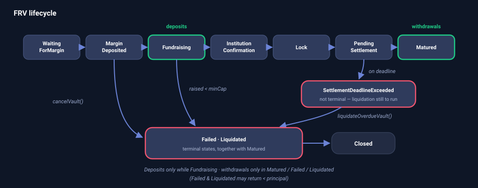

# Yield Groups

A **YieldGroup** is a Source implementation: it aggregates one or more *resources* of a single protocol family behind the uniform [`IYieldGroupBase`](interfaces.md) boundary the Hub depends on. Each YieldGroup is deployed per asset as a beacon proxy and owns its own inner deposit / withdraw queues, per-resource registry, and per-resource pause flags.

There are **two YieldGroup contracts**, deployed as three families in v1:

* **Core** — the generic `YieldGroup` contract behind the Core beacon, registering Venus Core-pool vTokens (`mint` / `redeemUnderlying`) via `AdapterCoreV1`, initialised with the chain's `blocksPerYear`.
* **Flux** — the *same* `YieldGroup` contract behind the Flux beacon, registering Fluid Lending fTokens (ERC-4626 shares) via `AdapterFlux`, initialised with `blocksPerYear = 0`.
* **`YieldGroupFRV`** — a separate contract, for Venus Fixed-Rate Vaults (ERC-4626 with an 11-state lifecycle).

"Core" and "Flux" are **deployment identities, not contract names** — which adapter, resources, caps and `blocksPerYear` governance wires into the proxy is the only difference. There is no `YieldGroupCore` or `YieldGroupFlux` type to import.

All three share the same Hub-facing surface and the same registry / queue / pause admin surface; they differ only in the protocol-specific behavior delegated to their [adapter](adapters.md) and in a few family-specific rules noted below.

> **Terminology.** The PRD calls this layer a *Source*; the code names the contract a *YieldGroup* and the Hub-facing interface `IYieldGroupBase`. There is no `ISource` type — "Source" survives in the Solidity only as deployment-artifact aliases (`CoreSource_USDT`, `FluxSource_USDC`, `FRVSource_U`). A registered resource is the PRD's *Product / Vault*.

## Hub-facing surface (`IYieldGroupBase`)

Every YieldGroup implements `IYieldGroupBase`. The Hub depends only on these functions and never reaches past a Source into the underlying market. Mutating entry points (`deposit` / `withdraw` / `depositResource` / `withdrawResource`) are `onlyHub`-gated (`NotHub` otherwise) and `nonReentrant`.

* **`deposit(uint256 amount)` → `uint256 deposited`** — pull `amount` from the caller and place it across resources via the inner deposit queue.
* **`withdraw(uint256 amount, address to)`** — pull `amount` from resources via the inner withdraw queue (idle-first) and deliver exactly `amount` to `to`, or revert.
* **`depositResource(address resource, uint256 amount)` → `uint256 deposited`** — deposit the full `amount` into one specific resource, bypassing the inner queue (for Operator reallocation). Reverts if that resource cannot accept exactly `amount`.
* **`withdrawResource(address resource, uint256 amount, address to)`** — redeem exactly `amount` from one specific resource (no idle-first, no cascade); pulling from a paused resource is permitted (wind-down).
* **`accrue()`** — `onlyHub`; the Hub pokes every registered Source before reading NAV so the management fee is charged on interest-current value. Core pokes each resource's `accrueInterest()`; Flux and FRV inherit the base no-op.
* **Views** — `asset()`, `totalAssets()`, `maxDeposit()`, `maxWithdraw()`, `spotAPYBps()`.

See [Interfaces](interfaces.md) for the full `IYieldGroupBase` contract and its conventions.

## ResourceConfig

Each YieldGroup stores per-resource state. The struct is declared on `IYieldGroupBase`:

```solidity
struct ResourceConfig {
    bool registered;   // true iff present in the resource registry
    bool paused;        // when true, routing skips this resource; balance still counts
    address adapter;    // IResourceAdapter implementation handling this resource's ABI
}
```

The public accessor **`resourceConfig(address resource)`** returns the three fields as separate values `(bool registered, bool paused, address adapter)`, not as a struct.

The optional per-resource deposit cap (Core & Flux only) lives in a separate `resourceCap` mapping so it does not disturb the struct's single-slot packing.

## Initialization

Called once via the proxy:

Core and Flux are the **same `YieldGroup` contract** behind different beacons, so they share one initializer; only the argument they pass for `blocksPerYear` differs. FRV is a separate contract with its own.

* **Core** — `initialize(address hub_, address asset_, uint256 blocksPerYear_, address acm_)`. Core annualises per-block supply rates, so it is deployed with the chain's `blocksPerYear` (**70,080,000** on BNB Chain, at roughly 0.45s per block).
* **Flux** — the same `initialize(address hub_, address asset_, uint256 blocksPerYear_, address acm_)`, deployed with `blocksPerYear_ = 0`: `AdapterFlux` reads a pre-annualised APR from the Fluid `LendingResolver` and ignores the argument.
* **FRV** — `initialize(address hub_, address asset_, address acm_)`. `YieldGroupFRV` passes `0` through to the shared base internally.

Each validates `asset_ == Hub.asset()` (`HubAssetMismatch` otherwise).

## Registry (governance)

* **`addResource(address resource, address adapter)`** — register a resource alongside the stateless adapter that handles its ABI. Validates that both are contracts (`ResourceNotContract` / `AdapterNotContract`) and that `adapter.asset(resource)` matches the YieldGroup's underlying (`ResourceAssetMismatch`). It then calls `adapter.validateRegistration(resource)`, which is where family-specific preconditions live: `AdapterCoreV1` rejects a vToken whose Comptroller charges a non-zero `treasuryPercent`, while `AdapterFlux` and `AdapterFRV` implement it as a no-op. Does not auto-append to either inner queue. Reverts `ResourceAlreadyRegistered` if present. Emits `ResourceAdded`.
* **`removeResource(address resource)`** — remove a resource. Requires a zero *raw receipt-token* balance (`ResourceHasBalance` otherwise) — the share-based check prevents a sub-unit residual from being rounded to zero and orphaning tokens. Also removes it from both inner queues via swap-and-pop. Emits `ResourceRemoved`.

* **`updateResourceAdapter(address resource, address adapter)`** — repoint a registered resource at a different adapter, without unwinding the position. Revalidates the new adapter the same way `addResource` does. Emits `ResourceAdapterUpdated`.
* **`forceRemoveResource(address resource)`** — FRV only. Evict a resource whose vault has become unusable, abandoning any shares still held rather than blocking on the balance gate. Reverts `ResourceHasValue` if the position is still worth recovering. Emits `ResourceForceRemoved`.

The same stateless adapter address may be reused across any number of resources in the same protocol family.

## Other governance functions

* **`setBlocksPerYear(uint256 blocksPerYear)`** — Core and Flux only. Retune the annualisation factor if the chain's block cadence changes. Emits `BlocksPerYearSet`.
* **`sweep(address token, address to)`** — forward a stray ERC-20 balance out of the YieldGroup. Cannot take the underlying (`SweepProtectedAsset`) or any registered resource's receipt token (`SweepProtectedResource`).

## Inner queues (Operator)

* **`setInnerDepositQueue(address[] queue)`** — replace the inner deposit-routing order. Every entry must be a registered resource; duplicates revert `InvalidQueue`. Emits `InnerDepositQueueSet`.
* **`setInnerWithdrawQueue(address[] queue)`** — replace the inner withdraw-routing order, independent of the deposit queue. Emits `InnerWithdrawQueueSet`.

## Pause (asymmetric)

* **`pauseResource(address resource)`** — make the inner queue skip a resource. Operator-accessible. Balance still counts; `depositResource` into it reverts; `withdrawResource` from it is allowed. Emits `ResourcePauseToggled`.
* **`unpauseResource(address resource)`** — governance-only. Emits `ResourcePauseToggled`.

There is no global YieldGroup pause — the only granularity inside a YieldGroup is per-resource. (A whole YieldGroup is paused at the Hub level via `pauseYieldGroup`.)

## Resource caps (Core & Flux only)

An optional per-resource deposit cap limits how much underlying *this YieldGroup* holds in one market, independent of the market's own protocol supply cap. Effective room is `min(protocolHeadroom, resourceCap − ourBalance)`.

* **`raiseResourceCap(address resource, uint256 newCap)`** — loosen (governance-only). `newCap == 0` means unbounded, so raising to `0` removes the cap; the new value must be strictly looser (`NotIncreasing` otherwise). Emits `ResourceCapRaised`.
* **`lowerResourceCap(address resource, uint256 newCap)`** — tighten (Operator-accessible). Must be strictly tighter and non-zero (`NotDecreasing` otherwise). Lowering below the current balance simply stops new deposits; it never forces a withdrawal. Emits `ResourceCapLowered`.

`YieldGroupFRV` does not expose these — FRV capacity comes entirely from the vault's own cap and its Fundraising-only rule.

## Family-specific behavior

|                          | **Core** (`YieldGroup`)                                  | **Flux** (`YieldGroup`)                  | **`YieldGroupFRV`**                            |
| ------------------------ | -------------------------------------------------------- | ---------------------------------------- | ---------------------------------------------- |
| Resource                 | Venus Core vToken                                        | Fluid fToken                             | Fixed-Rate Vault share                         |
| Redeem-time pool fee     | grossed-up for Comptroller `treasuryPercent` if enabled; registration blocked while non-zero | none | none |
| Spot APY source          | `supplyRatePerBlock` × `blocksPerYear`                   | Fluid `LendingResolver` (pre-annualised) | vault `fixedAPY` (Fundraising / Lock only)     |
| Per-resource deposit cap | optional                                                 | optional (primary control — Fluid `maxDeposit` is effectively unbounded) | not applicable |
| Lifecycle                | none                                                     | none                                     | 11-state machine (below)                       |

## FRV lifecycle

FRV vaults are ERC-4626 with an **11-state machine** on top. `YieldGroupFRV` calls the vault's permissionless `updateVaultState()` before every **mutating** sizing read — both cascade legs and both targeted `*Resource` legs — so deposit / withdraw routing always acts on current state. The `maxDeposit()` / `maxWithdraw()` **views** are `view` and structurally cannot advance state, so they can report a stale figure until someone pokes `updateVaultState()`.

<figure><figcaption></figcaption></figure>

The full `FRVVaultState` enum (values 0–10): `WaitingForMargin`, `MarginDeposited`, `Fundraising`, `InstitutionConfirmation`, `Lock`, `PendingSettlement`, `SettlementDeadlineExceeded`, `Matured`, `Failed`, `Liquidated`, `Closed`.

* **Deposits** are accepted **only in `Fundraising`** (`maxDeposit` is 0 in every other state). Each vault has a `minSupplierDeposit` floor: a sub-floor cascade leg is skipped to the next vault; a sub-floor targeted `depositResource` reverts `ResourceBelowMinimumDeposit` — *unless* the sub-floor amount exactly fills the vault's remaining capacity (the residual tail), which is always accepted.
* **Withdrawals** are possible **only in the terminal states** `Matured`, `Failed`, or `Liquidated` — capital is locked through `Lock` and `PendingSettlement`. `Matured` adds the fixed-rate yield; `Failed` / `Liquidated` can return **less than principal**, which marks down both `maxWithdraw` and `totalAssets`.
* **Mark-to-model gap.** `AdapterFRV` values a locked position at principal plus the coupon accrued straight-line over the lock, and holds the **full** term coupon flat through `PendingSettlement` and `SettlementDeadlineExceeded` — while `maxWithdraw` stays `0` throughout. That accrued coupon therefore enters `Hub.totalAssets()` and the ERC-4626 share price before it is realized or withdrawable, and it is written down only if the vault settles `Failed` / `Liquidated`. Depositors minting during a lock buy in at a price that includes it; redeemers cannot exit against it until a terminal state.
* Because `maxDeposit()` is a view it cannot advance state, so it can report stale non-zero capacity for a vault that is time-due to leave `Fundraising`; a permissionless `updateVaultState()` poke resolves it. This is a documented honesty-contract caveat, not a fund-safety issue.

## Events

All three YieldGroups emit the shared set below. FRV omits the three `IYieldGroup`-only events (`ResourceCapRaised`, `ResourceCapLowered`, `BlocksPerYearSet`) and is the only one that emits `ResourceForceRemoved`:

| Event                  | Parameters             | Description                                       |
| ---------------------- | ---------------------- | ------------------------------------------------- |
| `ResourceAdded`        | `resource`, `adapter`  | Resource registered alongside its adapter         |
| `ResourceRemoved`      | `resource`             | Resource removed                                  |
| `ResourcePauseToggled` | `resource`, `paused`   | Resource pause flag flipped                       |
| `InnerDepositQueueSet` | `queue`                | Inner deposit-routing order replaced              |
| `InnerWithdrawQueueSet`| `queue`                | Inner withdraw-routing order replaced             |
| `DepositRouted`        | `resource`, `amount`   | Underlying placed into a resource                 |
| `WithdrawRouted`       | `resource`, `amount`   | Underlying pulled from a resource                 |
| `ResourceCapRaised`     | `resource`, `newCap`                     | Per-resource deposit cap loosened (Core / Flux)  |
| `ResourceCapLowered`    | `resource`, `newCap`                     | Per-resource deposit cap tightened (Core / Flux) |
| `ResourceAdapterUpdated`| `resource`, `oldAdapter`, `newAdapter`   | A resource's adapter was swapped                 |
| `ResourceSkipped`       | `resource`, `isDeposit`                  | A cascade leg's adapter dispatch **reverted** and was routed around; a healthy system emits this zero times (paused / at-cap / dry resources are skipped silently, with no event) |
| `ResourceAccrualFailed` | `resource`, `adapter`                    | An adapter's accrual call reverted and was isolated |
| `BlocksPerYearSet`      | `oldBlocksPerYear`, `newBlocksPerYear`   | Annualisation factor retuned (Core / Flux)       |
| `ResourceForceRemoved`  | `resource`, `orphanedShares`             | Bricked resource evicted, abandoning its shares (FRV) |
| `Swept`                 | `token`, `to`, `amount`                  | Stray-token balance rescued                      |

## Errors

| Error                          | When                                                                  |
| ------------------------------ | --------------------------------------------------------------------- |
| `NotHub`                       | An `onlyHub` function was called by a non-Hub address                 |
| `Unauthorized`                 | Caller lacked the ACM role for the called function                    |
| `ZeroAddress`                  | A required non-zero address parameter was zero                        |
| `HubAssetMismatch`             | The asset at init does not match the Hub's `asset()`                  |
| `ResourceAssetMismatch`        | A resource's underlying does not match this YieldGroup's asset        |
| `ResourceAlreadyRegistered`    | `addResource` on an already-registered resource                       |
| `ResourceNotRegistered`        | Operation targeted a resource not in the registry                     |
| `ResourceHasBalance`           | `removeResource` while the resource still holds a balance             |
| `ResourceIsPaused`             | A deposit was routed to a paused resource                             |
| `ResourceCapacityExceeded`     | A **targeted** `depositResource` exceeded that one resource's spare capacity. The inner-queue `deposit` path never reverts on capacity — it partial-fills and refunds the remainder |
| `ResourceLiquidityInsufficient`| Withdraw exceeded aggregate liquid funds across the inner queue       |
| `ResourceNotContract`          | The supplied resource address has no code                            |
| `AdapterNotContract`           | The supplied adapter address has no code                             |
| `AdapterUnderfilled`           | An adapter delegatecall's observed effect did not match the request   |
| `InvalidQueue`                 | A queue contains a **duplicate** entry (an *unregistered* entry reverts `ResourceNotRegistered` instead) |
| `NotIncreasing` / `NotDecreasing` | A `raiseResourceCap` / `lowerResourceCap` call was not strictly looser / tighter (Core / Flux) |
| `ResourceBelowMinimumDeposit`  | An FRV targeted deposit was below `minSupplierDeposit` and not the residual tail (FRV only) |
| `ResourceHasValue`             | A force-removal target still holds value that would be abandoned      |
| `SweepProtectedAsset`          | `sweep` called with the YieldGroup's own underlying                   |
| `SweepProtectedResource`       | `sweep` called with a registered resource's receipt token             |
| `WithdrawQueueOmitsFundedResource` | An inner withdraw-queue replacement drops a funded resource       |
| `OnlySelf`                     | An internal dispatch entry point was called externally                |

## ACM role strings

Per YieldGroup, the role is `keccak256(yieldGroupAddress, roleString)`.

Shared by all three families (8):

`addResource(address,address)`, `removeResource(address)`, `updateResourceAdapter(address,address)`, `setInnerDepositQueue(address[])`, `setInnerWithdrawQueue(address[])`, `pauseResource(address)`, `unpauseResource(address)`, `sweep(address,address)`.

Core and Flux add three, for **11** in total:

`raiseResourceCap(address,uint256)`, `lowerResourceCap(address,uint256)`, `setBlocksPerYear(uint256)`.

FRV adds one instead, for **9** in total:

`forceRemoveResource(address)`.
