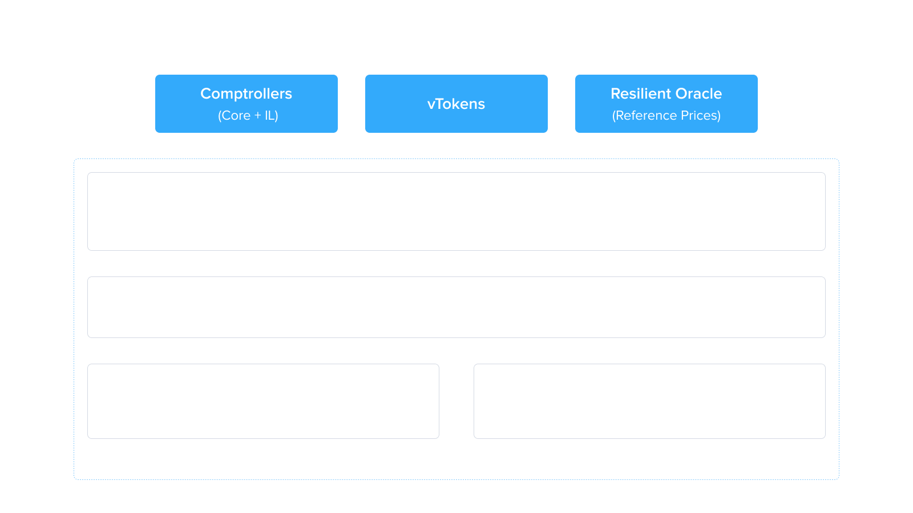

# DeviationSentinel

The DeviationSentinel is a Venus periphery contract that monitors price deviations between the ResilientOracle and a DEX-based SentinelOracle. When deviations exceed configured thresholds, it automatically pauses market actions and adjusts collateral factors to protect the protocol from price manipulation or oracle failures.

## Overview

Price oracle reliability is critical for lending protocols. A compromised or malfunctioning oracle can lead to undercollateralized borrows or improper liquidations. The DeviationSentinel mitigates this risk by continuously comparing prices from two independent sources and taking protective action when they diverge beyond acceptable limits.

The system consists of four contracts:

| Contract             | Description                                                |
| -------------------- | ---------------------------------------------------------- |
| `DeviationSentinel`  | Core controller that detects deviations and pauses markets |
| `SentinelOracle`     | Aggregator oracle routing to DEX oracles or direct prices  |
| `UniswapOracle`      | Fetches prices from Uniswap V3 pools                       |
| `PancakeSwapOracle`  | Fetches prices from PancakeSwap V3 pools                   |

### Economic Rationale

The deviation response logic is designed to counter specific attack vectors that arise when oracle prices diverge from real market prices.

**When DEX Price > Oracle Price (borrow attack):**

1. Attacker deposits an asset (e.g., BNB) as collateral
2. Borrows the mispriced token at its undervalued oracle price
3. Sells the borrowed token on DEX at the higher DEX price
4. Repeats until protocol liquidity is drained

**Action:** Pause borrowing for the affected asset.

**When DEX Price < Oracle Price (collateral attack):**

1. Attacker deposits the mispriced token as collateral, valued at the higher oracle price
2. Borrows other assets up to the loan-to-value limit
3. Sells or hedges the collateral token at the lower DEX price
4. Walks away with profit if the protocol later realigns, leaving bad debt

**Action:** Set collateral factor to 0 and pause supply for the affected asset.

Pauses trigger only for large price deviations (e.g., 15%-50%), not for minor discrepancies (1%-10%), to avoid unnecessary interruptions from normal pool volatility. Small deviations are not economically viable for attackers.

### Deviation Response Logic

When a deviation is detected, the response depends on the direction:

| Condition                           | Action                                    | Rationale                                        |
| ----------------------------------- | ----------------------------------------- | ------------------------------------------------ |
| Sentinel price > Oracle price       | Pause borrowing                           | Prevents borrowing out undervalued assets        |
| Sentinel price < Oracle price       | Set collateral factor to 0, pause supply  | Prevents supplying overvalued assets as collateral |
| No deviation (prices within bounds) | Unpause all actions, restore CF           | Resume normal operations                         |

### Off-Chain Monitoring

An off-chain monitoring service continuously compares the ResilientOracle price with on-chain swap prices from PancakeSwap and Uniswap. When the deviation exceeds a configured threshold, the monitor calls `handleDeviation` via a trusted keeper address to pause the affected market actions.

Once the DEX pools return to equilibrium and the price discrepancy resolves, the monitor calls `handleDeviation` again, which automatically unpauses and resumes normal operations. The on-chain contract includes its own price validation checks to protect against false pauses caused by compromised or faulty off-chain monitors.

## Architecture

<figure><figcaption></figcaption></figure>

## Inheritance

### DeviationSentinel

- `AccessControlledV8` - Governance-controlled access

### SentinelOracle

- `AccessControlledV8` - Governance-controlled access

### UniswapOracle / PancakeSwapOracle

- `AccessControlledV8` - Governance-controlled access

## State Variables

### DeviationSentinel

#### Immutable

| Variable               | Type                      | Description                                      |
| ---------------------- | ------------------------- | ------------------------------------------------ |
| `CORE_POOL_COMPTROLLER`| `ICorePoolComptroller`    | Core pool comptroller reference                  |
| `RESILIENT_ORACLE`     | `ResilientOracleInterface`| Primary oracle for reference prices              |
| `SENTINEL_ORACLE`      | `OracleInterface`         | DEX-based oracle for comparison prices           |

#### Mutable

| Variable         | Type                                   | Description                                          |
| ---------------- | -------------------------------------- | ---------------------------------------------------- |
| `tokenConfigs`   | `mapping(address => DeviationConfig)`  | Deviation threshold and enabled status per token     |
| `trustedKeepers` | `mapping(address => bool)`             | Addresses authorized to call `handleDeviation`       |
| `marketStates`   | `mapping(address => MarketState)`      | Tracks pause states and original collateral factors  |

#### Constants

| Constant         | Value | Description                          |
| ---------------- | ----- | ------------------------------------ |
| `MAX_DEVIATION`  | 100   | Maximum configurable deviation (100%)|

### SentinelOracle

| Variable       | Type                                  | Description                                   |
| -------------- | ------------------------------------- | --------------------------------------------- |
| `tokenConfigs` | `mapping(address => TokenConfig)`     | Maps tokens to their DEX oracle address       |
| `directPrices` | `mapping(address => uint256)`         | Direct price overrides (0 means use DEX oracle)|

### UniswapOracle / PancakeSwapOracle

| Variable          | Type                          | Description                              |
| ----------------- | ----------------------------- | ---------------------------------------- |
| `RESILIENT_ORACLE` | `ResilientOracleInterface`   | Immutable reference for pair token prices|
| `tokenPools`      | `mapping(address => address)` | Maps tokens to their DEX pool address    |

## Structs

### DeviationConfig

```solidity
struct DeviationConfig {
    uint8 deviation;   // Maximum allowed deviation percentage (1-100)
    bool enabled;      // Whether monitoring is active for this token
}
```

### MarketState

```solidity
struct MarketState {
    bool borrowPaused;                     // Whether borrow was paused by sentinel
    bool cfModifiedAndSupplyPaused;        // Whether CF was zeroed and supply paused
    mapping(uint96 => uint256) poolCFs;    // Original collateral factors by pool ID
    mapping(uint96 => uint256) poolLTs;    // Original liquidation thresholds by pool ID
}
```

### TokenConfig (SentinelOracle)

```solidity
struct TokenConfig {
    address oracle;  // DEX oracle contract address
}
```

# Solidity API

## DeviationSentinel

### handleDeviation

Checks for price deviation on a market and takes protective action. This is the core function called by trusted keepers.

```solidity
function handleDeviation(IVToken market) external
```

#### Parameters

| Name   | Type    | Description                          |
| ------ | ------- | ------------------------------------ |
| market | IVToken | The vToken market to check and act on|

#### Behavior

1. Retrieves the underlying token and its deviation config
2. Calls `checkPriceDeviation` to compare oracle prices
3. If deviation detected:
   - If sentinel price > oracle price: pauses borrowing
   - If sentinel price < oracle price: sets collateral factor to 0 and pauses supply
4. If no deviation: unpauses all actions and restores original collateral factors
5. Early returns if the required action has already been taken

#### Access Requirements

- Caller must be a trusted keeper

#### Errors

- `UnauthorizedKeeper` if caller is not a trusted keeper
- `MarketNotConfigured` if token has no deviation config
- `TokenMonitoringDisabled` if monitoring is disabled for the token

---

### checkPriceDeviation

View function that checks whether a market's underlying token has a price deviation exceeding its configured threshold.

```solidity
function checkPriceDeviation(
    IVToken market
) public view returns (
    bool hasDeviation,
    uint256 oraclePrice,
    uint256 sentinelPrice,
    uint256 deviationPercent
)
```

#### Parameters

| Name   | Type    | Description               |
| ------ | ------- | ------------------------- |
| market | IVToken | The vToken market to check|

#### Return Values

| Name             | Type    | Description                                      |
| ---------------- | ------- | ------------------------------------------------ |
| hasDeviation     | bool    | True if deviation exceeds the configured threshold|
| oraclePrice      | uint256 | Price from the ResilientOracle                   |
| sentinelPrice    | uint256 | Price from the SentinelOracle                    |
| deviationPercent | uint256 | Calculated deviation as a percentage             |

#### Deviation Calculation

```
deviationPercent = (|oraclePrice - sentinelPrice| / oraclePrice) * 100
```

If either price is 0, the function sets `hasDeviation` to true and `deviationPercent` to `type(uint256).max`.

---

### setTokenConfig

Configures deviation monitoring parameters for a token.

```solidity
function setTokenConfig(address token, DeviationConfig calldata config) external
```

#### Parameters

| Name   | Type            | Description                    |
| ------ | --------------- | ------------------------------ |
| token  | address         | The underlying token address   |
| config | DeviationConfig | Deviation threshold and status |

#### Access Requirements

- Governance only (via AccessControlManager)

#### Errors

- `ZeroDeviation` if `config.deviation` is 0
- `ExceedsMaxDeviation` if `config.deviation` exceeds 100

#### Events

- `TokenConfigUpdated` emitted on success

---

### setTokenMonitoringEnabled

Enables or disables deviation monitoring for a previously configured token.

```solidity
function setTokenMonitoringEnabled(address token, bool enabled) external
```

#### Parameters

| Name    | Type    | Description                      |
| ------- | ------- | -------------------------------- |
| token   | address | The underlying token address     |
| enabled | bool    | Whether monitoring should be active |

#### Access Requirements

- Governance only

#### Errors

- `MarketNotConfigured` if token has no existing config

#### Events

- `TokenMonitoringStatusChanged` emitted on success

---

### setTrustedKeeper

Adds or removes an address from the trusted keepers list.

```solidity
function setTrustedKeeper(address keeper, bool isTrusted) external
```

#### Parameters

| Name      | Type    | Description                       |
| --------- | ------- | --------------------------------- |
| keeper    | address | The keeper address                |
| isTrusted | bool    | Whether the address should be trusted |

#### Access Requirements

- Governance only

#### Errors

- `ZeroAddress` if keeper is the zero address

#### Events

- `TrustedKeeperUpdated` emitted on success

---

### resetMarketState

Clears all sentinel-tracked state for a market. Must be called before VIPs (Venus Improvement Proposals) that modify collateral factors or pause states to prevent the sentinel from overriding governance changes.

```solidity
function resetMarketState(IVToken market) external
```

#### Parameters

| Name   | Type    | Description                 |
| ------ | ------- | --------------------------- |
| market | IVToken | The vToken market to reset  |

#### Access Requirements

- Governance only

#### Events

- `MarketStateReset` emitted on success

---

## SentinelOracle

### getPrice

Returns the price of an asset from the configured DEX oracle or a direct price override.

```solidity
function getPrice(address asset) external view returns (uint256)
```

#### Parameters

| Name  | Type    | Description              |
| ----- | ------- | ------------------------ |
| asset | address | The token address        |

#### Return Values

| Type    | Description                                       |
| ------- | ------------------------------------------------- |
| uint256 | Asset price in (36 - asset decimals) format       |

#### Price Resolution Order

1. If `directPrices[asset]` is non-zero, return it
2. Otherwise, fetch from the configured DEX oracle

#### Errors

- `TokenNotConfigured` if no oracle is configured and no direct price is set

---

### setTokenOracleConfig

Associates a token with a DEX oracle for price fetching.

```solidity
function setTokenOracleConfig(address token, address oracle) external
```

#### Parameters

| Name   | Type    | Description                  |
| ------ | ------- | ---------------------------- |
| token  | address | The underlying token address |
| oracle | address | The DEX oracle address       |

#### Access Requirements

- Governance only

#### Errors

- `ZeroAddress` if either address is zero

#### Events

- `TokenOracleConfigUpdated` emitted on success

---

### setDirectPrice

Sets a direct price override for a token. Set to 0 to revert to DEX oracle pricing.

```solidity
function setDirectPrice(address token, uint256 price) external
```

#### Parameters

| Name  | Type    | Description                                  |
| ----- | ------- | -------------------------------------------- |
| token | address | The underlying token address                 |
| price | uint256 | The price override (0 to use DEX oracle)     |

#### Access Requirements

- Governance only

#### Events

- `DirectPriceUpdated` emitted on success

---

## UniswapOracle

### getPrice

Returns the price of a token derived from its Uniswap V3 pool.

```solidity
function getPrice(address asset) external view returns (uint256)
```

#### Parameters

| Name  | Type    | Description       |
| ----- | ------- | ----------------- |
| asset | address | The token address |

#### Return Values

| Type    | Description                                 |
| ------- | ------------------------------------------- |
| uint256 | Asset price in (36 - asset decimals) format |

#### Price Calculation

1. Reads `sqrtPriceX96` from the Uniswap V3 pool's `slot0`
2. Computes `priceX96 = (sqrtPriceX96)² / Q96`
3. Determines target token position (token0 or token1)
4. Fetches the reference token price from ResilientOracle
5. Converts the pool ratio to a USD price using the reference price

#### Errors

- `TokenNotConfigured` if no pool is configured for the token
- `InvalidPool` if the configured pool does not contain the token

---

### setPoolConfig

Associates a token with a Uniswap V3 pool.

```solidity
function setPoolConfig(address token, address pool) external
```

#### Parameters

| Name  | Type    | Description                   |
| ----- | ------- | ----------------------------- |
| token | address | The underlying token address  |
| pool  | address | The Uniswap V3 pool address  |

#### Access Requirements

- Governance only

#### Errors

- `ZeroAddress` if either address is zero

#### Events

- `PoolConfigUpdated` emitted on success

---

## PancakeSwapOracle

### getPrice

Returns the price of a token derived from its PancakeSwap V3 pool. Identical behavior to `UniswapOracle.getPrice`.

```solidity
function getPrice(address asset) external view returns (uint256)
```

---

### setPoolConfig

Associates a token with a PancakeSwap V3 pool. Identical behavior to `UniswapOracle.setPoolConfig`.

```solidity
function setPoolConfig(address token, address pool) external
```

---

## Events

### DeviationSentinel Events

| Event                          | Parameters                                                            | Description                                    |
| ------------------------------ | --------------------------------------------------------------------- | ---------------------------------------------- |
| `TokenConfigUpdated`           | token, config                                                         | Deviation config set for a token               |
| `TokenMonitoringStatusChanged` | token, enabled                                                        | Monitoring toggled for a token                 |
| `TrustedKeeperUpdated`         | keeper, isTrusted                                                     | Keeper added or removed                        |
| `MarketStateReset`             | market                                                                | Market sentinel state cleared                  |
| `BorrowPaused`                 | market                                                                | Borrowing paused due to deviation              |
| `BorrowUnpaused`               | market                                                                | Borrowing resumed after deviation resolved     |
| `SupplyPaused`                 | market                                                                | Supply paused due to deviation                 |
| `SupplyUnpaused`               | market                                                                | Supply resumed after deviation resolved        |
| `CollateralFactorUpdated`      | market, poolId, oldCF, newCF                                          | Collateral factor modified by sentinel         |

### SentinelOracle Events

| Event                      | Parameters     | Description                       |
| -------------------------- | -------------- | --------------------------------- |
| `TokenOracleConfigUpdated` | token, oracle  | Token associated with DEX oracle  |
| `DirectPriceUpdated`       | token, price   | Direct price override set         |

### UniswapOracle / PancakeSwapOracle Events

| Event              | Parameters   | Description                      |
| ------------------ | ------------ | -------------------------------- |
| `PoolConfigUpdated`| token, pool  | Token associated with DEX pool   |

## Security Considerations

### Access Control

- **Governance Functions**: All configuration functions (`setTokenConfig`, `setTrustedKeeper`, `resetMarketState`, etc.) are restricted via `AccessControlManager`
- **Keeper Functions**: `handleDeviation` is restricted to trusted keepers via the `onlyKeeper` modifier
- **Direct Price Overrides**: The `setDirectPrice` function on `SentinelOracle` is governance-controlled to prevent price manipulation

### Collateral Factor Restoration Safety

When restoring collateral factors after a deviation resolves, the contract performs safety checks to avoid overriding changes made by governance (VIPs):

- Skips restoration if the original liquidation threshold is 0 (uninitialized)
- Skips restoration if a new collateral factor was set externally while the sentinel had it zeroed
- `resetMarketState` must be called before any VIP that modifies collateral factors or pause states

### Pool Handling

The contract handles both core pool and isolated pool comptrollers:

- **Core Pool**: Iterates through all emode groups (`corePoolId` to `lastPoolId`) to set/restore collateral factors
- **Isolated Pools**: Single operation at pool index 0

## Deployment

See [Deployed Contracts](../../deployed-contracts/periphery.md) for current addresses.

## Audits

DeviationSentinel undergoes security audits before mainnet deployment. Audit reports are available in the [venus-periphery repository](https://github.com/VenusProtocol/venus-periphery/tree/main/audits).
