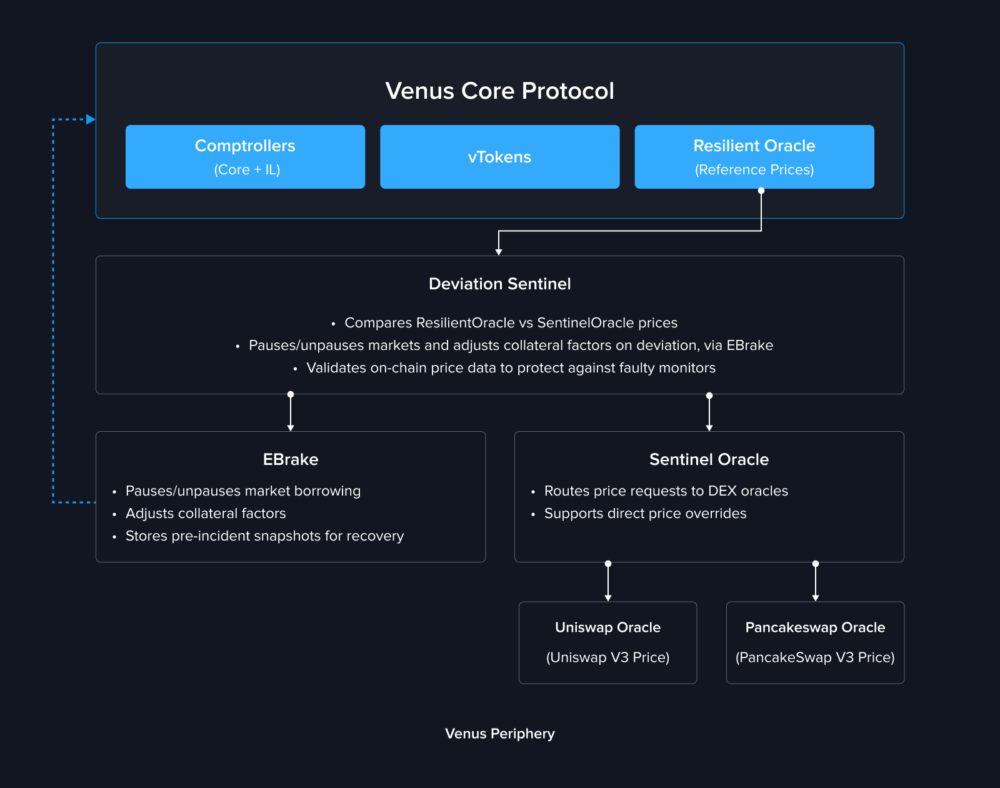

# DeviationSentinel

The DeviationSentinel is a Venus periphery contract that monitors price deviations between the ResilientOracle and a DEX-based SentinelOracle. When deviations exceed configured thresholds, it routes emergency actions through the [EBrake](ebrake.md) contract to pause market actions and zero collateral factors, protecting the protocol from price manipulation or oracle failures.

## Overview

Price oracle reliability is critical for lending protocols. A compromised or malfunctioning oracle can lead to undercollateralized borrows or improper liquidations. The DeviationSentinel mitigates this risk by continuously comparing prices from two independent sources and taking protective action when they diverge beyond acceptable limits.

The system consists of seven contracts:

| Contract                    | Description                                                                     |
| --------------------------- | ------------------------------------------------------------------------------- |
| `DeviationSentinel`         | Detects price deviations and routes emergency actions through EBrake            |
| `EBrake`                    | Executes emergency actions (pauses, CF decrease) on the Comptroller             |
| `SentinelOracle`            | Aggregator routing per-token to a DEX oracle or returning a direct price override |
| `UniswapOracle`             | Fetches prices from Uniswap V3 pools                                            |
| `PancakeSwapOracle`         | Fetches prices from PancakeSwap V3 pools                                        |
| `CurveOracle`               | Fetches prices from Curve StableSwap-NG pools via `get_dy`                      |
| `AerodromeSlipstreamOracle` | Fetches prices from Aerodrome Slipstream (CL) pools — Uniswap V3 fork           |

### Economic Rationale

The deviation response logic is designed to counter specific attack vectors that arise when oracle prices diverge from real market prices.

**When DEX Price > Oracle Price (borrow attack):**

1. Attacker deposits an asset (e.g., BNB) as collateral
2. Borrows the mispriced token at its undervalued oracle price
3. Sells the borrowed token on DEX at the higher DEX price
4. Repeats until protocol liquidity is drained

**Action:** Pause borrowing for the affected asset.

**When DEX Price < Oracle Price (collateral attack):**

1. Attacker deposits the mispriced token as collateral, valued at the higher oracle price
2. Borrows other assets up to the loan-to-value limit
3. Sells or hedges the collateral token at the lower DEX price
4. Walks away with profit if the protocol later realigns, leaving bad debt

**Action:** Set collateral factor to 0 and pause supply for the affected asset.

Pauses trigger only for large price deviations (e.g., 15%-50%), not for minor discrepancies (1%-10%), to avoid unnecessary interruptions from normal pool volatility. Small deviations are not economically viable for attackers.

### Deviation Response Logic

When a deviation is detected, the response depends on the direction:

| Condition                     | Action                                    | Rationale                                          |
| ----------------------------- | ----------------------------------------- | -------------------------------------------------- |
| Sentinel price > Oracle price  | Pause borrowing via EBrake                         | Prevents borrowing out undervalued assets          |
| Sentinel price ≤ Oracle price  | Zero collateral factor and pause supply via EBrake | Prevents supplying overvalued assets as collateral |

DeviationSentinel can only tighten restrictions. Recovery (unpausing, restoring collateral factors) is handled exclusively via a governance VIP, which calls the corresponding EBrake snapshot reset functions after restoring Comptroller parameters.

### Off-Chain Monitoring

An off-chain monitoring service continuously compares the ResilientOracle price with the on-chain price reported by the SentinelOracle for each monitored token (sourced from the configured DEX backend — Uniswap V3, PancakeSwap V3, Curve StableSwap-NG, or Aerodrome Slipstream). When the deviation exceeds a configured threshold, the monitor calls `handleDeviation` via a trusted keeper address, which routes the emergency action through EBrake to pause the affected market.

`handleDeviation` re-runs the deviation check against live on-chain prices before acting, so a compromised or faulty off-chain monitor cannot trigger a pause that the on-chain prices don't justify. Once the incident is resolved, a governance VIP restores all parameters on the Comptroller and calls the EBrake snapshot reset functions to prepare for future incidents.

## Architecture

<figure><figcaption></figcaption></figure>

Any of the four DEX-oracle backends (`UniswapOracle`, `PancakeSwapOracle`, `CurveOracle`, `AerodromeSlipstreamOracle`) can sit behind `SentinelOracle` per token, with the right backend chosen at deploy time per chain.

## Inheritance

All `DeviationSentinel`-system contracts (`DeviationSentinel`, `SentinelOracle`, `UniswapOracle`, `PancakeSwapOracle`, `CurveOracle`, `AerodromeSlipstreamOracle`) inherit from `AccessControlledV8` — every privileged setter is gated through the Venus Access Control Manager.

They all use the upgradeable initializer pattern: each constructor sets immutables and calls `_disableInitializers()`; `initialize(address accessControlManager_)` wires the ACM on the proxy after deployment.

## State Variables

### DeviationSentinel

#### Immutable

| Variable           | Type                       | Description                                                         |
| ------------------ | -------------------------- | ------------------------------------------------------------------- |
| `EBRAKE`           | `IEBrake`                  | EBrake contract through which all emergency actions are executed    |
| `RESILIENT_ORACLE` | `ResilientOracleInterface` | Primary oracle for reference prices                                 |
| `SENTINEL_ORACLE`  | `OracleInterface`          | DEX-based oracle for comparison prices                              |

#### Mutable

| Variable         | Type                                  | Description                                      |
| ---------------- | ------------------------------------- | ------------------------------------------------ |
| `tokenConfigs`   | `mapping(address => DeviationConfig)` | Deviation threshold and enabled status per token |
| `trustedKeepers` | `mapping(address => bool)`            | Addresses authorized to call `handleDeviation`   |

#### Constants

| Constant         | Value | Description                          |
| ---------------- | ----- | ------------------------------------ |
| `MAX_DEVIATION`  | 100   | Maximum configurable deviation (100%)|

#### Storage Reservation

| Variable | Type           | Description                                         |
| -------- | -------------- | --------------------------------------------------- |
| `__gap`  | `uint256[48]`  | Reserved storage slots for future upgrades (private)|

### SentinelOracle

| Variable       | Type                                  | Description                                   |
| -------------- | ------------------------------------- | --------------------------------------------- |
| `tokenConfigs` | `mapping(address => TokenConfig)`     | Maps tokens to their DEX oracle address       |
| `directPrices` | `mapping(address => uint256)`         | Direct price overrides (0 means use DEX oracle)|

### UniswapOracle / PancakeSwapOracle

| Variable          | Type                          | Description                              |
| ----------------- | ----------------------------- | ---------------------------------------- |
| `RESILIENT_ORACLE` | `ResilientOracleInterface`   | Immutable reference for pair token prices|
| `tokenPools`      | `mapping(address => address)` | Maps tokens to their DEX pool address    |

### CurveOracle

| Variable           | Type                                | Description                                  |
| ------------------ | ----------------------------------- | -------------------------------------------- |
| `RESILIENT_ORACLE` | `ResilientOracleInterface`          | Immutable reference for the reference token's USD price |
| `poolConfigs`      | `mapping(address => PoolConfig)`    | Maps each priced token to its Curve pool routing config |

### AerodromeSlipstreamOracle

| Variable           | Type                          | Description                              |
| ------------------ | ----------------------------- | ---------------------------------------- |
| `RESILIENT_ORACLE` | `ResilientOracleInterface`    | Immutable reference for pair token prices|
| `tokenPools`       | `mapping(address => address)` | Maps tokens to their Aerodrome Slipstream pool address |

## Structs

### DeviationConfig

```solidity
struct DeviationConfig {
    uint8 deviation;   // Maximum allowed deviation percentage (1-100)
    bool enabled;      // Whether monitoring is active for this token
}
```

### DeviationAction

```solidity
enum DeviationAction {
    BorrowPaused,            // Triggered when sentinel price > oracle price
    SupplyPausedAndCFZeroed  // Triggered when sentinel price <= oracle price
}
```

### TokenConfig (SentinelOracle)

```solidity
struct TokenConfig {
    address oracle;  // DEX oracle contract address
}
```

### PoolConfig (CurveOracle)

```solidity
struct PoolConfig {
    address pool;            // Curve StableSwap-NG pool
    uint8   coinIndex;       // index of the priced asset in the pool
    uint8   refCoinIndex;    // index of the reference token in the same pool
    address referenceToken;  // token whose USD price is fetched from ResilientOracle
    uint8   assetDecimals;   // decimals of the priced asset (cached to avoid a per-call STATICCALL)
}
```

# Solidity API

## DeviationSentinel

### constructor

```solidity
constructor(IEBrake eBrake_, ResilientOracleInterface resilientOracle_, OracleInterface sentinelOracle_)
```

Sets the three immutables (`EBRAKE`, `RESILIENT_ORACLE`, `SENTINEL_ORACLE`) and disables initializers on the implementation. Reverts with `ZeroAddress` if any argument is the zero address.

### initialize

```solidity
function initialize(address accessControlManager_) external initializer
```

Wires the Access Control Manager. Called once on the proxy after deployment.

---

### handleDeviation

Checks for price deviation on a market and takes protective action. This is the core function called by trusted keepers.

```solidity
function handleDeviation(IVToken market) external
```

#### Parameters

| Name   | Type    | Description                          |
| ------ | ------- | ------------------------------------ |
| market | IVToken | The vToken market to check and act on|

#### Behavior

1. Retrieves the underlying token and its deviation config
2. Calls `checkPriceDeviation` to compare oracle prices
3. Returns early if no deviation is detected (prices within configured threshold)
4. If deviation detected:
   - If sentinel price > oracle price: calls `EBRAKE.pauseBorrow(market)`
   - If sentinel price ≤ oracle price: calls `EBRAKE.decreaseCF(market, 0)` then `EBRAKE.pauseSupply(market)`
5. Emits `DeviationHandled` with the prices and the action taken

Idempotency is handled by EBrake — duplicate calls for an already-paused market are no-ops on the EBrake side.

#### Access Requirements

- Caller must be a trusted keeper

#### Errors

- `UnauthorizedKeeper` if caller is not a trusted keeper
- `MarketNotConfigured` if token has no deviation config
- `TokenMonitoringDisabled` if monitoring is disabled for the token

---

### checkPriceDeviation

View function that checks whether a market's underlying token has a price deviation exceeding its configured threshold.

```solidity
function checkPriceDeviation(
    IVToken market
) public view returns (
    bool hasDeviation,
    uint256 oraclePrice,
    uint256 sentinelPrice,
    uint256 deviationPercent
)
```

#### Parameters

| Name   | Type    | Description               |
| ------ | ------- | ------------------------- |
| market | IVToken | The vToken market to check|

#### Return Values

| Name             | Type    | Description                                      |
| ---------------- | ------- | ------------------------------------------------ |
| hasDeviation     | bool    | True if deviation exceeds the configured threshold|
| oraclePrice      | uint256 | Price from the ResilientOracle                   |
| sentinelPrice    | uint256 | Price from the SentinelOracle                    |
| deviationPercent | uint256 | Calculated deviation as a percentage             |

#### Deviation Calculation

```
deviationPercent = (|oraclePrice - sentinelPrice| / oraclePrice) * 100
```

If either price is 0, the function sets `hasDeviation` to true and `deviationPercent` to `type(uint256).max`.

---

### setTokenConfig

Configures deviation monitoring parameters for a token.

```solidity
function setTokenConfig(address token, DeviationConfig calldata config) external
```

#### Parameters

| Name   | Type            | Description                    |
| ------ | --------------- | ------------------------------ |
| token  | address         | The underlying token address   |
| config | DeviationConfig | Deviation threshold and status |

#### Access Requirements

- Governance only (via AccessControlManager)

#### Errors

- `ZeroAddress` if `token` is the zero address
- `ZeroDeviation` if `config.deviation` is 0
- `ExceedsMaxDeviation` if `config.deviation` exceeds 100

#### Events

- `TokenConfigUpdated` emitted on success

---

### setTokenMonitoringEnabled

Enables or disables deviation monitoring for a previously configured token.

```solidity
function setTokenMonitoringEnabled(address token, bool enabled) external
```

#### Parameters

| Name    | Type    | Description                      |
| ------- | ------- | -------------------------------- |
| token   | address | The underlying token address     |
| enabled | bool    | Whether monitoring should be active |

#### Access Requirements

- Governance only

#### Errors

- `ZeroAddress` if `token` is the zero address
- `MarketNotConfigured` if token has no existing config

#### Events

- `TokenMonitoringStatusChanged` emitted on success

---

### setTrustedKeeper

Adds or removes an address from the trusted keepers list.

```solidity
function setTrustedKeeper(address keeper, bool isTrusted) external
```

#### Parameters

| Name      | Type    | Description                       |
| --------- | ------- | --------------------------------- |
| keeper    | address | The keeper address                |
| isTrusted | bool    | Whether the address should be trusted |

#### Access Requirements

- Governance only

#### Errors

- `ZeroAddress` if keeper is the zero address

#### Events

- `TrustedKeeperUpdated` emitted on success

---

## SentinelOracle

### constructor

```solidity
constructor()
```

Disables initializers on the implementation. SentinelOracle has no immutables.

### initialize

```solidity
function initialize(address accessControlManager_) external initializer
```

Wires the Access Control Manager. Called once on the proxy after deployment.

---

### getPrice

Returns the price of an asset from the configured DEX oracle or a direct price override.

```solidity
function getPrice(address asset) external view returns (uint256)
```

#### Parameters

| Name  | Type    | Description              |
| ----- | ------- | ------------------------ |
| asset | address | The token address        |

#### Return Values

| Type    | Description                                       |
| ------- | ------------------------------------------------- |
| uint256 | Asset price in (36 - asset decimals) format       |

#### Price Resolution Order

1. If `directPrices[asset]` is non-zero, return it
2. Otherwise, fetch from the configured DEX oracle

#### Errors

- `TokenNotConfigured` if no oracle is configured and no direct price is set

---

### setTokenOracleConfig

Associates a token with a DEX oracle for price fetching.

```solidity
function setTokenOracleConfig(address token, address oracle) external
```

#### Parameters

| Name   | Type    | Description                  |
| ------ | ------- | ---------------------------- |
| token  | address | The underlying token address |
| oracle | address | The DEX oracle address       |

#### Access Requirements

- Governance only

#### Errors

- `ZeroAddress` if either address is zero

#### Events

- `TokenOracleConfigUpdated` emitted on success

---

### setDirectPrice

Sets a direct price override for a token. Set to 0 to revert to DEX oracle pricing.

```solidity
function setDirectPrice(address token, uint256 price) external
```

#### Parameters

| Name  | Type    | Description                                  |
| ----- | ------- | -------------------------------------------- |
| token | address | The underlying token address                 |
| price | uint256 | The price override (0 to use DEX oracle)     |

#### Access Requirements

- Governance only

#### Events

- `DirectPriceUpdated` emitted on success

---

## UniswapOracle

### constructor

```solidity
constructor(ResilientOracleInterface resilientOracle_)
```

Sets the immutable `RESILIENT_ORACLE` and disables initializers on the implementation.

### initialize

```solidity
function initialize(address accessControlManager_) external initializer
```

Wires the Access Control Manager. Called once on the proxy after deployment.

---

### getPrice

Returns the price of a token derived from its Uniswap V3 pool.

```solidity
function getPrice(address asset) external view returns (uint256)
```

#### Parameters

| Name  | Type    | Description       |
| ----- | ------- | ----------------- |
| asset | address | The token address |

#### Return Values

| Type    | Description                                 |
| ------- | ------------------------------------------- |
| uint256 | Asset price in (36 - asset decimals) format |

#### Price Calculation

1. Reads `sqrtPriceX96` from the Uniswap V3 pool's `slot0`
2. Computes `priceX96 = (sqrtPriceX96)² / Q96`
3. Determines target token position (token0 or token1)
4. Fetches the reference token price from ResilientOracle
5. Converts the pool ratio to a USD price using the reference price

#### Errors

- `TokenNotConfigured` if no pool is configured for the token
- `InvalidPool` if the configured pool does not contain the token

---

### setPoolConfig

Associates a token with a Uniswap V3 pool.

```solidity
function setPoolConfig(address token, address pool) external
```

#### Parameters

| Name  | Type    | Description                   |
| ----- | ------- | ----------------------------- |
| token | address | The underlying token address  |
| pool  | address | The Uniswap V3 pool address  |

#### Access Requirements

- Governance only

#### Errors

- `ZeroAddress` if either address is zero

#### Events

- `PoolConfigUpdated` emitted on success

---

## PancakeSwapOracle

### constructor

```solidity
constructor(ResilientOracleInterface resilientOracle_)
```

Sets the immutable `RESILIENT_ORACLE` and disables initializers on the implementation.

### initialize

```solidity
function initialize(address accessControlManager_) external initializer
```

Wires the Access Control Manager. Called once on the proxy after deployment.

---

### getPrice

Returns the price of a token derived from its PancakeSwap V3 pool. Identical behavior to `UniswapOracle.getPrice`.

```solidity
function getPrice(address asset) external view returns (uint256)
```

---

### setPoolConfig

Associates a token with a PancakeSwap V3 pool. Identical behavior to `UniswapOracle.setPoolConfig`.

```solidity
function setPoolConfig(address token, address pool) external
```

---

## CurveOracle

### constructor

```solidity
constructor(ResilientOracleInterface resilientOracle_)
```

Sets the immutable `RESILIENT_ORACLE` and disables initializers. Reverts with `ZeroAddress` if `resilientOracle_` is the zero address.

### initialize

```solidity
function initialize(address accessControlManager_) external initializer
```

Wires the Access Control Manager. Called once on the proxy after deployment.

---

### getPrice

Returns the price of a token derived from its configured Curve StableSwap-NG pool.

```solidity
function getPrice(address asset) external view returns (uint256)
```

#### Parameters

| Name  | Type    | Description       |
| ----- | ------- | ----------------- |
| asset | address | The token address |

#### Return Values

| Type    | Description                                 |
| ------- | ------------------------------------------- |
| uint256 | Asset price in (36 - asset decimals) format |

#### Price Calculation

1. Reads `dy = pool.get_dy(coinIndex, refCoinIndex, 10**assetDecimals)` — instantaneous swap output for one unit of the asset, reflecting the current pool state (including any active manipulation).
2. Fetches the reference token's USD price `refPriceUsd` from ResilientOracle.
3. Computes `price = dy * refPriceUsd / 10**assetDecimals`.

`refDecimals` cancels out of the formula, so only `assetDecimals` is needed at call time. It is cached in the `PoolConfig` at setup time to avoid an extra STATICCALL per `getPrice`.

#### Errors

- `TokenNotConfigured` if no pool is configured for the asset
- `ZeroPrice` if `get_dy` returns 0

---

### setPoolConfig

Associates a token with a Curve StableSwap-NG pool and its reference-token routing.

```solidity
function setPoolConfig(
    address token,
    address pool,
    uint8 coinIndex,
    uint8 refCoinIndex,
    address referenceToken,
    uint8 assetDecimals
) external
```

#### Parameters

| Name           | Type    | Description                                                    |
| -------------- | ------- | -------------------------------------------------------------- |
| token          | address | The token to price                                             |
| pool           | address | The Curve StableSwap-NG pool                                   |
| coinIndex      | uint8   | Index of `token` in the pool's coins array                     |
| refCoinIndex   | uint8   | Index of `referenceToken` in the same pool                     |
| referenceToken | address | The pool's other coin, whose USD price is fetched from ResilientOracle |
| assetDecimals  | uint8   | Decimals of `token` (cached to avoid a per-call STATICCALL)    |

#### Access Requirements

- Governance only

#### Errors

- `ZeroAddress` if `token`, `pool`, or `referenceToken` is the zero address
- `AssetMismatch` if `pool.coins(coinIndex) != token`
- `ReferenceMismatch` if `pool.coins(refCoinIndex) != referenceToken`

#### Events

- `PoolConfigUpdated(token, pool, coinIndex, refCoinIndex, referenceToken, assetDecimals)` emitted on success

---

## AerodromeSlipstreamOracle

### constructor

```solidity
constructor(ResilientOracleInterface resilientOracle_)
```

Sets the immutable `RESILIENT_ORACLE` and disables initializers on the implementation.

### initialize

```solidity
function initialize(address accessControlManager_) external initializer
```

Wires the Access Control Manager. Called once on the proxy after deployment.

---

### getPrice

Returns the price of a token derived from its configured Aerodrome Slipstream pool.

```solidity
function getPrice(address asset) external view returns (uint256)
```

#### Price Calculation

Aerodrome Slipstream is a concentrated-liquidity AMM (Uniswap V3 fork). Its `slot0()` returns six values (no `feeProtocol` field), so the pool ABI is incompatible with `IUniswapV3Pool`, but the price-derivation math is otherwise identical:

1. Reads `sqrtPriceX96` from the pool's `slot0()`.
2. Computes `priceX96 = (sqrtPriceX96)² / Q96`.
3. Determines target token position (token0 or token1).
4. Fetches the reference token price from ResilientOracle.
5. Converts the pool ratio to a USD price using the reference price.

Uses the current `slot0` price (no TWAP). Suitable for sentinel deviation detection where some manipulation tolerance is acceptable.

#### Errors

- `TokenNotConfigured` if no pool is configured for the token
- `InvalidPool` if the configured pool does not contain the token

---

### setPoolConfig

Associates a token with an Aerodrome Slipstream pool. Identical behavior to `UniswapOracle.setPoolConfig`.

```solidity
function setPoolConfig(address token, address pool) external
```

#### Errors

- `ZeroAddress` if either address is zero

#### Events

- `PoolConfigUpdated` emitted on success

---

## Events

### DeviationSentinel Events

| Event                          | Parameters                                        | Description                                               |
| ------------------------------ | ------------------------------------------------- | --------------------------------------------------------- |
| `TokenConfigUpdated`           | token, config                                     | Deviation config set for a token                          |
| `TokenMonitoringStatusChanged` | token, enabled                                    | Monitoring toggled for a token                            |
| `TrustedKeeperUpdated`         | keeper, isTrusted                                 | Keeper added or removed                                   |
| `DeviationHandled`             | market, oraclePrice, sentinelPrice, action        | Deviation detected and acted on; `action` is a `DeviationAction` enum value |

Pause and collateral factor events are now emitted by EBrake (`ActionPaused`, `CollateralFactorDecreased`) rather than by DeviationSentinel directly.

### SentinelOracle Events

| Event                      | Parameters     | Description                       |
| -------------------------- | -------------- | --------------------------------- |
| `TokenOracleConfigUpdated` | token, oracle  | Token associated with DEX oracle  |
| `DirectPriceUpdated`       | token, price   | Direct price override set         |

### UniswapOracle / PancakeSwapOracle / AerodromeSlipstreamOracle Events

| Event              | Parameters   | Description                                |
| ------------------ | ------------ | ------------------------------------------ |
| `PoolConfigUpdated`| token, pool  | Token associated with a DEX pool (V3 / Slipstream) |

### CurveOracle Events

| Event              | Parameters                                                            | Description                              |
| ------------------ | --------------------------------------------------------------------- | ---------------------------------------- |
| `PoolConfigUpdated`| token, pool, coinIndex, refCoinIndex, referenceToken, assetDecimals   | Token associated with a Curve pool route |

## Security Considerations

### Access Control

- **Governance Functions**: All configuration functions (`setTokenConfig`, `setTrustedKeeper`, `setTokenMonitoringEnabled`) are restricted via `AccessControlManager`
- **Keeper Functions**: `handleDeviation` is restricted to trusted keepers via the `onlyKeeper` modifier
- **Direct Price Overrides**: The `setDirectPrice` function on `SentinelOracle` is governance-controlled to prevent price manipulation

### Separation of Detection and Execution

DeviationSentinel contains only detection logic. All Comptroller interactions (pausing, CF changes) are executed by EBrake. This means:

- A compromised keeper can only trigger EBrake actions, not call the Comptroller directly
- EBrake enforces its own "tighten only" invariant independently — the sentinel cannot unpause or restore CF even if its logic were modified
- Pre-incident state snapshots (original CF, borrow caps, supply caps) are tracked by EBrake, not DeviationSentinel

### Recovery

Recovery from a sentinel-triggered freeze requires a governance VIP that:
1. Restores Comptroller parameters (unpause actions, restore CF)
2. Calls the appropriate EBrake snapshot reset functions (`resetCFSnapshot`, `resetBorrowCapSnapshot`, `resetSupplyCapSnapshot`) to clear the stored snapshots

### Custom Errors

Per-contract reference of revert reasons:

| Contract                    | Errors                                                                                              |
| --------------------------- | --------------------------------------------------------------------------------------------------- |
| `DeviationSentinel`         | `ZeroAddress`, `ZeroDeviation`, `ExceedsMaxDeviation`, `UnauthorizedKeeper`, `MarketNotConfigured`, `TokenMonitoringDisabled` |
| `SentinelOracle`            | `ZeroAddress`, `TokenNotConfigured`                                                                 |
| `UniswapOracle`             | `ZeroAddress`, `InvalidPool`, `TokenNotConfigured`                                                  |
| `PancakeSwapOracle`         | `ZeroAddress`, `InvalidPool`, `TokenNotConfigured`                                                  |
| `CurveOracle`               | `ZeroAddress`, `TokenNotConfigured`, `AssetMismatch`, `ReferenceMismatch`, `ZeroPrice`              |
| `AerodromeSlipstreamOracle` | `ZeroAddress`, `InvalidPool`, `TokenNotConfigured`                                                  |

## Deployment

See [Deployed Contracts](../../deployed-contracts/periphery.md) for current addresses.

## Audits

DeviationSentinel undergoes security audits before mainnet deployment. Audit reports are available in the [venus-periphery repository](https://github.com/VenusProtocol/venus-periphery/tree/main/audits).
