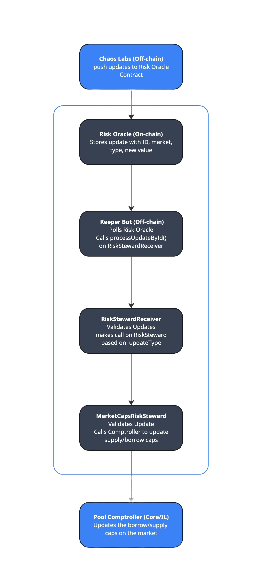

# Risk Steward

## Overview

The Risk Stewards system introduces a secure and modular mechanism for automatically updating borrow and supply caps in the Venus Protocol. In the earlier model, these risk parameters were modified manually via governance proposals (VIPs). This new architecture eliminates manual intervention by enabling fully on-chain, automated updates.

In this updated model, **Chaos Labs provides risk parameter updates through their on-chain Risk Oracle**. These updates are delivered directly to dedicated steward contracts, such as `MarketCapsRiskSteward`, which are responsible for applying the changes to the protocol.

All updates are executed through a central router contract, `RiskStewardReceiver`, which ensures:

- Only pre-approved steward contracts are allowed to execute logic
- Updates adhere to protocol-defined rules such as:
  - Debounce periods between consecutive updates
  - Maximum allowable percentage change in parameters
  - Access control enforced through Venus’s `AccessControlManager`

This architecture enables faster response to market dynamics while maintaining the safety and integrity of the protocol’s core risk parameters.

---

## Contracts and Responsibilities

### 1. `RiskStewardReceiver.sol`

### Purpose

The `RiskStewardReceiver` contract acts as the **central entry point for processing on-chain risk parameter updates** in the Venus Protocol. It integrates directly with the **Chaos Labs Risk Oracle**, pulling risk recommendations (like borrow/supply caps) and forwarding them to the appropriate **RiskSteward** contract (e.g., `MarketCapsRiskSteward`) for enforcement.

Its key role is to:
- **Validate**, **deduplicate**, and **throttle** risk updates,
- And **delegate the actual update execution** to the appropriate steward contract responsible for enforcing specific risk parameter types.

This contract enables a **modular and secure pipeline** for processing real-time risk recommendations on-chain.

---

### Key Responsibilities

- **Oracle Integration**:  
  Directly reads data from the `IRiskOracle`, which provides structured `RiskParameterUpdate` records.

- **Per-Type Configuration**:  
  Maintains a `riskParameterConfigs` mapping to register:
  - Which `updateType` is supported,
  - Which steward contract should handle it,
  - What debounce period (minimum time between updates) is enforced.

- **Validation Checks Before Processing**:  
  Before an update is executed, the contract validates that:
  - The update type is **active** (`ConfigNotActive`)
  - The update is **not expired** (`UpdateIsExpired`)
  - The update has **not already been processed** (`ConfigAlreadyProcessed`)
  - The **debounce period** since the last update has passed (`UpdateTooFrequent`)

- **Processing Updates**:
  Provides two ways to trigger an update:
  1. `processUpdateById(updateId)`
  2. `processUpdateByParameterAndMarket(updateType, market)`
  
  Both functions:
  - Fetch the update from the risk oracle
  - Validate its status
  - Delegate the update execution to the configured `IRiskSteward` contract

- **State Tracking**:
  - `lastProcessedTime`: Tracks last update per `(market + updateType)` to enforce debounce period
  - `processedUpdates`: Marks updates that have already been processed, preventing replay

- **Governance and Controls**:
  - Uses `AccessControlledV8` to restrict who can:
    - Set or modify risk configs
    - Pause or unpause the contract
  - Can be paused to halt all update processing using OpenZeppelin’s `PausableUpgradeable`

---

### 2. `MarketCapsRiskSteward.sol`

The `MarketCapsRiskSteward` contract is responsible for **processing supply cap and borrow cap updates** for Venus markets. These updates originate from the `RiskStewardReceiver`, which itself receives on-chain recommendations from the Chaos Labs Risk Oracle.

This contract **does not fetch or validate updates directly**. Instead, it:
- **Receives validated updates** delegated by the `RiskStewardReceiver`
- **Performs delta checks** to ensure caps are within allowed bounds
- **Writes new cap values** into the correct pool comptroller (either Core or Isolated)
- Emits events for transparency and downstream indexing

---

### Key Responsibilities

- **Parameter Enforcement**  
  Applies updates only for:
  - `supplyCap`
  - `borrowCap`

- **Source Validation**  
  Ensures updates can only be executed by the trusted `RiskStewardReceiver`.  
  → Any direct call from an external or malicious contract is rejected (`OnlyRiskStewardReceiver`).

- **Delta Bounding**  
  Before updating any cap, the new value is validated against the previous cap. The change is only allowed if it’s within the `maxDeltaBps` (basis points) threshold.  
  → Ensures the system remains stable and avoids drastic risk shifts (`UpdateNotInRange`).

- **Governance Access**  
  `AccessControlledV8` is used to restrict who can:
  - Set the `maxDeltaBps`
  - Initialize the contract

---

## End-to-End Flow: Market Cap Update via Risk Stewards 

This example walks through a complete end-to-end flow where **Chaos Labs** updates a **borrow cap** for a market using the on-chain risk oracle, and the change is processed securely through the steward contracts.

### Roles

| Role | Description |
|------|-------------|
| Chaos Labs | Publishes risk parameter updates on-chain via a Risk Oracle |
| Keeper Bot | External off-chain agent responsible for calling the RiskStewardReceiver to apply updates |
| RiskStewardReceiver | Central processor that validates updates and routes them to the correct steward |
| MarketCapsRiskSteward | Applies validated supply/borrow cap updates to the appropriate pool comptroller |

---

### Example Scenario

Chaos Labs recommends updating the **borrow cap** for the USDC market (`vUSDC`) from **5,000,000** to **6,000,000** tokens.

---

### Step-by-Step Execution

#### 1. **Chaos Labs Publishes an Update On-Chain**

Chaos Labs publishes the following to the on-chain **Risk Oracle** contract:

```json
{
  "updateId": 101,
  "market": "0x...vUSDC",
  "updateType": "borrowCap",
  "newValue": 6000000,
  "timestamp": 1721036000,
  "additionalData": "<encoded underlyingAddress/chainId>"
}
```

This update is stored in the oracle contract and made available via `getUpdateById(updateId)`.

---

#### 2. **Keeper Bot Detects the Update and Calls `processUpdateById`**

A **Keeper Bot** regularly polls the Risk Oracle and calls:

```solidity
riskStewardReceiver.processUpdateById(101);
```

---

#### 3. **RiskStewardReceiver Validates the Update**

Upon receiving the call, `RiskStewardReceiver` performs **strict validations**:

- ✅ Checks that the update is the **latest** from the oracle for the given market and type  
- ✅ Validates the update is **active** in config (`ConfigNotActive`)  
- ✅ Verifies it is **not expired** (timestamp + 1 day > now) (`UpdateIsExpired`)  
- ✅ Ensures it is **not already processed** (`ConfigAlreadyProcessed`)  
- ✅ Ensures **debounce interval** has passed for the `(market + updateType)` pair (`UpdateTooFrequent`)

If any check fails, the transaction reverts with the corresponding error.

---

#### 4. **Update is Routed to MarketCapsRiskSteward**

Once the update passes all validations, the RiskStewardReceiver uses the updateType to determine which RiskSteward contract should handle it, and delegates the update to MarketCapsRiskSteward:

```solidity
        IRiskSteward(riskParameterConfigs[update.updateType].riskSteward).processUpdate(update);
```

Here, the steward performs:

- ✅ Validates that the `msg.sender` is `RiskStewardReceiver` (`OnlyRiskStewardReceiver`)
- ✅ Confirms that `updateType` is either `supplyCap` or `borrowCap` (`UnsupportedUpdateType`)
- ✅ Retrieves the current cap from the comptroller and validates that the new cap change is within the allowed delta range defined by `maxDeltaBps`:
- ✅ Writes the new cap into the pool comptroller:
- ✅ Emits `BorrowCapUpdated(market, newCap)` for downstream indexing
- ✅ Applies the update to the pool’s comptroller, by directly making a call to the appropriate setter function: 
`comptroller.setMarketSupplyCaps(newSupplyCapMarkets, newSupplyCaps)`

---

#### 5. **Update State is Committed**

Once the steward call completes:

- The update ID is marked as **processed**
- The `(market + updateType)` debounce timer is updated with the current block time
- `RiskParameterUpdated(updateId)` is emitted

---

### Failure Scenarios

| Scenario | Failure Trigger | Result |
|----------|-----------------|--------|
| Keeper calls too late (e.g. after 24h) | `UpdateIsExpired` | Revert |
| Keeper tries again for same ID | `ConfigAlreadyProcessed` | Revert |
| Another update was already applied for the same market+type | `UpdateIsExpired` | Revert |
| Debounce timer has not passed | `UpdateTooFrequent` | Revert |
| Chaos Labs sets too large a delta | `UpdateNotInRange` | Revert |
| Cap type is misspelled | `UnsupportedUpdateType` | Revert |
| Non-receiver tries to call steward | `OnlyRiskStewardReceiver` | Revert |

---

<figure><figcaption>riskSteward</figcaption></figure>

## Limitations

While the Risk Steward system enables secure and automated updates to certain risk parameters, there are important limitations to keep in mind:

### 1. Bypasses On-Chain Governance

This architecture allows updates (e.g., supply and borrow caps) to be applied automatically, without going through the formal governance process.

- Critical parameters such as collateral factors, liquidation thresholds, and reserve factors are intentionally excluded.
- These parameters are considered sensitive and must be proposed and approved through governance (via Venus Improvement Proposals or VIPs) to ensure proper transparency and community review.

### 2. No Cross-Chain Initiation Support

The current design supports only same-chain update processing.

- Updates on a specific chain can only be processed if a Risk Oracle is deployed and supported on that chain..
- For operational efficiency and monitoring, it would be beneficial to register or reflect these updates on BNB Chain, where monitoring systems and automation (such as keeper bots) are primarily active.

