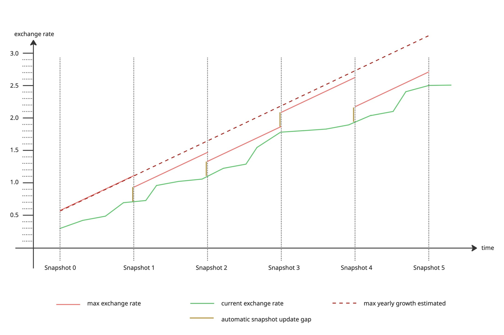

# Capped Oracles

Some assets, such as Liquid Staking Tokens (LSTs), are closely tied to an underlying asset, often featuring an added growth component.

The exchange rate between an asset and its underlying is typically sourced from an onchain smart contract, which can be susceptible to manipulation. A capped oracle is a design mechanism that mitigates potential losses from such manipulation by limiting the rate at which the exchange rate is allowed to grow.

The capped oracle mechanism should be used for any asset whose price is derived through an intermediary token, where the exchange rate between the source asset and the intermediary is fetched onchain and includes a growth component.

At a high level, the capped oracle determines the maximum allowable exchange rate at the queried block based on a predefined growth rate. It then compares this with the current onchain exchange rate, and if the current rate exceeds the calculated maximum, it caps it to that maximum value.

Typically, the current maximum exchange rate at a given block is calculated by taking a historical exchange rate from a past block and applying a predefined per-second growth rate up to the current block timestamp. However, since the exchange rate may not grow consistently over time, the historical reference rate is periodically updated to ensure a more accurate and reliable maximum exchange rate. 

<figure><figcaption>Capped Oracle</figcaption></figure>

The historical reference rate is periodically refreshed through a process called snapshotting. During this process, the new reference rate is set to the lower of the current onchain exchange rate or the maximum rate derived from the previous reference rate, helping maintain a more accurate and robust cap. Before querying an asset’s price from the capped oracle, the consumer should trigger the snapshotting process—if the configured interval has elapsed, a new snapshot will be taken.

The capped exchange rate between intervals is constrained by a per-second growth limit. However, since the actual exchange rate may exceed this cap, we inflate the snapshotted exchange rate by a predefined buffer to avoid imposing a hard limit.

## Configuration

The following configuration needs to be defined when configuring the capped oracle for a token:

* Annual Growth Rate: This defines the maximum growth in exchange rate per year. Internally this is converted to growth rate per second.
* Snapshot Interval: After the number of seconds window at which the reference exchange rate is recalculated, 
* Initial Snapshot Exchange Rate and Timestamp: Defines the initial reference exchange rate and the timestamp at which the exchange rate is taken from. 
* Snapshot Gap: Used to define the inflation of the exchange rate at each snapshot. 

Note that all the above variables values can be updated using the governance process after the deployment with the initial values. 