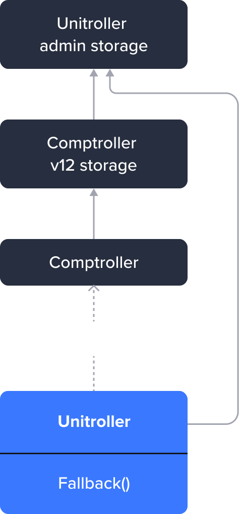

# Core pool Diamond Comptroller

As features continued to be introduced to the Core Pool Comptroller contract, it grew to exceed the [maximum allowable size of 24KB](https://eips.ethereum.org/EIPS/eip-170). In response to this challenge and to preemptively address similar issues in the future, a multifaceted diamond pattern was implemented.

The original comptroller was refactored using the [EIP-2535](https://eips.ethereum.org/EIPS/eip-2535) diamond pattern into distinct facets. This restructuring aligns the storage layout with that of the Comptroller proxy, streamlining the contract's organization and enhancing efficiency. As a consequence  user interactions now trigger two delegate calls.

## Venus Comptroller - Refactored to EIP 2535

The previous implementation of Venus used a transparent upgrade proxy delegate pattern. For the diamond proxy we needed a slightly different implementation of fallback function.

- Comptroller proxy(Unitroller): https://bscscan.com/address/0xfd36e2c2a6789db23113685031d7f16329158384
- Comptroller implementation before enabling the Diamond Proxy:  https://bscscan.com/address/0x909dd16b24cef96c7be13065a9a0eaf8a126ffa5

The following diagram shows the previous design:    

<figure><figcaption></figcaption></figure>

The Unitroller contract delegated calls to the Comptroller. The Comptroller had the storage layout defined by ComptrollerV12Storage, which extended the UnitrollerAdminStorage.

## EIP - 2535 Overview

The Diamond Proxy pattern is widely used in Solidity development for its ability to separate concerns and improve code maintainability. It is often used in complex contracts that require multiple facets with shared functionality.

1. The Diamond Proxy pattern involves creating a "proxy" contract that acts as a single entry point for all functionality shared by multiple contracts. This allows contracts to share functionality without having to duplicate code in each contract.

2. Each contract that needs to share functionality with the proxy contract is referred to as a "facet." Facets are separate contracts that can be upgraded or modified independently of each other and the proxy contract.

3. The proxy contract delegates function calls to the correct facet contract based on the function selector. This allows the proxy contract to act as a single entry point for all shared functionality.

4. The Diamond Proxy pattern also supports multiple inheritances. This means that each facet can inherit from other contracts, including other facets. This allows for a high degree of code reuse and modular design.

## Enabling Venus Integration with the existing Unitroller - Diamond and Transparent proxy combination

**Step 1:** The first step was creating the Diamond proxy contract. This contract contains a mapping to hold the addresses of the facet contracts and a fallback function that delegates the function call to the appropriate facet. 

Chained delegate calls are used. This means calldata is delegated from Unitroller to the Diamond contract and then a chained delegate call is made to a specific facet based on the function selector.

<figure><figcaption></figcaption></figure>

The Diamond contract checks for the facet address in the **selectors-to-facet-address** mapping (`_selectorToFacetAndPosition` internal variable) and then makes a delegate call to that facet address. Facets inherit the ComptrollerStorage (ComptrollerV13Storage) to access the state.

**Step 2:** Division of the comptroller into multiple facets based on separation of concerns.

Generally [AppStorage](https://eips.ethereum.org/EIPS/eip-2535#storage) is used with the diamond pattern. Since the Core Pool contracts still use Solidity 0.5.16 this wasn't an option and storage is handled using the same pattern as the original comptroller, by inheriting storage contracts.

Comptroller storage contains the facet addresses, mapping of the function selectors to the facet address, and mapping of all selectors to the facet address.

## User interaction with new diamond pattern

Users will continue to interact with the Unitroller proxy contract same as before with one significant difference.  Now the Diamond proxy serves as the implementation contract for the Unitroller, and the Comptroller's implementation has been divided into multiple facets. These facets will function as the various components of the Diamond proxy.

Following a user's interaction with the Unitroller, the `delegateCall` operation will be directed towards the Diamond proxy. Once the `delegateCall` reaches the Diamond proxy, it will analyze the function selector and determine the appropriate facet address to which the `delegateCall` will be forwarded.

## How will new Upgrades work?
**Scenario:** A new state variable is to be introduced for an upgrade, which is being used by all or few facets.

Add a new state variable in the `comptrollerStorage` by extending the storage to `ComptrollerV14Storage` just like  new state is added to facets by extending the previous storage.

**Scenario:** Add a new facet to the Diamond or update the existing facet by add/replace/remove function selectors.

Deploy the facet with the functions/methods that need to be added to the Comptroller Implementation.

Execute the `diamondCut` method(admin access) to add the new facet to the `comptrollerStorage`.

To execute the `diamondCut` through VIP, the cut argument can be generated using the facet-[cut-params-generator script](https://github.com/VenusProtocol/venus-protocol/blob/develop/script/deploy/comptroller/facet-cut-params-generator.ts) by customizing the `generateCutParams` to provide the correct actions on the provided function seletors.

## Diamond proxy implementation for Core Pool Comptroller
The Comptroller of the core pool is divided into 4 facets and 2 parent contracts extended by the facets. Facets will receive the function call through a chained delegateCall from Unitroller, and each facet holds its own responsibility as explained below:

### Facets
**[PolicyFacet](../reference-core-pool/comptroller/Diamond/Facets/PolicyFacet.md):** This facet contains all the external pre-hook functions related to vToken.

**[SetterFacet](../reference-core-pool/comptroller/Diamond/Facets/SetterFacet.md):** This facet contains all setter configuration functions.

**[MarketFacet](../reference-core-pool/comptroller/Diamond/Facets/MarketFacet.md):** This facet provides market information including account activity in the market. It is also responsible for entering and exiting the market.

**[RewardFacet](../reference-core-pool/comptroller/Diamond/Facets/RewardFacet.md):** This facet provides the external functions related to all claims and rewards of the protocol.

### Parent contracts
**[FacetBase](../reference-core-pool/comptroller/Diamond/Facets/FacetBase.md):** This contract contains functions related to access and checks.

**XVSRewardsHelper:** This contract contains the shared functions used by the RewardFacet and PolicyFacet.

The following diagram shows the inheritance and association relationships among the different contracts:

<figure><figcaption></figcaption></figure>