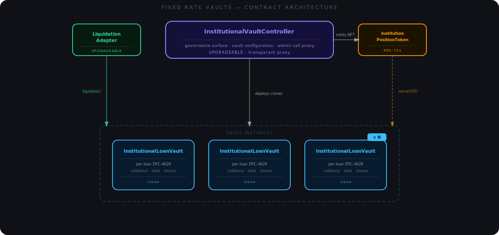

# Fixed Term Vaults

A Fixed Term Vault is a two-party, fixed-term loan between an institution and a pool of on-chain suppliers. The institution borrows a stablecoin against crypto collateral at a rate and duration agreed at vault creation. Suppliers commit capital during a short fundraising window; at maturity they redeem their shares for principal plus the fixed interest, regardless of market conditions between entry and settlement.

Each vault is a fully isolated contract clone — its own collateral, its own debt, its own supplier shares. A default, liquidation, or governance action in one vault has zero effect on any other vault or on Venus core markets.

## Architecture

### Contracts

The system is composed of four contracts. Each vault is an independent clone deployed by the controller — there is no shared state between loans.

<figure><figcaption><p>The controller deploys a fresh vault clone and mints a position NFT per loan; all liquidation calls are routed through the LiquidationAdapter</p></figcaption></figure>

**[InstitutionalVaultController](../reference-fixed-rate-vaults/institutional-vault-controller.md)** is the sole factory and the only conduit through which any admin operation reaches a vault. It deploys each vault clone and mints the corresponding position NFT in the same transaction. It also exposes the ACM-gated lifecycle calls (`openVault`, `cancelVault`, `partialPauseVault`, `completePauseVault`, `unpauseVault`, `closeVault`) and risk-parameter updates that governance invokes separately over the life of each vault. All ACM permission checks are enforced here — individual vaults carry no ACM wiring and trust calls from the controller implicitly. Deployed behind a transparent proxy, so governance policy can be updated without touching live contracts.

**[InstitutionalLoanVault](../reference-fixed-rate-vaults/institutional-loan-vault.md)** is the core execution contract for a single loan. It holds all assets — collateral and supply stablecoin — enforces the `VaultState` machine, and is the only place debt is created, tracked, and cleared. Suppliers interact through the standard ERC-4626 interface (`deposit`, `mint`, `withdraw`, `redeem`); institution-side calls (`depositCollateral`, `claimRaisedFunds`, `withdrawCollateral`) are gated by `onlyPositionHolder`; liquidation entry points are gated by `onlyLiquidationAdapter`. Each vault is deployed as an EIP-1167 minimal proxy clone — non-upgradeable and single-use. Its rules are immutable from the moment it goes live, and renewing a deal always means deploying a fresh clone rather than resetting an existing one.

**[InstitutionPositionToken](../reference-fixed-rate-vaults/institution-position-token.md)** is a singleton ERC-721 shared across all vaults — one contract, one token ID per vault. Whoever holds a given token ID controls all institution-side operations on that vault, since `depositCollateral`, `claimRaisedFunds`, and `withdrawCollateral` all resolve to `positionToken.ownerOf(positionTokenId)` at call time. Keeping ownership in a transferable NFT rather than hardcoded in the vault means control can move to a new address without any state change inside the vault itself. Every transfer requires a prior single-use governance approval via `approvePositionTransfer(vault, recipient)`, consumed on the next `safeTransferFrom`.

**[LiquidationAdapter](../reference-fixed-rate-vaults/liquidation-adapter.md)** is the only address permitted to call `vault.liquidate()`, enforced by `onlyLiquidationAdapter` on each vault. The vault itself does one thing: check whether the health factor permits liquidation. Everything else — who is allowed to liquidate, how much they can seize, at what incentive rate, and what share goes to the protocol — is owned entirely by the adapter. Whitelisted liquidators and overdue settlers are registered here via two independent ACM-gated lists. Parameters like `closeFactor` and `protocolLiquidationShare` live here too, meaning governance can tune liquidation behaviour across the entire system without touching any deployed vault. The adapter also accumulates the protocol's share of seized collateral and transfers it to PSR via `sweepProtocolShareToReserve(address collateral)`.

### BaseVault, ERC-4626, and extensibility

`InstitutionalLoanVault` inherits `BaseVault`, an abstract contract built on top of ERC-4626 that was designed to be reusable across different kinds of fixed-term vault. `BaseVault` captures everything that any such vault has in common — fundraising, interest computation, the settlement waterfall, state machine scaffolding, and the pause system — so a new vault type only has to implement what is specific to its loan structure. Future vault types follow the same pattern: inherit `BaseVault`, override its three virtual hooks (`_checkAndAdvanceState`, `_afterWithdrawHook`, `_beforeClaimRaisedFunds`), and add the remaining type-specific logic on top.

ERC-4626 is used as the supplier-facing API, but several methods deviate from the specification to enforce lifecycle constraints:

| Method | Standard behaviour | Vault behaviour |
| --- | --- | --- |
| `deposit` | Always open; reverts on cap breach | Only in `Fundraising`; excess silently clamped to remaining cap, not reverted |
| `mint` | Always open; reverts on cap breach | Only in `Fundraising`; excess silently clamped |
| `withdraw` | Available any time (subject to balance) | Only in terminal states (`Matured`, `Failed`, `Liquidated`) |
| `redeem` | Available any time (subject to balance) | Only in terminal states |
| `maxDeposit` | Returns `type(uint256).max` | Returns `maxBorrowCap − totalRaised`; zero outside `Fundraising` |
| `maxWithdraw` | Returns asset value of shares | Zero outside terminal states |
| `maxRedeem` | Returns `balanceOf(owner)` | Zero outside terminal states |
| `totalAssets` | Returns live underlying balance | Returns `totalRaised` pre-terminal; switches to `settlementAmount` once settled |

`totalAssets()` is backed by internal accounting variables (`totalRaised` and `settlementAmount`) rather than `balanceOf(address(this))`. Tokens sent directly to the vault address have no effect on the share price, which removes the donation-based inflation attack that affects naive ERC-4626 implementations.

`minSupplierDeposit` adds a minimum deposit floor absent from the spec. The floor is waived for the final deposit that fills the remaining capacity exactly, preventing the vault from getting permanently stuck below `maxBorrowCap` when the residual slot is smaller than the minimum. Fee-on-transfer and rebasing tokens are not supported for either the supply asset or collateral.

### Oracle

All USD valuations in the system route through Venus `ResilientOracle`. The vault calls `oracle.getPrice(asset)`, which returns a price scaled to `36 − asset.decimals()` decimal places — always expressed as an 18-decimal USD value per token unit regardless of the token's own decimals. A zero price reverts with `InvalidOraclePrice`.

Both the supply asset and the collateral asset must have a non-zero oracle price at vault creation. The controller probes the oracle during `createVault` and reverts with `InvalidConfig` if either price is missing. This prevents a vault from entering price-dependent states — liquidation checks, claim validation, bad-debt detection — with an asset the oracle cannot price.

## State machine

The vault tracks lifecycle as a `VaultState` enum. Transitions are monotonic — no state ever goes backward. Every non-view entry point calls `_checkAndAdvanceState()` before its own logic, so state advances automatically on the first relevant call after a trigger condition is met. All transitions after `openVault` are automatic — no governance call is needed to move the vault from `Fundraising` through `Lock`, `PendingSettlement`, and into a terminal state. For cases where no interaction is pending but conditions for a transition are already met, anyone can call `updateVaultState()` to advance the state explicitly.

<figure><figcaption><p>State transitions are monotonic — no state ever goes backward. Dashed red paths show cancel and failure routes; the grey arrows at the bottom show all three terminal states collapsing into Closed via <code>closeVault()</code></p></figcaption></figure>

## Core mechanics

### Margin deposit

Before suppliers can interact, the institution must post a security deposit — the required margin — in a single `depositCollateral` call. It acts as a credible commitment: the institution either tops up collateral to `idealCollateralAmount` before fundraising closes or forfeits the margin to suppliers. The vault stays in `WaitingForMargin` until this condition is met:

$$\text{requiredMargin} = \text{idealCollateralAmount} \times \frac{\text{marginRate}}{10^{18}}$$

Once `totalCollateralDeposited ≥ requiredMargin` the vault advances to `MarginDeposited`, where it waits for governance to inspect the configuration and call `openVault()` to open the fundraising window.

### Fundraising

`deposit` and `mint` are permissionless during `Fundraising`. Unlike standard ERC-4626, both calls silently clamp to remaining capacity (`maxBorrowCap - totalRaised`): a `deposit` that exceeds the cap fills the residual and mints fewer shares than requested, rather than reverting. `minSupplierDeposit` is enforced on every call except one that fills or exceeds the remaining capacity — because the residual may be smaller than the minimum, skipping the check on that deposit prevents the vault from being permanently stuck below `maxBorrowCap`. Share tokens are standard ERC-20s, freely transferable at all times.

At `fundraisingEndTime` both sides are evaluated simultaneously. If `totalRaised ≥ minBorrowCap` and `totalCollateralDeposited ≥ idealCollateralAmount` the vault transitions to `Lock` and the loan begins.

If either condition is not met, the vault transitions to `Failed`. Two distinct failure modes are possible, distinguished by `InstitutionalRuntime.institutionDefaulted`:

**Raise shortfall** (`totalRaised < minBorrowCap` at window close). `institutionDefaulted = false`. No default has occurred; suppliers recover full principal and the institution recovers all collateral including the margin.

**Collateral underdelivery** (`totalRaised ≥ minBorrowCap` but `totalCollateralDeposited < idealCollateralAmount` at window close). `institutionDefaulted = true`. Only the pre-determined margin is confiscated, not the institution's full collateral position. `confiscatedMargin` is set to exactly `requiredMargin`:

$$\text{requiredMargin} = \text{idealCollateralAmount} \times \frac{\text{marginRate}}{10^{18}}$$

Suppliers recover principal plus a pro-rata share of `confiscatedMargin` (see [Margin confiscation](#margin-confiscation-collateral-underdelivery) for the per-redemption distribution). The institution recovers `totalCollateralDeposited - confiscatedMargin`.

#### Margin confiscation: collateral underdelivery

When the vault fails via collateral underdelivery, `confiscatedMargin = requiredMargin`. Each `withdraw` / `redeem` triggers `_afterWithdrawHook`, which distributes a pro-rata slice of the remaining confiscated margin:

$$\text{compensation} = \text{confiscatedMarginRemaining} \times \frac{\text{shares}}{\text{totalSupplyBeforeBurn}}$$

Compensation is denominated in the **collateral asset** (e.g. BTC or ETH), not the supply stablecoin. `confiscatedMarginRemaining` decrements on every redemption, so early redeemers and late redeemers receive the same proportion.

### Lock entry and borrowing

When the vault transitions to `Lock`, two values are fixed for the lifetime of the loan:

**Total interest** is stored immediately as `totalDebt` and is owed in full regardless of when the institution repays — there is no early-repayment discount:

$$\text{totalInterest} = \frac{\text{totalRaised} \times \text{fixedAPY} \times \text{lockDuration}}{\text{BPS} \times \text{YEAR}}$$

`BPS = 10000`, `YEAR = 365 days`. `totalDebt = totalInterest` at lock entry; after `claimRaisedFunds` it becomes `totalInterest + totalRaised`.

**Minimum collateral floor** is recalculated proportionally to the actual raise. When the raise underfills `maxBorrowCap`, the floor scales down, freeing excess collateral above it for withdrawal during `Lock`:

$$\text{minimumCollateralRequired} = \text{idealCollateralAmount} \times \frac{\text{totalRaised}}{\text{maxBorrowCap}}$$

#### Claiming raised funds

`claimRaisedFunds()` is a one-shot call (gated by `fundsWithdrawn`), available only in `Lock`. It transfers the entire supply asset balance to the position-NFT holder. Before releasing funds, it simulates **interest plus principal** against current collateral via `_getHypotheticalVaultLiquidity(0, totalRaised)` — not just the principal being claimed. The call reverts with `ClaimWouldBreachLT` if the combined debt would breach the liquidation threshold.

After a successful claim, `totalDebt = totalInterest + totalRaised` — the full lifetime obligation.

#### Repaying

`repay(amount)` is unrestricted: any address can reduce `totalDebt` by pulling supply asset from its own balance. This is intentional — third parties can service the debt without holding the position NFT. Available in `Lock`, `PendingSettlement`, and `SettlementDeadlineExceeded`; overpayment silently clamps to `outstandingDebt()`.

#### Collateral during Lock

The institution may add or withdraw collateral during `Lock`. Withdrawal requires both checks to pass:

1. **Floor check** — `totalCollateralDeposited − amount ≥ minimumCollateralRequired`. The locked floor cannot be touched.
2. **LT health check** — the post-withdrawal state must not produce an LT shortfall.

The tighter of the two determines how much can be withdrawn.

### Settlement window

At `lockEndTime` the vault enters `PendingSettlement`. This state is never skipped — even if the institution cleared all debt before the lock expired, the vault holds in `Lock` until `block.timestamp ≥ lockEndTime`, then moves to `PendingSettlement`, and only transitions to `Matured` once `outstandingDebt() == 0`.

The institution has until `settlementDeadline` to repay in full. `repay()` remains available and unrestricted throughout. If the debt is cleared before the deadline the vault moves to `Matured` and the settlement waterfall runs. If the deadline passes with debt still outstanding the vault enters `SettlementDeadlineExceeded` — the institution may still repay voluntarily, but whitelisted settlers can now trigger overdue liquidation at the late-penalty rate (see [Overdue](#overdue)).

### Settlement waterfall

On entry to `Matured` or `Liquidated`, `_settleProtocolShare` runs once and distributes the supply asset balance:

| Branch | Condition | Protocol fee | `settlementAmount` |
| --- | --- | --- | --- |
| Full repayment | `available ≥ totalRaised + totalInterest` | `totalInterest × reserveFactor` | `available − protocolFee − surplus` |
| Partial interest shortfall | `totalRaised < available < totalRaised + totalInterest` | `(available − totalRaised) × reserveFactor` | `available − protocolFee` |
| Principal shortfall | `available ≤ totalRaised` | 0 | `available` |

Surplus above `totalRaised + totalInterest` is forwarded to PSR. `ShortfallDetected(expected, available)` fires in the shortfall branches.

`totalAssets()` returns `totalRaised` throughout `Lock` and `PendingSettlement`, then switches to `settlementAmount` once the vault settles — the conversion anchor for all ERC-4626 share-to-asset calculations on redemption. Each supplier's payout on redemption is:

$$\text{payout} = \text{shares} \times \frac{\text{settlementAmount}}{\text{totalSupply}}$$

### Liquidation

#### Health factor

The vault's health is computed by `_getHypotheticalVaultLiquidity`, which follows the same accounting approach as Compound V2 (the protocol Venus is built on) — collateral is weighted by a liquidation threshold and compared against outstanding debt, both expressed in USD:

$$\text{LT-cap} = \frac{\text{collateralUSD} \times \text{liquidationThreshold}}{10^{18}}$$

$$\begin{cases} \text{liquidity} = \text{LT-cap} - \text{debtUSD} & \text{if } \text{debtUSD} \leq \text{LT-cap} \\ \text{shortfall} = \text{debtUSD} - \text{LT-cap} & \text{otherwise} \end{cases}$$

`liquidationThreshold` is a mantissa (e.g. `0.85e18` = 85%). A shortfall greater than zero means the vault is liquidatable. The same function is used with non-zero `withdrawAmount` or `additionalDebt` arguments to simulate hypothetical state changes — called by `claimRaisedFunds` and `withdrawCollateral` before executing the action, so neither operation can push the vault into an underwater position.

#### Seize calculation and Compound V2 lineage

The collateral seize formula is taken directly from Compound V2. In Compound V2, liquidators repay debt in the borrowed asset and receive collateral at a bonus rate. The same principle applies here: the repaid value is converted to USD, multiplied by the incentive multiplier, then divided by the collateral price to arrive at collateral units:

$$\text{seizeAmount} = \frac{\text{repayAmount} \times \text{supplyPrice} \times \text{incentive}}{10^{18} \times \text{collateralPrice}}$$

`incentive` is `liquidationIncentive` for health-based liquidations and `latePenaltyRate` for overdue liquidations. Both are mantissa-encoded multipliers greater than `1e18` — an incentive of `1.1e18` means the liquidator receives 10% more collateral than the repaid debt's USD value. Prices come from `ResilientOracle.getPrice()` scaled to `36 − asset.decimals()` decimal places.

The vault transfers the full `seizeAmount` to `LiquidationAdapter`. The adapter then isolates the bonus slice and takes the protocol's share of that slice only — not of the full seizure:

```
repayEquivalent  = totalSeized × MANTISSA_ONE / incentive
incentiveAmount  = totalSeized − repayEquivalent
protocolAmount   = incentiveAmount × protocolLiquidationShare / MANTISSA_ONE
callerAmount     = totalSeized − protocolAmount
```

This mirrors Compound V2's `liquidationIncentiveMantissa` accounting: the protocol treasury participates only in the bonus, leaving the principal-equivalent collateral recovery entirely with the liquidator.

#### Health-based

Available in `Lock`, `PendingSettlement`, and `SettlementDeadlineExceeded` when the vault has a non-zero shortfall (see [Health factor](#health-factor) above).

Whitelisted liquidators call `LiquidationAdapter.liquidate(vault, repayAmount)`. The adapter validates vault registration and forwards to `vault.liquidate(repayAmount)` through the `onlyLiquidationAdapter` modifier. Inside the vault, `liquidate()` checks for an LT shortfall and reverts with `NotLiquidatable` if none exists; `_executeLiquidation` then enforces the close factor: if `actualRepay > outstandingDebt × closeFactor` the call reverts with `ExceedsCloseFactor` — it is a hard revert, not a silent cap. (`actualRepay` is `min(repayAmount, outstandingDebt)` — the close-factor check fires on the clamped value, not the raw input.) Seized collateral is split between the caller and the protocol per the formula above.

A health-based liquidation does not directly trigger a state transition. The vault advances normally — through `PendingSettlement` and into `Matured` once debt is zero. The `Liquidated` state is never reached via health-based liquidation.

#### Overdue

Available once the vault enters `SettlementDeadlineExceeded`. No LT shortfall is required — the time breach alone qualifies. The same `closeFactor` cap applies, but collateral is seized at `latePenaltyRate` instead of `liquidationIncentive`. A vault that breaches both the LT cap and the deadline can be liquidated through either path; the chosen path determines the bonus rate. Like health-based liquidation, an overdue liquidation that clears all debt transitions the vault to `Matured`, not `Liquidated`. The `Liquidated` state is reached exclusively via `repayBadDebt`.

#### Bad-debt rescue

Available in `Lock`, `PendingSettlement`, and `SettlementDeadlineExceeded` whenever the USD value of deposited collateral falls below the USD value of outstanding debt. `repayBadDebt` is permissionless — any address may call it. The repayment must be large enough to reduce `totalDebt` to at most `totalInterest` in a single call (i.e., the principal must be fully covered); the call reverts with `InsufficientRepayment` otherwise. Once that condition is met the vault transitions to `Liquidated` and the settlement waterfall runs immediately over the combined supply asset balance. Without a rescue the vault remains in whichever state it was in and suppliers have no recourse beyond ordinary liquidation.

## Risk parameters

All tunable parameters grouped by contract, mutability, and who sets them.

**Set once at vault creation via `createVault` — fixed for the life of the vault:**

| Parameter | Location | Units | Constraint |
| --- | --- | --- | --- |
| Supply asset | `VaultConfig.supplyAsset` | address | Must have non-zero oracle price; must differ from collateral |
| Collateral asset | `InstitutionalConfig.collateralAsset` | address | Must have non-zero oracle price; must differ from supply asset |
| Target APR | `VaultConfig.fixedAPY` | basis points | 1 – 10 000 |
| Reserve factor | `VaultConfig.reserveFactor` | mantissa | ≤ `1e18` |
| Minimum borrow cap | `VaultConfig.minBorrowCap` | supply asset units | > 0; ≤ `maxBorrowCap` |
| Maximum borrow cap | `VaultConfig.maxBorrowCap` | supply asset units | ≥ `minBorrowCap` |
| Minimum supplier deposit | `VaultConfig.minSupplierDeposit` | supply asset units | 0 = no floor |
| Fundraising duration | `VaultConfig.openDuration` | seconds | > 0 |
| Lock duration | `VaultConfig.lockDuration` | seconds | > 0 |
| Settlement window | `VaultConfig.settlementWindow` | seconds | > 0 |
| Ideal collateral amount | `InstitutionalConfig.idealCollateralAmount` | collateral token units | > 0 |
| Margin rate | `InstitutionalConfig.marginRate` | mantissa | 0 < rate ≤ `1e18` |

**Set at vault creation — mutable per vault by governance via the controller:**

| Parameter | Location | Units | Constraint |
| --- | --- | --- | --- |
| Liquidation threshold | `RiskConfig.liquidationThreshold` | mantissa | 0 < LT ≤ `1e18`; `LT × LI < 1e36`; `LT × latePenaltyRate < 1e36` |
| Liquidation incentive | `RiskConfig.liquidationIncentive` | mantissa | `1e18 < LI ≤ 1.5e18`; `LT × LI < 1e36` |
| Late penalty rate | `RiskConfig.latePenaltyRate` | mantissa | `1e18 < rate ≤ 1.5e18`; `LT × rate < 1e36` |

**Held on `LiquidationAdapter` — global across all vaults, mutable by governance:**

| Parameter | Field | Constraint |
| --- | --- | --- |
| Close factor | `closeFactor` | 0 < CF ≤ `1e18` |
| Protocol liquidation share | `protocolLiquidationShare` | ≤ `1e18` |

The constraint `LT × LI < 1e36` (and the equivalent for `latePenaltyRate`) ensures that a liquidation always improves vault health rather than worsening it. The controller enforces this invariant on both creation (`_validateLiquidationInvariant`) and every subsequent per-vault update.

## Governance and access control

### Pause system

A two-level pause is controlled by governance via `partialPauseVault` / `completePauseVault`:

| Level | Blocked | Live |
| --- | --- | --- |
| **Partial** | `deposit`, `mint`, `depositCollateral`, `claimRaisedFunds` | `repay`, `liquidate`, `withdraw`, `redeem` |
| **Complete** | All vault interactions | — |

By design, governance can freeze new supply and collateral operations without interrupting active debt service or liquidations.

### Position NFT

`depositCollateral`, `claimRaisedFunds`, and `withdrawCollateral` are gated by `onlyPositionHolder`, which checks `positionToken.ownerOf(positionTokenId) == msg.sender` at call time. Transferring the NFT immediately reassigns control of all three. `repay` carries no such guard — intentional, for the permissionless debt-service case.

NFT transfers require a single-use governance approval: `approvePositionTransfer(vault, recipient)` records the approved target, consumed on the next `safeTransferFrom`. `revokePositionTransfer` cancels a pending approval before it is used.

### ACM permissions

Governance operations (create, open, cancel, pause, close, risk-parameter updates) route through `InstitutionalVaultController` and are gated per selector by the Venus AccessControlManager. Liquidation entry points on the vault are gated by `onlyLiquidationAdapter`; the adapter maintains its own ACM-gated whitelists for liquidators and settlers independently.

## Further reading

- [Supplier Guide](../../guides/fixed-rate-vaults/supplier-guide.md)
- [Institution Guide](../../guides/fixed-rate-vaults/institution-guide.md)
- [Solidity API Reference](../reference-fixed-rate-vaults/README.md)
- [Repository](https://github.com/VenusProtocol/fixed-rate-vaults)
