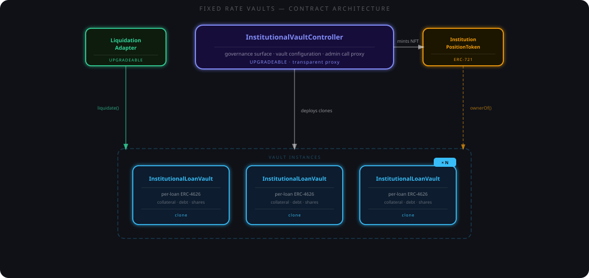

# Fixed Term Vaults

A Fixed Term Vault is a fixed-term loan between an institution and a pool of on-chain suppliers. The institution borrows a configured supply asset against collateral at a scheduled rate and duration set at vault creation. Suppliers receive vault shares representing a claim on the assets available at settlement. If the loan is fully repaid, redemption includes principal and the supplier portion of scheduled interest; partial-interest or principal shortfalls can reduce the payout, so principal and return are not guaranteed.

Each loan clone keeps separate collateral, debt accounting, and supplier shares and does not share liquidity with other vault clones or Venus Core markets. It nevertheless relies on shared controller, PositionToken, oracle, ProtocolShareReserve, LiquidationAdapter, and governance components, so shared dependencies and parameters can affect more than one vault.


This article describes the published contract architecture. Deployed controller and adapter implementations, each vault's clone implementation and state, risk parameters, whitelists, and ACM permissions are live on-chain data. Verify them at a recorded block using the [deployed-contracts page](../../deployed-contracts/fixed-rate-vaults.md); repository source and deployment records alone do not prove the current on-chain configuration.


## Architecture

### Contracts

The system is composed of four primary contracts. Each loan's assets, debt accounting, and supplier shares live in a separate clone, while the controller registry, PositionToken, oracle, ProtocolShareReserve, and LiquidationAdapter are shared system components.

<figure><figcaption><p>The controller deploys a fresh vault clone and mints a position NFT per loan; all liquidation calls are routed through the LiquidationAdapter</p></figcaption></figure>

**[InstitutionalVaultController](../reference-fixed-rate-vaults/institutional-vault-controller.md)** is the sole factory and the only conduit through which any admin operation reaches a vault. It deploys each vault clone and mints the corresponding position NFT in the same transaction. It also exposes the ACM-gated lifecycle calls (`openVault`, `cancelVault`, `partialPauseVault`, `completePauseVault`, `unpauseVault`, `closeVault`) and risk-parameter updates that governance invokes separately over the life of each vault. All ACM permission checks are enforced here — individual vaults carry no ACM wiring and trust calls from the controller implicitly. The controller is deployed behind a transparent proxy, so its live implementation and effective ACM permissions must be resolved on-chain rather than inferred from a repository release.

**[InstitutionalLoanVault](../reference-fixed-rate-vaults/institutional-loan-vault.md)** is the core execution contract for a single loan. It holds all assets — collateral and supply stablecoin — enforces the `VaultState` machine, and is the only place debt is created, tracked, and cleared. Suppliers interact through the ERC-4626 interface (`deposit`, `mint`, `withdraw`, `redeem`); institution-side calls (`depositCollateral`, `claimRaisedFunds`, `withdrawCollateral`) are gated by `onlyPositionHolder`; liquidation entry points are gated by `onlyLiquidationAdapter`. Each vault is a non-upgradeable, single-use EIP-1167 clone. Its supply asset, collateral asset, scheduled rate, caps, and lifecycle durations are set at creation. Its liquidation threshold, liquidation incentive, and late-penalty rate can be updated per vault through the controller; shared adapter parameters and controller dependencies are also governance-controlled. A renewed deal uses a new clone rather than resetting an existing vault.

**[InstitutionPositionToken](../reference-fixed-rate-vaults/institution-position-token.md)** is a singleton ERC-721 shared across all vaults — one contract, one token ID per vault. Whoever holds a given token ID controls all institution-side operations on that vault, since `depositCollateral`, `claimRaisedFunds`, and `withdrawCollateral` all resolve to `positionToken.ownerOf(positionTokenId)` at call time. Keeping ownership in a transferable NFT rather than hardcoded in the vault means control can move to a new address without any state change inside the vault itself. Every transfer requires a prior single-use governance approval via `approvePositionTransfer(vault, recipient)`, consumed on the next `safeTransferFrom`.

**[LiquidationAdapter](../reference-fixed-rate-vaults/liquidation-adapter.md)** is the only address permitted to call `vault.liquidate()`, enforced by `onlyLiquidationAdapter` on each vault. The adapter controls the liquidator and settler whitelists, global close factor, and protocol share of liquidation incentives. Each vault stores its per-vault liquidation threshold, liquidation incentive, and late-penalty rate, checks liquidation eligibility, and calculates the seize amount; the adapter routes repayment and distributes seized collateral. The adapter also accumulates the protocol's share of seized collateral and transfers it to PSR via `sweepProtocolShareToReserve(address collateral)`.

### BaseVault, ERC-4626, and extensibility

`InstitutionalLoanVault` inherits `BaseVault`, an abstract contract built on top of ERC-4626 that was designed to be reusable across different kinds of fixed-term vault. `BaseVault` captures everything that any such vault has in common — fundraising, interest computation, the settlement waterfall, state machine scaffolding, and the pause system — so a new vault type only has to implement what is specific to its loan structure. Future vault types follow the same pattern: inherit `BaseVault`, override its three virtual hooks (`_checkAndAdvanceState`, `_afterWithdrawHook`, `_beforeClaimRaisedFunds`), and add the remaining type-specific logic on top.

ERC-4626 is used as the supplier-facing API, but the vault changes the usual limit behavior to enforce its lifecycle. ERC-4626 uses the `max*` views to report current limits; it does not require deposits or withdrawals to remain open in every state. Calls that request more than the reported maximum are normally expected to revert. This implementation instead clamps `deposit` and `mint` requests to the remaining fundraising capacity:

| Method | Relevant ERC-4626 semantics | Vault behavior |
| --- | --- | --- |
| `deposit` | Deposits an exact asset amount; `previewDeposit` rounds shares down | Only in `Fundraising`; assets above `maxDeposit` are clamped to the remaining capacity, then shares round down |
| `mint` | Mints an exact share amount; `previewMint` rounds required assets up | Only in `Fundraising`; shares above `maxMint` are clamped, then required assets round up |
| `withdraw` | Withdraws an exact asset amount; `previewWithdraw` rounds shares up | Only in `Matured`, `Failed`, or `Liquidated`; requests above `maxWithdraw` revert |
| `redeem` | Redeems an exact share amount; `previewRedeem` rounds assets down | Only in `Matured`, `Failed`, or `Liquidated`; requests above `maxRedeem` revert |
| `maxDeposit` | Reports the current asset limit and may return zero | `maxBorrowCap − totalRaised` in `Fundraising`; zero otherwise |
| `maxMint` | Reports the current share limit and may return zero | Converts remaining asset capacity to shares with rounding down; zero outside `Fundraising` |
| `maxWithdraw` | Reports the owner's current asset limit | `previewRedeem(balanceOf(owner))` in `Matured`, `Failed`, or `Liquidated`; zero otherwise |
| `maxRedeem` | Reports the owner's current share limit | `balanceOf(owner)` in `Matured`, `Failed`, or `Liquidated`; zero otherwise |
| `totalAssets` | Reports assets managed by the vault according to its accounting | `settlementAmount` only in `Matured`, `Failed`, or `Liquidated`; `totalRaised` in every other stored state, including `Closed` |

`totalAssets()` is backed by internal accounting variables (`totalRaised` and `settlementAmount`) rather than directly returning `balanceOf(address(this))`. A direct token transfer therefore does not immediately change the reported share price through `totalAssets()`, avoiding the donation-based share-price manipulation path found in naive ERC-4626 implementations. The actual token balance is still read when the settlement waterfall runs. After the controller changes a fully resolved vault from one of those three states to `Closed`, the implementation's state branch returns `totalRaised` again; governance is expected to close only after suppliers have withdrawn, and integrations should not treat `Closed.totalAssets()` as a live redemption quote.

`minSupplierDeposit` adds a minimum deposit floor absent from the spec. The floor is waived for the final deposit that fills the remaining capacity exactly, preventing the vault from getting permanently stuck below `maxBorrowCap` when the residual slot is smaller than the minimum. Fee-on-transfer and rebasing tokens are not supported for either the supply asset or collateral.

### Oracle

All USD valuations in the system route through Venus `ResilientOracle`. For an asset with `d` decimals, `oracle.getPrice(asset)` is scaled to `36 − d` decimals. The vault multiplies an amount expressed in the asset's smallest units by that price and divides by `1e18`; the result is an 18-decimal USD value. The raw oracle return is therefore not itself an 18-decimal price for every asset. A zero price reverts with `InvalidOraclePrice`.

Both the supply asset and the collateral asset must have a non-zero oracle price at vault creation. The controller probes the oracle during `createVault` and reverts with `InvalidConfig` if either price is missing. This prevents a vault from entering price-dependent states — liquidation checks, claim validation, bad-debt detection — with an asset the oracle cannot price.

## State machine

The vault tracks lifecycle as a `VaultState` enum. Transitions are monotonic — no state ever goes backward. Time passing alone does not write a new state: storage advances only when a function that invokes `_checkAndAdvanceState()` runs. Those paths include the supplier ERC-4626 entry points, collateral and claim operations, repayment, liquidation, bad-debt rescue, and the permissionless `updateVaultState()` function. Controller-only functions such as pause, parameter updates, sweep, cancel, and close do not all invoke this hook, and view calls report the stored state without advancing it.

The hook can catch up the time- and debt-dependent `Fundraising → Lock/Failed → PendingSettlement → Matured/SettlementDeadlineExceeded` chain on a relevant call. `Liquidated` still requires a successful `repayBadDebt` call, and `Closed` requires the controller to call `closeVault()`. Anyone can call `updateVaultState()` when a hook-driven transition is ready but no other interaction is pending.

<figure><figcaption><p>State transitions are monotonic — no state ever goes backward. Dashed red paths show cancel and failure routes; the grey arrows at the bottom show all three terminal states collapsing into Closed via <code>closeVault()</code></p></figcaption></figure>

## Core mechanics

### Margin deposit

Before suppliers can interact, the institution must post a security deposit — the required margin — in a single `depositCollateral` call. It acts as a credible commitment: the institution either tops up collateral to `idealCollateralAmount` before fundraising closes or forfeits the margin to suppliers. The vault stays in `WaitingForMargin` until this condition is met:

$$\text{requiredMargin} = \left\lfloor\text{idealCollateralAmount} \times \frac{\text{marginRate}}{10^{18}}\right\rfloor$$

Once `totalCollateralDeposited ≥ requiredMargin` the vault advances to `MarginDeposited`, where it waits for governance to inspect the configuration and call `openVault()` to open the fundraising window.

### Fundraising

`deposit` and `mint` are permissionless during `Fundraising`. Unlike the usual ERC-4626 over-limit behavior, both calls clamp to remaining capacity (`maxBorrowCap - totalRaised`): an oversized `deposit` fills the residual and computes shares with rounding down; an oversized `mint` clamps the share request to `maxMint` and computes the required assets with rounding up. If the vault is already full, the clamped amount is zero and the call reverts with `ExceedsMaxCap`. `minSupplierDeposit` is enforced on every call except one that fills or exceeds the remaining capacity — because the residual may be smaller than the minimum, skipping the check on that deposit prevents the vault from being permanently stuck below `maxBorrowCap`. Share tokens are standard ERC-20s, freely transferable at all times.

At `fundraisingEndTime` both sides are evaluated simultaneously. If `totalRaised ≥ minBorrowCap` and `totalCollateralDeposited ≥ idealCollateralAmount` the vault transitions to `Lock` and the loan begins.

If either condition is not met, the vault transitions to `Failed`. Two distinct failure modes are possible, distinguished by `InstitutionalRuntime.institutionDefaulted`:

**Raise shortfall** (`totalRaised < minBorrowCap` at window close). `institutionDefaulted = false`. No default has occurred; suppliers recover full principal and the institution recovers all collateral including the margin.

**Collateral underdelivery** (`totalRaised ≥ minBorrowCap` but `totalCollateralDeposited < idealCollateralAmount` at window close). `institutionDefaulted = true`. Only the pre-determined margin is confiscated, not the institution's full collateral position. `confiscatedMargin` is set to exactly `requiredMargin`:

$$\text{requiredMargin} = \left\lfloor\text{idealCollateralAmount} \times \frac{\text{marginRate}}{10^{18}}\right\rfloor$$

Suppliers recover principal plus a pro-rata share of `confiscatedMargin` (see [Margin confiscation](#margin-confiscation-collateral-underdelivery) for the per-redemption distribution). The institution recovers `totalCollateralDeposited - confiscatedMargin`.

#### Margin confiscation: collateral underdelivery

When the vault fails via collateral underdelivery, `confiscatedMargin = requiredMargin`. Each `withdraw` / `redeem` triggers `_afterWithdrawHook`, which distributes a pro-rata slice of the remaining confiscated margin:

$$\text{compensation} = \text{confiscatedMarginRemaining} \times \frac{\text{shares}}{\text{totalSupplyBeforeBurn}}$$

Compensation is denominated in the **collateral asset** (e.g. BTC or ETH), not the supply stablecoin. Each calculation uses integer division and rounds down to collateral-token units. `confiscatedMarginRemaining` and the share supply both decrease after each redemption, so the formula allocates the remaining pool pro rata, but smallest-unit rounding can leave residual collateral for later redeemers; exact per-share equality across redemption order is not guaranteed.

### Lock entry and borrowing

When the vault transitions to `Lock`, two values are fixed for the lifetime of the loan:

**Total interest** is stored immediately as `totalDebt` and is owed in full regardless of when the institution repays — there is no early-repayment discount:

$$\text{totalInterest} = \frac{\text{totalRaised} \times \text{fixedAPY} \times \text{lockDuration}}{\text{BPS} \times \text{YEAR}}$$

`BPS = 10000`, `YEAR = 365 days`. Solidity integer division rounds `totalInterest` down to supply-asset units. `totalDebt = totalInterest` at lock entry; after `claimRaisedFunds` it becomes `totalInterest + totalRaised`.

**Minimum collateral floor** is recalculated proportionally to the actual raise. When the raise underfills `maxBorrowCap`, the floor scales down, freeing excess collateral above it for withdrawal during `Lock`:

$$\text{minimumCollateralRequired} = \left\lfloor\text{idealCollateralAmount} \times \frac{\text{totalRaised}}{\text{maxBorrowCap}}\right\rfloor$$

#### Claiming raised funds

`claimRaisedFunds()` is a one-shot call (gated by `fundsWithdrawn`), available only in `Lock`. It transfers the entire supply asset balance to the position-NFT holder. Before releasing funds, it simulates **interest plus principal** against current collateral via `_getHypotheticalVaultLiquidity(0, totalRaised)` — not just the principal being claimed. The call reverts with `ClaimWouldBreachLT` if the combined debt would breach the liquidation threshold.

After a successful claim, `totalDebt = totalInterest + totalRaised` — the full lifetime obligation.

#### Repaying

`repay(amount)` is unrestricted: any address can reduce `totalDebt` by pulling supply asset from its own balance. This is intentional — third parties can service the debt without holding the position NFT. Available in `Lock`, `PendingSettlement`, and `SettlementDeadlineExceeded`; overpayment silently clamps to `outstandingDebt()`.

#### Collateral during Lock

The institution may add or withdraw collateral during `Lock`. Withdrawal requires both checks to pass:

1. **Floor check** — `totalCollateralDeposited − amount ≥ minimumCollateralRequired`. The locked floor cannot be touched.
2. **LT health check** — the post-withdrawal state must not produce an LT shortfall.

The tighter of the two determines how much can be withdrawn.

### Settlement window

At `lockEndTime` the vault enters `PendingSettlement`. This state is never skipped — even if the institution cleared all debt before the lock expired, the vault holds in `Lock` until `block.timestamp ≥ lockEndTime`, then moves to `PendingSettlement`, and only transitions to `Matured` once `outstandingDebt() == 0`.

The institution has until `settlementDeadline` to repay in full. `repay()` remains available and unrestricted throughout. If the debt is cleared before the deadline the vault moves to `Matured` and the settlement waterfall runs. If the deadline passes with debt still outstanding the vault enters `SettlementDeadlineExceeded` — the institution may still repay voluntarily, but whitelisted settlers can now trigger overdue liquidation at the late-penalty rate (see [Overdue](#overdue)).

### Settlement waterfall

On entry to `Matured` or `Liquidated`, `_settleProtocolShare` runs once and distributes the supply asset balance:

| Branch | Condition | Protocol fee | `settlementAmount` |
| --- | --- | --- | --- |
| Full repayment | `available ≥ totalRaised + totalInterest` | `totalInterest × reserveFactor` | `available − protocolFee − surplus` |
| Partial interest shortfall | `totalRaised < available < totalRaised + totalInterest` | `(available − totalRaised) × reserveFactor` | `available − protocolFee` |
| Principal shortfall | `available ≤ totalRaised` | 0 | `available` |

Surplus above `totalRaised + totalInterest` is forwarded to PSR. Protocol-fee multiplication and division use integer arithmetic and round down to supply-asset units. `ShortfallDetected(expected, available)` fires in the shortfall branches.

`totalAssets()` returns `totalRaised` throughout `Lock` and `PendingSettlement`, then uses `settlementAmount` while the stored state is `Matured`, `Failed`, or `Liquidated` — the conversion anchor for ERC-4626 redemption in those states. Each supplier's payout on redemption is:

$$\text{payout} = \left\lfloor\text{shares} \times \frac{\text{settlementAmount}}{\text{totalSupply}}\right\rfloor$$

This is the `previewRedeem` rounding direction. Both `settlementAmount` and `totalSupply` decrease after each completed withdrawal, so integrations should use the live preview immediately before submission rather than a stale aggregate ratio.

### Liquidation

#### Health factor

The vault's health is computed by `_getHypotheticalVaultLiquidity`, which follows the same accounting approach as Compound V2 (the protocol Venus is built on) — collateral is weighted by a liquidation threshold and compared against outstanding debt, both expressed in USD:

$$\text{LT-cap} = \left\lfloor\frac{\text{collateralUSD} \times \text{liquidationThreshold}}{10^{18}}\right\rfloor$$

$$\begin{cases} \text{liquidity} = \text{LT-cap} - \text{debtUSD} & \text{if } \text{debtUSD} \leq \text{LT-cap} \\ \text{shortfall} = \text{debtUSD} - \text{LT-cap} & \text{otherwise} \end{cases}$$

`liquidationThreshold` is a mantissa (e.g. `0.85e18` = 85%). Asset-to-USD conversion and the LT multiplication each use integer division and round down. A shortfall greater than zero means the vault is liquidatable. The same function is used with non-zero `withdrawAmount` or `additionalDebt` arguments to simulate hypothetical state changes — called by `claimRaisedFunds` and `withdrawCollateral` before executing the action, so those calls revert if the calculated post-operation state has a shortfall.

#### Seize calculation and Compound V2 lineage

The collateral seize calculation follows the same accounting principle as Compound V2: the repaid value is converted to USD, multiplied by the incentive multiplier, then divided by the collateral price to arrive at collateral units. The implementation performs two integer divisions, so the exact sequence is:

$$\text{repayValueUSD} = \left\lfloor\frac{\text{repayAmount} \times \text{supplyPrice}}{10^{18}}\right\rfloor$$

$$\text{seizeAmount} = \left\lfloor\frac{\text{repayValueUSD} \times \text{incentive}}{\text{collateralPrice}}\right\rfloor$$

`incentive` is `liquidationIncentive` for health-based liquidations and `latePenaltyRate` for overdue liquidations. Both are mantissa-encoded multipliers greater than `1e18` — an incentive of `1.1e18` targets 10% more collateral value than the repaid debt before token-unit rounding. `supplyPrice` and `collateralPrice` use their respective `36 − asset.decimals()` oracle scales; the differing scales are what convert supply-asset base units into collateral-asset base units.

The vault transfers the full `seizeAmount` to `LiquidationAdapter`. The adapter then isolates the bonus slice and takes the protocol's share of that slice only — not of the full seizure:

```
repayEquivalent  = totalSeized × MANTISSA_ONE / incentive
incentiveAmount  = totalSeized − repayEquivalent
protocolAmount   = incentiveAmount × protocolLiquidationShare / MANTISSA_ONE
callerAmount     = totalSeized − protocolAmount
```

In the published implementation, `repayEquivalent`, `protocolAmount`, and the vault's seize calculation each round down. The protocol share is calculated only from the resulting `incentiveAmount`; the caller receives `totalSeized − protocolAmount`. Smallest-unit rounding can therefore affect the exact split.

#### Health-based

Available in `Lock`, `PendingSettlement`, and `SettlementDeadlineExceeded` when the vault has a non-zero shortfall (see [Health factor](#health-factor) above).

Whitelisted liquidators call `LiquidationAdapter.liquidate(vault, repayAmount)`. The adapter validates vault registration and forwards to `vault.liquidate(repayAmount)` through the `onlyLiquidationAdapter` modifier. Inside the vault, `liquidate()` checks for an LT shortfall and reverts with `NotLiquidatable` if none exists; `_executeLiquidation` then enforces the close factor: if `actualRepay > outstandingDebt × closeFactor` the call reverts with `ExceedsCloseFactor` — it is a hard revert, not a silent cap. (`actualRepay` is `min(repayAmount, outstandingDebt)` — the close-factor check fires on the clamped value, not the raw input.) Seized collateral is split between the caller and the protocol per the formula above.

A health-based liquidation does not directly trigger a state transition. The vault advances normally — through `PendingSettlement` and into `Matured` once debt is zero. The `Liquidated` state is never reached via health-based liquidation.

#### Overdue

Available once the vault enters `SettlementDeadlineExceeded`. No LT shortfall is required — the time breach alone qualifies. The same hard-reverting `closeFactor` limit applies, but collateral is seized at `latePenaltyRate` instead of `liquidationIncentive`. A vault that breaches both the LT cap and the deadline can be liquidated through either path; the chosen path determines the bonus rate. Like health-based liquidation, an overdue liquidation that clears all debt transitions the vault to `Matured`, not `Liquidated`. The `Liquidated` state is reached exclusively via `repayBadDebt`.

#### Bad-debt rescue

Available in `Lock`, `PendingSettlement`, and `SettlementDeadlineExceeded` whenever the USD value of deposited collateral falls below the USD value of outstanding debt. `repayBadDebt` is permissionless — any address may call it. The repayment must be large enough to reduce `totalDebt` to at most `totalInterest` in a single call (i.e., the principal must be fully covered); the call reverts with `InsufficientRepayment` otherwise. Once that condition is met the vault transitions to `Liquidated` and the settlement waterfall runs immediately over the combined supply asset balance. Without a successful rescue, the published vault source does not automatically enter `Liquidated` or create an additional supplier payout; ordinary liquidation and voluntary repayment paths may remain available according to state. This contract description does not determine any off-chain legal or governance recovery rights.

## Risk parameters

All tunable parameters grouped by contract, mutability, and who sets them.

**Set once at vault creation via `createVault` — fixed for the life of the vault:**

| Parameter | Location | Units | Constraint |
| --- | --- | --- | --- |
| Supply asset | `VaultConfig.supplyAsset` | address | Must have non-zero oracle price; must differ from collateral |
| Collateral asset | `InstitutionalConfig.collateralAsset` | address | Must have non-zero oracle price; must differ from supply asset |
| Target APR | `VaultConfig.fixedAPY` | basis points | 1 – 10 000 |
| Reserve factor | `VaultConfig.reserveFactor` | mantissa | ≤ `1e18` |
| Minimum borrow cap | `VaultConfig.minBorrowCap` | supply asset units | > 0; ≤ `maxBorrowCap` |
| Maximum borrow cap | `VaultConfig.maxBorrowCap` | supply asset units | ≥ `minBorrowCap` |
| Minimum supplier deposit | `VaultConfig.minSupplierDeposit` | supply asset units | 0 = no floor |
| Fundraising duration | `VaultConfig.openDuration` | seconds | > 0 |
| Lock duration | `VaultConfig.lockDuration` | seconds | > 0 |
| Settlement window | `VaultConfig.settlementWindow` | seconds | > 0 |
| Ideal collateral amount | `InstitutionalConfig.idealCollateralAmount` | collateral token units | > 0 |
| Margin rate | `InstitutionalConfig.marginRate` | mantissa | 0 < rate ≤ `1e18` |

**Set at vault creation — mutable per vault by governance via the controller:**

| Parameter | Location | Units | Constraint |
| --- | --- | --- | --- |
| Liquidation threshold | `RiskConfig.liquidationThreshold` | mantissa | 0 < LT ≤ `1e18`; `LT × LI < 1e36`; `LT × latePenaltyRate < 1e36` |
| Liquidation incentive | `RiskConfig.liquidationIncentive` | mantissa | `1e18 < LI ≤ 1.5e18`; `LT × LI < 1e36` |
| Late penalty rate | `RiskConfig.latePenaltyRate` | mantissa | `1e18 < rate ≤ 1.5e18`; `LT × rate < 1e36` |

**Held on `LiquidationAdapter` — global across all vaults, mutable by governance:**

| Parameter | Field | Constraint |
| --- | --- | --- |
| Close factor | `closeFactor` | 0 < CF ≤ `1e18` |
| Protocol liquidation share | `protocolLiquidationShare` | ≤ `1e18` |

The constraint `LT × LI < 1e36` (and the equivalent for `latePenaltyRate`) ensures that a liquidation always improves vault health rather than worsening it. The controller enforces this invariant on both creation (`_validateLiquidationInvariant`) and every subsequent per-vault update.

## Governance and access control

### Pause system

A two-level pause is controlled by governance via `partialPauseVault` / `completePauseVault`. The table describes the published vault implementation's user-facing money-moving paths:

| Level | Blocked by pause modifier | Still callable subject to normal state, authorization, and balance checks |
| --- | --- | --- |
| **Partial** | `deposit`, `mint`, `depositCollateral`, `withdrawCollateral`, `claimRaisedFunds` | `withdraw`, `redeem`, `repay`, `repayBadDebt`, health-based liquidation, overdue liquidation, `updateVaultState` |
| **Complete** | All partial-pause paths, plus `withdraw`, `redeem`, `repay`, `repayBadDebt`, and both liquidation paths | `updateVaultState`; controller-only pause controls, close/cancel, parameter updates, and `sweep` are not guarded by the vault pause modifiers |

Partial pause therefore freezes new supplier deposits and position-holder collateral/fund operations without interrupting supplier terminal withdrawals, active debt service, or liquidation. Complete pause blocks those user money-moving paths, but it is not a universal freeze of views, state advancement, or controller-authorized administration.

### Administrative recovery

The controller's ACM-gated `sweep(vault, token)` path calls `vault.sweep(token)`, which transfers the vault's full balance of the specified ERC-20 to the controller's configured treasury. The published source does not exclude the supply or collateral token, so integrators should treat this as a material administrative authority and verify the live controller implementation, treasury, and ACM grants.

### Position NFT

`depositCollateral`, `claimRaisedFunds`, and `withdrawCollateral` are gated by `onlyPositionHolder`, which checks `positionToken.ownerOf(positionTokenId) == msg.sender` at call time. Transferring the NFT immediately reassigns control of all three. `repay` carries no such guard — intentional, for the permissionless debt-service case.

NFT transfers require a single-use governance approval: `approvePositionTransfer(vault, recipient)` records the approved target, consumed on the next `safeTransferFrom`. `revokePositionTransfer` cancels a pending approval before it is used.

### ACM permissions

Governance operations (create, open, cancel, pause, close, risk-parameter updates) route through `InstitutionalVaultController` and are gated per selector by the Venus AccessControlManager. Liquidation entry points on the vault are gated by `onlyLiquidationAdapter`; the adapter maintains its own ACM-gated whitelists for liquidators and settlers independently.

## Further reading

- [Supplier Guide](../../guides/fixed-rate-vaults/supplier-guide.md)
- [Institution Guide](../../guides/fixed-rate-vaults/institution-guide.md)
- [Solidity API Reference](../reference-fixed-rate-vaults/README.md)
- [Deployed Contracts](../../deployed-contracts/fixed-rate-vaults.md)
- [Repository](https://github.com/VenusProtocol/fixed-rate-vaults)
