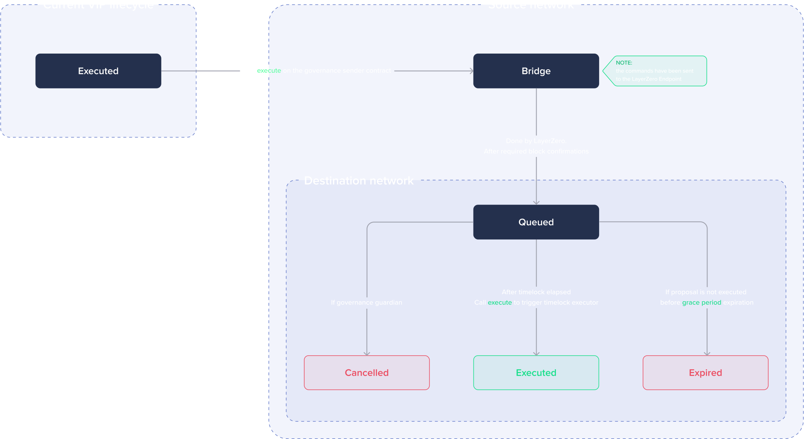

# Multichain governance


**To be released**


## System Overview

The multichain governance system is designed to facilitate the execution of VIP across multiple blockchain networks, integrating with the Access Control Manager (ACM) and LayerZero communication protocol. It extends the [governance model proposed by LayerZero](https://github.com/LayerZero-Labs/omnichain-governance-executor/tree/main).

### Key features

1. **VIP Types and delays:**
    - Provides three VIP options: Normal, Fast-track, and Critical.
    - Delays can be configured prior to remote execution on destination networks.
    - Normal VIPs have the greatest delays, whereas Critical VIPs have the smallest delays, indicating their urgency and importance.
2. **Inter-chain communication:**
    - LayerZero provides secure and reliable cross-chain messaging for remote execution commands.
3. **Bridging:**
    - Works with a bridge solution to deliver messages to destination networks.
    - Enables smooth interoperability between the BNB Chain and other supported networks.
    - Bridge configurations are flexible to accommodate various networks.
4. **Guardian account:**
    - Authorised by the ACM to revoke orders before they are executed on the target network.
    - Serves as a fail-safe mechanism, preventing unauthorised or incorrect commands from being performed.
5. **Command limits and pausing:**
    - Allows you to establish daily command restrictions for destination networks.
    - Adds pause/resume functionality for execution to temporarily halt operations in case of an emergency.

### Detailed breakdown

1. **Proposing and voting:**
    - Proposers establish VIPs with BNB Chain commands and remote commands.
    - Voting takes place on the BNB Chain, utilizing existing governance contracts.
    - Proposals are validated and approved according to predetermined criteria and threshold.
2. **Remote execution flow:**
    - Commands for destination networks generate "Remote VIPs. in a payload”
    - Payload are routed to the destination network using the bridge solution.
3. **Delay mechanism:**
    - Remote execution has two delays: bridge delay and executor delay.
    - Bridge delay is the time it takes for the bridge to propagate a message to the target network, which is commonly measured in minutes.
    - Executor delay is the duration between the message's arrival on the target network and its execution, which is customisable dependent on VIP type (Normal, Fast-track, or Critical)
4. **Execution and expiry:**
    - User-triggered execution occurs once both delays have passed, signaling the destination network's readiness to perform the orders via Timelock.
    - The Guardian account can cancel orders before they are executed, offering a safeguard against malicious or erroneous acts.
    - "Remote VIPs" become "Expired" if no execution happens within a set grace period, avoiding stale or outdated commands from being executed.
5. **Command restrictions:**
    - VIPs can only include one set of commands per destination network to prevent duplication and conflicts.
    - Duplicate commands for the same network within a VIP are not permitted, ensuring consistent and reliable execution.
6. **Executor-Side features:**
    - Sets a daily limit on the number of commands received per network.
    - Implements pause/resume functionality for the execute function in the target governance contract, enabling administrators to manage the system's operational state effectively.

## Detailed overview of remote proposal execution (step-by-step)

1. Proposing a remote VIP on BNB Chain

- A proposer submits a VIP through the existing governance mechanism on the BNB Chain.
- This VIP includes a command invoking the `OmnichainProposalSender::execute` function.
- The `execute` function takes three arguments:
    - `chainID`: Identifies the destination network for the remote execution (`endpointId` according to [LayerZero](https://layerzero.gitbook.io/docs/technical-reference/mainnet/supported-chain-ids)).
    - `payload`: Encoded data (off-chain) containing the specific commands to be executed on the target network.
    - `adapterParams` : It includes `refundAddress`, `zroPaymentTokenAddress` and encoded destination gas limits

2. Eligibility checks and limits

Before sending the remote execution message, the system verifies eligibility based on predefined thresholds and limits. These restrictions ensure responsible resource allocation and prevent potential misuse.

3. Remote proposal ID generation

It's crucial to understand that the proposal ID for the remote execution on the destination network differs from the initial VIP ID proposed on the BNB Chain. This remote proposal ID starts from 0.

4. Message relay based on outcome

- **Success:** If the eligibility checks and limits are met, the encoded message (payload) is relayed across chains using the LayerZero bridge.
- **Failure:** If the checks fail, the system handles the situation differently based on the cause:
    - **Insufficient Gas:** The `retryExecute` function is used to attempt redelivering the message with potentially adjusted gas fees.
    - **Logical Error or Check Failure:** The `fallbackWithdraw` function removes the message from the queue, preventing further retries if the failure stems from inherent logic errors or failed eligibility checks.

5. Receiving and Queuing on the Destination Network

<figure><figcaption></figcaption></figure>

- Upon successful reception by the destination network's executor contract (`OmnichainProposalExecutor`), the remote proposal enters a "Queued" state.
- This queuing process applies additional eligibility checks specific to the receiving network, ensuring compliance with its governance rules and thresholds of commands limits.

6. Delay mechanism and execution

- Once the configured delay for the remote proposal type (Normal, Fast-track, Critical) elapses, the proposal becomes eligible for execution.
- Any user can then trigger the execution of the queued commands on the destination network.

7. Ownership and Access Control

- `OmnichainProposalSender` (BNB Chain):
    - Owned by: NormalTimelock contract on the BNB Chain.
    - Authorised callers: Timelocks (Normal, Critical, Fast-track) are authorised to call the `execute` function on this contract.
- `OmnichainProposalExecutor` (destination network):
    - Owned by: `OmnichannelEcexutorOwner` contract. This owner performs Access Control Manager (ACM) checks before allowing any function calls on this contract.
- `TimelockV8`:
    - Owned by: `OmnichainProposalExecutor` contract. This ownership grants `TimelockV8` the authority to perform specific actions like queuing, canceling, and executing remote proposals.

## Contracts overview

<figure><figcaption></figcaption></figure>

### Contract 1: `BaseOmnichainControllerSrc`

#### Functionality

This contract serves as the framework for secure omnichain (cross-chain) communication. Its primary responsibilities include managing daily command limits and providing pausability for controlled message transmission across chains.

#### Key features

1. **Access Control Integration**: Integrates an `AccessControlManager` contract to enforce access control for critical functions. This ensures that only authorised entities can execute commands, enhancing security.
2. **Daily Command Limits**: Establishes a per-chain limit on the number of commands that can be sent within a 24-hour window. This feature prevents potential abuse and maintains system stability.
3. **Pausability**: Implements a pausability mechanism, inherited from the OpenZeppelin `Pausable` contract. This functionality allows the contract owner to temporarily halt omnichain communication if necessary.

#### Architecture

- **Inheritance**: Extends the functionalities of the `Ownable` and `Pausable` contracts from OpenZeppelin, inheriting ownership management and pausing capabilities.

#### State variables

- **`accessControlManager (address)`**: Stores the address of the `AccessControlManager` contract.
- **`chainIdToMaxDailyLimit (mapping)`**: Maps chain IDs to their corresponding daily command limits.
- **`chainIdToLast24HourCommandsSent (mapping)`**: Tracks the number of commands sent within the last 24 hours for each chain.
- **`chainIdToLast24HourWindowStart (mapping)`**: Records the timestamp when the last 24-hour window for a chain began.
- **`chainIdToLastProposalSentTimestamp (mapping)`**: maintains the timestamp of the last proposal sent to a specific chain to prevent sending multiple proposals within the same block.

#### Events

- **`SetMaxDailyLimit (event)`**: Emitted when the daily command limit for a chain is modified.
- **`NewAccessControlManager (event)`**: Triggered when the address of the `AccessControlManager` is updated.

#### Functions

- **`constructor(address accessControlManager_)`**: Initialises the contract with the address of the `AccessControlManager`.
- **`setMaxDailyLimit(uint16 chainId_, uint256 limit_)`**: Sets the maximum daily command limit for a specific chain ID. Requires permission from the `AccessControlManager`.
- **`pause()`**: Triggers the paused state, halting omnichain communication. Requires `AccessControlManager` permission.
- **`unpause()`**: Resumes omnichain communication from the paused state. Requires `AccessControlManager` permission.
- **`setAccessControlManager(address accessControlManager_)`**: Updates the address of the `AccessControlManager` contract. Only callable by the contract owner.
- **`isEligibleToSend(uint16 dstChainId, uint256 noOfCommands_)`**: Checks if sending the specified number of commands to the given chain is permissible based on daily limits and time windows.
- **`ensureAllowed(string memory functionSig)`**: Ensures the caller has permission to execute a specific function, leveraging the `AccessControlManager`.

### Contract 2: `OmnichainProposalSender`

#### Functionality

This contract facilitates cross-chain message transmission triggered by governor proposals on the main (BNB) chain. It sends proposal execution data to designated remote chains for processing.

#### Key features

- **LayerZero Integration**: Utilises the LayerZero communication protocol for efficient and reliable cross-chain message delivery.
- **Remote Chain Management**: Allows defining trusted remote contracts (receivers) on other chains using `setTrustedRemoteAddress`.
- **Failed Message Handling**: Stores the execution hashes of failed messages to facilitate resending or clearing them in case of insufficient fees or other issues.
- **Security Measures**: Enforces access control using the `AccessControlManager` for critical functions.

#### Architecture

- **Inheritance**: Inherits functionalities from both the `ReentrancyGuard` and `BaseOmnichainControllerSrc` contracts, providing reentrancy protection and foundational omnichain communication capabilities.

#### State variables

- **`proposalCount (uint256)`**: Tracks the total number of remote proposals.
- **`storedExecutionHashes (mapping)`**: Stores the execution hashes of failed messages for retry or clearing purposes.
- **`LZ_ENDPOINT (ILayerZeroEndpoint)`**: Interface for interacting with the LayerZero communication protocol.
- **`trustedRemoteLookup (mapping)`**: Maps remote chain IDs to trusted remote contract addresses for message transmission.

#### Events

- **`SetTrustedRemoteAddress (event)`**: Triggered when a trusted remote address is set for a remote chain.
- **`TrustedRemoteRemoved (event)`**: Emitted when a trusted remote address is removed from storage.
- **`ExecuteRemoteProposal (event)`**: Indicates the execution of a proposal on a remote chain.
- **`ClearPayload (event)`**: Signals the successful clearing of a previously failed message.
- **`StorePayload (event)`**: Records the storage of an execution hash for a failed message, along with relevant details.
- **`FallbackWithdraw (event)`**: Indicates a fallback withdrawal of funds in case of failed messages.

#### Functions

- **`constructor(ILayerZeroEndpoint lzEndpoint_, address accessControlManager_)`**: Initialises the contract with the LayerZero endpoint and the address of the `AccessControlManager`.
- **`estimateFees(uint16 remoteChainId_, bytes calldata payload_, bytes calldata adapterParams_)`** : Estimates LayerZero fees for cross-chain message delivery based on payload and adapter parameters.
- **`execute(uint16 remoteChainId_, bytes calldata payload_, bytes calldata adapterParams_)`**: Sends a message to execute a remote proposal, storing execution hashes if the message fails.
- **`retryExecute(...)`**: Resends a previously failed message with potentially additional fees, ensuring reentrancy protection.
- **`fallbackWithdraw(...)`**: Allows the owner to withdraw funds in case of failed messages.
- **`setTrustedRemoteAddress(uint16 remoteChainId_, bytes calldata newRemoteAddress_)`**: Sets the remote message receiver address for a specified remote chain, requiring `AccessControlManager` permission.
- **`setConfig(uint16 version_, uint16 chainId_, uint256 configType_, bytes calldata config_)`**: Sets the configuration of the LayerZero messaging library, controlled by the `AccessControlManager`.
- **`setSendVersion(uint16 version_)`**: Sets the messaging library version, with permission from the `AccessControlManager`.
- **`getConfig(uint16 version_, uint16 chainId_, uint256 configType_)`**: Retrieves the configuration of the LayerZero messaging library.

### Contract 3: `BaseOmnichainControllerDest`

#### Functionality

This contract serves as the base for the Omnichain controller destination contract. It provides functionality related to daily command limits and pausability.

#### State variables

- **`maxDailyReceiveLimit (uint256)`**: Maximum daily limit for receiving commands from BNB Chain.
- **`last24HourCommandsReceived (uint256)`**: Total received commands within the last 24-hour window from BNB Chain.
- **`last24HourReceiveWindowStart (uint256)`**: Timestamp when the last 24-hour window started from BNB Chain.

#### Events

- **`SetMaxDailyReceiveLimit (event)`**: Emitted when the maximum daily limit for receiving commands from BNB Chain is modified.

#### Functions

- **`constructor(address endpoint_)`**: Initialises the contract with the LayerZero endpoint address.
- **`setMaxDailyReceiveLimit(uint256 limit_)`**: Sets the maximum daily limit for receiving commands. Only callable by the contract owner.
- **`pause()`**: Triggers the paused state of the controller. Only callable by the contract owner.
- **`unpause()`**: Triggers the resume state of the controller. Only callable by the contract owner.
- **`renounceOwnership()`**: Overrides the renounceOwnership function to prevent accidental renouncement of ownership.
- **`_isEligibleToReceive(uint256 noOfCommands_)`**: Checks the eligibility to receive commands based on the daily limit and updates the state accordingly.

### Contract 4: `OmnichainGovernanceExecutor`

#### Functionality

This contract executes proposal transactions sent from the main chain. It controls LayerZero configuration and implements a non-blocking behavior.

#### State variables

- **`GUARDIAN (address)`**: A privileged role that can cancel any proposal.
- **`srcChainId (uint16)`**: Stores the layerzero endpoint ID.
- **`lastProposalReceived (uint256)`**: Last proposal count received.
- **`proposals (mapping)`**: Official record of all proposals ever proposed.
- **`proposalTimelocks (mapping)`**: Mapping containing Timelock addresses for each proposal type.
- **`queued (mapping)`**: Represents the queue state of a proposal.

#### Events

- **`ProposalReceived (event)`**: Emitted when a proposal is received.
- **`ProposalQueued (event)`**: Emitted when a proposal is queued.
- **`ProposalExecuted (event)`**: Emitted when a proposal is executed.
- **`ReceivePayloadFailed (event)`**: Emitted when a payload receive fails.
- **`ProposalCanceled (event)`**: Emitted when a proposal is canceled.
- **`TimelockAdded (event)`**: Emitted when a Timelock is added.
- **`SetSrcChainId (event)`**: Emitted when the source layer zero endpoint ID is updated.

#### Functions

- **`constructor(address endpoint_, address guardian_, uint16 srcChainId_)`**: Initialises the contract with the LayerZero endpoint address, guardian address, and source chain ID.
- **`setSrcChainId(uint16 srcChainId_)`**: Updates the source layerzero endpoint ID. Only callable by the contract owner.
- **`addTimelocks(ITimelock[] memory timelocks_)`**: Adds Timelocks to the ProposalTimelocks mapping. Only callable by the contract owner.
- **`execute(uint256 proposalId_)`** : Executes a queued proposal if the ETA has passed.
- **`cancel(uint256 proposalId_)`**: Cancels a proposal if the sender is the guardian and the proposal is not executed.
- **`state(uint256 proposalId_)`**: Gets the state of a proposal.
- **`_blockingLzReceive(...)`** and **`_nonblockingLzReceive(...)`**: Process LayerZero receive requests, with blocking and non-blocking behaviour respectively.
- **`_queue(uint256 proposalId_)`**: Queues a proposal for execution.
- **`_queueOrRevertInternal(...)`**: Checks for a unique proposal and queues it or reverts if already queued.

### Contract 5: `OmnichainExecutorOwner`

#### Functionality

The OmnichainExecutorOwner contract serves as a governance and access control mechanism for managing the `OmnichainGovernanceExecutor` contract. It allows the owner to control the functions that can be executed on the `OmnichainGovernanceExecutor` contract, upsert function signatures into a registry, and transfer ownership of the `OmnichainGovernanceExecutor` contract.

#### State variables

- **`OMNICHAIN_GOVERNANCE_EXECUTOR (immutable)`:**
    - This variable holds the address of the `OmnichainGovernanceExecutor` contract and is immutable once initialized.
- **`functionRegistry (mapping)`:**
    - This mapping stores the function signatures along with their corresponding 4-byte hash values.
    - It allows the contract owner to register which functions are permitted to be executed on the `OmnichainGovernanceExecutor` contract.

#### Events

- **`FunctionRegistryChanged` (event):**
    - This event is emitted when a function is added or removed from the function registry.
    - It provides information about the function signature and whether it is active (added) or inactive (removed).

#### Functions

- **`constructor(address omnichainGovernanceExecutor_)`:**
    - Initialises the contract with the address of the `OmnichainGovernanceExecutor` contract.
    - This constructor ensures that the provided address is not zero.
- **`initialize(address accessControlManager_)`:**
    - Initialises the contract with the address of the access control manager.
    - This function sets up access control for the contract.
- **`fallback(bytes calldata data_)`:**
    - Acts as a fallback function that is invoked when a called function does not exist in the contract.
    - It checks if the function signature exists in the function registry and if the caller has permission to execute it.
    - Then it forwards the function call to the `OmnichainGovernanceExecutor` contract.
    - If the call fails, it reverts with an error message.
- **`upsertSignature(string[] calldata signatures_, bool[] calldata active_)`:**
    - Allows the owner to upsert (add or remove) function signatures into the function registry.
    - The owner can specify whether each function signature should be added (**`true`**) or removed (**`false`**).
    - This function ensures that input arrays have the same length.
    - It emits the **`FunctionRegistryChanged`** event for each function signature that is added or removed.
- **`transferBridgeOwnership(address newOwner_)`:**
    - Transfers the ownership of the `OmnichainGovernanceExecutor` contract from this contract to a new owner.
    - This function is controlled by the access control manager to ensure that only authorized entities can transfer ownership.
    - It ensures that the new owner address is not zero before transferring ownership.
- **`renounceOwnership()`:**
    - Overrides the **`renounceOwnership`** function from the parent contract to provide an empty implementation.
    - This prevents accidental renouncement of ownership, as ownership renouncement is handled through the **`transferBridgeOwnership`** function.
    
### Contract 6: `TimelockV8`

#### Functionality

The `TimelockV8` contract is a Solidity V8 implementation of a timelock mechanism designed to execute transactions with a delay. It incorporates additional features such as setting a delay period, accepting pending admins, and queuing, executing, and canceling transactions. This contract ensures that specific transactions can only be executed after a predefined period, enhancing security and providing governance control.

#### Key features

- **Delayed Transaction Execution:** Allows transactions to be queued with an associated delay period before execution.
- **Admin Management:** Supports the transition of admin roles by accepting pending admin proposals.
- **Transaction Queueing:** Provides functionality to queue transactions for future execution, ensuring timely processing.
- **Transaction Execution:** Executes queued transactions after the specified delay period has elapsed, subject to admin authorisation.
- **Transaction Cancellation:** Allows cancellation of queued transactions before execution, providing flexibility and control.

#### Events

- **`NewAdmin`**: Signals the acceptance of a new admin account.
- **`NewPendingAdmin`**: Indicates the proposal of a new admin account.
- **`NewDelay`**: Notifies when the delay period for transaction execution is updated.
- **`CancelTransaction`**: Broadcasts the cancellation of a queued transaction.
- **`ExecuteTransaction`**: Broadcasts the execution of a queued transaction.
- **`QueueTransaction`**: Broadcasts the queuing of a new transaction for future execution.

#### Constants

- **`DEFAULT_GRACE_PERIOD`**: Default grace period for executing queued transactions (14 days).
- **`DEFAULT_MINIMUM_DELAY`**: Default minimum delay period for queuing transactions (1 hour).
- **`DEFAULT_MAXIMUM_DELAY`**: Default maximum delay period for queuing transactions (30 days).

#### State variables

- **`admin (address)`**: Stores the address of the current admin authorised to manage the timelock.
- **`pendingAdmin (address)`** : Stores the address of the proposed admin awaiting acceptance.
- **`delay (uint256)`** : Specifies the delay period for executing queued transactions.

#### Functions

- **`setDelay`**: Allows the admin to set the delay period for transaction execution.
- **`acceptAdmin`**: Enables the pending admin to accept the admin role.
- **`setPendingAdmin`**: Allows the admin to propose a new admin account.
- **`queueTransaction`**: Queues a transaction for future execution after a specified delay.
- **`cancelTransaction`**: Cancels a queued transaction before execution.
- **`executeTransaction`**: Executes a queued transaction after the delay period has elapsed.
