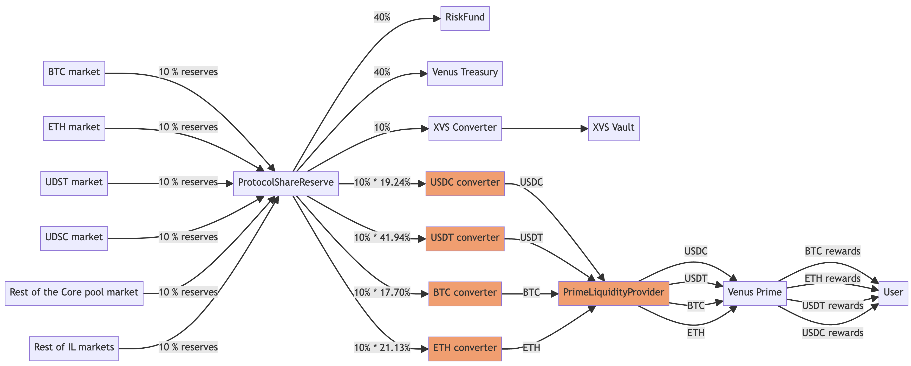

# Venus Prime


## Overview

This technical article explains implementation details of the Venus Prime program. The overview of the Venus Prime program can be checked [here](../../whats-new/prime-yield.md).

## Rewards

([*Main explanation of Prime rewards*](../../whats-new/prime-yield.md#technical-reward-details))

Qualifiable supply and borrow amounts limits are set by the staked XVS limit and the market multiplier. The USD values of the tokens and the USD value of XVS will be taken into account to calculate these caps. The following pseudocode shows how $$\sigma_{i,m}$$ is calculated considering the caps:

```jsx
borrowUSDCap = toUSD(xvsBalanceOfUser * marketBorrowMultipler)
supplyUSDCap = toUSD(xvsBalanceOfUser * marketSupplyMultipler)
borrowUSD = toUSD(borrowTokens)
supplyUSD = toUSD(supplyTokens)

// borrow side
if (borrowUSD < borrowUSDCap) {
  borrowQVL = borrowTokens
else {
  borrowQVL = borrowTokens * borrowUSDCap/borrowUSD
}

// supply side
if (supplyUSD < supplyUSDCap) {
  supplyQVL = supplyTokens
else {
  supplyQVL = supplyTokens * supplyUSDCap/supplyUSD
}

return borrowQVL + supplyQVL
```

**Significance of α**

A higher value of α increases the weight on stake contributions in the determination of rewards and decreases the weight on supply/borrow contributions. The value of α is between 0-1 (both excluded).

A default weight of 0.5 weight has been evaluated as a good ratio and is not likely to be changed. A higher value will only be needed if we want to attract more XVS stake from the Prime token holders at the expense of supply/ borrow rewards.

Here is an example to show how the score is impacted based on the value of α:

```jsx
User A:
Stake: 200
Supply/Borrow: 500

User B:
Stake: 100
Supply/Borrow: 1000

If alpha is 0.7 then:
user A score: 263.2764409
user B score: 199.5262315

If alpha is 0.3 then:
user A score: 379.8288965
user B score: 501.1872336
```

### Implementation of the rewards in solidity

There is a global `rewardIndex` and `sumOfMembersScore` variables per supported market. `sumOfMembersScore` represents the current sum of all the Prime token holders score. And `rewardIndex` needs to be updated whenever a user’s staked XVS or supply/borrow changes.

```jsx
// every time accrueInterest is called. delta is interest per score
delta = totalIncomeToDistribute / sumOfMembersScore;
rewardIndex += delta;
```

Whenever a user’s supply/borrow or XVS Vault balance changes we will recalculate the rewards accrued and add them to their account:

- In Comptroller (specifically in the `PolicyFacet`), after executing any operation that could impact the Prime score or interest, we accrue the interest and update the score for the Prime user by calling `accrueInterestAndUpdateScore`.
- In the `XVSVault`, after depositing or requesting a withdrawal, the function `xvsUpdated` is invoked, to review the requirements of Prime holders.

This is how we will calculate the user rewards:

```jsx
rewards = (rewardIndex - userRewardIndex) * scoreOfUser;
```

Then we will update the `userRewardIndex` (`interests[market][account]`) to their current global values.

## Income collection and distribution

Every market in Venus (including Isolated lending markets) contributes to the rewards that Prime contract will distribute, following the protocol [tokenomics](../../governance/tokenomics.md). The following diagram shows the flow of funds implemented.

<figure><figcaption></figcaption></figure>

Rewards will be distributed to Prime users only in USDT, USDC, BTC and ETH tokens. So, other tokens have to be converted to the tokens used for rewarding users in Prime. This conversion should follow a configurable (via VIP) distribution table, that initially will be this:

| Prime market | Distribution |
| --- | --- |
| USDC | 19.24% |
| USDT | 41.94% |
| BTC | 17.70% |
| ETH | 21.13% |

For Example:

- The CAKE market generates 1,000 CAKE of total income
- 10% of the CAKE total income should be allocated to Prime → 100 CAKE (following the protocol tokenomics)
- We should convert 100 CAKE to USDC, USDT, BTC and ETH, because in Prime the rewards are defined in these tokens
- The conversion should follow the previous table:
    - 19.24 CAKE should be converted to USDC
    - 41.94 CAKE should be converted to USDT
    - 17.70 CAKE should be converted to BTC
    - 21.13 CAKE should be converted to ETH

Interest reserves (part of the protocol income) from Isolated pools and core pool markets are sent to the PSR ([Protocol Share Reserve](https://github.com/VenusProtocol/protocol-reserve/blob/main/contracts/ProtocolReserve/ProtocolShareReserve.sol)) contract. Based on configuration a certain percentage of income from all markers is reserved for Prime token holders. The interest reserves will be sent to the PSR periodically (currently every 24 hours, but this can be changed by the community via [VIP](https://app.venus.io/governance)).

The PSR has a function `releaseFunds` that needs to be invoked to release the funds to the destination contracts. We have [SingleTokenConverter](https://github.com/VenusProtocol/protocol-reserve/contracts/TokenConverter/SingleTokenConverter.sol) contracts which receive income from the PSR and convert them to Prime supported reward tokens. 

Each `SingleTokenConverter` sends funds to `PrimeLiquidityProvider` contract which releases the funds to `Prime` contract. Distribution speeds for each of the reward token is configured in the `PrimeLiquidityProvider` contract and based on those speeds `Prime` distirbutes rewards. 

When a user claims their rewards and if the `Prime` contract doesn’t have enough funds then we trigger the release of funds from `PrimeLiquidityProvider` to `Prime` contract in the same transaction i.e., in the `claimInterest` function.

The following diagram shows the integration of the `SingleTokenConverter` contracts with the Prime contracts:

<figure><figcaption></figcaption></figure>

More information about Income collection and distribution can be found [here](../../whats-new/automatic-income-allocation.md).

## Update cap multipliers and alpha

Market multipliers and alpha can be updated at anytime and then need to be propagated to all users. Changes will be gradually applied to users as they borrow/supply assets and their individual scores are recalculated. This strategy has limitations because the scores will be wrong in aggregate until all Prime users have interacted with the markets.

To mitigate this issue, Venus will supply a script that will use the permission-less function `updateScores` to update the scores of all users. This script won’t pause market and `Prime` contracts. The scores will need to be updated in multiple transactions because a single transaction will run out of gas trying to update all scores.

As markets won't be paused, there could be inconsistencies due to user supply/borrow transactions in between updating scores transactions. These inconsistencies will be very minor compared to letting it update gradually when users will borrow/supply.

There are two main objectives for creating this script:

- If the Venus community wants to update the scores of all users when multipliers or alpha are updated then we have an immediate option.
- After minting Prime tokens if the Venus community decides to add an existing market to the Prime token program then the score of all users has to be updated to start giving them rewards. The scores cannot be applied gradually in this case as the initial Prime users for the market will get large rewards for some time. So this script will prevent this scenario.

There is a variable named `totalScoreUpdatesRequired` to track how many scores updates are pending. This is for tracking purposes and visibility to the community.

## Calculate APR associated with a Prime market and user

The goal is to offer a view function that allows the [Venus UI](https://app.venus.io) to show an estimation of the APR associated with the Prime token and the borrow/supply position of a user.

The steps to perform this calculation are:

1. Fetch the income per block from PrimeLiquidityProvider
2. Calculate the capped supply and borrow of the user for the market
3. Calculate the capped XVS balance of the user 
4. Calculate the user yearly income by multiplying (1) with blocks per year
5. Now borrow and supply APR of user can be calculated based on ratio of capped borrow and supply of the user. 

**Example:**

1. Income per block 0.00003 USDT
2. Income per year is 10512000 blocks/year * 0.00003 = 315.36 USDT
3. Assuming the user score for USDT: 3, and the sum of scores for USDT: 10, then we would have 94.608 USDT (yearly income for this user, generated by Prime)
4. Assuming the user has the following positions:
   1. borrow: 30 USDT. Let's say it's capped at 15 USDT, so we'll consider 15 USDT
   2. supply: 10 USDT. Let's say it's also capped at 15 USDT, so we'll consider 10 USDT
5. Allocating the rewards (94.608 USDT), considering these capped versions, we would have:
   1. borrow: 94.608 \* 15/25 = 56.76 USDT
   2. supply: 94.608 \* 10/25 = 37.84 USDT
6. Calculating the APR with these allocations, we would have:
   1. borrow: 56.76/30 = 1.89 = 189%
   2. supply: 37.84/10 = 3.78 = 378%

Only part of the supplied and borrowed amounts (the capped amounts) are actually "working" on increasing the Prime rewards. The rest of the supplied or borrowed amounts do not generate extra rewards. In the example, if the user supplies more USDT, they won't generate more rewards (because the supply amount to be considered is capped at 15 USDT). So, it would make sense that the supply APR would decrease if they supply more USDT.

## Bootstrap liquidity for the Prime program

There will be a bootstrap liquidity available for the Prime program. This liquidity:

- should be uniformly distributed during a period of time, configurable via VIP
- is defined in the multiple tokens enabled for the Prime program

These requirements will be mainly satisfied with the `PrimeLiquidityProvider` contract:

- The `Prime` contract has a reference to the `PrimeLiquidityProvider` contract
- The `Prime` contract will transfer to itself the available liquidity from the `PrimeLiquidityProvider` as soon as it’s needed when a user claims interests, to reduce the number of transfers
- The `Prime` contract takes into account the tokens available in the `PrimeLiquidityProvider` contract, when the interests are accrued and the estimated APR calculated

Regarding the `PrimeLiquidityProvider`,

- The `PrimeLiquidityProvider` contract maintains a speed per token (see `tokenDistributionSpeeds`, with the number of tokens to release each block), and the needed indexes, to release the required funds per block
- Anyone could send tokens to the `PrimeLiquidityProvider` contract
- Only accounts authorized via ACM will be able to change the `tokenDistributionSpeeds` attribute
- The `PrimeLiquidityProvider` provides a view function to get the available funds that could be transferred for a specific token, taking into account:
  - the current block number
  - the speed associated with the token
  - the last time those tokens were released
- The `PrimeLiquidityProvider` provides a function to transfer the available funds to the `Prime` contract.

## Pause `claimInterest`

There is a feature flag to enable/disable the function `claimInterest`. When this feature is paused, no users will be able to invoke this function.

The OpenZeppelin Plausable contract is used. Only the `claimInterest` function is under control of this pause mechanism.