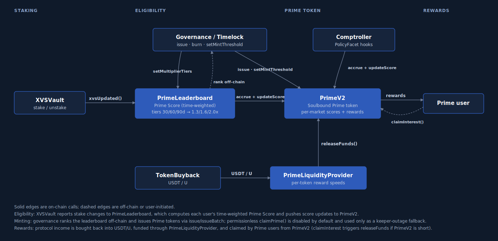
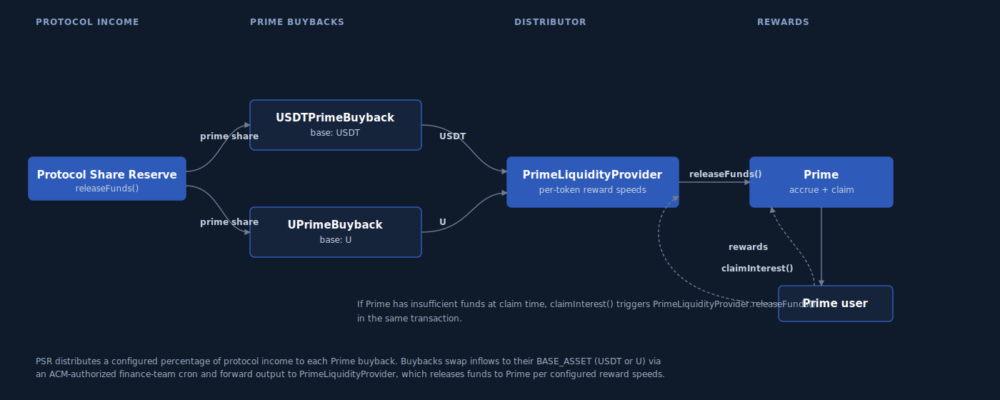

# Venus Prime

## Overview

This technical article explains the implementation details of the Venus Prime program. The high-level overview of the program can be found [here](../../whats-new/prime-yield.md).

Venus Prime is split across two contracts:

* **PrimeV2** — holds Soulbound Prime tokens, tracks per-market user scores, and distributes boosted rewards funded by protocol revenue through `PrimeLiquidityProvider`.
* **PrimeLeaderboard** — tracks time-weighted XVS staking and exposes a **Prime Score** used to decide who is eligible to mint a Prime token.

PrimeV2 is the current Prime architecture on BNB Chain. Other networks still run the earlier Prime (V1) contract and migrate to PrimeV2 per-chain through governance.

<figure><figcaption>PrimeV2 architecture — eligibility, governance and reward wiring</figcaption></figure>

## Eligibility and the leaderboard

### Prime Score

A user's **Prime Score** is their time-weighted stake, exposed on-chain via `getEffectiveStake` / `getEffectiveStakeBatch` (the contract returns it as `effectiveStake`).

`PrimeLeaderboard` records each user's XVS deposits as individual tranches (amount + timestamp). It is notified of every stake change by the `XVSVault` through the existing `xvsUpdated(user)` callback, which diffs the user's current vault balance against the last known total and records a deposit or a LIFO withdrawal accordingly.

Each tranche earns a multiplier based on how long it has been held:

| Holding duration | Multiplier (1e18) |
| --- | --- |
| < 30 days | 1.0x (base) |
| ≥ 30 days | 1.3x |
| ≥ 60 days | 1.6x |
| ≥ 90 days | 2.0x (cap) |

The Prime Score is:

```jsx
primeScore = Σ  deposit.amount × multiplier(holdingDuration) × min(holdingDuration, capSeconds)
```

where `capSeconds` is the longest configured tier duration (90 days by default). Tiers and the cap are configurable via `setMultiplierTiers(durations, multipliers)`; durations and multipliers must be strictly ascending and multipliers must be ≥ base (1e18).

Withdrawals are processed **LIFO** so the oldest, highest-multiplier deposits survive longest. To bound gas, a user keeps at most `MAX_DEPOSITS_PER_USER` (30) tranches; when the limit is reached, deposits are compacted — first by losslessly merging all max-tier tranches, then, if needed, by merging tranches within the same tier using an amount-weighted average timestamp.

### Minting

The primary minting path is **governance issuance**:

* `issue(user)` / `issueBatch(users)` let governance mint Prime tokens directly (ACM-gated). A keeper reads the leaderboard off-chain with `getEffectiveStakeBatch(users)`, ranks users, and governance issues tokens to the qualifying set.
* `burn(user)` / `burnBatch(users)` let governance revoke tokens (ACM-gated).

A **permissionless minting** window exists as a fallback and is **disabled by default**: `mintThreshold` initializes to `0`, so `claimPrime` / `claimPrimeBatch` revert with `MintThresholdNotSet`. Governance can open the window by calling `setMintThreshold(threshold, deadline)` — intended as a last resort if the keeper-driven issuance flow is unavailable. While open:

* `claimPrime(user)` / `claimPrimeBatch(users)` are permissionless — anyone can mint a Prime token for any user whose Prime Score ≥ `mintThreshold`. In the batch variant, users below the threshold are skipped (with a `SkippedIneligibleUser` event) rather than reverting the whole call.

Total Prime tokens are capped by `tokenLimit` (default 500). Setting `mintThreshold` back to `0` closes the window; a non-zero `mintDeadline` auto-closes it once `block.timestamp` passes it.

### Staker migration

When PrimeLeaderboard is first deployed, existing stakers are seeded with `initializeStakers(users, amounts, timestamps)` in batches (idempotent — already-seeded users are skipped). Once seeding is complete, `finalizeInitialization()` locks it permanently. The `XVSVault.primeToken` reference is then pointed at the leaderboard to begin live tracking.

## Rewards

([*Main explanation of Prime rewards*](../../whats-new/prime-yield.md#technical-reward-details))

Qualifiable supply and borrow amount limits are set by the staked XVS value and the market multiplier. The USD values of the tokens and of XVS are taken into account to calculate these caps. The following pseudocode shows how $$\sigma_{i,m}$$ is calculated considering the caps:

```jsx
borrowUSDCap = toUSD(xvsBalanceOfUser * marketBorrowMultipler)
supplyUSDCap = toUSD(xvsBalanceOfUser * marketSupplyMultipler)
borrowUSD = toUSD(borrowTokens)
supplyUSD = toUSD(supplyTokens)

// borrow side
if (borrowUSD < borrowUSDCap) {
  borrowQVL = borrowTokens
else {
  borrowQVL = borrowTokens * borrowUSDCap/borrowUSD
}

// supply side
if (supplyUSD < supplyUSDCap) {
  supplyQVL = supplyTokens
else {
  supplyQVL = supplyTokens * supplyUSDCap/supplyUSD
}

return borrowQVL + supplyQVL
```

**Significance of α**

A higher α value increases the weight of stake contributions when determining rewards and decreases the weight of supply/borrow contributions. The value of α is between 0-1 (both excluded).

A default weight of 0.5 has been evaluated as a good ratio and is not likely to be changed. A higher value would only be needed if Venus wanted to attract more XVS stake from Prime token holders at the expense of supply/borrow rewards.

Here is an example to show how the score is impacted based on the value of α:

```jsx
User A:
Stake: 200
Supply/Borrow: 500

User B:
Stake: 100
Supply/Borrow: 1000

If alpha is 0.7 then:
user A score: 263.2764409
user B score: 199.5262315

If alpha is 0.3 then:
user A score: 379.8288965
user B score: 501.1872336
```

### Implementation of the rewards in solidity

`rewardIndex` and `sumOfMembersScore` are global variables in supported markets used when calculating rewards. `sumOfMembersScore` represents the current sum of all Prime token holders' scores, and `rewardIndex` is updated whenever interest is accrued for a market.

```jsx
// every time accrueInterest is called. delta is interest per score
delta = distributionIncome / sumOfMembersScore;
rewardIndex += delta;
```

If interest accrues for a market while it has no scored members yet, the slice is recorded in `undistributedReward[underlying]` so governance can reclaim it later via `sweepUndistributed` instead of stranding it.

Whenever a user's supply/borrow or XVS Vault balance changes, the rewards accrued are recalculated and added to their account:

- In the Comptroller (specifically in the `PolicyFacet`), after any operation that could impact a Prime score or interest, `accrueInterestAndUpdateScore(user, market)` is called on PrimeV2.
- In the `XVSVault`, after depositing or requesting a withdrawal, `xvsUpdated(user)` is invoked on `PrimeLeaderboard`. The leaderboard updates its deposit tracking and then calls `accrueInterestAndUpdateScore(user)` on PrimeV2 so rewards are accrued at the old score before the score is recalculated.

User rewards are calculated as:

```jsx
rewards = (rewardIndex - userRewardIndex) * scoreOfUser;
```

The `userRewardIndex` (`interests[market][account].rewardIndex`) is then updated to the current global value.

### Per-cycle reward accounting

Rewards are tracked in monthly **cycles** for off-chain reporting. Each user's `interests[market][user].lifetimeAccrued` is a monotonic running total of every reward ever accrued to that user in that market — it grows alongside `accrued` but is never reset on claim. The off-chain pipeline computes a user's earnings for a given cycle as the difference between their `lifetimeAccrued` at the cycle's start and end.

Cycle boundaries are anchored on-chain: a keeper calls `recordCycleSnapshot(cycleId)`, which emits `CycleSnapshotRecorded(cycleId, block.number, block.timestamp)`. This is an operational hook (ACM-gated to a keeper, not the Timelock) and is intentionally not idempotent — the indexer de-duplicates repeated `cycleId`s. The snapshots themselves are read off-chain via `getLifetimeAccruedByMarket` / `getLifetimeAccruedByUser`, so no per-cycle state is stored on-chain beyond `lifetimeAccrued`.

## Income collection and distribution

Every market in Venus (including Isolated Lending markets) contributes to the rewards that PrimeV2 distributes, following the protocol [tokenomics](../../governance/tokenomics.md).

Prime rewards are denominated in the reward tokens accumulated by the `PrimeLiquidityProvider`. Protocol income that arrives in other tokens is converted into those reward tokens by [TokenBuyback](../../whats-new/token-converter.md) instances whose destination is the `PrimeLiquidityProvider`. On BNB Chain these are `USDTPrimeBuyback` (base asset USDT) and `UPrimeBuyback` (base asset U), so Prime rewards accumulate in USDT and U.

Interest reserves (part of the protocol income) from Isolated Pools and Core Pool markets are sent to the PSR ([Protocol Share Reserve](https://github.com/VenusProtocol/protocol-reserve/blob/main/contracts/ProtocolReserve/ProtocolShareReserve.sol)) contract. Based on the configuration, a percentage of income from all markets is reserved for Prime token holders. The interest reserves are sent to the PSR periodically (currently every 6 hours, changeable by the community via [VIP](https://app.venus.io/governance)).

The PSR has a function `releaseFunds` that releases the funds to the destination contracts. The Prime-destined `TokenBuyback` instances receive income from the PSR, swap it into the Prime reward tokens at DEX market rate via an ACM-authorized finance-team cron, and forward the output to `PrimeLiquidityProvider`. How much of each reward token is released to Prime users over time is controlled by the per-token distribution speeds configured in the `PrimeLiquidityProvider` via VIP (`setTokensDistributionSpeed`); there is no fixed allocation percentage hardcoded in Prime.

`PrimeLiquidityProvider` then releases the funds to the PrimeV2 contract according to distribution speeds configured per reward token.

If a user tries to claim their rewards and PrimeV2 doesn't have enough funds, the release of funds from `PrimeLiquidityProvider` to PrimeV2 is triggered in the same transaction (in the `claimInterest` function).

The following diagram shows the integration of the `TokenBuyback` contracts with the Prime contracts:

<figure><figcaption>PSR → Prime buybacks → PrimeLiquidityProvider → PrimeV2 → users</figcaption></figure>

More information about income collection and distribution can be found [here](../../whats-new/automatic-income-allocation.md).

## Update cap multipliers and alpha

Market multipliers and alpha can be updated at any time and then need to be propagated to all users. When `addMarket`, `updateMultipliers` or `updateAlpha` is called, PrimeV2 opens a new score-update round: it increments `nextScoreUpdateRoundId` and sets `pendingScoreUpdates` to the total number of Prime tokens. If a previous round was still in progress, it is discarded with an `IncompleteRoundDiscarded` event.

While `pendingScoreUpdates > 0`, issuing and burning are blocked (`ScoreUpdateInProgress`) until all scores have been recomputed. A keeper completes the round by calling the permissionless `updateScores(users)` in batches (split across multiple transactions to avoid running out of gas). Each user is updated at most once per round, tracked via `isScoreUpdated[roundId][user]`.

This mechanism ensures that when multipliers/alpha change, or a new market is added to the program, all Prime users' scores are brought up to date promptly rather than drifting until each user next interacts with the markets — which would otherwise let the first users in a new market collect disproportionately large rewards.

## Calculate APR associated with a Prime market and user

APR estimation lives in a separate read-only contract, **[PrimeLens](../../reference-core-pool/prime/prime-lens.md)**, kept out of PrimeV2 to stay within the EVM contract-size limit. The [Venus UI](https://app.venus.io) calls it to show the APR a user's Prime boost adds in a given market.

- `calculateAPR(market, user)` returns an `APRInfo` struct with the user's `supplyAPR` and `borrowAPR` (in BPS) plus the inputs behind them: `userScore`, `totalScore`, `xvsBalanceForScore`, `capital`, `cappedSupply`, `cappedBorrow`, `supplyCapUSD`, `borrowCapUSD`.
- `incomeDistributionYearly(vToken)` returns the annualized income for a market — the PrimeLiquidityProvider effective distribution speed for the market's underlying multiplied by `blocksOrSecondsPerYear` (PrimeV2 runs on `TimeManagerV8`, so this is per-second on time-based chains and per-block otherwise).

Conceptually the lens performs these steps:

1. Fetch the annualized income for the market (`incomeDistributionYearly`)
2. Compute the user's score and the market's total score, giving the user's share of that income over a year
3. Compute the user's capped supply and borrow for the market
4. Split the user's income share across the capped supply and borrow legs
5. Derive the supply and borrow APR from those legs

**Example:**

1. Annualized market income: 315.36 USDT
2. With user score 3 and total market score 10, the user's yearly income is 94.608 USDT
3. User positions — borrow 30 USDT (capped at 15), supply 10 USDT (capped at 10)
4. Allocating 94.608 USDT across the capped legs (15 + 10 = 25): borrow 94.608 × 15/25 = 56.76 USDT, supply 94.608 × 10/25 = 37.84 USDT
5. APR: borrow 56.76/30 = 189%, supply 37.84/10 = 378%

Only the supply and borrow amounts below the cap generate Prime rewards. Amounts above the cap do not generate extra rewards. In the example, if the user supplies more USDT they won't generate more rewards (the supply amount considered is capped), so the supply APR would decrease.

`getPendingRewards(user)` / `getPendingRewardsStatic(user)` on PrimeV2 remain available for reading already-accrued, claimable rewards per market (the former accrues first, the latter is a read-only view).

## Bootstrap liquidity for the Prime program

There is bootstrap liquidity available for the Prime program. This liquidity:

- should be uniformly distributed over a period of time, configurable via VIP
- is defined by the tokens enabled for the Prime program

These requirements are enforced with the `PrimeLiquidityProvider` contract:

- PrimeV2 holds a reference to the `PrimeLiquidityProvider` contract
- PrimeV2 transfers to itself the available liquidity from the `PrimeLiquidityProvider` as soon as it is needed when a user claims interest, to reduce the number of transfers
- PrimeV2 takes into account the tokens available in the `PrimeLiquidityProvider` contract when interest is accrued and the estimated APR is calculated

Regarding the `PrimeLiquidityProvider`:

- It maintains a speed per token (`tokenDistributionSpeeds`, the number of tokens to release each block or second, depending on the chain — PrimeLiquidityProvider runs on `TimeManagerV8`) and the indexes needed to release the required funds
- Anyone can send tokens to it
- Only accounts authorized via ACM can change the `tokenDistributionSpeeds`
- It accrues the distributable funds for a token via `accrueTokens` (public), based on the elapsed blocks or seconds, the token's speed, and the last accrued block/second; `getEffectiveDistributionSpeed` returns the current effective per-block/second rate for a token
- It exposes a function to transfer the available funds to the PrimeV2 contract

## Pausing

PrimeV2 uses OpenZeppelin's `PausableUpgradeable`. The ACM-gated `pause()` / `unpause()` functions control the user-facing entry points (`claimPrime`, `claimPrimeBatch`, `claimInterest`). Accrual and score-update functions (`accrueInterest`, `accrueInterestAndUpdateScore`, `updateScores`) are intentionally **not** gated by the pause, so reward accounting stays fair and keepers can finish score rounds even while the contract is paused.
