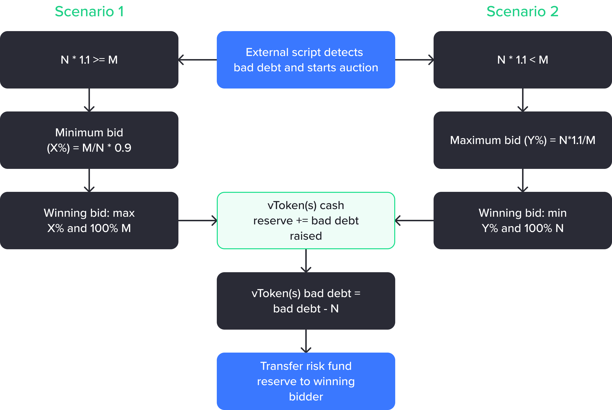

# Shortfall and auctions

A set of processes are executed in a market when a shortfall (total borrowed amount converted to USD is greater than the total supplied amount converted to USD) is detected for a borrower to pause the interest accrual on the borrow, write off the borrower's borrow balance and track the market bad debt.

_V_ represents the total bad debt including the accrued interest on the bad debt. To calculate the accrued interest the borrow index when the bad debt is detected is divided by the initial borrow index and then multiplied by the borrowed amount. For example, if the initial borrow index is 1.2 and when bad debt of 100 USDC is detected the borrow index is 1.5 then the _V_ (total bad debt) becomes 100 \* (1.5/1.2) = 125 USDC.

The calculated total bad debt of the account is written off for the borrower and interest accrual is stopped on the bad debt.

When the pool's bad debt reaches a minimum amount the risk fund reserve is auctioned off to cover the bad debt (see `Shortfall.minimumPoolBadDebt()`). Anyone will be allowed to start or restart an auction if the constraints are satisfied:

* no other auction is in progress for the same pool (`Shortfall.auctions(comptrollerAddress).status in (AuctionStatus.NOT_STARTED, AuctionStatus.ENDED)`)
* the bad debt accumulated in the pool, in USD, is greater than `Shortfall.minimumPoolBadDebt()`

Auction participants receive a maximum 10% incentive (configurable by the community via VIP, see `RiskFund.incentiveBps()`) for covering the bad debt. Depending on the size of the reserve in the risk fund, either 100% of bad debt or a portion of it is raised.

_N_ represents the total pool’s bad debt denoted in USD and _M_ represents total risk fund balance in USD.  When an auction begins, a starting bid is set to prevent bidders from taking advantage of the auction by opening with an undervalued bid. The highest bidder’s funds are locked, and when the auction closes the market(s) total cash reserve is increased, the bad debt of the market(s) is decreased and the risk fund partially/completely transferred to the winning bidder.

<figure><figcaption></figcaption></figure>

## Auction scenarios

In scenario 1, X% indicates the percentage of bad debt the bidder is willing to pay and in scenario 2, the Y% indicates the percentage of the risk fund the bidder is willing to seize. During the auction, bidders are only allowed to specify X% or Y% depending on the type of auction.

A bid will be successful only if the bidder has sufficient funds to cover the bad debt they are bidding for and they make the best offer. When a bid is placed it is transferred to the  `Shortfall` contract, and released if they are out bid. Subsequent bids should be placed within 100 blocks (adjustable via VIP, see `Shortfall.nextBidderBlockLimit()`) of the previous bid, otherwise anyone (including the winning bidder) can close the auction. If there is no bid for 100 blocks (adjustable via VIP, see `Shortfall.waitForFirstBidder()`) the auction can be restarted accounting for any changes in the risk fund and bad debt balance.

The auction process attempts to cover as much market bad debt as possible. In scenario 1, all of the bad debt may not be covered by the auction. In this case, the bad debt not covered will be maintained in the system until a new auction is started.

## Examples

Let’s take a scenario when bad debt is greater than the total risk fund balance.

* **Bad Debt**: Assuming that pool bad debt is 10 BTC and the price of BTC is $20,000. Then, the total bad debt is $200,000. If the incentive is 10% then the final bad debt is $220,000.
* **Risk Fund**: Given the risk fund is stored in USDT token, the token risk fund balance is 100,000 USDT and 1 USDT is equal to $1, then the total risk fund balance is $100,000
* **Minimum Bid**: In order for a user to bid they have to supply a minimum percentage of bad debt calculated as `(100000/220000) * 0.9 = 40.90%`
* **User A Starts Auction**: User A notices that the pool’s bad debt is greater than the minimum bad debt required to start an auction, then they can start an auction using this function call:
  * **Minimum Pool Bad Debt**: You can find the minimum required bad debt for a pool to start an auction using `minimumPoolBadDebt` state variable and the bad debt of individual markets using the `badDebt` state variable of the vToken contract.
  * **Start Auction Signature**: `startAuction(comptrollerAddress)`
    * Address of the pool’s comptroller.
    * Starting an auction triggers `AuctionStarted` event which can be monitored to get notifications.
* **User A Places Bid**: Now user A sees that the auction has started and wishes to place a bid. In this case, the user will place the minimum bid and try to seize the risk fund balance at the lowest value possible:
  * **Block Limit**: Note that the first bid has to be placed within 100 blocks from starting the auction, otherwise the auction needs to be restarted.
  * **Approval**: You need to give approval to the `Shortfall` contract to transfer the bid amount of funds to itself.
    * To calculate the amount for approval you need to first decide the bid bps. In this case, the minimum bid bps can be read using `auctions[comptrollerAddress].startBidBps` state variable.
    * In this example, it’s 4090 i.e., 40.90%. So you need to transfer 40.90% of 10 BTC which is 4.9 BTC. This is the approval amount. If there are multiple tokens as part of the bad debt then you have to provide 40.90% of each of the tokens bad debt.
    * You can find the list of markets involved in the bad debt by using `auctions[comptrollerAddress].markets` variable and then retrieving the underlying token of each of the markets using `underlying()` function.
  * **Place Bid Signature**: `placeBid(comptrollerAddress, bidBps, auctionStartBlock)`
    * **Auction Start Block**: This is the block number when the auction was started. You can find this using: `auctions[comptrollerAddress].startBlock` state variable.
    * Placing a bid triggers `BidPlaced` event which can be monitored.
* **User B Places Bid**: Now user B sees an opportunity and decides to place a bid. They have to place a bid bigger than 40.90% bid bps to succeed in placing the bid. For example, user B places a bid for 41% to outperform User A’s bid.
  * **Refund**: User A will immediately receive back the BTC they sent to the `Shortfall` contract as part of the first bid.
* **User A Places Improved Bid**: Now user A sees that User B places a better bid. Then User A can wish to complete with a better bid again. Suppose user A places a new bid for 43%.
* **User A Closed Auction**: After placing a bid, User A waits for 100 blocks and sees there are no new bids that outperform their bid then they can close the auction and win it.
  * **Close Auction Signature**: `closeAuction(comptrollerAddress)`
  * **Risk Fund Transfer**: At this point in time all the 100,000 USDT is transferred from the risk fund to user A’s address.

***

Scenario when bad debt is less than total risk fund balance

* **Bad Debt**: Assuming pool bad debt is 10 BTC and the price of BTC is $20,000. Then, the total bad debt is $200,000. Suppose the incentive is 10% then the final bad debt is $220,000.
* **Risk Fund**: Given the risk fund is stored in USDT token, the token risk fund balance is 500,000 USDT and 1 USDT is equal to $1, then the total risk fund balance is $500,000
* **Maximum Bid**: Now for a user to bid they have to supply 100% of the bad debt and can claim a maximum of `(220000 * 1.1) * 500000 = 48.40%` of the risk fund balance.
* **User A Starts Auction**: Now suppose user A notices that the pool’s bad debt is greater than the minimum bad debt required to start an auction, then they can start an auction.
  * **Minimum Pool Bad Debt**: You can find the minimum required bad debt for a pool to start an auction using `minimumPoolBadDebt` state variable and the bad debt of individual markets using `badDebt` state variable of the vToken contract.
  * **Start Auction Signature**: `startAuction(comptrollerAddress)`
    * Address of the pool’s comptroller.
    * Starting an auction triggers `AuctionStarted` event which can be monitored to get notifications.
* **User A Places Bid**: Now user A sees that the auction has started and wishes to place a bid. In this case, the user will place the maximum bid and try to seize the maximum possible risk fund balance by covering 100% of bad debt:
  * **Block Limit**: Note that the first bid has to be placed within 100 blocks from starting the auction, otherwise it needs to be restarted.
  * **Approval**: You need to give approval to the `Shortfall` contract to transfer the bid amount of funds to itself.
    * **Amount**: You need to transfer 10 BTC i.e., the complete bad debt. This is the approval amount. If there are multiple tokens as part of the bad debt then you have to provide complete bad debt for each token.
    * You can find the list of markets involved in the bad debt using `auctions[comptrollerAddress].markets` variable and then read the underlying token of each of the markets using `underlying()` function.
  * **Place Bid Signature**: `placeBid(comptrollerAddress, bidBps, auctionStartBlock)`
    * **Auction Start Block**: This is the block number when the auction was started. You can find this using: `auctions[comptrollerAddress].startBidBps` state variable.
    * **Bid BPS**: In this example, the bid bps is 100% which indicates 100% of 48.40% (i.e., 242,000 USDT).
    * Placing a bid triggers `BidPlaced` event which can be monitored.
* **User B Places Bid**: Now user B sees an opportunity and decides to place a bid. They have to place a bid lower than 100% bid bps to succeed in placing a bid. Image user B places a bid for 95% (i.e., risk fund seize amount is `242000 - (100-95)% = 229900` ) to outperform User A’s bid.
  * **Refund**: User A will immediately receive back the BTC they sent to the `Shortfall` contract as part of the first bid.
* **User A Places Improved Bid**: Now user A sees that User B places a better bid. Then User A can wish to complete with a better bid again. Suppose user A places a new bid for 94%.
* **User A Closed Auction**: After placing a bid, User A waits for 100 blocks and sees there are no new bids that outperform their bid then they can close the auction and win it.
  * **Close Auction Signature**: `closeAuction(comptrollerAddress)`
  * **Risk Fund Transfer**: At this point in time 94% of 242,000 USDT i.e., 227,480 USDT is transferred from the risk fund to user A’s address.

***

Scenario when the auction was started and nobody participated so instead of starting a new auction we need to restart the auction

* **Auction Started**: Suppose an auction was started and there was no bidder till 100 blocks. Then in this case the auction is stale and bids cannot be placed.
* **Restart Auction**: Now suppose a user wants to restart the auction and/or place a bid then they can restart using:
  * **Restart Auction Signature**: `restartAuction(comtrollerAddress)`
* **Place Bids and Close Auction**: Now just like previous steps a user can place bids and close the auction.
