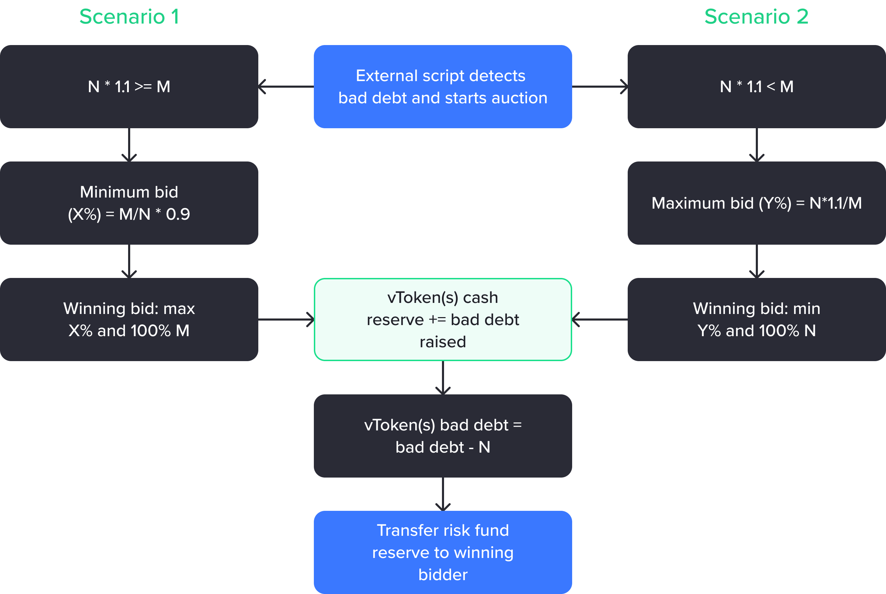

# Shortfall and auctions


**Legacy and disabled on BNB Chain.** This page describes the former Shortfall auction design used by Venus Isolated Pools. [Isolated Pools have been deprecated](../../guides/isolated-pools-deprecation.md).

At BNB Chain block `118328948` (August 27, 2026, 05:38:04 UTC), `Shortfall.auctionsPaused()` was `true`, and every pool returned by the PoolRegistry had auction status `NOT_STARTED`. The pause was executed as part of the TokenBuyback migration in [this transaction](https://bscscan.com/tx/0xe49e06d4711752f731cb38879c23c9a6954b2c6d7b57181352a32a2ef8552c85).

Do not approve tokens to Shortfall or call `startAuction`, `restartAuction`, or `placeBid` based on this historical page. Users with remaining Isolated Pool positions should follow the deprecation guide linked above. A historical bidder with a nonzero `tokenDebt(token, account)` may still need the separate `claimTokenDebt` recovery path.


## Historical design

When an undercollateralized borrow was written off in an Isolated Pool market, its borrow balance stopped accruing interest and the market tracked the amount as bad debt.

_V_ represents total bad debt including interest accrued before the write-off. If the initial borrow index was 1.2 and the borrow index was 1.5 when 100 USDC of principal became bad debt, then:

```text
V = 100 USDC × (1.5 / 1.2) = 125 USDC
```

Historically, anyone could start an auction when:

* no auction was in progress for that pool (`status` was `NOT_STARTED` or `ENDED`); and
* the pool's USD-denominated bad debt was greater than or equal to `Shortfall.minimumPoolBadDebt()`.

`Shortfall.incentiveBps()` configured the bidder incentive. Its value at the snapshot block above was 1,000 bps, or 10%; 10% was a configured value, not a source-enforced maximum.

_N_ represents the pool's total bad debt in USD and _M_ represents the pool's risk-fund balance in USD. After calculating the bad debt plus the configured incentive, the historical source selected the auction type as follows:

* `LARGE_POOL_DEBT` when the bad debt plus incentive was greater than or equal to _M_: bidders competed by offering a larger percentage of every market's bad debt. The winner was owed the auction's entire `seizedRiskFund` snapshot; Shortfall either transferred the payout or recorded it as claimable `tokenDebt` if the transfer to the winner failed.
* `LARGE_RISK_FUND` when the bad debt plus incentive was less than _M_: every bidder covered 100% of every market's bad debt and competed by requesting a smaller percentage of the `seizedRiskFund` snapshot.

<figure><figcaption>Historical Shortfall auction scenarios</figcaption></figure>

## Auction state and pause semantics

The historical ABI was:

```solidity
function startAuction(address comptroller) external;

function restartAuction(address comptroller) external;

function placeBid(
    address comptroller,
    uint256 bidBps,
    uint256 auctionStartBlockOrTimestamp
) external;

function closeAuction(address comptroller) external;
```

The third argument to `placeBid` had to equal `auctions(comptroller).startBlockOrTimestamp`. It was not `startBidBps`, and the deployed struct did not have a `startBlock` field.

The generated `auctions(address)` getter exposed only scalar fields. It did not expose the dynamic `markets` array or the per-market `marketDebt` and `bidAmount` mappings. Historical integrations had to obtain `auctionStartBlockOrTimestamp`, `markets`, `marketsDebt`, and `startBidBps` from the matching `AuctionStarted` event, then independently verify every underlying token and its decimals. `Comptroller.getAllMarkets()` describes current pool membership and is not a substitute for an auction snapshot.

Pausing had function-specific effects:

| Function | Effect while `auctionsPaused() == true` |
|---|---|
| `startAuction` | Reverted. |
| `restartAuction` | Reverted. |
| `placeBid` | Did not check the pause flag; it could accept a bid only if an auction was already `STARTED` and not stale. |
| `closeAuction` | Did not check the pause flag; it could close an already `STARTED` auction with a bidder after the configured limit. |
| `claimTokenDebt` | Remained available for historical transfer debt. |

Therefore, a pause flag alone did not prove that no auction required completion. The block-specific state check recorded at the top of this page separately confirmed that all eight registered BNB Chain pools were `NOT_STARTED`.

At the snapshot block, both `waitForFirstBidder` and `nextBidderBlockLimit` were 100 blocks. In the historical source, an auction with no bidder became stale only when the current block was greater than `startBlockOrTimestamp + waitForFirstBidder`. An auction with a bidder could be closed only when the current block was greater than `highestBidBlockOrTimestamp + nextBidderBlockLimit`.

## Historical examples

The following examples explain the old source calculations. They are not instructions to participate in an auction.

### Scenario 1: bad debt plus incentive equals or exceeds the risk fund

Assume:

* market bad debt: 10 BTC;
* BTC price: $20,000, so _N_ = $200,000;
* `incentiveBps`: 1,000, or 10%; and
* risk-fund balance _M_: 100,000 USDT, worth $100,000.

This was a `LARGE_POOL_DEBT` auction. The source calculated the starting bid as:

```text
startBidBps = floor(10,000 × 10,000 × M
                    / (N × (10,000 + incentiveBps)))

                = floor(100,000,000 × 100,000
                    / (200,000 × 11,000))

                = 4,545 bps = 45.45%
```

For a market with 10 BTC of snapshotted debt, the first bid transferred:

```text
floor(10 BTC × 4,545 / 10,000) = 4.545 BTC
```

The bidder historically had to approve the Shortfall proxy for at least the calculated amount of each underlying token in the `AuctionStarted` snapshot. Integer division rounded each token amount down in its smallest unit.

The first bid had to be at least 4,545 bps. Subsequent bids had to be higher than the current highest bid—for example, 4,600 bps and then 4,700 bps. A 4,090 bps, 41%, or 43% bid would not satisfy this example's starting-bid constraint. When a better bid was accepted, the previous bidder's deposited tokens were returned or recorded as claimable token debt if the transfer failed.

After the winning bid remained unchallenged beyond the configured next-bidder limit, `closeAuction(comptroller)` transferred the winning token amounts to the markets and requested the full 100,000 USDT `seizedRiskFund` snapshot for the winner. Shortfall then transferred that payout to the winner or recorded it as claimable `tokenDebt` if the winner transfer failed.

### Scenario 2: the risk fund exceeds bad debt plus incentive

Assume the same 10 BTC of debt at $20,000 per BTC, but a 500,000 USDT risk-fund balance.

This was a `LARGE_RISK_FUND` auction. The source applied the 10% incentive once:

```text
badDebtPlusIncentive = $200,000 × (1 + 1,000 / 10,000)
                     = $220,000

share of total risk fund = $220,000 / $500,000 = 44%
```

The auction's `seizedRiskFund` snapshot was therefore 220,000 USDT, not 242,000 USDT. Every bidder transferred the full 10 BTC of snapshotted bad debt. `bidBps` selected the fraction of the 220,000 USDT snapshot that the bidder requested:

| Bid | Requested risk-fund amount |
|---:|---:|
| 100% | 220,000 USDT |
| 95% | 209,000 USDT |
| 94% | 206,800 USDT |

The first bid could be at most 100%, and each subsequent bid had to be lower than the current highest bid. After the next-bidder limit passed, `closeAuction(comptroller)` calculated the winner's payout from the winning percentage of the 220,000 USDT snapshot; the payout was transferred or recorded as claimable `tokenDebt` if the winner transfer failed.

### Historical restart behavior

When an auction had no bidder and became stale, `restartAuction(comptroller)` ended the old auction and created a new snapshot of bad debt and risk-fund balances. Restarting required auctions not to be paused. Because BNB Chain auctions are currently paused and all registered pools were `NOT_STARTED` at the recorded block, this historical restart flow is not currently available.
