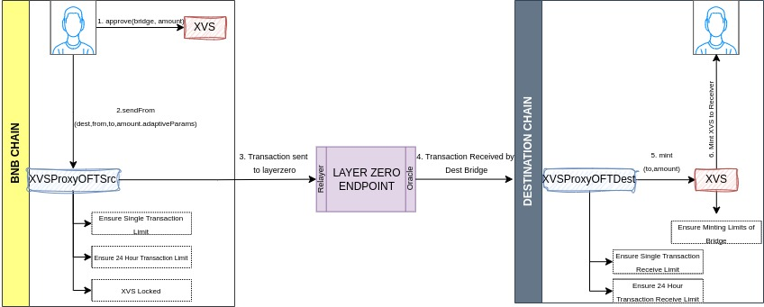
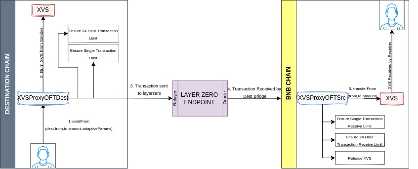
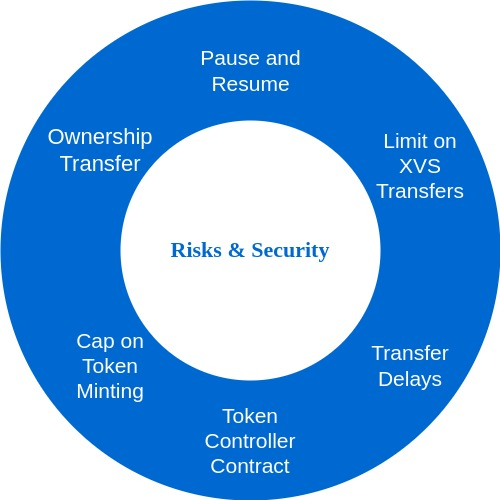

# Cross-Chain Bridge Documentation

This documentation provides detailed instructions and explanations for using the Cross-Chain Bridge. The Bridge allows users to transfer tokens between different blockchain networks, specifically between the BNB and the Destination Chain. The system consists of multiple contracts, including XVSBridgeAdmin, XVSProxySrc, XVSProxyDest, and XVS token contracts.

**_The functionality of the protocol relies on LayerZero for the seamless transfer of XVS tokens across different networks. Consequently, the security and integrity of the token on each network are subject to potential vulnerabilities inherent in the bridging mechanism. It is essential to note that these risks are a general characteristic of integrating with network bridges and do not stem from any particular weaknesses within the token implementation._**

## Table of Contents

1. [Getting Started](#1-getting-started)
   - [1.1. Approving XVS Tokens](#11-approving-xvs-tokens)
   - [1.2. Estimating Transaction Fees](#12-estimating-transaction-fees)
2. [Transferring Tokens](#2-transferring-tokens)
   - [2.1. Sending Tokens](#21-sending-tokens)
3. [Receiving Tokens on the Destination Chain](#3-receiving-tokens-on-the-remote-chain)
4. [Transferring Tokens Back to the BNB](#4-transferring-tokens-back-to-the-bnb)
5. [Monitoring Transaction Status](#5-monitoring-transaction-status)
6. [Security and Risks](#6-security-and-risks)

   - [6.1. Ownership Transfer](#61-ownership-transfer)
   - [6.2. Pause and Resume](#62-pause-and-resume)
   - [6.3. Limit the Amount of XVS Transfers](#63-limit-the-amount-of-xvs-transfers)
   - [6.4. Transfer Delays](#64-transfer-delays)
   - [6.5. Token Controller Contract](#65-token-controller-contract)
   - [6.6. Cap on Token Minting](#66-cap-on-token-minting)

7. [Contract Details](#7-contract-details)
   - [7.1. XVSBridgeAdmin](#71-xvsbridgeadmin)
   - [7.2. XVSProxySrc](#72-xvsproxysrc)
   - [7.3. XVSProxyDest](#73-xvsproxydest)
   - [7.4. XVS Token](#74-xvs-token)
8. [Variables and Configuration](#8-variables-and-configuration)
9. [Additional Features](#9-additional-features)
   - [9.1. Oracle Integration](#91-oracle-integration)
   - [9.2. Whitelist Mechanism](#92-whitelist-mechanism)
   - [9.3. Transaction Limits](#93-transaction-limits)
   - [9.4. Pause and Unpause Mechanism](#94-pause-and-unpause-mechanism)
10. [Possible Failures of Bridging XVS Tokens](#10-possible-failures-of-bridging-xvs-tokens)
    - [10.1. Sending XVS tokens from the source chain](#101-sending-xvs-tokens-from-the-source-chain)
    - [10.2. Receiving XVS tokens on the destination chain](#102-receiving-xvs-tokens-on-the-destination-chain)

## 1. Getting Started 

To start using the Cross-Chain Bridge, follow these steps:

### 1.1. Approving XVS Tokens 

Before transferring XVS tokens, you need to approve the Bridge contract on the BNB to spend XVS tokens on your behalf. Follow these steps:

1. Call the `approve` function of the XVS token contract with the following parameters:
   - `_spender`: Address of the Bridge contract on the BNB.
   - `_amount`: Amount of XVS tokens to approve for transfer.

### 1.2. Estimating Transaction Fees 

To estimate the transaction fees required to send XVS tokens to the Destination Chain, call the `estimateSend` function of the Bridge contract with the following parameters:

- `_dstChainId`: Destination Chain ID (e.g., Ethereum virtual chain ID (101))
- `_toAddress`: Receiver address on the Destination Chain
- `_amount`: Amount of XVS tokens you want to send
- `_useZro`: `false` (indicating that you are not paying in layer zero ZRO tokens)
- `_adapterParams`: `0x` (empty bytes as no custom adapter is used)

## 2. Transferring Tokens 

The actual token transfer is performed using the `sendFrom` function of the Bridge contract. Follow these steps:

### 2.1. Sending Tokens 

<figure><figcaption></figcaption></figure>

1. Call the `sendFrom` function of the Bridge contract with the following parameters:
   - `_from`: Your address on the BNB
   - `_dstChainId`: Destination Chain ID (e.g., Sepolia virtual chain ID)
   - `_toAddress`: The address on the Destination Chain where you want to receive the XVS tokens
   - `_amount`: Amount of XVS tokens you want to send
   - `_callParams`: ["RefundGasAddress", "ZROaddress", "adapterParams"]
     - `RefundGasAddress`: Address where you want to receive a refund for excessive gas sent.
     - `ZROaddress`: `0x0000000000000000000000000000000000000000` (indicating that you are not paying in ZRO tokens)
     - `adapterParams`: `0x` (empty bytes, as no custom adapter is used)

## 3. Receiving Tokens on the Destination Chain 

When you send XVS tokens to the Destination Chain using the Bridge, the tokens will be minted by the Bridge contract to the receiver's address on the Destination Chain.

## 4. Transferring Tokens Back to the BNB 

<figure><figcaption></figcaption></figure>

To transfer XVS tokens back to the BNB, follow a similar process as mentioned in the earlier send section. You don't need to approve the Bridge contract on the Destination Chain to spend XVS tokens on your behalf. The tokens will be burned on the Destination Chain on your behalf and unlocked and transferred to the receiver's address on the BNB.

## 5. Monitoring Transaction Status 

After initiating a token transfer, you should wait for the transaction to confirm. This process may take a few minutes. Once the transaction confirms, you will receive the bridged XVS tokens on the Destination Chain.

## 6. Security and Risks 

<figure><figcaption></figcaption></figure>

### 6.1. Ownership Transfer 

- Use the `transferOwnership` method in the XVSBridgeAdmin contract to transfer ownership of the admin contract.
- Use the `transferBridgeOwnership` method to transfer ownership of the Bridge contract from one contract to another.
- Ownership control is crucial in case of emergencies or security issues.

### 6.2. Pause and Resume 

- The Bridge includes a pause and unpause mechanism. Use the `pause` method to halt the contract's functionality and `unpause` to resume.
- Pausing is a security measure to prevent further transactions during emergencies or potential attacks.
- Cross-chain messages that attempt to mint or release tokens to the receiver can be received by the destination bridge. These messages will fail, but they can be retried once the destination bridge has been unpaused.

### 6.3. Limit the Amount of XVS Transfers 

- Example: Limit the maximum XVS transfer to USD 1,000 in one transaction and USD 100,000 in one day. These limits can be adjusted using VIPs.

### 6.4. Transfer Delays 

- Configurable delay after XVS transfers to the target network by specifying a minimum number of blocks in the layer zero endpoint configuration.

### 6.5. Token Controller Contract 

- Token Controller contract within the XVS token deployed on the target network to blacklist addresses, preventing them from transferring or receiving XVS. Integrated with the ACM.

### 6.6. Cap on Token Minting 

- Cap on the amount of tokens that can be minted in the destination target network. This feature can be integrated in Token Controller.

### Bridge Model

The XVSProxyOFTDest contract serves as the bridge model. It will be authorized to mint and burn tokens in the destination chain. Limits on these actions will be set by Governance or Guardian.

## 7. Contract Details 

Here, we provide more details about the key contracts used in the Bridge:

### 7.1. XVSBridgeAdmin 

- XVSBridgeAdmin is the admin contract for the bridge, ensuring proper setup.
- It contains a `functionRegistry` mapping for function signatures, allowing the contract to call corresponding methods in destination contracts after ensuring access control permissions.
- Ownership transfers for XVSBridgeAdmin and Bridge can be executed via the `transferOwnership` and `transferBridgeOwnership` methods respectively.

### 7.2. XVSProxySrc 

- XVSProxySrc extends the BaseOFTV2 contract and includes custom logic for token transfers.
- It overrides the `_debitFrom` and `_creditTo` functions, checking transaction limits and user eligibility.
- It enforces transaction limits, tracks 24-hour window limits, and allows whitelisting of users.
- XVSProxySrc can be paused and resumed in emergencies.

### 7.3. XVSProxyDest 

- XVSProxyDest is similar to XVSProxySrc but with specific differences.
- Transaction limits are enforced primarily for outbound amounts only in the source chain.
- It overrides the `debitFrom` function to include custom logic for checking transaction limits in USD and performs an external call to the XVS token contract to burn tokens from the sender.
- It overrides the `creditTo` function to trigger an external call to the XVS token contract to mint tokens for the receiver.
- When sending tokens from this contract, it burns user tokens, with the burning logic residing in the XVS token contract.
- When receiving tokens, it mints tokens for the receiver, with the minting logic residing in the XVS token contract.

### 7.4. XVS Token 

- The XVS token contract is deployed on destination/Destination Chains, and it is used within the XVSProxyDest contract.
- The XVS Token follows the ERC20 standard and extends the `TokenController` ownable contract, which contains all controlling mechanisms of the XVS.
- It is responsible for setting minting limits for the minter (in this case, the remote bridge contract).
- When receiving transactions and tokens from the source chain's Bridge contract, an external call is made to mint tokens for the receiver.
- When sending tokens to the source chain's Bridge contract, an external call is made from the bridge contract to burn tokens from the sender.
- Offers a blacklisting feature to prevent certain users from receiving XVS tokens.
- ACM integration is used for setting minting caps and blacklisting, and these settings can be configured via multisig now and VIPs in the near future.

## 8. Variables and Configuration 

Here, we provide details about the key variables and configuration settings used in the Bridge:

- `address public accessControlManager`: Stores the address of the access control manager contract. This contract manages permissions for who can call certain functions.
- `ResilientOracleInterface public oracle`: Represents the interface to interact with the ResilientOracle contract. This contract is responsible for providing price information, especially related to token values.
- `mapping(uint16 => uint256) public chainIdToMaxSingleTransactionLimit`: Maps a destination chain ID to the maximum limit (in USD) for a single transaction to that chain.
- `mapping(uint16 => uint256) public chainIdToMaxSingleTransactionReceiveLimit`: Maps a destination chain ID to the maximum limit (in USD) for a single transaction to receive from that chain.
- `mapping(uint16 => uint256) public chainIdToMaxDailyLimit`: Maps a destination chain ID to the maximum limit (in USD) for the total value of transactions in a 24-hour window to that chain.
- `mapping(uint16 => uint256) public chainIdToMaxDailyReceiveLimit`: Maps a destination chain ID to the maximum limit (in USD) for the total value of transactions in a 24-hour window that can be received from that chain.
- `mapping(uint16 => uint256) public chainIdToLast24HourTransferred`: Maps a destination chain ID to the total value of transactions transferred to that chain in the current 24-hour window.
- `mapping(uint16 => uint256) public chainIdToLast24HourReceived`: Maps a destination chain ID to the total value of transactions received from that chain in the current 24-hour window.
- `mapping(uint16 => uint256) public chainIdToLast24HourWindowStart`: Maps a destination chain ID to the timestamp when the current 24-hour window started for transactions to that chain.
- `mapping(address => bool) public whitelist`: A mapping of addresses to a boolean indicating whether the address is whitelisted, exempting it from certain limits.

## 9. Additional Features 

In addition to the core functionality, the Bridge includes additional features to enhance its capabilities:

### 9.1. Oracle Integration 

- The contract incorporates an oracle integration through the `ResilientOracleInterface`. It allows the contract to fetch price data for the token using the `getPrice` function.

### 9.2. Whitelist Mechanism 

- The contract implements a whitelist mechanism to skip checks on transaction limits for whitelisted addresses. The `whitelist` mapping is used to track whitelisted addresses. The `setWhitelist` function allows adding or removing addresses from the whitelist.

### 9.3. Transaction Limits 

- The contract introduces transaction limits for both sending and receiving transactions, based on a daily and single transaction basis. The limits are defined using `chainIdToMaxSingleTransactionLimit`, `chainIdToMaxDailyLimit`, `chainIdToMaxSingleReceiveTransactionLimit`, and `chainIdToMaxDailyReceiveLimit`.

### 9.4. Pause and Unpause Mechanism 

- The contract incorporates a pause and unpause mechanism using the `Pausable` library. The `pause` and `unpause` functions can be used to halt and resume the contract's functionality, respectively.

## 10. Possible Failures of Bridging XVS Tokens 

### 10.1. Sending XVS tokens from the source chain 

- The oracle temporarily fails due to reasons including being paused by the owner, incorrect address configuration, or price validation failures.
- The transfer amount exceeds the single or daily sending transaction limit.
- The transfer amount is too small, becoming zero after removing dust.
- The sender is blacklisted by the XVS token.
- The destination bridge is not configured as a trusted remote.

### 10.2. Receiving XVS tokens on the destination chain 

- The oracle temporarily fails due to reasons including being paused by the owner, incorrect address configuration, or price validation failures.
- The transfer amount exceeds the single or daily receiving transaction limit.
- The recipient is blacklisted by the XVS token.
- The minting cap on the destination bridge is exceeded.

## Conclusion

This documentation provides a comprehensive guide to using the Cross-Chain Bridge, including its core functionality, contract details, admin functions, variables, and additional features. By following the provided steps and guidelines, users can seamlessly transfer tokens between different blockchain networks.
