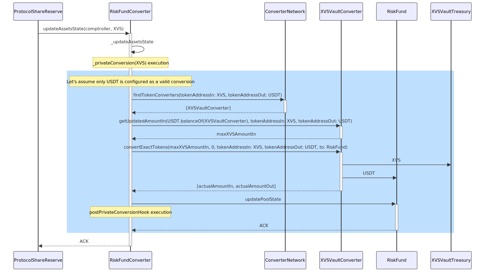

# Token converters


Only available on BNB chain and Ethereum



The [Venus CLI](https://github.com/VenusProtocol/keeper-bots/blob/develop/packages/cli/README.md) supports making conversions using flash swaps on Pancake Swap to fund the conversion.

The [Token Converter Bot](https://github.com/VenusProtocol/keeper-bots/blob/develop/packages/token-converter-bot/README.md) shows how to interact with the converters and can be used as a base to build advanced conversion strategies.


## Overview

The **Venus Protocol** generates income in various underlying tokens from interest and liquidation fees, that are then sent to the ProtocolShareReserve contract. The `ProtocolShareReserve` contract disburses these earnings to number of destinations. The distributions to the converter contracts are listed next.

### BNB Chain

| Converter               | Accepts           | Interest Reserves (%)| Liquidation Income (%)  |
|-------------------------|-------------------|----------------------|-------------------------|
| RiskFundConverter       |     USDT          |     0%               |                      0% |
| XVSVaultConverter       | 	XVS	          |     20%	             |                     20% |
| USDTPrimeConverter      | 	USDT          | 	10%	             |                      0% |
| USDCPrimeConverter      | 	USDC          | 	6%	             |                      0% |
| BTCBPrimeConverter      | 	BTCB          | 	1%               |                      0% |
| ETHPrimeConverter       | 	ETH	          |     3%               |                      0% |

### Ethereum Chain

| Converter               | Accepts           | Interest Reserves (%)| Liquidation Income (%)  |
|-------------------------|-------------------|----------------------|-------------------------|
| RiskFundConverter       |     USDT          |     0%               |                      0% |
| XVSVaultConverter       | 	XVS	          |     20%	             |                     20% |
| USDTPrimeConverter      | 	USDT          | 	1.4%             |                      0% |
| USDCPrimeConverter      | 	USDC          | 	1.4%             |                      0% |
| WBTCPrimeConverter      | 	WBTC          | 	1.4%             |                      0% |
| WETHPrimeConverter      | 	WETH	      |     15.8%            |                      0% |

`XVSVaultConverter` and every Prime converter are instances of `SingleTokenConverter` contract.

`RiskFundConverter` and `SingleTokenConverter` convert incoming earnings into specific tokens, with `RiskFundConverter` converting them into RiskFund's convertible base asset and `SingleTokenConverters` converting them into their `baseAsset`. Each time a conversion is completed, the resulting tokens are sent to their respective destination addresses.

The following diagram illustrates the flow of funds between contracts and its architecture:

<figure><figcaption>Integration of Token Converters in the Venus protocol</figcaption></figure>

- The transfer of funds to and from the `ProtocolShareReserve` contract are initiated by external agents (permissionless).
- The transfers of funds from the Token Converters to their destinations are performed on each conversion. The conversions are performed by external agents (permissionless).
- The transfer of XVS from the `XVSVaultTreasury` to the `XVSVault` will be performed via VIP.

`RiskFundConverter` and `SingleTokenConverters` possess the ability to "facilitate" token conversions for the income they receive, obtaining the desired tokens (base asset) by relying on oracle prices as reference points to accept conversions that external agents will carry out.

Venus encourages these conversions by providing incentives that create arbitrage opportunities in the market, with the expectation that external agents will seize these opportunities.

The diagram below illustrates the connection between income harvesting (the process by which Venus transfers income to the `ProtocolShareReserve`), distribution (application of the protocol's Tokenomics-defined rules), and conversion (acquiring the required base assets).

<figure><figcaption>Relationship among the harvesting, distribution, and converting of income</figcaption></figure>

## Token Converters Destinations

- `RiskFund` already includes the integration with the `Shortfall` contract. The USDT received in the conversions will be [auctioned off in the Shortfall contract](shortfall-and-auctions.md).
- `XVSVaultTreasury` accumulates the XVS received in the conversions. Those XVS will be sent to the `XVSVault` eventually via VIP, which will update also the APR in the `XVSVault`.
- `PrimeLiquidityProvider` accumulates [the Prime funds](prime.md) and distributes them according to the speeds configured via VIP.

## `AbstractTokenConverter`

`AbstractTokenConverter` contract provides required features to configure and convert desired assets. The `RiskFundConverter` and the `SingleTokenConverters` extend this abstract contract (that could also be extended by other contracts in the future because it provides these features agnostically).

### Configuration of conversions

There will be one configuration per pair `tokenAddressIn / tokenAddressOut`. Only authorized contracts (Governance) will be able to add or update these configurations. The configuration for a conversion includes:

- `tokenAddressIn` and `tokenAddressOut`: address of the token accepted by the converter in the conversion, and the address of the token sent to the user/wallet from the converter in the conversion
- `incentive`: percentage used to increase the amount finally sent to the user (see below).
- `conversionAccess`:
    - `NONE`: Conversion is disabled for the pair
    - `ALL`: Conversion is enabled for private conversion and users
    - `ONLY_FOR_CONVERTERS`: Conversion is enabled only for private conversion (see more about private conversions below)
    - `ONLY_FOR_USERS`: Conversion is enabled only for users

For example, in the `XVSVaultConverter` there would be a configuration entry with these values:

- `tokenAdressIn`: XVS token address (the converter accepts XVS)
- `tokenAddressOut`: BTCB token address (the converter offers BTCB)
- `incentive`: 0 (initially there won't be any incentive)
- `conversionAccess`: ALL (everyone can perform conversions of XVS for BTCB in the `XVSVaultConverter`)

### Incentives

To incentivize conversions we allow an increase in the final amount sent out from the converter contract.

**Example:**

- Given:
    - Conversion rate provided by the oracle: 1 XVS = 5 USDC
    - Incentive: 10%
- If the user sends 1 XVS to the contract, they will receive 5.5 USDC (5 USDC base + 0.5 USDC applying the incentive).

The incentive is applied on the base out amount calculated using the conversion rate, which is based on oracle prices. Incentives will be defined using normal VIP’s, following the Governance mechanism. Each pair of tokens can have a different incentive value. Bigger incentives can be set for converting tokens with lower liquidity, for example.

### Interaction with the Token Converter contracts

#### Get Amount Out

View function `getAmountOut(uint256 amountInMantissa, address tokenAddressIn, address tokenAddressOut) returns (uint256 amountConvertedMantissa, uint256 amountOutMantissa)`, to request the amount of `tokenAddressOut` tokens that a sender would receive providing `amountInMantissa` tokens of `tokenAddressIn`.

Where:

- Params:
    - `amountInMantissa`: the amount of `tokenAddressIn` tokens the sender would provide to perform the conversion. It is defined in terms of the mantissa of `tokenAddressIn`
    - `tokenAddressIn`: the address of the token provided by the sender to get tokens of `tokenAddressOut`
    - `tokenAddressOut`: the address of the token to get after the conversion
- Returned values:
    - `amountConvertedMantissa`: the amount of `tokenAddressIn` that would ultimately be transferred from the sender to the contract. This will be the lesser of the converter's liquidity (available with `balanceOf(address token)`) or `amountConvertedMantissa`.
    - `amountOutMantissa`: the amount of `tokenAddressOut` tokens that the sender would receive in that transaction if they provide `amountInMantissa` tokens of `tokenAddressIn`. It is defined in terms of the mantissa of `tokenAddressOut`.

Internally, this function uses:

- the oracle to calculate the conversion rate to apply
- the configuration for the pair `tokenAddressIn / tokenAddressOut`, to apply the right discount

There must be a `ConversionConfig` entry for the pair `tokenAddressIn / tokenAddressOut`. Otherwise, the transaction is reverted.

The convert functions use this view to calculate how many tokens must be transferred.

**Example:**

- Given:
    - There is a configuration entry for the pair `tokenAddressIn / tokenAddressOut`: XVS/USDC. That means, the contract accepts conversions where the sender sends XVS to the contract, and the contract sends USDC to the sender. This would be a possible configuration in the `XVSVaultConverter` contract.
    - Current liquidity: 100 USDC
    - Current conversion rate, given by the oracle: 1 XVS = 5 USDC
    - Configured discount: 1%
- Invocation 1: `getAmountOut(15 * 10^18, address(XVS), address(USDC))`
    - It means: how many USDC would the sender receive if they would provide **15 XVS** to the contract
    - Response:
        - `amountConvertedMantissa`: $ 15 * 10^{18} $
            There is enough liquidity of USDC to use 100% of the provided amount
        - `amountOutMantissa`: $(15 * (5/1) * 10^{18}) * 1.01 = 75.75 * 10^{18}$. 
            That is **75.75 USDC**.
            
            Where:
            - 15 is the input amount
            - 1,01 is the application of the discount
            - 5/1 is the conversion rate given by the oracles
- Invocation 2: `getAmountOut(25 * 10^18, address(XVS), address(USDC))`
    - How many USDC would the sender receive if they provided **25 XVS** to the contract?
    - In this case, there isn’t enough liquidity to convert 100% of the input amount (25 XVS would be 126.25 USDC), so 100% of the liquidity will be the `amountOutMantissa`, and this function (`getAmountOut`) calculates the input amount needed to “cover” that amount (taking into account the discount).
    - Response:
        - `amountConvertedMantissa`: $((100 / 1,01) / 5) * 10^{18}$ = 19.80$
        Where:
            - 100 is the liquidity of USDC in the contract
            - 1,01 is the application of the discount
            - 5 is the conversion rate given by the oracles
            - 19.80 is the amount of XVS needed to review the available liquidity
        - `amountOutMantissa`: 100 * 10^18. That is **100 USDC**

#### Get Amount In

View function `getAmountIn(uint256 amountOutMantissa, address tokenAddressIn, address tokenAddressOut) returns (uint256 amountInMantissa, uint256 amountConvertedMantissa)`, to request the amount of `tokenAddressIn` tokens that a sender should send to the contract, to receive `amountOutMantissa` tokens of `tokenAddressOut`.

Where:

- Parameters:
    - `amountOutMantissa`: the amount of `tokenAddressOut` tokens the sender would like to receive in the conversion. It is defined in terms of the mantissa of `tokenAddressOut`
    - `tokenAddressIn`: the address of the token provided by the sender to get tokens of `tokenAddressOut`
    - `tokenAddressOut`: the address of the token to get after the conversion
- Returned values:
    - `amountInMantissa`: the amount of `tokenAddressIn` tokens that the sender has to send to the contract to receive `amountConvertedMantissa` tokens of `tokenAddressOut`
    - `amountConvertedMantissa`: the amount of `tokenAddressOut` tokens that would ultimately be transferred from the contract to the sender if the user sends `amountInMantissa` tokens of `tokenAddressIn` to the contract. This will be the lesser of the available liquidity or the requested amount to receive.

**Example:**

- Invocation 1: `getAmountIn(40 * 10^18, address(XVS), address(USDC))`
    - Response:
        - `amountInMantissa`: $8 * 10^{18}$ (XVS)
        - `amountConvertedMantissa`: $40 * 10^{18}$ (USDC), equal to the `amountOutMantissa` param
- Invocation 2: `getAmountIn(120 * 10^18, address(XVS), address(USDC))`
    - Response:
        - `amountInMantissa`: $20 * 10^{18}$ (XVS)
        - `amountConvertedMantissa`: $100 * 10^{18}$ (USDC), different from the `amountOutMantissa` param because there is not enough liquidity

#### Conversions Fixing the Amount In

Function `convertExactTokens(uint256 amountInMantissa, uint256 amountOutMinMantissa, address tokenAddressIn, address tokenAddressOut, address to)`.

Where:

- `amountInMantissa`: the number of tokens (`tokensAddressIn`) the sender wants to convert
    - It’s defined in the mantissa of the `tokenAddressIn`
      **Example:**
-`amountOutMinMantissa`: the minimum amount of `tokenAddressOut` tokens the sender is willing to receive in the conversion. It’s defined in the mantissa of the `tokenAddressOut`.
    - If the amount that would finally be transferred to `to` is less than `amountOutMinMantissa`, the transaction is reverted
- `tokenAddressIn`: the address of the token provided by the sender to perform the conversion. For instance, in the `XVSVaultConverter` and in the `RiskFundConverter` there will be configurations to accept XVS and USDT token addresses respectively
- `tokenAddressOut`: the address of the token the sender wants to receive with the execution of the conversion
- `to`: the address where the tokens of `tokenAddressOut` should be sent

The received tokens (`amountInMantissa`) are transferred, in the same transaction, to the `destination` address. The `destination` address is configured as a storage attribute in the `AbstractTokenConverter` contract.

If the received amount is less than `amountInMantissa` or the transferred out amount is less than the expected one, the transaction is reverted because we don’t support tokens with fees on transferring in this function.

There must be a `ConversionConfig` entry for the pair `tokenAddressIn / tokenAddressOut`. Otherwise, the transaction will be reverted.

**What if there is not enough liquidity?**

- The contract will send to `to` 100% of the available liquidity, and it will only transfer from the sender the needed amount to cover the conversion (that will be less than the `amountInMantissa`)
It must satisfy the constraint of sending more than `amountOutMinMantissa`
- See the second invocation example in the section [Get amount out](https://www.notion.so/TD-26-Token-converters-59622320ee6945e2a8e0e6606af2f8b7?pvs=21)

#### Conversions Fixing the Amount Out

Function `convertForExactTokens(uint256 amountInMaxMantissa, uint256 amountOutMantissa, address tokenAddressIn, address tokenAddressOut, address to)`.

Where:

- `amountInMaxMantissa`: the maximum amount of `tokenAddressIn` tokens that the sender wants to convert. If the needed amount is greater than this param, the transaction is reverted
- `amountOutMantissa`: the exact amount of `tokenAddressOut` tokens that the sender wants to receive in the conversion
- `tokenAddressIn`: the address of the token that the sender is providing to complete the conversion
- `tokenAddressOut`: the address of the token that the sender wants to receive in the conversion
- `to`: the address where the tokens of `tokenAddressOut` should be sent

The received tokens (`amountInMantissa`) are transferred, in the same transaction, to the `destination` address. The `destination` address is configured as a storage attribute in the `AbstractTokenConverter` contract.

If the received or the transferred out amounts are less than the required amounts, the transaction is reverted, because we don’t support tokens with fees on transferring in this function.

There must be a `ConversionConfig` entry for the pair `tokenAddressIn / tokenAddressOut`. Otherwise, the transaction will be reverted.

This implementation of this function can use the `getAmountIn` function internally because the same liquidity check is needed. If the `amountConvertedMantissa` amount is less than the param `amountOutMantissa`, the transaction is reverted. This constraint is similar to checking that the liquidity of `tokenAddressOut` is less than `amountOutMantissa`.

### Private Conversion

Private Conversions aims to maximize the conversion of tokens received from the `ProtocolShareReserve` contract (to any converter) among existing converters in the same `ConverterNetwork` contract. This is done to preserve incentives and reduce the dependency on users to perform conversions. Converters will autonomously carry out Private Conversions whenever funds are received from `ProtocolShareReserve`. No incentives will be provided during this process.

The following diagram illustrates the flow of private conversion.

<figure><figcaption>Sequence diagram for private conversions</figcaption></figure>

## RiskFundConverter

The `RiskFundConverter` contract extends the `AbtractTokenConverter` contract. It maintains a distribution of assets per comptroller and assets. `ProtocolShareReserve` sends the RiskFund's share of income to this contract which will convert the assets and send them to the `RiskFund` contract.

## SingleTokenConverter

The `SingleTokenConverter` contract extends the `AbtractTokenConverter` contract. `ProtocolShareReserve` distributes the income share among various `SingleTokenConverter` contracts, such as the `USDTPrimeConverter` contract. This particular contract facilitates the conversion of assets to its base asset and subsequently sends them to their designated destination address.

Users can convert tokens through these contracts(`RiskFundConverter` and `SingleTokenConverters`) and receive the converted tokens along with an incentive. A conversion config for the `tokenAddressIn / tokenAddressOut` pair is necessary for a successful conversion; otherwise, the conversion will revert.

## XVSVaultTreasury

One instance of `XVSVaultTreasury` is configured as the destination address in the `XVSVaultConverter`. This treasury is used to fund the `XVSVault`.

## ConverterNetwork

This contract contains the list of all the converters and will provide valid converters which can perform conversions. Converters will interact with this contract to get the list of other converters open for Private Conversions.