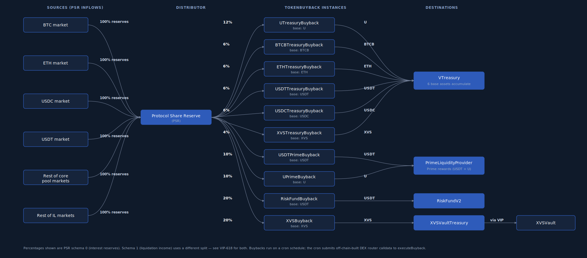

# Token Buyback


See the [TokenBuyback overview](../../whats-new/token-converter.md) for migration context and the [deployed-contracts page](../../deployed-contracts/token-converters.md) for proxy addresses. Live on BNB Chain via [VIP-618](https://app.venus.io/#/governance/proposal/618?chainId=56);


## Overview

`TokenBuyback` is the contract that holds protocol income arriving from `ProtocolShareReserve` (PSR) and converts it into a configured `BASE_ASSET` via on-chain DEX swaps. Each instance is deployed as a Transparent Proxy bound to a `(DESTINATION, BASE_ASSET)` pair at construction time; both addresses are immutable, so retargeting either requires a new deployment.

Swaps are initiated by an ACM-authorized finance-team cron, not by external community members. The cron builds the router calldata off-chain using DEX aggregators and submits it to `executeBuyback`. The contract validates a minimum output, pulls the actual `tokenIn` delta consumed by the router, forwards the resulting `BASE_ASSET` directly to `DESTINATION`, and applies two on-chain safety rails (USD daily cap + abnormal-slippage event) using a `ResilientOracle` reference price.

`TokenBuyback` implements `IIncomeDestination`, the same interface as the legacy converters, so PSR rewires to the new instances via a governance VIP without any PSR contract changes.

## Architecture

<figure><figcaption>PSR distribution across TokenBuyback instances and their destinations (example: BNB Chain — 10 instances; percentages from PSR schema 0 — interest reserves)</figcaption></figure>

Per-instance state:

| Slot | Purpose |
|---|---|
| `DESTINATION` (immutable) | Address that receives `BASE_ASSET` after each swap or forward |
| `BASE_ASSET` (immutable) | Output token of every buyback — every swap converts into this |
| `PROTOCOL_SHARE_RESERVE` (immutable) | Only address permitted to call `updateAssetsState` — prevents spoofed `AssetsReceived` events |
| `RESILIENT_ORACLE` (immutable) | USD-pricing source for the daily cap and the abnormal-slippage signal — not used for swap pricing |
| `allowedRouters` | On-chain allowlist of DEX routers (governance-managed) |
| `assetsReserves[token]` | Balance watermark used to derive the inflow delta on each PSR call |
| `dailyCapUsd` | Rolling 24h USD cap on `tokenIn` consumption (1e18-scaled) |
| `slippageEventUsd` | Absolute USD threshold above which `AbnormalSlippage` fires (1e18-scaled) |
| `usdConsumedInWindow`, `lastUpdate` | Leaky-bucket accumulator state for the daily cap |

## Income Flow

1. PSR transfers underlying tokens to `TokenBuyback` and calls `updateAssetsState(comptroller, asset)`.
2. The contract reads `balanceOf(this)`, compares against the `assetsReserves[asset]` watermark, emits `AssetsReceived(comptroller, asset, delta)` when the delta is non-zero, and resyncs the watermark to the current balance.
3. The cron monitors `AssetsReceived` events to know which token landed and from which pool.
4. When the cron decides to convert, it calls `executeBuyback` with off-chain-built router calldata.
5. `executeBuyback` swaps `tokenIn → BASE_ASSET` through the allowlisted router, validates `minAmountOut`, forwards the output to `DESTINATION`, pushes fresh oracle prices, enforces the daily cap, and emits `AbnormalSlippage` if the USD delta crosses the threshold.
6. `BASE_ASSET` that lands without needing a swap (e.g. PSR delivers `BASE_ASSET` directly) is sent on via `forwardBaseAsset`, which partitions the balance by caller-supplied `amount` so each portion can be attributed to a different comptroller via separate events.

## Daily USD Cap (leaky bucket)

`executeBuyback` enforces a rolling 24h USD cap on `tokenIn` consumption. The accumulator decays linearly between calls:

```
elapsed   = block.timestamp - lastUpdate
decayed   = elapsed >= WINDOW ? 0 : usdConsumedInWindow * (WINDOW - elapsed) / WINDOW
newUsage  = decayed + usdIn
require(newUsage <= dailyCapUsd)
usdConsumedInWindow = newUsage
lastUpdate          = block.timestamp
```

Where `WINDOW = 24 hours` and `usdIn = actualAmountIn * priceIn / 1e18`. Any rolling 24h interval's cumulative consumption is bounded by `dailyCapUsd`. Reverts with `DailyCapExceeded(attempted, cap)` past the cap.

Default: **$30,000 / 24h** at deploy. Tunable via `setDailyCapUsd` (ACM-restricted, rejects zero).

## Abnormal Slippage Signal

After settling the swap, `executeBuyback` USD-prices both legs and emits `AbnormalSlippage(tokenIn, actualAmountIn, amountOut, usdIn, usdOut)` when `usdIn − usdOut > slippageEventUsd`. The event is informational only — it does not revert. Used by off-chain monitoring to flag swaps routed through hostile pools or stale-aggregator outputs.

Default: **$500** absolute. Tunable via `setSlippageEventUsd` (ACM-restricted, rejects zero).

The slippage check uses the same oracle snapshot as the cap, refreshed via `oracle.updateAssetPrice(tokenIn)` and `oracle.updateAssetPrice(BASE_ASSET)` immediately before the read.

## Functions

### `updateAssetsState(address comptroller, address asset)`

PSR-only. Records the balance delta against the `assetsReserves[asset]` watermark and emits `AssetsReceived(comptroller, asset, delta)` when non-zero. Restricted by the `PROTOCOL_SHARE_RESERVE` immutable. The reported amount is a balance delta, not an authenticated source-of-funds record — tokens transferred directly to the contract outside the PSR flow are merged into the next event under whichever comptroller PSR happens to be processing.

### `executeBuyback(tokenIn, amountIn, minAmountOut, deadline, router, routerCalldata, comptroller)`

ACM-restricted. Performs the swap via the supplied router (must be on the allowlist) and forwards the output to `DESTINATION`.

Sequence:
1. Validate `deadline`, `tokenIn != BASE_ASSET`, router allowlisted, `amountIn > 0` and within `balanceOf(this)`.
2. Snapshot `tokenIn` and `BASE_ASSET` balances on this contract.
3. `forceApprove(router, amountIn)`, `router.functionCall(routerCalldata)`, `forceApprove(router, 0)`.
4. Compute `actualAmountIn = tokenInBefore - tokenInAfter` and `amountOut = baseAssetAfter - baseAssetBefore`.
5. Revert with `SlippageExceeded` if `amountOut < minAmountOut`.
6. Transfer `amountOut` of `BASE_ASSET` to `DESTINATION` and resync both watermarks.
7. Push fresh oracle prices, enforce the daily USD cap, emit `AbnormalSlippage` if applicable.
8. Emit `BuybackExecuted(tokenIn, actualAmountIn, amountOut, router, comptroller)`.

The reported `amountIn` in `BuybackExecuted` is the actual router consumption, not the caller-supplied parameter — the event reflects what the router actually pulled.

### `forwardBaseAsset(address comptroller, uint256 amount)`

ACM-restricted. Forwards a caller-specified `amount` of accumulated `BASE_ASSET` to `DESTINATION` without a swap. The `amount` parameter is exposed so the operator can partition multi-pool `BASE_ASSET` inflows and attribute each portion via a separate `BaseAssetForwarded(comptroller, amount)` event. No-op when `amount == 0`. Resyncs the `BASE_ASSET` watermark after the transfer.

### `setAllowedRouter(address router, bool allowed)`

Governance-only. Adds or removes a DEX router from the on-chain allowlist. Emits `RouterAllowlisted(router, allowed)`.

### `setDailyCapUsd(uint256 newCap)`

ACM-restricted. Updates the rolling 24h USD cap (1e18-scaled). Reverts with `ZeroValueNotAllowed` if `newCap` is zero — the cap is not a kill switch; revoke ACM permissions to fully disable buybacks. Emits `DailyCapUpdated(oldCap, newCap)`.

### `setSlippageEventUsd(uint256 newThreshold)`

ACM-restricted. Updates the absolute USD slippage-event threshold (1e18-scaled). Reverts with `ZeroValueNotAllowed` if `newThreshold` is zero. Emits `SlippageEventUsdUpdated(oldThreshold, newThreshold)`.

### `sweepToken(address token, address to, uint256 amount)`

Governance-only. Emergency token recovery. Also the canonical recovery path for tokens transferred directly to the contract outside the PSR flow, since on-chain accounting cannot distinguish donations from authenticated inflows. Resyncs `assetsReserves[token]` to the post-transfer balance. Emits `SweepToken(token, to, amount)`.

## Events

| Event | When emitted |
|---|---|
| `AssetsReceived(comptroller, asset, amount)` | PSR delivers tokens (non-zero delta) |
| `BuybackExecuted(tokenIn, amountIn, amountOut, router, comptroller)` | Successful DEX swap; `amountIn` is the on-chain router consumption |
| `BaseAssetForwarded(comptroller, amount)` | `BASE_ASSET` forwarded to `DESTINATION` without swap |
| `RouterAllowlisted(router, allowed)` | Router added or removed from allowlist |
| `SweepToken(token, to, amount)` | Emergency token sweep |
| `AbnormalSlippage(tokenIn, actualAmountIn, amountOut, usdIn, usdOut)` | Swap returned less USD value than input by more than `slippageEventUsd` |
| `DailyCapUpdated(oldCap, newCap)` | `setDailyCapUsd` succeeded |
| `SlippageEventUsdUpdated(oldThreshold, newThreshold)` | `setSlippageEventUsd` succeeded |

## Errors

| Error | Cause |
|---|---|
| `UnauthorizedCaller(caller)` | `updateAssetsState` called by anyone other than `PROTOCOL_SHARE_RESERVE` |
| `RouterNotAllowed(router)` | `executeBuyback` with a router not on the allowlist |
| `InvalidTokenIn(tokenIn)` | `executeBuyback` with `tokenIn == BASE_ASSET` |
| `InsufficientBalance(token, requested, available)` | `executeBuyback` or `forwardBaseAsset` requested more than the contract holds |
| `SlippageExceeded(expected, actual)` | Swap output fell below `minAmountOut` |
| `DeadlineExpired(deadline, blockTimestamp)` | `executeBuyback` after the supplied deadline |
| `DailyCapExceeded(attempted, cap)` | `executeBuyback` would push cumulative USD usage past `dailyCapUsd` |
| `ZeroAddressNotAllowed` | Constructor / `setAllowedRouter` / `sweepToken` with zero address |
| `ZeroValueNotAllowed` | Setters or `sweepToken` invoked with zero |

## Destinations

The `(DESTINATION, BASE_ASSET)` pair is fixed per instance. Common destinations across deployments:

* **`VTreasury`** — accumulates protocol-revenue tokens (U, BTCB, ETH, USDT, USDC, XVS) bought back from non-Prime, non-RiskFund income.
* **`PrimeLiquidityProvider`** — accumulates Prime rewards in USDT and U; later distributed to Prime users according to per-token speeds configured via VIP. See [Prime tokens](prime.md).
* **`RiskFundV2`** — accumulates USDT used by [Shortfall auctions](shortfall-and-auctions.md). Per-pool accounting was removed alongside the migration; `RiskFundV2` now draws against its raw balance.
* **`XVSVaultTreasury`** — accumulates XVS that funds `XVSVault` rewards via VIP.

See [deployed contracts](../../deployed-contracts/token-converters.md) for per-chain proxy addresses and their `(base asset, destination)` mapping.

## Operator Notes

* Conversions run on a defined schedule rather than on every inflow. The cron decides when to call `executeBuyback`; the contract has no internal trigger.
* The oracle is consulted **only** for the cap and slippage signal — not for swap pricing. Swap economics are determined by the off-chain-built router calldata.
* The daily cap bounds blast radius if the operator key is compromised. It is not intended to throttle normal operation.
* Routers must be added to the allowlist by governance before the cron can route through them. Removing a router via `setAllowedRouter(router, false)` immediately blocks future swaps through it.
* Donations to the contract (tokens sent directly, outside the PSR flow) are not distinguished from authenticated PSR inflows on-chain. Use `sweepToken` to recover them if needed.
