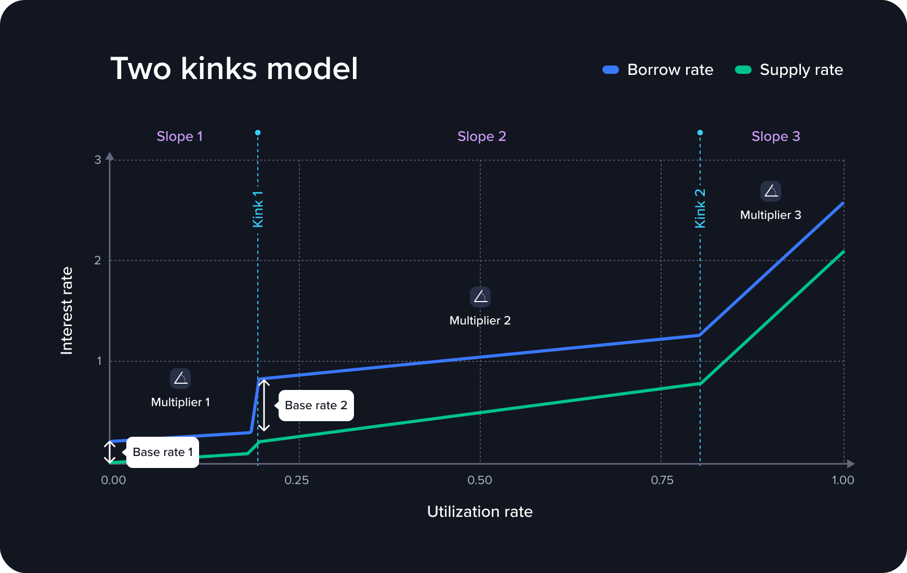

# Two Kinks Interest Rate Curve

## Overview

The 2-Kink Interest Rate Curve introduces a new model to optimize interest rates and utilization across Venus protocol markets. By incorporating two separate "kinks", this model aims to provide more flexible control over market dynamics, enhancing both the predictability and efficiency of APYs (Annual Percentage Yields) for borrowers and suppliers.

This design helps reduce the volatility of APYs during periods of high demand, such as during launchpool events, and encourages greater participation by offering more predictable costs and returns.

## 2-Kink Interest Rate Model Architecture

The 2-Kink IR Curve is built into the Interest Rate Models used by Venus markets. It allows for two distinct kinks in the curve, separating the initial utilization phase from the high-utilization phase. This enables better control over borrow and supply rates as utilization increases.

The curve is defined by:

- **Kink**: A utilization threshold where the interest rate curve’s slope changes.
- **Multiplier**: The rate at which the interest rate increases before and after the kink, controlling the curve’s steepness.
- **Base Rate**: A predefined APY jump at the start of the curve or any kink, providing a step-up in interest rates as utilization increases.

By using two kinks and base rates, the protocol can more accurately balance supply and borrow demand, especially in markets with varying demand cycles like launchpools.

<figure><figcaption>Two Kinks Interest Rate Model</figcaption></figure>

## Benefits of 2-Kink IR Curve

- **More Predictable APYs**: By introducing a second kink, the interest rate curve allows for smoother transitions in APYs as market utilization changes.
- **Increased Participation**: Both borrowers and suppliers benefit from more predictable rates, encouraging greater market participation even during high-demand periods.
- **Optimized Market Efficiency**: By reducing sharp spikes in borrow APYs, the 2-Kink IR Curve improves the overall efficiency of Venus markets, ensuring better control over utilization rates and protocol reserves.

## Smart Contract Reference

* [Two Kinks Rate Model contract (for the Core pool on BNB Chain)](../reference-core-pool/interestratemodels/twokinksinterestratemodel.md)
* [Two Kinks Rate Model contract (for the Isolated pools)](../reference-isolated-pools/interest-rate-models/two-kinks-interest-rate-model.md)
* [Jump Rate Model contract (used in the Core pool on BNB Chain)](../reference-core-pool/interestratemodels/jumpmodel.md)
* [Jump Rate Model V2 contract (used in the Isolated pools)](../reference-isolated-pools/interest-rate-models/jump-rate-model-v2.md)