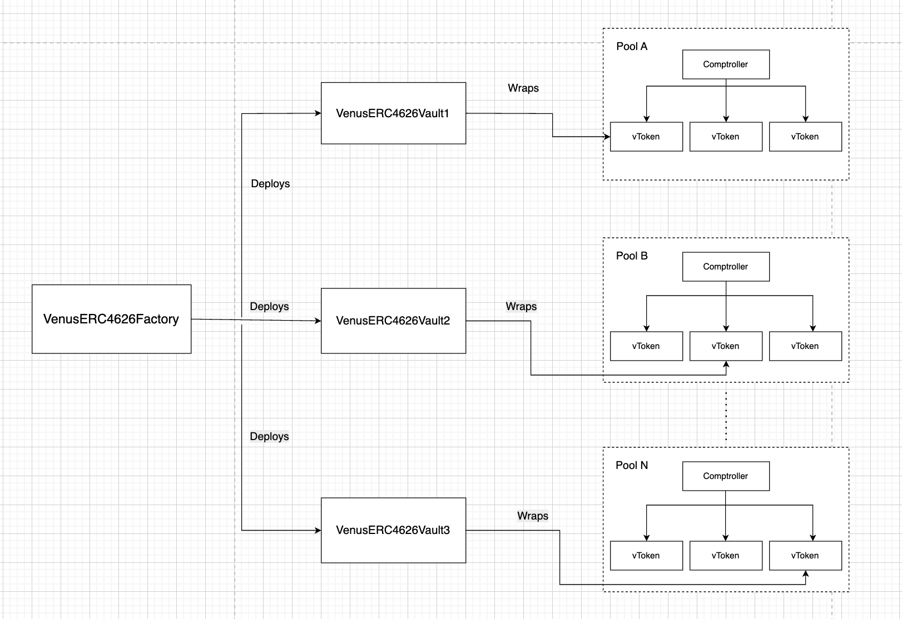
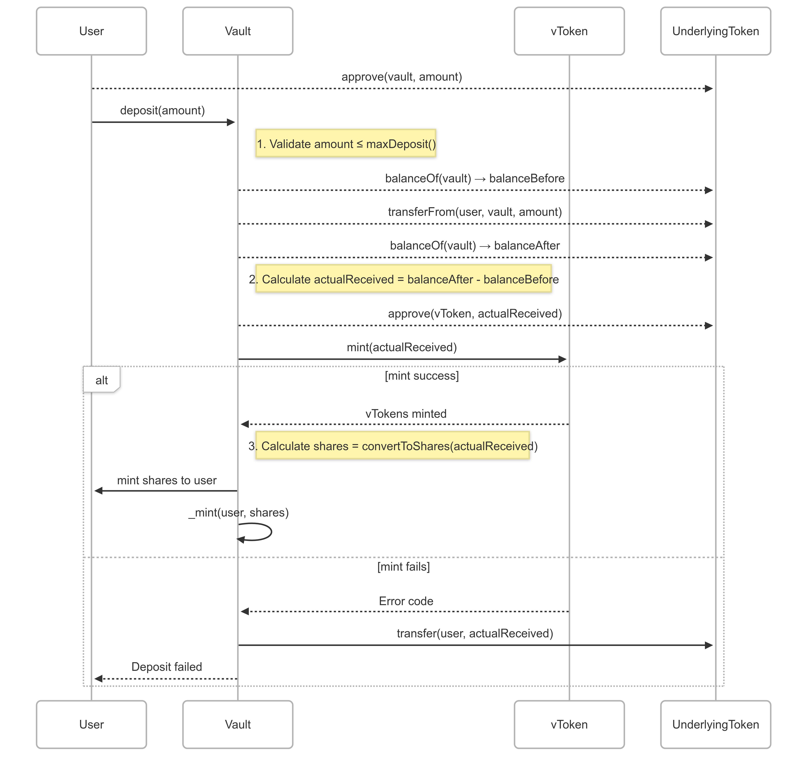
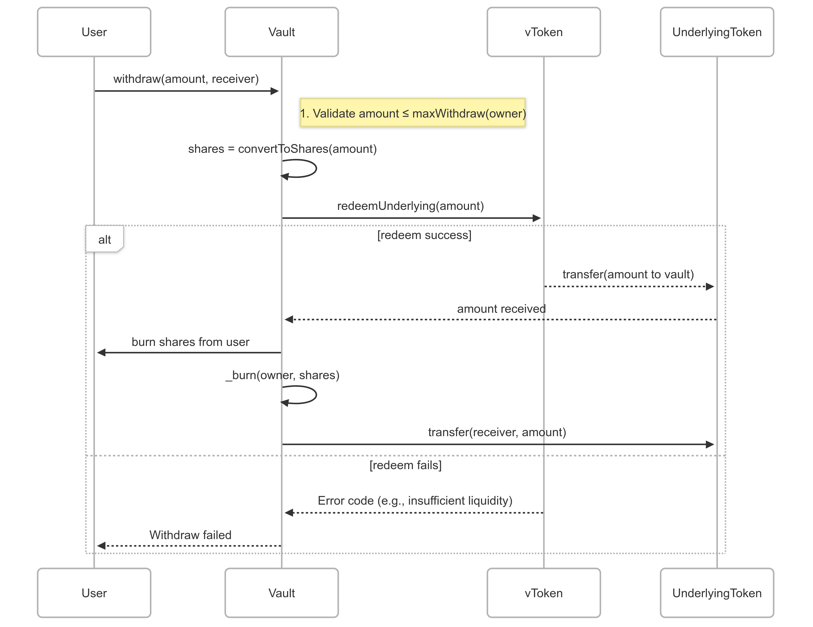

# Venus Protocol's ERC-4626 Implementation

## Overview

Venus Protocol introduces **native ERC-4626 vaults**, bringing standardized, composable yield vaults to the Venus ecosystem. This integration represents a significant advancement in making Venus's yield-bearing markets more accessible and composable within the broader DeFi ecosystem.

### Key Benefits:

- **Full ERC-4626 Compliance** – Interoperable with DeFi primitives (DAOs, aggregators, etc.)
- **Native Venus Yield Integration** – Auto-compounding via vTokens
- **Gas-Optimized Architecture** – Beacon proxy pattern for efficient deployments, so all vaults share the same implementation contract.
- **Secure & Upgradeable** – Governance-controlled upgrades and reward management

## Understanding ERC-4626

ERC-4626 is a tokenized vault standard designed to unify how yield-bearing assets are deposited, managed, and withdrawn in DeFi protocols. It builds on the ERC-20 token standard and introduces a consistent interface for vaults that accept a specific asset (like USDC) and issue shares representing ownership in the vault.

The primary goal of ERC-4626 is **standardization**—allowing developers to integrate with vaults without needing to understand their internal mechanics. Functions like deposit, withdraw, mint, and redeem, follow predictable behaviors across all compliant contracts.

In essence, ERC-4626 makes it easier for users to earn yield on their assets and for protocols to plug into vaults in a reliable, composable way—enhancing both usability and interoperability across the DeFi ecosystem.

#### Reference: https://eips.ethereum.org/EIPS/eip-4626

## The implementation of the Venus ERC-4626 vaults consists of two core smart contracts:

#### **1\. VenusERC4626Factory.sol - The factory contract for deploying standardized vaults**

- Deploys individual vaults for individual vTokens via **BeaconProxy**
- Ensures deterministic addresses using **CREATE2**
- Managed by Venus Governance

#### **2\. VenusERC4626.sol - The vault logic implementing ERC-4626 functionality**

- ERC-4626-compliant mint, deposit, redeem, and withdraw functions
- Integrates with Venus **vToken** interest accrual
- Handles reward distribution (e.g., XVS)

## Architecture

<figure><figcaption></figcaption></figure>

## **VenusERC4626Factory.sol: The Vault Factory**

### **Architecture Overview**

The factory contract implements a sophisticated deployment system using OpenZeppelin's upgradeability patterns:

```jsx
contract VenusERC4626Factory is AccessControlledV8, MaxLoopsLimitHelper {
    UpgradeableBeacon public beacon;
    mapping(address vToken => ERC4626Upgradeable vault) public createdVaults;

    function createERC4626(address vToken) external returns (ERC4626Upgradeable) {
        // Deployment logic...
    }
}
```

### **Core Components**

### **Beacon Proxy System**

- **UpgradeableBeacon**: Stores the current implementation address.
- **BeaconProxy**: Proxy delegates to beacon implementation.
- **CREATE2**: Deterministic deployment with fixed salt for beacon proxies.

#### Benefits:

- Single implementation contract shared by all vaults.
- Gas-efficient deployments.
- Centralized upgrade capability.

### **PoolRegistry Integration**

```jsx
function createERC4626(address vToken) external {
    // Validate vToken is registered in PoolRegistry
    if (vToken != poolRegistry.getVTokenForAsset(comptroller, underlying)) {
        revert VenusERC4626Factory__InvalidVToken();
    }
    // Proceed with deployment...
}
```

This ensures:

- Only legitimate Venus vTokens can create vaults.
- Proper asset/vToken pairing.
- Compliance with Venus's risk parameters.

### Key Features

- **Deterministic Deployment**: Uses a constant salt to enable deterministic address generation for ERC-4626 vault proxies.
- **Upgradeable Architecture**: Utilizes a beacon proxy pattern to support upgradeability of all deployed vaults via a single beacon.
- **Vault Tracking**: Maintains a mapping `createdVaults` of vTokens to their corresponding deployed ERC-4626 vaults.
- **Reward Routing**: Allows configuration of a centralized reward recipient for all vaults and supports liquidity mining incentives.
- **Permissioned Admin**: Restricts administrative operations (e.g., setting reward recipient, max loops) via Access Control Manager (ACM).

### Events

- **`CreateERC4626 (event)`**: Emitted when a new ERC-4626 vault is created for a vToken.
- **`RewardRecipientUpdated (event)`**: Emitted when the reward recipient address is updated.

### Constants

- **`SALT (bytes32)`**: Constant salt used for deterministic deployment of vaults.

### State variables

- **`beacon (UpgradeableBeacon)`**: Stores the address of the beacon contract holding the ERC-4626 vault implementation.
- **`poolRegistry (PoolRegistryInterface)`**: Reference to the Venus Pool Registry contract.
- **`rewardRecipient (address)`**: Address designated to receive liquidity mining rewards.
- **`createdVaults (mapping(address => ERC4626Upgradeable))`**: Maps vTokens to their deployed ERC-4626 vault instances.

### Functions

- **`initialize()`**: Initializes the factory with core configuration.
- **`createERC4626(address vToken)`**: Creates a new ERC-4626 vault for the specified vToken.
- **`computeVaultAddress(address vToken)`**: Returns the predicted address of a vault for a specific vToken.
- **`setRewardRecipient(address newRecipient)`**: Updates the address receiving reward distributions (ACM-restricted).
- **`setMaxLoopsLimit(uint256 loopsLimit)`**: Configures the maximum allowed loop iterations (ACM-restricted).

### **Security Considerations**

### **1\. Access Controls**

- **Admin-Only Functions** (via **AccessControlledV8**):

  - **setRewardRecipient()**
  - **setMaxLoopsLimit()**
  - **upgradeBeacon()** (for emergency fixes)

### **2\. Input Validation**

- **ensureNonzeroAddress()** prevents invalid configurations.

### **Attack Surface Mitigation**

| **Threat Vector**  | **Mitigation Strategy**   |
| ------------------ | ------------------------- |
| Reentrancy         | `nonReentrant` modifiers  |
| Invalid vTokens    | PoolRegistry validation   |
| Governance attacks | ACM with timelocks        |
| Upgrade risks      | Beacon ownership controls |

---

## VenusERC4626.sol: The Vault Implementation

### Core Architecture

The **VenusERC4626** contract serves as an ERC-4626 compliant wrapper around Venus's yield-bearing vTokens. It inherits from multiple OpenZeppelin and Venus-specific base contracts to provide a secure, feature-rich implementation:

```jsx
contract VenusERC4626 is
    ERC4626Upgradeable,
    AccessControlledV8,
    MaxLoopsLimitHelper,
    ReentrancyGuardUpgradeable {
    // Implementation...
}
```

### Key Features

- **ERC-4626 Compliant**: Fully compliant with the ERC-4626 Tokenized Vault standard, enabling integrations with yield aggregators and frontends.
- **vToken Wrapping**: Provides tokenized access to underlying vTokens with proportional interest accrual.
- **Dual-Stage Initialization**: Separates base contract setup and access/reward configuration for modular deployment.
- **Reward Claiming**: Allows vaults to claim accrued rewards and direct them to a predefined recipient.
- **Failsafes and Admin Tools**: Includes recovery mechanisms, such as `sweepToken`, and loop control for security and operational safety.

### Key Inherited Functionality:

- **ERC4626Upgradeable**: Uses OpenZeppelin's 4626 contract as the base implementation of the ERC-4626 standard.
- **AccessControlledV8**: Venus role-based access control system.
- **ReentrancyGuardUpgradeable**: Protection against reentrancy attacks.
- **MaxLoopsLimitHelper**: Prevents gas exhaustion in loops.

### Events

- **`ClaimRewards (event)`**: Emitted when rewards are claimed and distributed.
- **`RewardRecipientUpdated (event)`**: Emitted when the reward recipient address is updated.
- **`SweepToken (event)`**: Emitted when ERC-20 tokens are swept from the contract.

### State variables

- **`vToken (VToken)`**: The underlying Venus vToken being wrapped.
- **`comptroller (IComptroller)`**: The Comptroller contract associated with the vToken.
- **`rewardRecipient (address)`**: Address designated to receive reward tokens.

### Functions

#### Core ERC-4626 Functions

- **`deposit(uint256 assets, address receiver)`**: Deposits assets and mints shares to the receiver. 
    - Note - It can mint slightly fewer shares than requested, because vToken.mint rounds down.
- **`mint(uint256 shares, address receiver)`**: Mints exact shares by depositing required assets. 
    - Note - It can mint slightly fewer shares than requested, because vToken.mint rounds down. 
- **`withdraw(uint256 assets, address receiver, address owner)`**: Withdraws exact assets and burns shares from the owner. 
    - Note - Receiver can receive slightly more assets than requested, because VToken.redeemUnderlying rounds up
- **`redeem(uint256 shares, address receiver, address owner)`**: Redeems exact shares and transfers assets to the receiver.
- **`totalAssets()`**: Returns the total underlying assets held by the vault.

#### Initialization

- **`initialize(address vToken_)`**: Initializes the vault with the target vToken (first-stage init).
- **`initialize2(address accessControlManager_, address rewardRecipient_, uint256 loopsLimit_)`**: Second-stage initialization with access control, reward recipient, and loop limit.

#### Reward Management

- **`claimRewards()`**: Claims all available rewards and sends them to the recipient.
- **`setRewardRecipient(address newRecipient)`**: Updates the reward recipient address (ACM-restricted).

#### Admin Functions

- **`sweepToken(IERC20Upgradeable token)`**: Allows the owner to recover any ERC-20 tokens that were mistakenly sent to the vault.
- **`setMaxLoopsLimit(uint256 loopsLimit)`**: Configures the maximum loop iterations (ACM-restricted).

### Error Codes

- **`VenusError(uint256 errorCode)`**: Generic error returned from Venus protocol operations.
- **`ERC4626__ZeroAmount(string operation)`**: Thrown when a zero amount is provided during an operation.
- **`ERC4626__DepositMoreThanMax()`**: Error triggered when a deposit exceeds the maximum limit.
- **`ERC4626__MintMoreThanMax()`**: Error triggered when a mint exceeds the maximum limit.
- **`ERC4626__WithdrawMoreThanMax()`**: Error triggered when a withdrawal exceeds the maximum limit.
- **`ERC4626__RedeemMoreThanMax()`**: Error triggered when a redeem exceeds the maximum limit.

### **Deposit Flow**

```jsx
function deposit(uint256 assets, address receiver)
    public
    override
    nonReentrant
    returns (uint256)
{
    // Input validation
    if (assets == 0) revert ERC4626__ZeroAmount("deposit");
    if (assets > maxDeposit(receiver)) revert ERC4626__DepositMoreThanMax();

    // Process deposit
    uint256 shares = previewDeposit(assets);
    _deposit(_msgSender(), receiver, assets, shares);

    return shares;
}
```

1.  Validates input parameters.
2.  Calculates shares to mint.
3.  Transfers assets from the user.
4.  Mints vTokens via Venus Protocol.
5.  Issues vault shares to the receiver.

#### Example

**Scenario**: Alice deposits 100 USDC.

<figure><figcaption></figcaption></figure>

#### Result:

- Alice gets 100 vault shares.
- Vault holds 100 vUSDC (earning yield).

### **Withdrawal Flow**

```jsx
function withdraw(uint256 assets, address receiver, address owner)
    public
    override
    nonReentrant
    returns (uint256)
{
    // Input validation
    if (assets == 0) revert ERC4626__ZeroAmount("withdraw");
    if (assets > maxWithdraw(owner)) revert ERC4626__WithdrawMoreThanMax();

    // Process withdrawal
    uint256 shares = previewWithdraw(assets);
    beforeWithdraw(assets); // Redeems from Venus
    _withdraw(_msgSender(), receiver, owner, assets, shares);

    return shares;
}
```

1.  Validates input parameters.
2.  Calculates shares to burn.
3.  Redeems underlying assets from Venus.
4.  Transfers assets to the receiver.
5.  Burns vault shares.

#### Example

**Scenario**: Alice withdraws 50 USDC (after interest accrual).

<figure><figcaption></figcaption></figure>

#### Result

Alice receives 50 USDC.

- Vault burns shares adjusted for interest (e.g., 48.54 shares at a 1.03 exchange rate).

### **Security Features**

1.  **Reentrancy Protection**:

    - All state-changing functions use the **nonReentrant** modifier.
    - Critical Venus operations (mint/redeem) are atomic.

2.  **Input Validation**:

    - Zero-address checks are performed via **ensureNonzeroAddress**.
    - Zero-amount validation for all operations.
    - Explicit error codes for Venus operations.

3.  **Access Control**:

    - Sensitive functions are protected by Venus's ACM.
    - The reward recipient can only be changed by authorized accounts.

---
