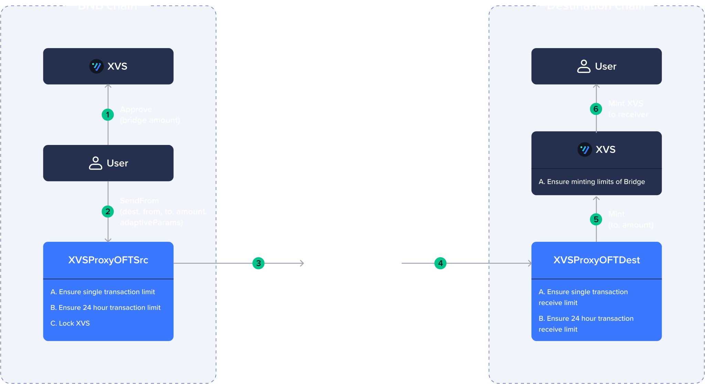
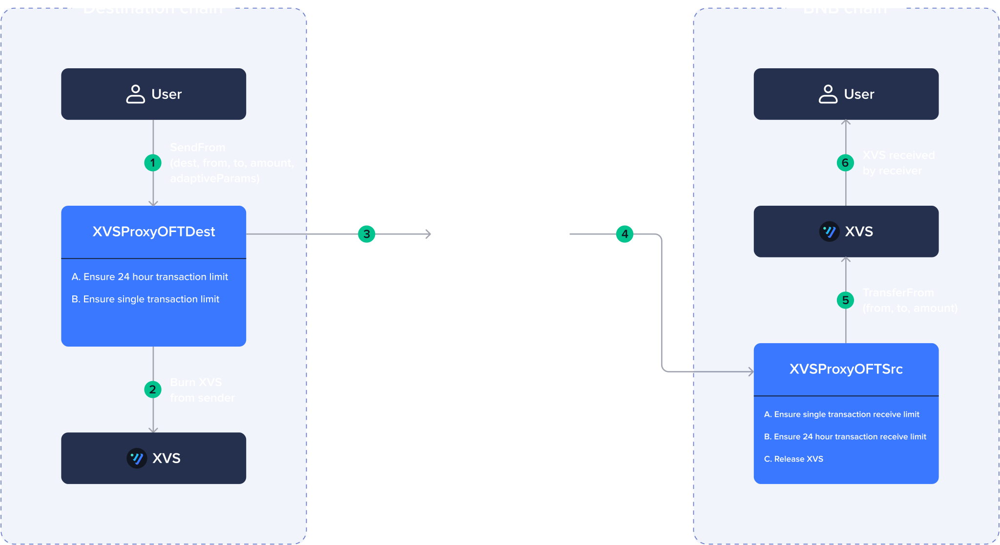
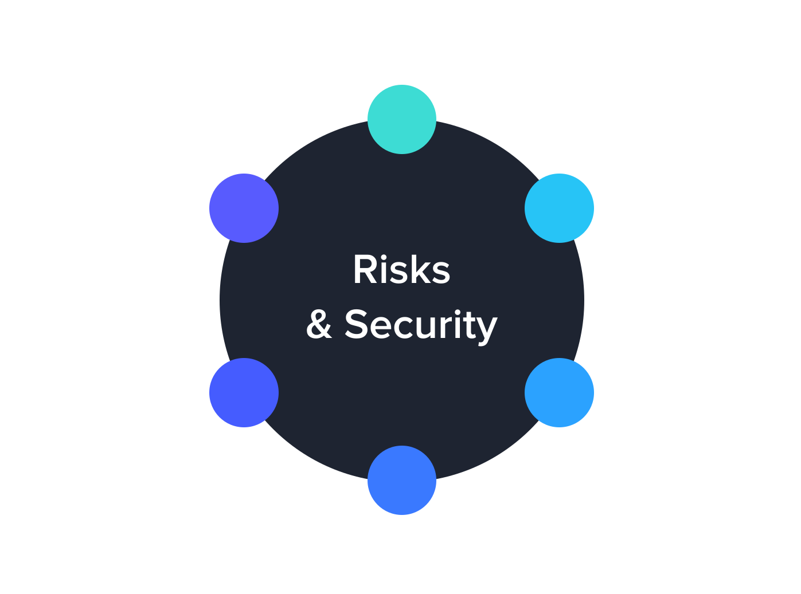

# XVS Cross-Chain Bridge Documentation

This documentation provides detailed instructions and explanations for using the XVS Cross-Chain Bridge. The bridge allows users to transfer tokens between different blockchain networks, including the [BNB chain](https://www.bnbchain.org) and multiple destination chains. The supported networks are as follows:
* [BNB](https://www.bnbchain.org)
* [Ethereum](https://ethereum.org)
* [opBNB](https://opbnb.bnbchain.org)
* [Arbitrum](https://arbitrum.io)

## Supported Transfer Paths

The bridge supports transfers between all network pairs, providing users with enhanced flexibility and interoperability across blockchain ecosystems.

The system consists of multiple contracts, including [XVSBridgeAdmin](https://github.com/VenusProtocol/token-bridge/blob/develop/contracts/Bridge/XVSBridgeAdmin.sol), [XVSProxySrc](https://github.com/VenusProtocol/token-bridge/blob/develop/contracts/Bridge/XVSProxyOFTSrc.sol), [XVSProxyDest](https://github.com/VenusProtocol/token-bridge/blob/develop/contracts/Bridge/XVSProxyOFTDest.sol), and [XVS](https://github.com/VenusProtocol/token-bridge/blob/develop/contracts/Bridge/token/XVS.sol) token contracts.

**_The functionality of the bridge relies on [LayerZero](https://layerzero.network) for the seamless transfer of XVS tokens across different networks. Consequently, the security and integrity of the token on each network are subject to potential vulnerabilities inherent in the bridging mechanism. It is essential to note that these risks are a general characteristic of integrating with network bridges and do not stem from any particular weaknesses within the token implementation._**

## 1. Getting Started

To start using the XVS Cross-Chain Bridge, follow these steps:

### 1.1. Approving XVS Tokens

Before transferring XVS tokens, you need to approve the `Bridge` contract on the BNB chain to spend XVS tokens on your behalf. Follow these steps:

1. Call the `approve` function of the XVS token contract with the following parameters:
   - `_spender`: Address of the `Bridge` contract on the BNB chain.
   - `_amount`: Amount of XVS tokens to approve for transfer.

### 1.2. Estimating Transaction Fees

To estimate the transaction fees required to send XVS tokens to the destination chain, call the `estimateSend` function of the `Bridge` contract with the following parameters:

- `_dstChainId`: Destination chain ID, [defined by LayerZero](https://layerzero.gitbook.io/docs/technical-reference/mainnet/supported-chain-ids) (e.g., Ethereum virtual chain ID (101))
- `_toAddress`: Receiver address on the destination chain
- `_amount`: Amount of XVS tokens you want to send, defined with 18 decimals
- `_useZro`: `false` (indicating that you are not paying in LayerZero ZRO tokens)
- `_adapterParams`: `0x000100000000000000000000000000000000000000000000000000000000000493E0` (ethers.utils.solidityPack(['uint16','uint256'],[1, gasValue]) the gas value should be greater then minDestGas which is set to 300k).

## 2. Transferring Tokens

The actual token transfer is performed using the `sendFrom` function of the `Bridge` contract. Follow these steps:

### 2.1. Sending Tokens

<figure><figcaption></figcaption></figure>

1. Call the `sendFrom` function of the `Bridge` contract with the following parameters::
   - `_from`: Your address on the BNB chain
   - `_dstChainId`: Destination chain ID [defined by LayerZero](https://layerzero.gitbook.io/docs/technical-reference/mainnet/supported-chain-ids) (e.g., Ethereum virtual chain ID (101))
   - `_toAddress`: The address on the destination chain where you want to receive the XVS tokens
   - `_amount`: Amount of XVS tokens you want to send, defined with 18 decimals
   - `_callParams`: ["RefundGasAddress", "ZROaddress", "adapterParams"]
     - `RefundGasAddress`: Address where you want to receive a refund for excessive gas sent. It can be the sender's address.
     - `ZROaddress`: `0x0000000000000000000000000000000000000000` (indicating that you are not paying in ZRO tokens)
     - `adapterParams`: `0x000100000000000000000000000000000000000000000000000000000000000493E0` (ethers.utils.solidityPack(['uint16','uint256'],[1, gasValue]) the gas value should be greater then minDestGas which is set to 300k).

## 3. Receiving Tokens on the Destination Chain

When you send XVS tokens to the destination chain using the bridge, the tokens will be minted by the `Bridge` contract to the receiver's address on the destination chain.

## 4. Transferring Tokens Back to the BNB chain

<figure><figcaption></figcaption></figure>

To transfer XVS tokens back to the BNB chain, follow a similar process as mentioned in the earlier send section. You don't need to approve the `Bridge` contract on the destination chain to spend XVS tokens on your behalf. The tokens will be burned on the destination chain on your behalf and unlocked and transferred to the receiver's address on the BNB chain.

To transfer XVS tokens between destination chains, such as from Ethereum to opBNB, the process remains similar to the earlier send section. You don't need to approve the `Bridge` contract on the destination chain to spend XVS tokens on your behalf. The tokens will be burned on the one destination chain (Ethereum) and minted on the other destination chain (opBNB).

## 5. Monitoring Transaction Status

After initiating a token transfer, you should wait for the transaction to confirm. This process may take a few minutes. Once the transaction confirms, you will receive the bridged XVS tokens on the destination chain. You can use [LayerZero scan](https://layerzeroscan.com) to monitor your cross-chain transactions.

## 6. Security and Risks

<figure><figcaption></figcaption></figure>

### 6.1. Ownership Transfer

- Use the `transferOwnership` method in the `XVSBridgeAdmin` contract to transfer ownership of the admin contract.
- Use the `transferBridgeOwnership` method to transfer ownership of the `Bridge` contract from one contract to another.
- Ownership control is crucial in case of emergencies or security issues.
- The owner of the `XVSBridgeAdmin` contract will be initially the `Guardian`, but it will be transferred to Governance as soon as the `MultichainGovernance` module is deployed.

### 6.2. Pause and Resume

- The `Bridge` includes a pause and unpause mechanism. Use the `pause` method to halt the contract's functionality and `unpause` to resume.
- Pausing is a security measure to prevent further transactions during emergencies or potential attacks.
- XVS Cross-chain messages that attempt to mint or release tokens to the receiver can be received by the destination `Bridge` contract. These messages will fail, but they can be retried once the destination `Bridge` Contract has been unpaused.

### 6.3. Limit the Amount of XVS Transfers

- Example: Limit the maximum XVS transfer to USD 1,000 in one transaction and USD 100,000 in one day. These limits can be adjusted using VIPs.

### 6.4. Transfer Delays

- Configurable delay after XVS transfers to the target network by specifying a minimum number of blocks in the LayerZero endpoint configuration.

### 6.5. Token Controller Contract

- [Token Controller](https://github.com/VenusProtocol/token-bridge/blob/develop/contracts/Bridge/token/TokenController.sol) contract within the XVS token deployed on the target network to blacklist addresses, preventing them from transferring or receiving XVS. Integrated with the ACM.

### 6.6. Cap on Token Minting

- Cap on the amount of tokens that can be minted in the destination target network. This feature can be integrated in Token Controller.

### 6.7. Mitigation Plans for Mint Cap Reached

- If XVS become stuck between bridges due to exceeding the mint cap, the system will extend the mint cap via VIP. The failed message will be retried.

### 6.8. Bridge Model

- The `XVSProxyOFTDest` contract serves as the `Bridge` model. It will be authorized to mint and burn XVS in the destination chain. Limits on these actions will be set by Governance or the Guardian.
- While the initial deployment involves one `Bridge` contract per network, the system is designed to support several bridges simultaneously, providing users with flexibility.
- The system's architecture allows for the deployment of multiple bridges within the same network, offering users the option to choose different bridges for their transactions. This flexibility ensures efficient and diverse token bridging capabilities.

   **Example of Bridging in Case of Multiple Active Bridges:**

      1. Initial Setup:
         - Bridge Contract A (BridgeA) has a minterToMintedAmount of 100 XVS.
         - User A holds all 100 XVS minted by BridgeA.

      2. Separate Bridge Contract B Setup:
         - Bridge Contract B (BridgeB) has a separate minterToMintedAmount of 50 XVS.
         - User B holds all 50 XVS minted by BridgeB.

      3. User B Bridges Off Tokens Using Bridge A:
         - User B decides to use BridgeA to bridge off his 50 XVS.
         - After the successful bridging process, BridgeA's minterToMintedAmount is now 50, reflecting the XVS burned by User B through this BridgeA.

      4. User A Bridges Off Tokens Using Both Bridges:
         - Now, User A intends to bridge off his 100 XVS, splitting them between BridgeA and BridgeB.
         - User A uses BridgeA for 50 XVS and BridgeB for the remaining 50 XVS.

### 6.9. Bridge Replacement Scenario
In the event that a `Bridge` contract needs replacement, such as due to a security risk, the following steps will be taken:
1. **Pause the Bridge:**
   - Temporarily pause the `Bridge` contract to prevent further transactions.

2. **Token Evaluation:**
   - Evaluate whether pausing the XVS token is necessary during the replacement process.

3. **Migrate MinterToMintedAmount:**
   - Move the `minterToMintedAmount` value to a different `Bridge` contract address using the `migrateMintedTokens` function.

4. **Reduce MintCap:**
   - Reduce the `mintCap` to zero for the `Bridge` contract address with security issues.

These steps ensure a secure and systematic replacement of a `Bridge` contract, maintaining the integrity of the token. Simultaneously, on the BNB chain, the locked XVS will be transferred and locked in the other `Bridge` contract, ensuring a fix total supply of XVS.

### 6.10. Default Downtime
- Currently, the `Bridge` relies on a single relayer, the [default](https://layerzero.gitbook.io/docs/technical-reference/mainnet/default-config) by LayerZero, to generate proofs and submit them to target chains. While this configuration is functional, it's important to be aware of the potential implications. If the relayer goes offline or encounters problems, there's no immediate backup to maintain bridge functionality, potentially delaying or preventing transactions. In the event of unforeseen downtime affecting the default LayerZero relayer, a wallet can be authorized to temporarily generate proofs and submit them on the target network on behalf of the relayer. This authorization is granted only in exceptional circumstances via VIP.

## 7. Contract Details

Here, we provide more details about the key contracts used in the XVS Cross-chain Bridge:

### 7.1. XVSBridgeAdmin

- [XVSBridgeAdmin](https://github.com/VenusProtocol/token-bridge/blob/develop/contracts/Bridge/XVSBridgeAdmin.sol) is the admin contract for the bridge, ensuring proper setup.
- It contains a `functionRegistry` mapping for function signatures, allowing the contract to call corresponding methods in destination contracts after ensuring access control permissions.
- Ownership transfers for `XVSBridgeAdmin` and `Bridge` can be executed via the `transferOwnership` and `transferBridgeOwnership` methods respectively.

### 7.2. XVSProxySrc

- [XVSProxySrc](https://github.com/VenusProtocol/token-bridge/blob/develop/contracts/Bridge/XVSProxyOFTSrc.sol) extends the [BaseOFTV2](https://github.com/LayerZero-Labs/solidity-examples/blob/main/contracts/token/oft/v2/BaseOFTV2.sol) contract and includes custom logic for token transfers.
- It overrides the `_debitFrom` and `_creditTo` functions, checking transaction limits and user eligibility.
- It enforces transaction limits, tracks 24-hour window limits, and allows whitelisting of users.
- `XVSProxySrc` can be paused and resumed in emergencies.

### 7.3. XVSProxyDest

- [XVSProxyDest](https://github.com/VenusProtocol/token-bridge/blob/develop/contracts/Bridge/XVSProxyOFTDest.sol) is similar to `XVSProxySrc` but with specific differences.
- Transaction limits are enforced primarily for outbound amounts only in the source chain.
- It overrides the `debitFrom` function to include custom logic for checking transaction limits in USD and performs an external call to the XVS token contract to burn tokens from the sender.
- It overrides the `creditTo` function to trigger an external call to the XVS token contract to mint tokens for the receiver.
- When sending tokens from the destination chain to the BNB chain, it burns user tokens, with the burning logic residing in the XVS token contract.
- When receiving tokens from the BNB chain (to the Destination Chain), it mints tokens for the receiver, with the minting logic residing in the XVS token contract.

### 7.4. XVS Token

- The [XVS](https://github.com/VenusProtocol/token-bridge/blob/develop/contracts/Bridge/token/XVS.sol) token contract is deployed on destination chains, and it is used within the `XVSProxyDest` contract.
- The XVS token follows the ERC20 standard and extends the [TokenController](https://github.com/VenusProtocol/token-bridge/blob/develop/contracts/Bridge/token/TokenController.sol) ownable contract, which contains all controlling mechanisms of the XVS.
- It is responsible for setting minting limits for the minter (in this case, the remote `Bridge` contract).
- When receiving transactions and tokens from the source chain's `Bridge` contract, an external call is made to mint tokens for the receiver.
- When sending tokens to the source chain's `Bridge` contract, an external call is made from the `Bridge` contract to burn tokens from the sender.
- Offers a blacklisting feature to prevent certain users from receiving, transferring and bridging XVS tokens.
- [ACM](https://github.com/VenusProtocol/governance-contracts/blob/develop/contracts/Governance/AccessControlManager.sol) integration is used for setting minting caps and blacklisting, and these settings can be configured via VIPs or Guardian.

## 8. Additional Features

In addition to the core functionality, the XVS Cross-chain Bridge includes additional features to enhance its capabilities:

### 8.1. Oracle Integration

- The contract incorporates an oracle integration through the `ResilientOracleInterface`. It allows the contract to fetch price data for the token using the `getPrice` function.

### 8.2. Whitelist Mechanism

- The contract implements a whitelist mechanism to skip checks on transaction limits for whitelisted addresses. The `whitelist` mapping is used to track whitelisted addresses. The `setWhitelist` function allows adding or removing addresses from the whitelist.

### 8.3. Transaction Limits

- The contract introduces transaction limits for both sending and receiving transactions, based on a daily and single transaction basis. The limits are defined using `chainIdToMaxSingleTransactionLimit`, `chainIdToMaxDailyLimit`, `chainIdToMaxSingleReceiveTransactionLimit`, and `chainIdToMaxDailyReceiveLimit`.

- Single Send Limit (source network in the first column, destination network in the first row)

   |          |   BNB     |   opBNB   |   Arbitrum   |   Ethereum   |   ZKsync  |
   |----------|-----------|-----------|--------------|--------------|-----------|
   | BNB      |     -     | $10,000   | $20,000      | $100,000     | $20,000   |
   | opBNB    | $10,000   |    -      | $20,000      | $10,000      | $20,000   |
   | Arbitrum | $20,000   | $20,000   |     -        | $20,000      | $20,000   |
   | Ethereum | $100,000  | $10,000   | $20,000      |      -       | $20,000   |  
   | ZKsync   | $20,000   | $20,000   | $20,000      | $20,000      |     -     |

   
- Daily Send Limit (source network in the first column, destination network in the first row)

   |          |    BNB     |   opBNB   |   Arbitrum   |   Ethereum   |   ZKsync  |
   |----------|------------|-----------|--------------|--------------|-----------|
   | BNB      |     -      | $50,000   | $100,000     | $1,000,000   | $100,000  |
   | opBNB    | $50,000    |    -      | $100,000     | $50,000      | $100,000  |
   | Arbitrum | $100,000   | $100,000  |     -        | $100,000     | $100,000  |
   | Ethereum | $1,000,000 | $50,000   | $100,000     |      -       | $100,000  |  
   | ZKsync   | $100,000   | $100,000  | $100,000     | $100,000     |     -     |

- Single Receive Limit = Single Send Limit + 2%

- Daily Receive Limit = Daily Send Limit + 2%

**Note**: The additional 2% provides a margin to account for potential price fluctuations during the processing of bridging transactions.

### 8.4. Pause and Unpause Mechanism

- The contract incorporates a pause and unpause mechanism using the `Pausable` library. The `pause` and `unpause` functions can be used to halt and resume the contract's functionality, respectively.

## 9. Possible Failures of Bridging XVS Tokens

### 9.1. Sending XVS tokens from the source chain

- The oracle temporarily fails due to reasons including being paused by the owner, incorrect address configuration, or price validation failures.
- The transfer amount exceeds the single or daily sending transaction limit.
- The transfer amount is too small, becoming zero after removing dust.
- The sender is blacklisted by the XVS token.
- The destination bridge is not configured as a trusted remote.

### 9.2. Receiving XVS tokens on the destination chain

- The oracle temporarily fails due to reasons including being paused by the owner, incorrect address configuration, or price validation failures.
- The transfer amount exceeds the single or daily receiving transaction limit.
- The recipient is blacklisted by the XVS token.
- The minting cap on the destination bridge is exceeded.

### Retry Mechanism for Failed Transactions

In the event of a failed transaction, follow the below step-by-step process using block explorers and the [`retryMessage`](https://github.com/VenusProtocol/token-bridge/blob/main/contracts/Bridge/BaseXVSProxyOFT.sol#L368) function to retry transactions on the respective blockchain. Here's a detailed guide:

1. **Identify the Failed Transaction:**
   - Use [LayerZero scan](https://layerzeroscan.com) to identify the failed transaction within the target network by providing the transaction hash from the source network where the transaction was initiated.

2. **Examine the MessageFailed Log:**
   - Access the emitted events of the failed transaction and specifically examine the [`MessageFailed`](https://github.com/LayerZero-Labs/solidity-examples/blob/main/contracts/lzApp/NonblockingLzApp.sol#L20) log. This log contains essential function parameters needed for the retry.

3. **Extract Function Parameters:**
   - From the `MessageFailed` log, extract the following essential function parameters:
     - `_srcChainId`
     - `_srcAddress`
     - `_nonce`
     - `_payload`

4. **Construct a RetryMessage:**
   - In the event of a transaction failure on the BNB chain, invoke the `retryMessage` function of the `XVSProxyOFTSrc` contract on the BNB chain. Use the parameters extracted from the `MessageFailed` log for this operation. Conversely, if the transaction fails on any network other than BNB chain, invoke the `retryMessage` function of the `XVSProxyOFTDest` contract on that network. 
