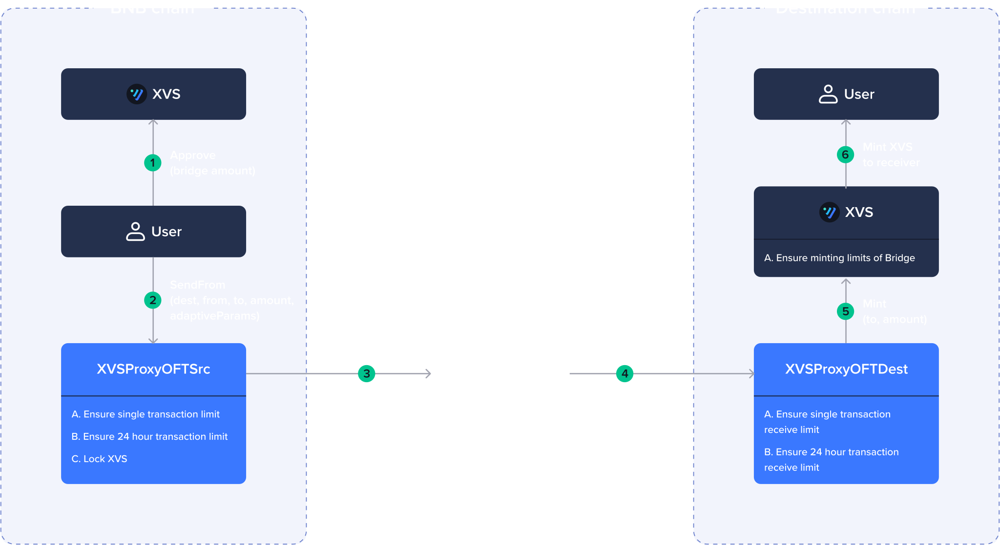
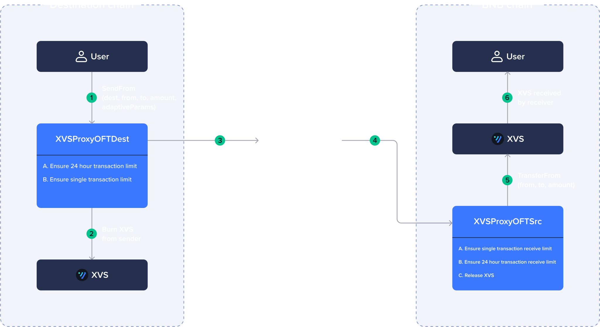
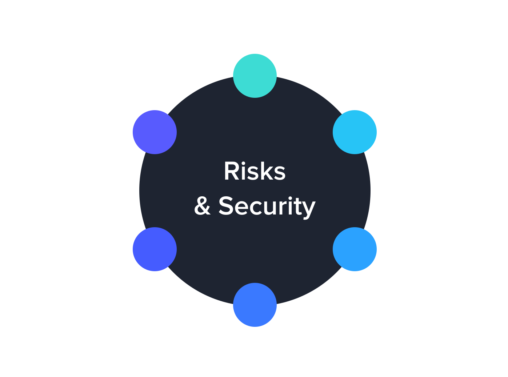

# XVS Cross-Chain Bridge Documentation

This article describes the stable [`token-bridge` v2.7.0 architecture](https://github.com/VenusProtocol/token-bridge/tree/v2.7.0). It uses LayerZero OFT V2 contracts on the LayerZero V1 messaging stack (`uint16` endpoint IDs, named chain IDs in the ABI); it is not the LayerZero V2 OApp API.

The current Venus interface includes these mainnets:

* [Arbitrum](https://arbitrum.io)
* [Base](https://www.base.org/)
* [BNB Chain](https://www.bnbchain.org)
* [Ethereum](https://ethereum.org)
* [opBNB](https://opbnb.bnbchain.org)
* [Optimism](https://app.optimism.io)
* [Unichain](https://www.unichain.org/)
* [ZKsync](https://zksync.io/)

## Supported Transfer Paths

The interface can construct transfers between its supported networks, but a path is usable only while both bridge contracts, their trusted remotes, limits, oracle, LayerZero configuration, and destination mint capacity permit it. Recheck the selected path immediately before signing.

The system consists of [XVSBridgeAdmin](https://github.com/VenusProtocol/token-bridge/blob/v2.7.0/contracts/Bridge/XVSBridgeAdmin.sol), [XVSProxyOFTSrc](https://github.com/VenusProtocol/token-bridge/blob/v2.7.0/contracts/Bridge/XVSProxyOFTSrc.sol), [XVSProxyOFTDest](https://github.com/VenusProtocol/token-bridge/blob/v2.7.0/contracts/Bridge/XVSProxyOFTDest.sol), and the destination-chain [XVS](https://github.com/VenusProtocol/token-bridge/blob/v2.7.0/contracts/Bridge/token/XVS.sol) token.

**_The functionality of the bridge relies on [LayerZero](https://layerzero.network) for the seamless transfer of XVS tokens across different networks. Consequently, the security and integrity of the token on each network are subject to potential vulnerabilities inherent in the bridging mechanism. It is essential to note that these risks are a general characteristic of integrating with network bridges and do not stem from any particular weaknesses within the token implementation._**

## 1. Getting Started

To start using the XVS Cross-Chain Bridge, follow these steps:

### 1.1. Approving XVS Tokens

Before transferring XVS tokens, you need to approve the `Bridge` contract on the BNB chain to spend XVS tokens on your behalf. Follow these steps:

1. Call the `approve` function of the XVS token contract with the following parameters:
   - `_spender`: Address of the `Bridge` contract on the BNB chain.
   - `_amount`: Amount of XVS tokens to approve for transfer.

### 1.2. Estimating Transaction Fees

To estimate the transaction fees required to send XVS tokens to the destination chain, call `estimateSendFee` on the local bridge with the following parameters:

- `_dstChainId`: Destination [LayerZero V1 endpoint ID](https://docs.layerzero.network/v1/deployments/deployed-contracts), not the EVM chain ID (for example, Ethereum V1 endpoint ID `101`)
- `_toAddress`: Receiver address on the destination chain
- `_amount`: Amount of XVS tokens you want to send, defined with 18 decimals
- `_useZro`: `false` (indicating that you are not paying in LayerZero ZRO tokens)
- `_adapterParams`: Versioned LayerZero V1 adapter parameters with destination gas at or above the bridge's current `minDstGasLookup` requirement. Do not copy a historical fixed gas value.

## 2. Transferring Tokens

The actual token transfer is performed using the `sendFrom` function of the `Bridge` contract. Follow these steps:

### 2.1. Sending Tokens

<figure><figcaption></figcaption></figure>

1. Call the `sendFrom` function of the local bridge with the following parameters:
   - `_from`: Your address on the source network
   - `_dstChainId`: Destination LayerZero V1 endpoint ID (for example, Ethereum `101`)
   - `_toAddress`: The address on the destination chain where you want to receive the XVS tokens
   - `_amount`: Amount of XVS tokens you want to send, defined with 18 decimals
   - `_callParams`: `[refundAddress, zroPaymentAddress, adapterParams]`
     - `RefundGasAddress`: Address where you want to receive a refund for excessive gas sent. It can be the sender's address.
     - `ZROaddress`: `0x0000000000000000000000000000000000000000` (indicating that you are not paying in ZRO tokens)
     - `adapterParams`: The same current LayerZero V1 adapter parameters used for the fee estimate.

## 3. Receiving Tokens on the Destination Chain

When BNB-chain XVS leaves BNB Chain it is locked by XVSProxyOFTSrc; XVSProxyOFTDest mints destination-chain XVS to the receiver. For destination-to-destination transfers, the source destination token is burned and the target destination token is minted.

## 4. Transferring Tokens Back to the BNB chain

<figure><figcaption></figcaption></figure>

To transfer XVS tokens back to the BNB chain, follow a similar process as mentioned in the earlier send section. You don't need to approve the `Bridge` contract on the destination chain to spend XVS tokens on your behalf. The tokens will be burned on the destination chain on your behalf and unlocked and transferred to the receiver's address on the BNB chain.

To transfer XVS tokens between destination chains, such as from Ethereum to opBNB, the process remains similar to the earlier send section. You don't need to approve the `Bridge` contract on the destination chain to spend XVS tokens on your behalf. The tokens will be burned on the one destination chain (Ethereum) and minted on the other destination chain (opBNB).

## 5. Monitoring Transaction Status

After initiating a token transfer, you should wait for the transaction to confirm. This process may take a few minutes. Once the transaction confirms, you will receive the bridged XVS tokens on the destination chain. You can use [LayerZero scan](https://layerzeroscan.com) to monitor your cross-chain transactions.

## 6. Security and Risks

<figure><figcaption></figcaption></figure>

### 6.1. Ownership Transfer

- Use the `transferOwnership` method in the `XVSBridgeAdmin` contract to transfer ownership of the admin contract.
- Use the `transferBridgeOwnership` method to transfer ownership of the `Bridge` contract from one contract to another.
- Ownership control is crucial in case of emergencies or security issues.
- The initial-Guardian rollout statement is obsolete. On August 27, 2026, each mainnet XVSBridgeAdmin was owned by that network's Normal Timelock, and each local bridge was owned by its XVSBridgeAdmin. Verify both `owner()` values before preparing an administrative action.

### 6.2. Pause and Resume

- The `Bridge` includes a pause and unpause mechanism. Use the `pause` method to halt the contract's functionality and `unpause` to resume.
- Pausing is a security measure to prevent further transactions during emergencies or potential attacks.
- XVS Cross-chain messages that attempt to mint or release tokens to the receiver can be received by the destination `Bridge` contract. These messages will fail, but they can be retried once the destination `Bridge` Contract has been unpaused.

### 6.3. Limit the Amount of XVS Transfers

- Example: Limit the maximum XVS transfer to USD 1,000 in one transaction and USD 100,000 in one day. These limits can be adjusted using VIPs.

### 6.4. Message Finality

- The bridge contract does not expose a user-set transfer delay. Delivery time and confirmation requirements come from the selected LayerZero V1 path, both networks, adapter gas, and current messaging-library configuration.

### 6.5. Token Controller Contract

- The [TokenController](https://github.com/VenusProtocol/token-bridge/blob/v2.7.0/contracts/Bridge/token/TokenController.sol) within destination-chain XVS can blacklist addresses, preventing them from transferring or receiving XVS. Its protected functions use the local AccessControlManager.

### 6.6. Cap on Token Minting

- Destination-chain XVS already enforces `minterToCap` and `minterToMintedAmount` for each authorized bridge minter. This is a live second bound in addition to bridge send/receive limits.

### 6.7. Mitigation Plans for Mint Cap Reached

- A mint-cap failure creates an operational incident; it does not guarantee that governance will raise the cap. Any cap change and message retry require an independently reviewed authorized action.

### 6.8. Bridge Model

- XVSProxyOFTDest is authorized through the destination XVS token's AccessControlManager to mint and burn. Its bridge owner is XVSBridgeAdmin; current administrative caller permissions must be read from the local ACM.
- The stable mainnet artifacts contain one bridge per network. TokenController supports migrating minter accounting if governance replaces a destination bridge, but that recovery capability is not evidence of multiple simultaneously supported user routes on one network.

### 6.9. Bridge Replacement Scenario

A bridge replacement is a governance and incident-response procedure, not one atomic contract call. A reviewed plan can include:

1. **Pause the Bridge:**
   - Temporarily pause the `Bridge` contract to prevent further transactions.

2. **Token Evaluation:**
   - Evaluate whether pausing the XVS token is necessary during the replacement process.

3. **Migrate MinterToMintedAmount:**
   - Move the recorded `minterToMintedAmount` value to a replacement bridge with `migrateMinterTokens`. This updates accounting only; it does not transfer users' ERC-20 balances.

4. **Reduce the old minter cap:**
   - Set the affected bridge's `minterToCap` to its remaining accounted minted amount or complete a valid migration before reducing it further; `setMintCap` rejects a cap below `minterToMintedAmount`.

BNB-side custody must be reconciled separately with the source bridge's `fallbackWithdraw` and `fallbackDeposit` accounting and the exact failed-message state. None of these steps automatically proves global XVS supply conservation; the complete cross-chain supply and in-flight messages must be reconciled before enabling the replacement path.

### 6.10. Messaging Dependency

- Delivery depends on each path's current LayerZero V1 endpoint, messaging library, oracle/relayer configuration, trusted remote, and destination execution gas. The old blanket statement that every route uses one fixed default relayer is not a durable configuration guarantee. Inspect the live endpoint configuration for the exact route when diagnosing downtime.

## 7. Contract Details

Here, we provide more details about the key contracts used in the XVS Cross-chain Bridge:

### 7.1. XVSBridgeAdmin

- [XVSBridgeAdmin](https://github.com/VenusProtocol/token-bridge/blob/v2.7.0/contracts/Bridge/XVSBridgeAdmin.sol) is the admin contract for the bridge, ensuring proper setup.
- It contains a `functionRegistry` mapping for function signatures, allowing the contract to call corresponding methods in destination contracts after ensuring access control permissions.
- Ownership transfers for `XVSBridgeAdmin` and `Bridge` can be executed via the `transferOwnership` and `transferBridgeOwnership` methods respectively.

### 7.2. XVSProxySrc

- [XVSProxyOFTSrc](https://github.com/VenusProtocol/token-bridge/blob/v2.7.0/contracts/Bridge/XVSProxyOFTSrc.sol) extends the LayerZero `BaseOFTV2` contract and includes custom logic for token transfers.
- It overrides the `_debitFrom` and `_creditTo` functions, checking transaction limits and user eligibility.
- It enforces transaction limits, tracks 24-hour window limits, and allows whitelisting of users.
- `XVSProxySrc` can be paused and resumed in emergencies.

### 7.3. XVSProxyDest

- [XVSProxyOFTDest](https://github.com/VenusProtocol/token-bridge/blob/v2.7.0/contracts/Bridge/XVSProxyOFTDest.sol) shares the base bridge controls but uses burn/mint token accounting.
- Transaction limits are enforced primarily for outbound amounts only in the source chain.
- It overrides the `debitFrom` function to include custom logic for checking transaction limits in USD and performs an external call to the XVS token contract to burn tokens from the sender.
- It overrides the `creditTo` function to trigger an external call to the XVS token contract to mint tokens for the receiver.
- When sending tokens from the destination chain to the BNB chain, it burns user tokens, with the burning logic residing in the XVS token contract.
- When receiving tokens from the BNB chain (to the Destination Chain), it mints tokens for the receiver, with the minting logic residing in the XVS token contract.

### 7.4. XVS Token

- The [XVS](https://github.com/VenusProtocol/token-bridge/blob/v2.7.0/contracts/Bridge/token/XVS.sol) token contract is deployed on destination chains and is used by XVSProxyOFTDest.
- The XVS token follows the ERC-20 standard and extends the [TokenController](https://github.com/VenusProtocol/token-bridge/blob/v2.7.0/contracts/Bridge/token/TokenController.sol) ownable contract.
- It is responsible for setting minting limits for the minter (in this case, the remote `Bridge` contract).
- When receiving transactions and tokens from the source chain's `Bridge` contract, an external call is made to mint tokens for the receiver.
- When sending tokens to the source chain's `Bridge` contract, an external call is made from the `Bridge` contract to burn tokens from the sender.
- Offers a blacklisting feature to prevent certain users from receiving, transferring and bridging XVS tokens.
- [AccessControlManager v2.15.0](https://github.com/VenusProtocol/governance-contracts/blob/v2.15.0/contracts/Governance/AccessControlManager.sol) integration is used for mint caps, blacklisting, pause controls, and bridge administration. The authorized caller must be checked from current permissions; it is not implied by the labels “VIP” or “Guardian.”

## 8. Additional Features

In addition to the core functionality, the XVS Cross-chain Bridge includes additional features to enhance its capabilities:

### 8.1. Oracle Integration

- The contract incorporates an oracle integration through the `ResilientOracleInterface`. It allows the contract to fetch price data for the token using the `getPrice` function.

### 8.2. Whitelist Mechanism

- The contract implements a whitelist mechanism to skip checks on transaction limits for whitelisted addresses. The `whitelist` mapping is used to track whitelisted addresses. The `setWhitelist` function allows adding or removing addresses from the whitelist.

### 8.3. Transaction Limits

- The bridge enforces mutable single-send, daily-send, single-receive, and daily-receive USD limits per LayerZero path. Read `chainIdToMaxSingleTransactionLimit`, `chainIdToMaxDailyLimit`, `chainIdToMaxSingleReceiveTransactionLimit`, and `chainIdToMaxDailyReceiveLimit` on the source contract selected by the interface.
- The historical static matrices have been removed: they omitted Unichain and could become unsafe after a governance update. Also read the current rolling-window counters and the destination XVS mint capacity before signing.

### 8.4. Pause and Unpause Mechanism

- The contract incorporates a pause and unpause mechanism using the `Pausable` library. The `pause` and `unpause` functions can be used to halt and resume the contract's functionality, respectively.

## 9. Possible Failures of Bridging XVS Tokens

### 9.1. Sending XVS tokens from the source chain

- The oracle temporarily fails due to reasons including being paused by the owner, incorrect address configuration, or price validation failures.
- The transfer amount exceeds the single or daily sending transaction limit.
- The transfer amount is too small, becoming zero after removing dust.
- The sender is blacklisted by the XVS token.
- The destination bridge is not configured as a trusted remote.

### 9.2. Receiving XVS tokens on the destination chain

- The oracle temporarily fails due to reasons including being paused by the owner, incorrect address configuration, or price validation failures.
- The transfer amount exceeds the single or daily receiving transaction limit.
- The recipient is blacklisted by the XVS token.
- The minting cap on the destination bridge is exceeded.

### Retry Mechanism for Failed Transactions

In the event of a failed transaction, inspect the destination event and the stable [`retryMessage` implementation](https://github.com/VenusProtocol/token-bridge/blob/v2.7.0/contracts/Bridge/BaseXVSProxyOFT.sol). Retrying is a state-changing action: confirm that the stored payload hash still exists, the trusted path is unchanged, and the underlying failure has been resolved.

1. **Identify the Failed Transaction:**
   - Use [LayerZero scan](https://layerzeroscan.com) to identify the failed transaction within the target network by providing the transaction hash from the source network where the transaction was initiated.

2. **Examine the MessageFailed Log:**
   - Examine the emitted `MessageFailed` event. Its source chain ID, source path, nonce, payload, and reason identify the stored message and retry parameters.

3. **Extract Function Parameters:**
   - From the `MessageFailed` log, extract the following essential function parameters:
     - `_srcChainId`
     - `_srcAddress`
     - `_nonce`
     - `_payload`

4. **Construct a RetryMessage:**
   - In the event of a transaction failure on the BNB chain, invoke the `retryMessage` function of the `XVSProxyOFTSrc` contract on the BNB chain. Use the parameters extracted from the `MessageFailed` log for this operation. Conversely, if the transaction fails on any network other than BNB chain, invoke the `retryMessage` function of the `XVSProxyOFTDest` contract on that network. 
